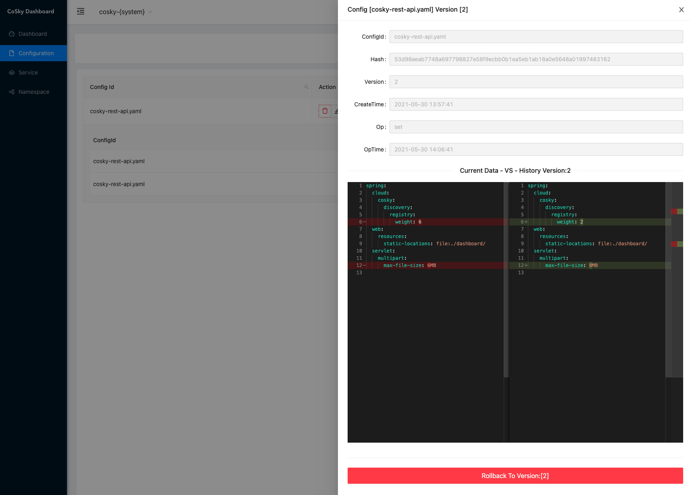
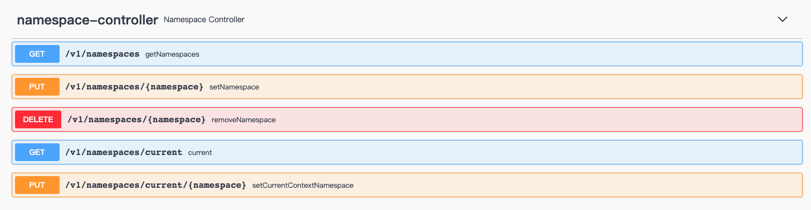

# Govern Service On Redis (Service Discovery and Configuration Service)

> [中文文档](./README.zh-CN.md)

*Govern Service* is a lightweight, low-cost service registration, service discovery, and configuration service SDK. By
using Redis in the existing infrastructure (I believe you have already deployed Redis), it doesn’t need to bring extra
to the operation and maintenance deployment. Cost and burden. With the high performance of Redis, *Govern Service*
provides ultra-high TPS&QPS (10W+/s [JMH Benchmark](#jmh-benchmark)). *Govern Service* combines the process cache
strategy + *Redis PubSub* to achieve real-time process cache refresh, with unparalleled QPS performance and real-time
consistency between process cache and Redis.

## Installation

### Gradle

> Kotlin DSL

``` kotlin
    val governVersion = "0.9.18";
    implementation("me.ahoo.govern:spring-cloud-starter-govern-config:${governVersion}")
    implementation("me.ahoo.govern:spring-cloud-starter-govern-discovery:${governVersion}")
```

### Maven

```xml
<?xml version="1.0" encoding="UTF-8"?>

<project xmlns="http://maven.apache.org/POM/4.0.0"
         xmlns:xsi="http://www.w3.org/2001/XMLSchema-instance"
         xsi:schemaLocation="http://maven.apache.org/POM/4.0.0 http://maven.apache.org/xsd/maven-4.0.0.xsd">

  <modelVersion>4.0.0</modelVersion>
  <artifactId>demo</artifactId>
  <properties>
    <govern.version>0.9.18</govern.version>
  </properties>

  <dependencies>
    <dependency>
      <groupId>me.ahoo.govern</groupId>
      <artifactId>spring-cloud-starter-govern-config</artifactId>
      <version>${govern.version}</version>
    </dependency>
    <dependency>
      <groupId>me.ahoo.govern</groupId>
      <artifactId>spring-cloud-starter-govern-discovery</artifactId>
      <version>${govern.version}</version>
    </dependency>
  </dependencies>

</project>
```

### bootstrap.yaml (Spring-Cloud-Config)

```yaml
spring:
  application:
    name: ${service.name:govern-rest-api}
  cloud:
    govern:
      namespace: ${govern.namespace:govern-{system}}
      config:
        config-id: ${spring.application.name}.yaml
      redis:
        mode: ${govern.redis.mode:standalone}
        url: ${govern.redis.uri:redis://localhost:6379}
logging:
  file:
    name: logs/${spring.application.name}.log
```

## REST-API Server (``Optional``)

### Installation REST-API Server

#### Option 1：Download the executable file

> Download [govern-rest-api-server](https://github.com/Ahoo-Wang/govern-service/releases/download/0.9.18/govern-rest-api-0.9.18.tar)

> tar *govern-rest-api-0.9.18.tar*

```shell
cd govern-rest-api-0.9.18
# Working directory: govern-rest-api-0.9.18
bin/govern-rest-api --server.port=8080 --govern.redis.uri=redis://localhost:6379
```

#### Option 2：Run On Docker 

```shell
docker pull ahoowang/govern-service:0.9.18
docker run --name govern-service -d -p 8080:8080 --link redis -e GOVERN_REDIS_URI=redis://redis:6379  ahoowang/govern-service:0.9.18
```

---
> MacBook Pro (M1)
>
> Please use *ahoowang/govern-service:0.9.18-armv7*

```shell
docker pull ahoowang/govern-service:0.9.18-armv7
docker run --name govern-service -d -p 8080:8080 --link redis -e GOVERN_REDIS_URI=redis://redis:6379  ahoowang/govern-service:0.9.18-armv7
```

#### Option 3：Run On Kubernetes

```yaml
apiVersion: apps/v1
kind: Deployment
metadata:
  name: govern-service-rest-api
spec:
  replicas: 1
  selector:
    matchLabels:
      app: govern-service-rest-api
  template:
    metadata:
      labels:
        app: govern-service-rest-api
    spec:
      containers:
        - env:
            - name: GOVERN_REDIS_MODE
              value: standalone
            - name: GOVERN_REDIS_URI
              value: redis://redis-uri:6379
          image: ahoowang/govern-service:0.9.18
          name: govern-service
          resources:
            limits:
              cpu: "1"
              memory: 640Mi
            requests:
              cpu: 250m
              memory: 512Mi
          volumeMounts:
            - mountPath: /etc/localtime
              name: volume-localtime
      volumes:
        - hostPath:
            path: /etc/localtime
            type: ""
          name: volume-localtime
```
---

> [http://localhost:8080/dashboard](http://localhost:8080/dashboard)


### Dashboard


#### Namespace


#### Config


---

---

---


#### Service


---


### REST-API

> http://localhost:8080/swagger-ui/index.html#/

##### Namespace



- /v1/namespaces
  - GET
- /v1/namespaces/{namespace}
  - PUT
  - GET
- /v1/namespaces/current
  - GET
- /v1/namespaces/current/{namespace}
  - PUT

##### Config


- /v1/namespaces/{namespace}/configs
  - GET
- /v1/namespaces/{namespace}/configs/{configId}
  - GET
  - PUT
    - DELETE
- /v1/namespaces/{namespace}/configs/{configId}/versions
  - GET
- /v1/namespaces/{namespace}/configs/{configId}/versions/{version}
    - GET
- /v1/namespaces/{namespace}/configs/{configId}/to/{targetVersion}
    - PUT

#### Service


- /v1/namespaces/{namespace}/services/
  - GET
- /v1/namespaces/{namespace}/services/{serviceId}/instances
  - GET
  - PUT
- /v1/namespaces/{namespace}/services/{serviceId}/instances/{instanceId}
  - DELETE
- /v1/namespaces/{namespace}/services/{serviceId}/instances/{instanceId}/metadata
  - PUT
- /v1/namespaces/{namespace}/services/{serviceId}/lb
  - GET

## JMH-Benchmark

- The development notebook : MacBook Pro (M1)
- All benchmark tests are carried out on the development notebook.
- Deploying Redis on the development notebook.

### ConfigService

``` shell
gradle config:jmh
```

```
# JMH version: 1.29
# VM version: JDK 11.0.11, OpenJDK 64-Bit Server VM, 11.0.11+9-LTS
# VM invoker: /Library/Java/JavaVirtualMachines/zulu-11.jdk/Contents/Home/bin/java
# VM options: -Dfile.encoding=UTF-8 -Djava.io.tmpdir=/Users/ahoo/govern-service/govern-config/build/tmp/jmh -Duser.country=CN -Duser.language=zh -Duser.variant
# Blackhole mode: full + dont-inline hint
# Warmup: 1 iterations, 10 s each
# Measurement: 1 iterations, 10 s each
# Timeout: 10 min per iteration
# Threads: 50 threads, will synchronize iterations
# Benchmark mode: Throughput, ops/time

Benchmark                                          Mode  Cnt          Score   Error  Units
ConsistencyRedisConfigServiceBenchmark.getConfig  thrpt       265321650.148          ops/s
RedisConfigServiceBenchmark.getConfig             thrpt          106991.476          ops/s
RedisConfigServiceBenchmark.setConfig             thrpt          103659.132          ops/s
```

### ServiceDiscovery

``` shell
gradle discovery:jmh
```

```
# JMH version: 1.29
# VM version: JDK 11.0.11, OpenJDK 64-Bit Server VM, 11.0.11+9-LTS
# VM invoker: /Library/Java/JavaVirtualMachines/zulu-11.jdk/Contents/Home/bin/java
# VM options: -Dfile.encoding=UTF-8 -Djava.io.tmpdir=/Users/ahoo/govern-service/govern-discovery/build/tmp/jmh -Duser.country=CN -Duser.language=zh -Duser.variant
# Blackhole mode: full + dont-inline hint
# Warmup: 1 iterations, 10 s each
# Measurement: 1 iterations, 10 s each
# Timeout: 10 min per iteration
# Threads: 50 threads, will synchronize iterations
# Benchmark mode: Throughput, ops/time

Benchmark                                                Mode  Cnt          Score   Error  Units
ConsistencyRedisServiceDiscoveryBenchmark.getInstances  thrpt        76894658.867          ops/s
ConsistencyRedisServiceDiscoveryBenchmark.getServices   thrpt       466036317.472          ops/s
RedisServiceDiscoveryBenchmark.getInstances             thrpt          107778.244          ops/s
RedisServiceDiscoveryBenchmark.getServices              thrpt          106920.412          ops/s
RedisServiceRegistryBenchmark.deregister                thrpt          114094.513          ops/s
RedisServiceRegistryBenchmark.register                  thrpt          109085.694          ops/s
RedisServiceRegistryBenchmark.renew                     thrpt          127003.104          ops/s
```

## TODO

1. Grayscale Publishing
