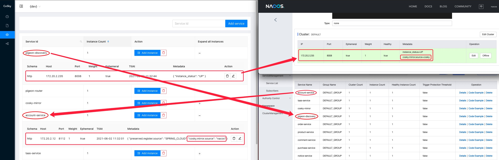

# [CoSky](https://github.com/Ahoo-Wang/CoSky) On Redis (Service Discovery and Configuration Service)

> **Co**n**s**ul + S**ky** = **[CoSky](https://github.com/Ahoo-Wang/CoSky)**

> [中文文档](./README.zh-CN.md)

*[CoSky](https://github.com/Ahoo-Wang/CoSky)* is a lightweight, low-cost service registration, service discovery, and configuration service SDK. By using
Redis in the existing infrastructure (I believe you have already deployed Redis), it doesn’t need to bring extra to the
operation and maintenance deployment. Cost and burden. With the high performance of Redis, *CoSky*
provides ultra-high TPS&QPS (100,000+/s [JMH Benchmark](#jmh-benchmark)). *CoSky* combines the process cache strategy + *
Redis PubSub* to achieve real-time process cache refresh, with unparalleled QPS performance (70,000,000+/s [JMH Benchmark](#jmh-benchmark)) and real-time consistency
between process cache and Redis.

### Service Discovery


### Configuration


### CoSky-Mirror (Real-time synchronization of service instance change status)

> CoSky-Mirror is like a mirror placed between Nacos and CoSky to build a unified service discovery platform.





## Installation

### Gradle

> Kotlin DSL

``` kotlin
    val coskyVersion = "1.1.5";
    implementation("me.ahoo.cosky:spring-cloud-starter-cosky-config:${coskyVersion}")
    implementation("me.ahoo.cosky:spring-cloud-starter-cosky-discovery:${coskyVersion}")
```

### Maven

```xml
<?xml version="1.0" encoding="UTF-8"?>

<project xmlns="http://maven.apache.org/POM/4.0.0"
         xmlns:xsi="http://www.w3.org/2001/XMLSchema-instance"
         xsi:schemaLocation="http://maven.apache.org/POM/4.0.0 http://maven.apache.org/xsd/maven-4.0.0.xsd">

    <modelVersion>4.0.0</modelVersion>
    <artifactId>demo</artifactId>
    <properties>
        <cosky.version>1.1.5</cosky.version>
    </properties>

    <dependencies>
        <dependency>
            <groupId>me.ahoo.cosky</groupId>
            <artifactId>spring-cloud-starter-cosky-config</artifactId>
            <version>${cosky.version}</version>
        </dependency>
        <dependency>
            <groupId>me.ahoo.cosky</groupId>
            <artifactId>spring-cloud-starter-cosky-discovery</artifactId>
            <version>${cosky.version}</version>
        </dependency>
    </dependencies>

</project>
```

### bootstrap.yaml (Spring-Cloud-Config)

```yaml
spring:
  application:
    name: ${service.name:cosky-rest-api}
  cloud:
    cosky:
      namespace: ${cosky.namespace:cosky-{system}}
      config:
        config-id: ${spring.application.name}.yaml
      redis:
        mode: ${cosky.redis.mode:standalone}
        url: ${cosky.redis.uri:redis://localhost:6379}
logging:
  file:
    name: logs/${spring.application.name}.log
```

## REST-API Server (``Optional``)

### Installation REST-API Server

#### Option 1：Download the executable file

> Download [cosky-rest-api-server](https://github.com/Ahoo-Wang/cosky/releases/download/1.1.5/cosky-rest-api-1.1.5.tar)

> tar *cosky-rest-api-1.1.5.tar*

```shell
cd cosky-rest-api-1.1.5
# Working directory: cosky-rest-api-1.1.5
bin/cosky-rest-api --server.port=8080 --cosky.redis.uri=redis://localhost:6379
```

#### Option 2：Run On Docker

```shell
docker pull ahoowang/cosky-rest-api:1.1.5
docker run --name cosky-rest-api -d -p 8080:8080 --link redis -e COSKY_REDIS_URI=redis://redis:6379  ahoowang/cosky-rest-api:1.1.5
```

##### MacBook Pro (M1)

> Please use *ahoowang/cosky-rest-api:1.1.5-armv7*

```shell
docker pull ahoowang/cosky-rest-api:1.1.5-armv7
docker run --name cosky-rest-api -d -p 8080:8080 --link redis -e COSKY_REDIS_URI=redis://redis:6379  ahoowang/cosky-rest-api:1.1.5-armv7
```

#### Option 3：Run On Kubernetes

```yaml
apiVersion: apps/v1
kind: Deployment
metadata:
  name: cosky-rest-api
  labels:
    app: cosky-rest-api
spec:
  replicas: 1
  selector:
    matchLabels:
      app: cosky-rest-api
  template:
    metadata:
      labels:
        app: cosky-rest-api
    spec:
      containers:
        - env:
            - name: COSKY_REDIS_MODE
              value: standalone
            - name: COSKY_REDIS_URI
              value: redis://redis-uri:6379
          image: ahoowang/cosky-rest-api:1.1.5
          name: cosky-rest-api
          ports:
            - containerPort: 8080
              protocol: TCP
          resources:
            limits:
              cpu: "1"
              memory: 1280Mi
            requests:
              cpu: 250m
              memory: 1024Mi
          volumeMounts:
            - mountPath: /etc/localtime
              name: volume-localtime
      volumes:
        - hostPath:
            path: /etc/localtime
            type: ""
          name: volume-localtime

---
apiVersion: v1
kind: Service
metadata:
  name: cosky-rest-api
  labels:
    app: cosky-rest-api
spec:
  selector:
    app: cosky-rest-api
  ports:
    - name: rest
      port: 80
      protocol: TCP
      targetPort: 8080
```

### Dashboard

> [http://localhost:8080/dashboard](http://localhost:8080/dashboard)


#### Namespace


#### Config


##### Edit configuration


##### Rollback configuration


##### Import configuration from Nacos


#### Service


##### Edit Service Instance


### REST-API

> http://localhost:8080/swagger-ui/index.html#/

#### Namespace


- /v1/namespaces
    - GET
- /v1/namespaces/{namespace}
    - PUT
    - GET
- /v1/namespaces/current
    - GET
- /v1/namespaces/current/{namespace}
    - PUT

#### Config


- /v1/namespaces/{namespace}/configs
    - GET
- /v1/namespaces/{namespace}/configs/{configId}
    - GET
    - PUT
    - DELETE
- /v1/namespaces/{namespace}/configs/{configId}/versions
    - GET
- /v1/namespaces/{namespace}/configs/{configId}/versions/{version}
    - GET
- /v1/namespaces/{namespace}/configs/{configId}/to/{targetVersion}
    - PUT

#### Service


- /v1/namespaces/{namespace}/services/
    - GET
- /v1/namespaces/{namespace}/services/{serviceId}/instances
    - GET
    - PUT
- /v1/namespaces/{namespace}/services/{serviceId}/instances/{instanceId}
    - DELETE
- /v1/namespaces/{namespace}/services/{serviceId}/instances/{instanceId}/metadata
    - PUT
- /v1/namespaces/{namespace}/services/{serviceId}/lb
    - GET

## JMH-Benchmark

- The development notebook : MacBook Pro (M1)
- All benchmark tests are carried out on the development notebook.
- Deploying Redis on the development notebook.

### ConfigService

``` shell
gradle cosky-config:jmh
# or
java -jar cosky-config/build/libs/cosky-config-1.1.5-jmh.jar -bm thrpt -t 25 -wi 1 -rf json -f 1
```

```
# JMH version: 1.29
# VM version: JDK 11.1.51, OpenJDK 64-Bit Server VM, 11.1.51+9-LTS
# VM invoker: /Library/Java/JavaVirtualMachines/zulu-11.jdk/Contents/Home/bin/java
# VM options: -Dfile.encoding=UTF-8 -Djava.io.tmpdir=/Users/ahoo/cosky/cosky-config/build/tmp/jmh -Duser.country=CN -Duser.language=zh -Duser.variant
# Blackhole mode: full + dont-inline hint
# Warmup: 1 iterations, 10 s each
# Measurement: 1 iterations, 10 s each
# Timeout: 10 min per iteration
# Threads: 50 threads, will synchronize iterations
# Benchmark mode: Throughput, ops/time

Benchmark                                          Mode  Cnt          Score   Error  Units
ConsistencyRedisConfigServiceBenchmark.getConfig  thrpt       265321650.148          ops/s
RedisConfigServiceBenchmark.getConfig             thrpt          106991.476          ops/s
RedisConfigServiceBenchmark.setConfig             thrpt          103659.132          ops/s
```

### ServiceDiscovery

``` shell
gradle cosky-discovery:jmh
# or
java -jar cosky-discovery/build/libs/cosky-discovery-1.1.5-jmh.jar -bm thrpt -t 25 -wi 1 -rf json -f 1
```

```
# JMH version: 1.29
# VM version: JDK 11.1.51, OpenJDK 64-Bit Server VM, 11.1.51+9-LTS
# VM invoker: /Library/Java/JavaVirtualMachines/zulu-11.jdk/Contents/Home/bin/java
# VM options: -Dfile.encoding=UTF-8 -Djava.io.tmpdir=/Users/ahoo/cosky/cosky-discovery/build/tmp/jmh -Duser.country=CN -Duser.language=zh -Duser.variant
# Blackhole mode: full + dont-inline hint
# Warmup: 1 iterations, 10 s each
# Measurement: 1 iterations, 10 s each
# Timeout: 10 min per iteration
# Threads: 50 threads, will synchronize iterations
# Benchmark mode: Throughput, ops/time

Benchmark                                                Mode  Cnt          Score   Error  Units
ConsistencyRedisServiceDiscoveryBenchmark.getInstances  thrpt        76894658.867          ops/s
ConsistencyRedisServiceDiscoveryBenchmark.getServices   thrpt       466036317.472          ops/s
RedisServiceDiscoveryBenchmark.getInstances             thrpt          107778.244          ops/s
RedisServiceDiscoveryBenchmark.getServices              thrpt          106920.412          ops/s
RedisServiceRegistryBenchmark.deregister                thrpt          114094.513          ops/s
RedisServiceRegistryBenchmark.register                  thrpt          109085.694          ops/s
RedisServiceRegistryBenchmark.renew                     thrpt          127003.104          ops/s
```
