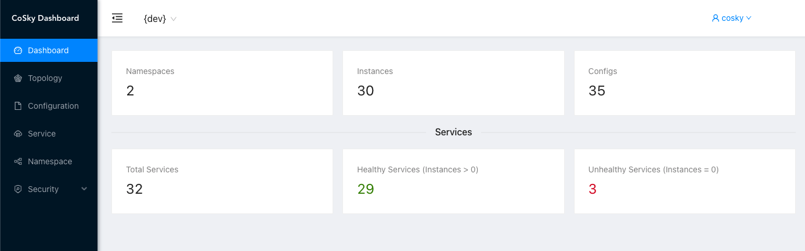
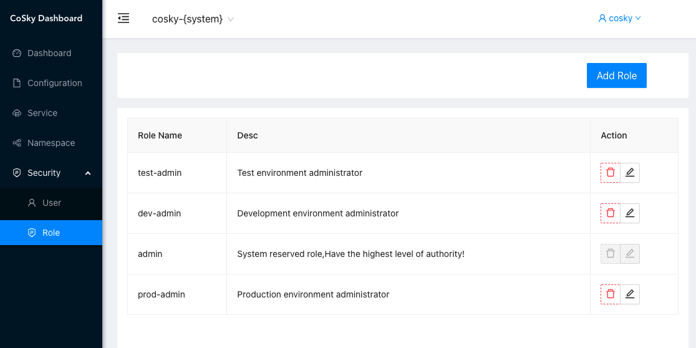

# [CoSky](https://github.com/Ahoo-Wang/CoSky) High-performance, low-cost microservice governance platform (Service Discovery and Configuration Service)

> [中文文档](https://github.com/Ahoo-Wang/CoSky/blob/main/README.zh-CN.md)

*[CoSky](https://github.com/Ahoo-Wang/CoSky)* is a lightweight, low-cost service registration, service discovery, and configuration service SDK. By using Redis in the existing infrastructure (I believe you have already deployed Redis), it doesn’t need to bring extra to the operation and maintenance deployment. Cost and burden. With the high performance of Redis, *CoSky* provides ultra-high TPS&QPS (100,000+/s [JMH Benchmark](#jmh-benchmark)). *CoSky* combines the process cache strategy + *Redis PubSub* to achieve real-time process cache refresh, with unparalleled QPS performance (70,000,000+/s [JMH Benchmark](#jmh-benchmark)) and real-time consistency
between process cache and Redis.

## Service Discovery

<p align="center">
     
</p>

## Configuration

<p align="center">
     
</p>

## Examples

[Service Consumer --RPC--> Service Provider Examples](https://github.com/Ahoo-Wang/CoSky/tree/main/examples)

## Installation

### Gradle

> Kotlin DSL

``` kotlin
    val coskyVersion = "1.3.20";
    implementation("me.ahoo.cosky:spring-cloud-starter-cosky-config:${coskyVersion}")
    implementation("me.ahoo.cosky:spring-cloud-starter-cosky-discovery:${coskyVersion}")
    implementation("org.springframework.cloud:spring-cloud-starter-loadbalancer:3.0.3")
```

### Maven

```xml
<?xml version="1.0" encoding="UTF-8"?>

<project xmlns="http://maven.apache.org/POM/4.0.0"
         xmlns:xsi="http://www.w3.org/2001/XMLSchema-instance"
         xsi:schemaLocation="http://maven.apache.org/POM/4.0.0 http://maven.apache.org/xsd/maven-4.0.0.xsd">

    <modelVersion>4.0.0</modelVersion>
    <artifactId>demo</artifactId>
    <properties>
        <cosky.version>1.3.20</cosky.version>
    </properties>

    <dependencies>
        <dependency>
            <groupId>me.ahoo.cosky</groupId>
            <artifactId>spring-cloud-starter-cosky-config</artifactId>
            <version>${cosky.version}</version>
        </dependency>
        <dependency>
            <groupId>me.ahoo.cosky</groupId>
            <artifactId>spring-cloud-starter-cosky-discovery</artifactId>
            <version>${cosky.version}</version>
        </dependency>
        <dependency>
          <groupId>org.springframework.cloud</groupId>
          <artifactId>spring-cloud-starter-loadbalancer</artifactId>
          <version>3.0.3</version>
        </dependency>
    </dependencies>

</project>
```

### bootstrap.yaml (Spring-Cloud-Config)

```yaml
spring:
  application:
    name: ${service.name:cosky-rest-api}
  cloud:
    cosky:
      namespace: ${cosky.namespace:cosky-{system}}
      config:
        config-id: ${spring.application.name}.yaml
      redis:
        mode: ${cosky.redis.mode:standalone}
        url: ${cosky.redis.uri:redis://localhost:6379}
logging:
  file:
    name: logs/${spring.application.name}.log
```

## REST-API Server (``Optional``)

### Installation REST-API Server

#### Option 1：Download the executable file

> Download [cosky-rest-api-server](https://github.com/Ahoo-Wang/cosky/releases/download/1.3.20/cosky-rest-api-1.3.20.tar)

> tar *cosky-rest-api-1.3.20.tar*

```shell
cd cosky-rest-api-1.3.20
# Working directory: cosky-rest-api-1.3.20
bin/cosky-rest-api --server.port=8080 --cosky.redis.uri=redis://localhost:6379
```

#### Option 2：Run On Docker

```shell
docker pull ahoowang/cosky-rest-api:1.3.20
docker run --name cosky-rest-api -d -p 8080:8080 --link redis -e COSKY_REDIS_URI=redis://redis:6379  ahoowang/cosky-rest-api:1.3.20
```

#### Option 3：Run On Kubernetes

```yaml
apiVersion: apps/v1
kind: Deployment
metadata:
  name: cosky-rest-api
  labels:
    app: cosky-rest-api
spec:
  replicas: 1
  selector:
    matchLabels:
      app: cosky-rest-api
  template:
    metadata:
      labels:
        app: cosky-rest-api
    spec:
      containers:
        - env:
            - name: COSKY_REDIS_MODE
              value: standalone
            - name: COSKY_REDIS_URI
              value: redis://redis-uri:6379
          image: ahoowang/cosky-rest-api:1.3.20
          name: cosky-rest-api
          ports:
            - containerPort: 8080
              protocol: TCP
          resources:
            limits:
              cpu: "1"
              memory: 1280Mi
            requests:
              cpu: 250m
              memory: 1024Mi
          volumeMounts:
            - mountPath: /etc/localtime
              name: volume-localtime
      volumes:
        - hostPath:
            path: /etc/localtime
            type: ""
          name: volume-localtime

---
apiVersion: v1
kind: Service
metadata:
  name: cosky-rest-api
  labels:
    app: cosky-rest-api
spec:
  selector:
    app: cosky-rest-api
  ports:
    - name: rest
      port: 80
      protocol: TCP
      targetPort: 8080
```

### Dashboard

> [http://localhost:8080/dashboard](http://localhost:8080/dashboard)

<p align="center">
     
</p>

### Service dependent topology

<p align="center">
     
</p>

### Role-based access control(RBAC)

- cosky: Reserved username, super user, with the highest authority. When the application is launched for the first time, the super user (cosky) password will be initialized and printed on the console. Don't worry if you forget your password, you can configure `enforce-init-super-user: true`, *CoSky* will help you reinitialize the password and print it on the console.

```log
---------------- ****** CoSky -  init super user:[cosky] password:[6TrmOux4Oj] ****** ----------------
```

- admin: Reserved roles, super administrator roles, have all permissions, a user can be bound to multiple roles, and a role can be bound to multiple resource operation permissions.
- Permission control granularity is namespace, read and write operations

#### Role Permissions

<p align="center">
     
</p>

##### Add Role

<p align="center">
     
</p>

#### User Management

<p align="center">
     
</p>

##### Add User

<p align="center">
     
</p>

#### Audit Log

<p align="center">
     
</p>

#### Namespace

<p align="center">
     
</p>

#### Config

<p align="center">
     
</p>

##### Edit configuration

<p align="center">
     
</p>

##### Rollback configuration

<p align="center">
     
</p>

##### Import configuration from Nacos

<p align="center">
     
</p>

#### Service

<p align="center">
     
</p>

##### Edit Service Instance

<p align="center">
     
</p>

### REST-API

> http://localhost:8080/swagger-ui/index.html#/

#### Namespace

<p align="center">
     
</p>

- /v1/namespaces
    - GET
- /v1/namespaces/{namespace}
    - PUT
    - GET
- /v1/namespaces/current
    - GET
- /v1/namespaces/current/{namespace}
    - PUT

#### Config

<p align="center">
     
</p>

- /v1/namespaces/{namespace}/configs
    - GET
- /v1/namespaces/{namespace}/configs/{configId}
    - GET
    - PUT
    - DELETE
- /v1/namespaces/{namespace}/configs/{configId}/versions
    - GET
- /v1/namespaces/{namespace}/configs/{configId}/versions/{version}
    - GET
- /v1/namespaces/{namespace}/configs/{configId}/to/{targetVersion}
    - PUT

#### Service

<p align="center">
     
</p>

- /v1/namespaces/{namespace}/services/
    - GET
- /v1/namespaces/{namespace}/services/{serviceId}/instances
    - GET
    - PUT
- /v1/namespaces/{namespace}/services/{serviceId}/instances/{instanceId}
    - DELETE
- /v1/namespaces/{namespace}/services/{serviceId}/instances/{instanceId}/metadata
    - PUT
- /v1/namespaces/{namespace}/services/{serviceId}/lb
    - GET

## JMH-Benchmark

- The development notebook : MacBook Pro (M1)
- All benchmark tests are carried out on the development notebook.
- Deploying Redis on the development notebook.

### ConfigService

``` shell
gradle cosky-config:jmh
# or
java -jar cosky-config/build/libs/cosky-config-1.3.20-jmh.jar -bm thrpt -t 25 -wi 1 -rf json -f 1
```

```
Benchmark                                          Mode  Cnt          Score   Error  Units
ConsistencyRedisConfigServiceBenchmark.getConfig  thrpt       256733987.827          ops/s
RedisConfigServiceBenchmark.getConfig             thrpt          241787.679          ops/s
RedisConfigServiceBenchmark.setConfig             thrpt          140461.112          ops/s
```

### ServiceDiscovery

``` shell
gradle cosky-discovery:jmh
# or
java -jar cosky-discovery/build/libs/cosky-discovery-1.3.20-jmh.jar -bm thrpt -t 25 -wi 1 -rf json -f 1
```

```
Benchmark                                                Mode  Cnt          Score   Error  Units
ConsistencyRedisServiceDiscoveryBenchmark.getInstances  thrpt        76621729.048          ops/s
ConsistencyRedisServiceDiscoveryBenchmark.getServices   thrpt       455760632.346          ops/s
RedisServiceDiscoveryBenchmark.getInstances             thrpt          226909.985          ops/s
RedisServiceDiscoveryBenchmark.getServices              thrpt          304979.150          ops/s
RedisServiceRegistryBenchmark.deregister                thrpt          255305.648          ops/s
RedisServiceRegistryBenchmark.register                  thrpt          110664.160          ops/s
RedisServiceRegistryBenchmark.renew                     thrpt          210960.325          ops/s
```

## CoSky-Mirror (Real-time synchronization of service instance change status)

> CoSky-Mirror is like a mirror placed between Nacos and CoSky to build a unified service discovery platform.

<p align="center">
     
</p>

<p align="center">
     
</p>

## Comparison with others
|                                | CoSky            | 	Eureka       | 	Consul           | 	CoreDNS      | 	Zookeeper    | 	Nacos                       | 	Apollo       |
|--------------------------------|------------------|---------------|-------------------|---------------|---------------|------------------------------|---------------|
| CAP                            | CP+AP            | 	AP           | 	CP               | 	CP           | 	CP           | 	CP+AP                       | 	CP+AP        |
| Health Check                   | 	Client Beat     | 	Client Beat	 | TCP/HTTP/gRPC/Cmd | 	Keep Alive   | 	Keep Alive   | 	TCP/HTTP/Client Beat        | 	Client Beat  |
| Load Balancing Strategy        | 	Weight/Selector | 	Ribbon       | 	Fabio	           | 	RoundRobin	  | 	RoundRobin	  | 	Weight/metadata/RoundRobin	 | 	RoundRobin	  |
| Avalanche Protection           | 	N               | 	Y            | 	N	               | 	N	           | 	N	           | 	Y	                          | 	N	           |
| Auto Logoff Instance           | 	Support         | 	Support      | 	Not Support	     | 	Not Support	 | 	Support      | 	Support                     | 	Support	     |
| Access Protocol                | 	HTTP/Redis      | 	HTTP         | 	HTTP/DNS	        | 	DNS	         | 	TCP	         | 	HTTP/DNS	                   | 	HTTP	        |
| Listening Support              | 	Support         | 	Support      | 	Support	         | 	Not Support	 | 	Support	     | 	Support	                    | 	Support	     |
| Multi-data Center              | 	Support         | 	Support      | 	Support	         | 	Not Support	 | 	Not Support	 | 	Support	                    | 	Support	     |
| Cross Registry Synchronization | 	Support         | 	Not Support  | 	Support	         | 	Not Support	 | 	Not Support	 | 	Support	                    | 	Not Support	 |
| SpringCloud Integration        | 	Support         | 	Support      | 	Support	         | 	Not Support	 | 	Not Support	 | 	Support                     | 	Support	     |
| Dubbo Integration              | 	Support         | 	Not Support  | 	Not Support	     | 	Not Support	 | 	Support	     | 	Support	                    | 	Support	     |
| K8S Integration                | 	Support         | 	Not Support  | 	Support	         | 	Support	     | 	Not Support	 | 	Support	                    | 	Not Support	 |
| Persistence                    | 	Redis           | 		            | 		                | 		            |               | 	MySql                       | 	MySql        |
