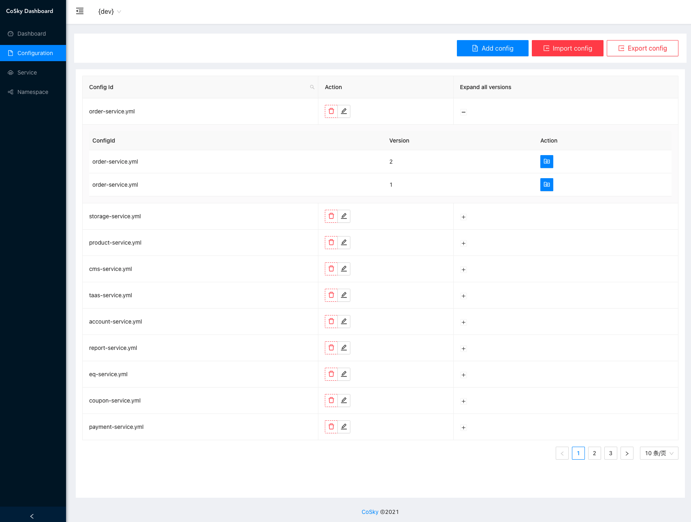
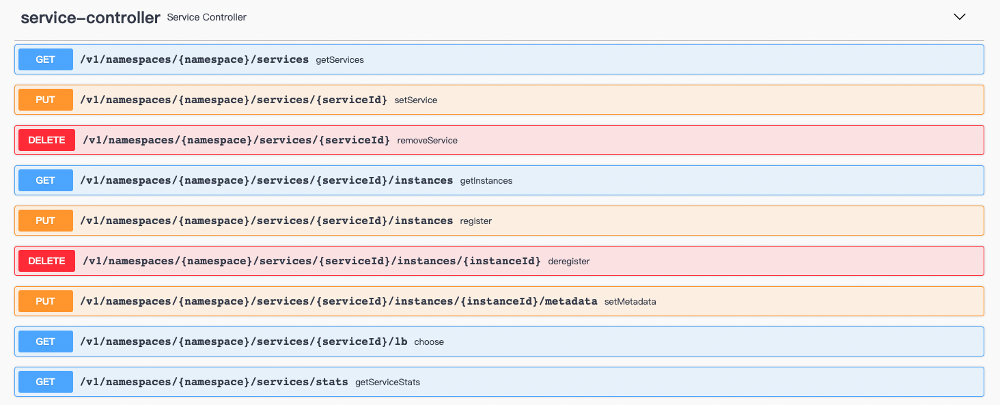

# Govern Service On Redis (Service Discovery and Configuration Service)

> [中文文档](./README.zh-CN.md)

*Govern Service* is a lightweight, low-cost service registration, service discovery, and configuration service SDK. By
using Redis in the existing infrastructure (I believe you have already deployed Redis), it doesn’t need to bring extra
to the operation and maintenance deployment. Cost and burden. With the high performance of Redis, *Govern Service*
provides ultra-high TPS&QPS. *Govern Service* combines the process cache strategy + *Redis PubSub* to achieve real-time
process cache refresh, with unparalleled QPS performance and real-time consistency between process cache and Redis.

## Installation

### Gradle

> Kotlin DSL

``` kotlin
    val governVersion = "0.9.11";
    implementation("me.ahoo.govern:spring-cloud-starter-config:${governVersion}")
    implementation("me.ahoo.govern:spring-cloud-starter-discovery:${governVersion}")
```

### Maven

```xml
<?xml version="1.0" encoding="UTF-8"?>

<project xmlns="http://maven.apache.org/POM/4.0.0"
         xmlns:xsi="http://www.w3.org/2001/XMLSchema-instance"
         xsi:schemaLocation="http://maven.apache.org/POM/4.0.0 http://maven.apache.org/xsd/maven-4.0.0.xsd">

  <modelVersion>4.0.0</modelVersion>
  <artifactId>demo</artifactId>
  <properties>
    <govern.version>0.9.11</govern.version>
  </properties>

  <dependencies>
    <dependency>
      <groupId>me.ahoo.govern</groupId>
      <artifactId>spring-cloud-starter-config</artifactId>
      <version>${govern.version}</version>
    </dependency>
    <dependency>
      <groupId>me.ahoo.govern</groupId>
      <artifactId>spring-cloud-starter-discovery</artifactId>
      <version>${govern.version}</version>
    </dependency>
  </dependencies>

</project>
```

### bootstrap.yml (Spring-Cloud-Config)

```yaml
spring:
  application:
    name: govern-rest-api
  cloud:
    govern:
      namespace: dev
      config:
        config-id: ${spring.application.name}.yml
      redis:
        mode: standalone
        url: redis://localhost:6379
```

## REST-API Server (``Optional``)

### Installation REST-API Server

#### Option 1：Download the executable file

> Download [rest-api-server](https://github.com/Ahoo-Wang/govern-service/releases/download/0.9.11/rest-api-0.9.11.tar)

> tar *rest-api-0.9.11.tar*

```shell
cd rest-api-0.9.11
# Working directory: rest-api-0.9.11
bin/rest-api --server.port=8080 --govern.redis.uri=redis://localhost:6379
```

#### Option 2：Docker run

```shell
docker pull ahoowang/govern-service:0.9.11
docker run --name govern-service -d -p 8080:8080 --link redis -e GOVERN_REDIS_URI=redis://redis:6379  ahoowang/govern-service:0.9.11
```

---
> MacBook Pro (M1)
>
> Please use *ahoowang/govern-service:0.9.11-armv7*

```shell
docker pull ahoowang/govern-service:0.9.11-armv7
docker run --name govern-service -d -p 8080:8080 --link redis -e GOVERN_REDIS_URI=redis://redis:6379  ahoowang/govern-service:0.9.11-armv7
```

---

> [http://localhost:8080/dashboard](http://localhost:8080/dashboard)


### Dashboard


#### Namespace


#### Config


---

---

---


#### Service


---


### REST-API

> http://localhost:8080/swagger-ui/index.html#/

##### Namespace


- /v1/namespaces
  - GET
- /v1/namespaces/{namespace}
  - PUT
  - GET
- /v1/namespaces/current
  - GET
- /v1/namespaces/current/{namespace}
  - PUT

##### Config


- /v1/namespaces/{namespace}/configs
  - GET
- /v1/namespaces/{namespace}/configs/{configId}
  - GET
  - PUT
    - DELETE
- /v1/namespaces/{namespace}/configs/{configId}/versions
  - GET
- /v1/namespaces/{namespace}/configs/{configId}/versions/{version}
    - GET
- /v1/namespaces/{namespace}/configs/{configId}/to/{targetVersion}
    - PUT

#### Service



- /v1/namespaces/{namespace}/services/
  - GET
- /v1/namespaces/{namespace}/services/{serviceId}/instances
  - GET
  - PUT
- /v1/namespaces/{namespace}/services/{serviceId}/instances/{instanceId}
  - DELETE
- /v1/namespaces/{namespace}/services/{serviceId}/instances/{instanceId}/metadata
  - PUT
- /v1/namespaces/{namespace}/services/{serviceId}/lb
  - GET

## JMH Benchmark

- The development notebook : MacBook Pro (M1)
- All benchmark tests are carried out on the development notebook.
- Deploying Redis with docker on the development notebook.

``` shell
gradle jmh
```

### ConfigService

```
# JMH version: 1.28
# VM version: JDK 11.0.11, OpenJDK 64-Bit Server VM, 11.0.11+9-LTS
# VM invoker: /Library/Java/JavaVirtualMachines/zulu-11.jdk/Contents/Home/bin/java
# VM options: -Dfile.encoding=UTF-8 -Djava.io.tmpdir=/Users/ahoo/govern-service/config/build/tmp/jmh -Duser.country=CN -Duser.language=zh -Duser.variant
# Blackhole mode: full + dont-inline hint
# Warmup: 1 iterations, 10 s each
# Measurement: 1 iterations, 10 s each
# Timeout: 10 min per iteration
# Threads: 50 threads, will synchronize iterations
# Benchmark mode: Throughput, ops/time

Benchmark                                          Mode  Cnt          Score   Error  Units
ConsistencyRedisConfigServiceBenchmark.getConfig  thrpt       555275866.836          ops/s
RedisConfigServiceBenchmark.getConfig             thrpt           57397.188          ops/s
RedisConfigServiceBenchmark.setConfig             thrpt           56882.673          ops/s
```

### ServiceDiscovery

```
# JMH version: 1.29
# VM version: JDK 11.0.11, OpenJDK 64-Bit Server VM, 11.0.11+9-LTS
# VM invoker: /Library/Java/JavaVirtualMachines/zulu-11.jdk/Contents/Home/bin/java
# VM options: -Dfile.encoding=UTF-8 -Djava.io.tmpdir=/Users/ahoo/work/ahoo-git/govern-service/discovery/build/tmp/jmh -Duser.country=CN -Duser.language=zh -Duser.variant
# Blackhole mode: full + dont-inline hint
# Warmup: 1 iterations, 10 s each
# Measurement: 1 iterations, 10 s each
# Timeout: 10 min per iteration
# Threads: 50 threads, will synchronize iterations
# Benchmark mode: Throughput, ops/time

Benchmark                                                Mode  Cnt           Score   Error  Units
ConsistencyRedisServiceDiscoveryBenchmark.getInstances  thrpt        567329996.255          ops/s
ConsistencyRedisServiceDiscoveryBenchmark.getServices   thrpt       1929377291.635          ops/s
RedisServiceDiscoveryBenchmark.getInstances             thrpt            43760.035          ops/s
RedisServiceDiscoveryBenchmark.getServices              thrpt            60953.971          ops/s
RedisServiceRegistryBenchmark.deregister                thrpt            63133.011          ops/s
RedisServiceRegistryBenchmark.register                  thrpt            53957.797          ops/s
RedisServiceRegistryBenchmark.renew                     thrpt            67116.116          ops/s
```

## TODO

1. Grayscale Publishing
