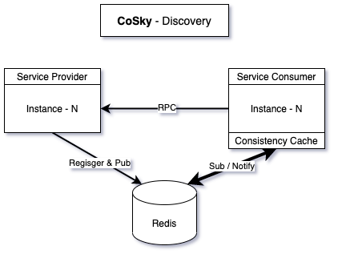
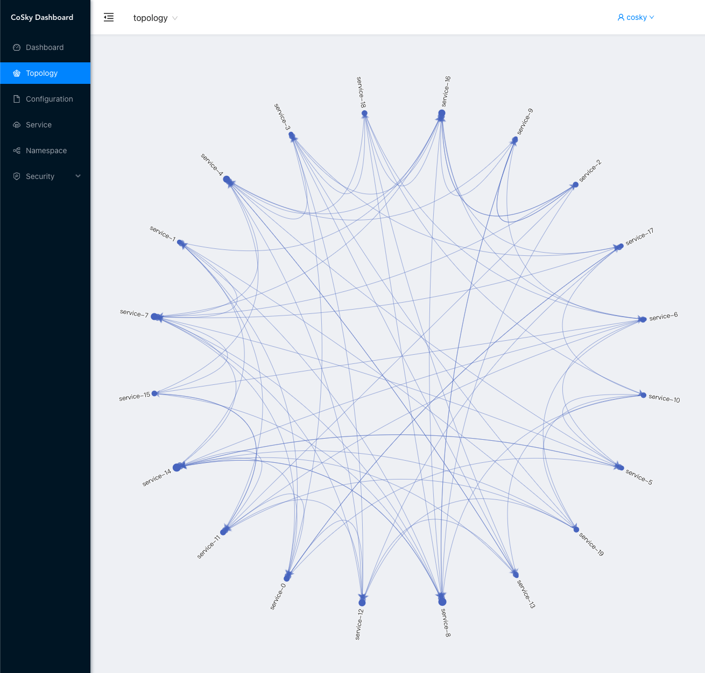
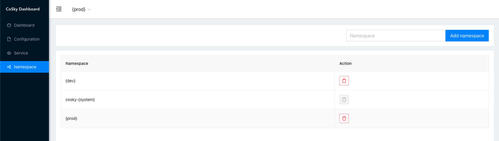
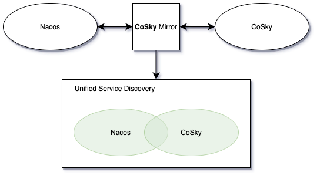

# [CoSky](https://github.com/Ahoo-Wang/CoSky) - High-Performance Microservice Governance Platform

[](https://www.apache.org/licenses/LICENSE-2.0.html)
[](https://github.com/Ahoo-Wang/CoSky/releases)
[](https://central.sonatype.com/artifact/me.ahoo.cosky/cosky-core)
[](https://www.codacy.com/gh/Ahoo-Wang/CoSky/dashboard?utm_source=github.com&amp;utm_medium=referral&amp;utm_content=Ahoo-Wang/CoSky&amp;utm_campaign=Badge_Grade)
[](https://codecov.io/gh/Ahoo-Wang/CoSky)
[](https://github.com/Ahoo-Wang/CoSky)
[](https://deepwiki.com/Ahoo-Wang/CoSky)

> [中文文档](https://github.com/Ahoo-Wang/CoSky/blob/main/README.zh-CN.md)

*[CoSky](https://github.com/Ahoo-Wang/CoSky)* is a lightweight, low-cost service registration, service discovery, and configuration service SDK. By leveraging Redis in your existing infrastructure (which you've likely already deployed), CoSky eliminates additional operational costs and deployment burdens. Powered by Redis's high performance, CoSky delivers exceptional TPS&QPS (100,000+/s [JMH Benchmark](#jmh-benchmark)). Through its combination of local process caching strategies and *Redis PubSub*, CoSky achieves real-time cache refreshing with outstanding QPS performance (70,000,000+/s [JMH Benchmark](#jmh-benchmark)) and maintains real-time consistency between process cache and Redis.

## Service Discovery

<p align="center">
     
</p>

## Configuration

<p align="center">
     
</p>

## Examples

[Service Consumer --RPC--> Service Provider Examples](https://github.com/Ahoo-Wang/CoSky/tree/main/examples)

## Installation

### Gradle

> Kotlin DSL

``` kotlin
    val coskyVersion = "lastVersion";
    implementation("me.ahoo.cosky:spring-cloud-starter-cosky-config:${coskyVersion}")
    implementation("me.ahoo.cosky:spring-cloud-starter-cosky-discovery:${coskyVersion}")
    implementation("org.springframework.cloud:spring-cloud-starter-loadbalancer:3.0.3")
```

### Maven

```xml
<?xml version="1.0" encoding="UTF-8"?>

<project xmlns="http://maven.apache.org/POM/4.0.0"
         xmlns:xsi="http://www.w3.org/2001/XMLSchema-instance"
         xsi:schemaLocation="http://maven.apache.org/POM/4.0.0 http://maven.apache.org/xsd/maven-4.0.0.xsd">

    <modelVersion>4.0.0</modelVersion>
    <artifactId>demo</artifactId>
    <properties>
        <cosky.version>lastVersion</cosky.version>
    </properties>

    <dependencies>
        <dependency>
            <groupId>me.ahoo.cosky</groupId>
            <artifactId>spring-cloud-starter-cosky-config</artifactId>
            <version>${cosky.version}</version>
        </dependency>
        <dependency>
            <groupId>me.ahoo.cosky</groupId>
            <artifactId>spring-cloud-starter-cosky-discovery</artifactId>
            <version>${cosky.version}</version>
        </dependency>
        <dependency>
          <groupId>org.springframework.cloud</groupId>
          <artifactId>spring-cloud-starter-loadbalancer</artifactId>
          <version>3.0.3</version>
        </dependency>
    </dependencies>

</project>
```

### bootstrap.yaml (Spring-Cloud-Config)

```yaml
spring:
  application:
    name: ${service.name:cosky}
  data:
    redis:
      url: redis://localhost:6379
  cloud:
    cosky:
      namespace: ${cosky.namespace:cosky-{system}}
      config:
        config-id: ${spring.application.name}.yaml
    service-registry:
      auto-registration:
        enabled: ${cosky.auto-registry:true}
logging:
  file:
    name: logs/${spring.application.name}.log
```

## 🌐 REST-API Server (Optional)

Choose from three deployment options based on your environment:

### 🖥️ Option 1: Standalone Executable

Download the latest release and run directly:

```shell
# Download cosky-server
wget https://github.com/Ahoo-Wang/cosky/releases/latest/download/cosky-server.tar

# Extract and run
tar -xvf cosky-server.tar
cd cosky-server
bin/cosky --server.port=8080 --spring.data.redis.url=redis://localhost:6379
```

### 🐳 Option 2: Docker Deployment

Quick deployment with Docker:

```shell
docker pull ahoowang/cosky:latest
docker run --name cosky -d -p 8080:8080 \
  -e SPRING_DATA_REDIS_URL=redis://your-redis-host:6379 \
  ahoowang/cosky:latest
```

### ☸️ Option 3: Kubernetes Deployment

Deploy in your Kubernetes cluster:

```yaml
apiVersion: apps/v1
kind: Deployment
metadata:
  name: cosky
  labels:
    app: cosky
spec:
  replicas: 1
  selector:
    matchLabels:
      app: cosky
  template:
    metadata:
      labels:
        app: cosky
    spec:
      containers:
        - name: cosky
          image: ahoowang/cosky:latest
          ports:
            - containerPort: 8080
              protocol: TCP
          env:
            - name: SPRING_DATA_REDIS_URL
              value: redis://your-redis-host:6379
          resources:
            requests:
              cpu: 250m
              memory: 1024Mi
            limits:
              cpu: "1"
              memory: 1280Mi
          volumeMounts:
            - name: volume-localtime
              mountPath: /etc/localtime
      volumes:
        - name: volume-localtime
          hostPath:
            path: /etc/localtime
            type: ""

---
apiVersion: v1
kind: Service
metadata:
  name: cosky
  labels:
    app: cosky
spec:
  selector:
    app: cosky
  ports:
    - name: rest
      port: 80
      protocol: TCP
      targetPort: 8080
```

### 🎨 Dashboard

Access the web-based management interface at:
> [http://localhost:8080/dashboard](http://localhost:8080/dashboard)

<p align="center">
     
</p>

The CoSky Dashboard provides:
- Real-time service monitoring and management
- Configuration management with version control
- Namespace isolation and management
- Role-based access control (RBAC)
- Audit logging for compliance
- Service topology visualization
- Easy import/export functionality

### Service dependent topology

<p align="center">
     
</p>

### Role-based access control(RBAC)

- cosky: Reserved username, super user, with the highest authority. When the application is launched for the first time, the super user (cosky) password will be initialized and printed on the console. Don't worry if you forget your password, you can configure `enforce-init-super-user: true`, *CoSky* will help you reinitialize the password and print it on the console.

```log
---------------- ****** CoSky -  init super user:[cosky] password:[6TrmOux4Oj] ****** ----------------
```

- admin: Reserved roles, super administrator roles, have all permissions, a user can be bound to multiple roles, and a role can be bound to multiple resource operation permissions.
- Permission control granularity is namespace, read and write operations

#### Role Permissions

<p align="center">
     
</p>

##### Add Role

<p align="center">
     
</p>

#### User Management

<p align="center">
     
</p>

##### Add User

<p align="center">
     
</p>

#### Audit Log

<p align="center">
     
</p>

#### Namespace

<p align="center">
     
</p>

#### Config

<p align="center">
     
</p>

##### Edit configuration

<p align="center">
     
</p>

##### Rollback configuration

<p align="center">
     
</p>

##### Import configuration from Nacos

<p align="center">
     
</p>

#### Service

<p align="center">
     
</p>

##### Edit Service Instance

<p align="center">
     
</p>

### REST-API

> https://ahoo-cosky.apifox.cn/

## 🚀 Performance Benchmarks

<p align="center">
  <strong>CoSky delivers exceptional performance, outperforming alternatives by orders of magnitude</strong>
</p>

### Test Environment
- **Hardware**: MacBook Pro (M1)
- **Redis**: Deployed locally on the same machine
- **Methodology**: All benchmarks conducted using JMH (Java Microbenchmark Harness)

### Config Service Performance

```shell
gradle cosky-config:jmh
# or
java -jar cosky-config/build/libs/cosky-config-lastVersion-jmh.jar -bm thrpt -t 25 -wi 1 -rf json -f 1
```

#### Results
```
Benchmark                                          Mode  Cnt          Score   Error  Units
ConsistencyRedisConfigServiceBenchmark.getConfig  thrpt       256733987.827          ops/s
RedisConfigServiceBenchmark.getConfig             thrpt          241787.679          ops/s
RedisConfigServiceBenchmark.setConfig             thrpt          140461.112          ops/s
```

### Service Discovery Performance

```shell
gradle cosky-discovery:jmh
# or
java -jar cosky-discovery/build/libs/cosky-discovery-lastVersion-jmh.jar -bm thrpt -t 25 -wi 1 -rf json -f 1
```

#### Results
```
Benchmark                                                Mode  Cnt          Score   Error  Units
ConsistencyRedisServiceDiscoveryBenchmark.getInstances  thrpt        76621729.048          ops/s
ConsistencyRedisServiceDiscoveryBenchmark.getServices   thrpt       455760632.346          ops/s
RedisServiceDiscoveryBenchmark.getInstances             thrpt          226909.985          ops/s
RedisServiceDiscoveryBenchmark.getServices              thrpt          304979.150          ops/s
RedisServiceRegistryBenchmark.deregister                thrpt          255305.648          ops/s
RedisServiceRegistryBenchmark.register                  thrpt          110664.160          ops/s
RedisServiceRegistryBenchmark.renew                     thrpt          210960.325          ops/s
```

> 🔥 **Key Insight**: CoSky's consistency layer provides over 800x performance improvement for configuration retrieval and over 250x for service discovery compared to standard Redis operations.

## 🔁 CoSky-Mirror (Real-time synchronization of service instance change status)

> CoSky-Mirror acts as a bridge between Nacos and CoSky, creating a unified service discovery platform that enables seamless integration.

<p align="center">
     
</p>

<p align="center">
     
</p>

With CoSky-Mirror, you can:
- Synchronize service instances between Nacos and CoSky in real-time
- Maintain consistency across different service registries
- Migrate from Nacos to CoSky with zero downtime
- Build a hybrid service discovery architecture

## 📊 Feature Comparison

| Feature                        | CoSky            | Eureka        | Consul            | CoreDNS       | Zookeeper     | Nacos                        | Apollo        |
|-------------------------------|------------------|---------------|-------------------|---------------|---------------|------------------------------|---------------|
| **CAP**                       | CP+AP            | AP            | CP                | CP            | CP            | CP+AP                        | CP+AP         |
| **Health Check**              | Client Beat      | Client Beat   | TCP/HTTP/gRPC/Cmd | Keep Alive    | Keep Alive    | TCP/HTTP/Client Beat         | Client Beat   |
| **Load Balancing**            | Weight/Selector  | Ribbon        | Fabio             | RoundRobin    | RoundRobin    | Weight/metadata/RoundRobin   | RoundRobin    |
| **Avalanche Protection**      | ❌               | ✅            | ❌                | ❌            | ❌            | ✅                           | ❌            |
| **Auto Logoff Instance**      | ✅               | ✅            | ❌                | ❌            | ✅            | ✅                           | ✅            |
| **Access Protocol**           | HTTP/Redis       | HTTP          | HTTP/DNS          | DNS           | TCP           | HTTP/DNS                     | HTTP          |
| **Listening Support**         | ✅               | ✅            | ✅                | ❌            | ✅            | ✅                           | ✅            |
| **Multi-data Center**         | ✅               | ✅            | ✅                | ❌            | ❌            | ✅                           | ✅            |
| **Cross Registry Sync**       | ✅               | ❌            | ✅                | ❌            | ❌            | ✅                           | ❌            |
| **SpringCloud Integration**   | ✅               | ✅            | ✅                | ❌            | ❌            | ✅                           | ✅            |
| **Dubbo Integration**         | ✅               | ❌            | ❌                | ❌            | ✅            | ✅                           | ✅            |
| **K8S Integration**           | ✅               | ❌            | ✅                | ✅            | ❌            | ✅                           | ❌            |
| **Persistence**               | Redis            | -             | -                 | -             | -             | MySql                        | MySql         |

> ✅ **Key Advantages of CoSky**:
> - **Hybrid CP+AP model** for both consistency and availability
> - **Ultra-high performance** with Redis backend (100K+ QPS)
> - **Cross registry synchronization** capability
> - **Lightweight deployment** with minimal operational overhead
> - **Comprehensive ecosystem integration** (Spring Cloud, Dubbo, K8S)

---

## 🤝 Contributing

We welcome contributions from the community! Whether it's reporting bugs, suggesting features, or submitting pull requests, your input helps make CoSky better for everyone.

## 📄 License

CoSky is open-sourced software licensed under the [Apache License 2.0](https://www.apache.org/licenses/LICENSE-2.0.html).
