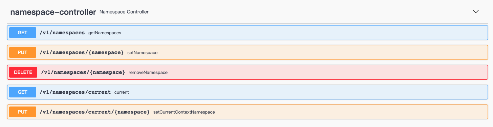
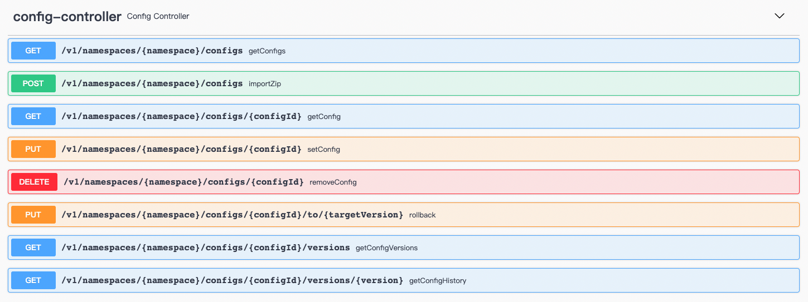
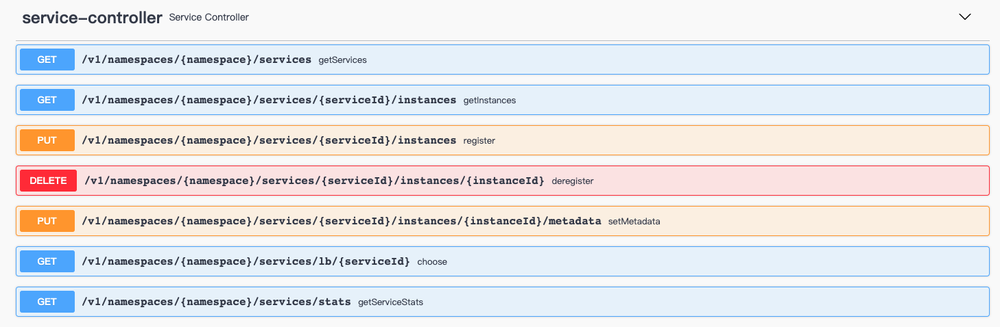

# Govern Service 基于 Redis 的服务治理平台（服务注册/发现 & 配置中心）

*Govern Service* 是一个轻量级、低成本的服务注册、服务发现、 配置服务 SDK，通过使用现有基础设施中的 Redis （相信你已经部署了Redis），不用给运维部署带来额外的成本与负担。 借助于 Redis 的高性能， *
Govern Service* 提供了超高TPS&QPS。*Govern Service* 结合本地进程缓存策略 + *Redis PubSub*，实现实时进程缓存刷新，兼具无与伦比的QPS性能、进程缓存与 Redis 的实时一致性。

## 安装

### Gradle

> Kotlin DSL

``` kotlin
    val governVersion = "0.9.3";
    implementation("me.ahoo.govern:spring-cloud-starter-config:${governVersion}")
    implementation("me.ahoo.govern:spring-cloud-starter-discovery:${governVersion}")
```

### Maven

```xml
<?xml version="1.0" encoding="UTF-8"?>

<project xmlns="http://maven.apache.org/POM/4.0.0"
         xmlns:xsi="http://www.w3.org/2001/XMLSchema-instance"
         xsi:schemaLocation="http://maven.apache.org/POM/4.0.0 http://maven.apache.org/xsd/maven-4.0.0.xsd">

  <modelVersion>4.0.0</modelVersion>
  <artifactId>demo</artifactId>
  <properties>
    <govern.version>0.9.3</govern.version>
  </properties>

  <dependencies>
    <dependency>
      <groupId>me.ahoo.govern</groupId>
      <artifactId>spring-cloud-starter-config</artifactId>
      <version>${govern.version}</version>
    </dependency>
    <dependency>
      <groupId>me.ahoo.govern</groupId>
      <artifactId>spring-cloud-starter-discovery</artifactId>
      <version>${govern.version}</version>
    </dependency>
  </dependencies>

</project>
```

### bootstrap.yml (Spring-Cloud-Config)

```yaml
spring:
  application:
    name: govern-rest-api
  cloud:
    govern:
      namespace: dev
      config:
        config-id: ${spring.application.name}.yml
      redis:
        mode: standalone
        url: redis://localhost:6379
```

## REST-API Server (``Optional``)

```shell
bin/rest-api
```

> http://localhost:8080/

### Dashboard


#### 命名空间管理


#### 配置管理


---

---


#### 服务管理


---


### REST-API

> http://localhost:8080/swagger-ui/index.html#/

##### Namespace



- /v1/namespaces
  - GET
- /v1/namespaces/{namespace}
  - PUT
  - GET
- /v1/namespaces/current
  - GET
- /v1/namespaces/current/{namespace}
  - PUT

##### Config



- /v1/namespaces/{namespace}/configs
  - GET
- /v1/namespaces/{namespace}/configs/{configId}
  - GET
  - PUT
    - DELETE
- /v1/namespaces/{namespace}/configs/{configId}/versions
  - GET
- /v1/namespaces/{namespace}/configs/{configId}/versions/{version}
  - GET
- /v1/namespaces/{namespace}/configs/{configId}/to/{targetVersion}
  - PUT

#### Service



- /v1/namespaces/{namespace}/services/
  - GET
- /v1/namespaces/{namespace}/services/{serviceId}/instances
  - GET
  - PUT
- /v1/namespaces/{namespace}/services/{serviceId}/instances/{instanceId}
  - DELETE
- /v1/namespaces/{namespace}/services/{serviceId}/instances/{instanceId}/metadata
  - PUT
- /v1/namespaces/{namespace}/services/{serviceId}/lb
  - GET
  
## JMH 基准测试

- The development notebook : MacBook Pro (M1)
- All benchmark tests are carried out on the development notebook.
- Deploying Redis with docker on the development notebook.

``` shell
gradle jmh
```

### ConfigService

```
# JMH version: 1.28
# VM version: JDK 11.0.11, OpenJDK 64-Bit Server VM, 11.0.11+9-LTS
# VM invoker: /Library/Java/JavaVirtualMachines/zulu-11.jdk/Contents/Home/bin/java
# VM options: -Dfile.encoding=UTF-8 -Djava.io.tmpdir=/Users/ahoo/govern-service/config/build/tmp/jmh -Duser.country=CN -Duser.language=zh -Duser.variant
# Blackhole mode: full + dont-inline hint
# Warmup: 1 iterations, 10 s each
# Measurement: 1 iterations, 10 s each
# Timeout: 10 min per iteration
# Threads: 50 threads, will synchronize iterations
# Benchmark mode: Throughput, ops/time

Benchmark                                          Mode  Cnt          Score   Error  Units
ConsistencyRedisConfigServiceBenchmark.getConfig  thrpt       555275866.836          ops/s
RedisConfigServiceBenchmark.getConfig             thrpt           57397.188          ops/s
RedisConfigServiceBenchmark.setConfig             thrpt           56882.673          ops/s
```

### ServiceDiscovery

```
# JMH version: 1.29
# VM version: JDK 11.0.11, OpenJDK 64-Bit Server VM, 11.0.11+9-LTS
# VM invoker: /Library/Java/JavaVirtualMachines/zulu-11.jdk/Contents/Home/bin/java
# VM options: -Dfile.encoding=UTF-8 -Djava.io.tmpdir=/Users/ahoo/work/ahoo-git/govern-service/discovery/build/tmp/jmh -Duser.country=CN -Duser.language=zh -Duser.variant
# Blackhole mode: full + dont-inline hint
# Warmup: 1 iterations, 10 s each
# Measurement: 1 iterations, 10 s each
# Timeout: 10 min per iteration
# Threads: 50 threads, will synchronize iterations
# Benchmark mode: Throughput, ops/time

Benchmark                                                Mode  Cnt           Score   Error  Units
ConsistencyRedisServiceDiscoveryBenchmark.getInstances  thrpt        567329996.255          ops/s
ConsistencyRedisServiceDiscoveryBenchmark.getServices   thrpt       1929377291.635          ops/s
RedisServiceDiscoveryBenchmark.getInstances             thrpt            43760.035          ops/s
RedisServiceDiscoveryBenchmark.getServices              thrpt            60953.971          ops/s
RedisServiceRegistryBenchmark.deregister                thrpt            63133.011          ops/s
RedisServiceRegistryBenchmark.register                  thrpt            53957.797          ops/s
RedisServiceRegistryBenchmark.renew                     thrpt            67116.116          ops/s
```

## TODO

1. Import/Export API
2. Grayscale Publishing
