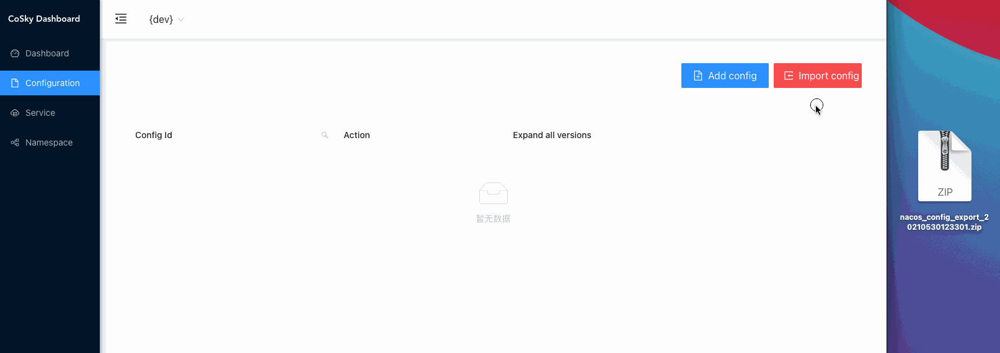

# CoSky 基于 Redis 的服务治理平台（服务注册/发现 & 配置中心）

> **Co**n**s**ul + S**ky** = **CoSky**

*CoSky* 是一个轻量级、低成本的服务注册、服务发现、 配置服务 SDK，通过使用现有基础设施中的 Redis （相信你已经部署了Redis），不用给运维部署带来额外的成本与负担。
借助于 Redis 的高性能， *CoSky* 提供了超高TPS&QPS (10W+/s [JMH 基准测试](#jmh-benchmark))。*CoSky* 结合本地进程缓存策略 + *Redis PubSub*
，实现实时进程缓存刷新，兼具无与伦比的QPS性能、进程缓存与 Redis 的实时一致性。

### 服务注册与发现


### 配置中心


### CoSky-Mirror

> CoSky-Mirror 就像一个镜子放在 Nacos、CoSky 中间，构建一个统一的服务发现平台。


## 安装

### Gradle

> Kotlin DSL

``` kotlin
    val coskyVersion = "1.1.0";
    implementation("me.ahoo.cosky:spring-cloud-starter-cosky-config:${coskyVersion}")
    implementation("me.ahoo.cosky:spring-cloud-starter-cosky-discovery:${coskyVersion}")
```

### Maven

```xml
<?xml version="1.0" encoding="UTF-8"?>

<project xmlns="http://maven.apache.org/POM/4.0.0"
         xmlns:xsi="http://www.w3.org/2001/XMLSchema-instance"
         xsi:schemaLocation="http://maven.apache.org/POM/4.0.0 http://maven.apache.org/xsd/maven-4.0.0.xsd">

  <modelVersion>4.0.0</modelVersion>
  <artifactId>demo</artifactId>
  <properties>
    <cosky.version>1.1.0</cosky.version>
  </properties>

  <dependencies>
    <dependency>
      <groupId>me.ahoo.cosky</groupId>
      <artifactId>spring-cloud-starter-cosky-config</artifactId>
      <version>${cosky.version}</version>
    </dependency>
    <dependency>
      <groupId>me.ahoo.cosky</groupId>
      <artifactId>spring-cloud-starter-cosky-discovery</artifactId>
      <version>${cosky.version}</version>
    </dependency>
  </dependencies>

</project>
```

### bootstrap.yaml (Spring-Cloud-Config)

```yaml
spring:
  application:
    name: ${service.name:cosky-rest-api}
  cloud:
    cosky:
      namespace: ${cosky.namespace:cosky-{system}}
      config:
        config-id: ${spring.application.name}.yaml
      redis:
        mode: ${cosky.redis.mode:standalone}
        url: ${cosky.redis.uri:redis://localhost:6379}
logging:
  file:
    name: logs/${spring.application.name}.log
```

## REST-API Server (``Optional``)

### 安装 REST-API Server

#### 方式一：下载可执行文件

> 下载 [rest-api-server](https://github.com/Ahoo-Wang/cosky/releases/download/1.1.0/cosky-rest-api-1.1.0.tar)

> 解压 *cosky-rest-api-1.1.0.tar*

```shell
cd cosky-rest-api-1.1.0
# 工作目录: cosky-rest-api-1.1.0
bin/cosky-rest-api --server.port=8080 --cosky.redis.uri=redis://localhost:6379
```

#### 方式二：在 Docker 中运行

```shell
docker pull ahoowang/cosky-rest-api:1.1.0
docker run --name cosky-rest-api -d -p 8080:8080 --link redis -e COSKY_REDIS_URI=redis://redis:6379  ahoowang/cosky-rest-api:1.1.0
```

##### MacBook Pro (M1)

> 请使用 *ahoowang/cosky-rest-api:1.1.0-armv7*

```shell
docker pull ahoowang/cosky-rest-api:1.1.0-armv7
docker run --name cosky-rest-api -d -p 8080:8080 --link redis -e COSKY_REDIS_URI=redis://redis:6379  ahoowang/cosky-rest-api:1.1.0-armv7
```

#### 方式三：在 Kubernetes 中运行

```yaml
apiVersion: apps/v1
kind: Deployment
metadata:
  name: cosky-rest-api
spec:
  replicas: 1
  selector:
    matchLabels:
      app: cosky-rest-api
  template:
    metadata:
      labels:
        app: cosky-rest-api
    spec:
      containers:
        - env:
            - name: COSKY_REDIS_MODE
              value: standalone
            - name: COSKY_REDIS_URI
              value: redis://redis-uri:6379
          image: ahoowang/cosky-rest-api:1.1.0
          name: cosky-rest-api
          resources:
            limits:
              cpu: "1"
              memory: 640Mi
            requests:
              cpu: 250m
              memory: 512Mi
          volumeMounts:
            - mountPath: /etc/localtime
              name: volume-localtime
      volumes:
        - hostPath:
            path: /etc/localtime
            type: ""
          name: volume-localtime

---
apiVersion: v1
kind: Service
metadata:
  name: cosky-rest-api
  labels:
    app: cosky-rest-api
spec:
  selector:
    app: cosky-rest-api
  ports:
    - name: rest
      port: 80
      protocol: TCP
      targetPort: 8080
```

### Dashboard

> [http://localhost:8080/dashboard](http://localhost:8080/dashboard)


#### 命名空间管理


#### 配置管理


##### 编辑配置


##### 回滚配置


##### 从 Nacos 导入配置



#### 服务管理


##### 编辑服务实例信息


### REST-API

> http://localhost:8080/swagger-ui/index.html#/

##### Namespace


- /v1/namespaces
  - GET
- /v1/namespaces/{namespace}
  - PUT
  - GET
- /v1/namespaces/current
  - GET
- /v1/namespaces/current/{namespace}
  - PUT

##### Config


- /v1/namespaces/{namespace}/configs
  - GET
- /v1/namespaces/{namespace}/configs/{configId}
  - GET
  - PUT
    - DELETE
- /v1/namespaces/{namespace}/configs/{configId}/versions
  - GET
- /v1/namespaces/{namespace}/configs/{configId}/versions/{version}
  - GET
- /v1/namespaces/{namespace}/configs/{configId}/to/{targetVersion}
  - PUT

#### Service


- /v1/namespaces/{namespace}/services/
  - GET
- /v1/namespaces/{namespace}/services/{serviceId}/instances
  - GET
  - PUT
- /v1/namespaces/{namespace}/services/{serviceId}/instances/{instanceId}
  - DELETE
- /v1/namespaces/{namespace}/services/{serviceId}/instances/{instanceId}/metadata
  - PUT
- /v1/namespaces/{namespace}/services/{serviceId}/lb
  - GET

## JMH-Benchmark

- 基准测试运行环境：笔记本开发机 ( MacBook Pro (M1) )
- 所有基准测试都在开发笔记本上执行。
- Redis 部署环境也在该笔记本开发机上。

### ConfigService

``` shell
gradle cosky-config:jmh
# or
java -jar cosky-config/build/libs/cosky-config-1.1.0-jmh.jar -bm thrpt -t 25 -wi 1 -rf json -f 1
```

```
# JMH version: 1.29
# VM version: JDK 11.1.01, OpenJDK 64-Bit Server VM, 11.1.01+9-LTS
# VM invoker: /Library/Java/JavaVirtualMachines/zulu-11.jdk/Contents/Home/bin/java
# VM options: -Dfile.encoding=UTF-8 -Djava.io.tmpdir=/Users/ahoo/cosky/config/build/tmp/jmh -Duser.country=CN -Duser.language=zh -Duser.variant
# Blackhole mode: full + dont-inline hint
# Warmup: 1 iterations, 10 s each
# Measurement: 1 iterations, 10 s each
# Timeout: 10 min per iteration
# Threads: 50 threads, will synchronize iterations
# Benchmark mode: Throughput, ops/time

Benchmark                                          Mode  Cnt          Score   Error  Units
ConsistencyRedisConfigServiceBenchmark.getConfig  thrpt       265321650.148          ops/s
RedisConfigServiceBenchmark.getConfig             thrpt          106991.476          ops/s
RedisConfigServiceBenchmark.setConfig             thrpt          103659.132          ops/s
```

### ServiceDiscovery

``` shell
gradle cosky-discovery:jmh
# or
java -jar cosky-discovery/build/libs/cosky-discovery-1.1.0-jmh.jar -bm thrpt -t 25 -wi 1 -rf json -f 1
```

```
# JMH version: 1.29
# VM version: JDK 11.1.01, OpenJDK 64-Bit Server VM, 11.1.01+9-LTS
# VM invoker: /Library/Java/JavaVirtualMachines/zulu-11.jdk/Contents/Home/bin/java
# VM options: -Dfile.encoding=UTF-8 -Djava.io.tmpdir=/Users/ahoo/cosky/discovery/build/tmp/jmh -Duser.country=CN -Duser.language=zh -Duser.variant
# Blackhole mode: full + dont-inline hint
# Warmup: 1 iterations, 10 s each
# Measurement: 1 iterations, 10 s each
# Timeout: 10 min per iteration
# Threads: 50 threads, will synchronize iterations
# Benchmark mode: Throughput, ops/time

Benchmark                                                Mode  Cnt          Score   Error  Units
ConsistencyRedisServiceDiscoveryBenchmark.getInstances  thrpt        76894658.867          ops/s
ConsistencyRedisServiceDiscoveryBenchmark.getServices   thrpt       466036317.472          ops/s
RedisServiceDiscoveryBenchmark.getInstances             thrpt          107778.244          ops/s
RedisServiceDiscoveryBenchmark.getServices              thrpt          106920.412          ops/s
RedisServiceRegistryBenchmark.deregister                thrpt          114094.513          ops/s
RedisServiceRegistryBenchmark.register                  thrpt          109085.694          ops/s
RedisServiceRegistryBenchmark.renew                     thrpt          127003.104          ops/s
```
