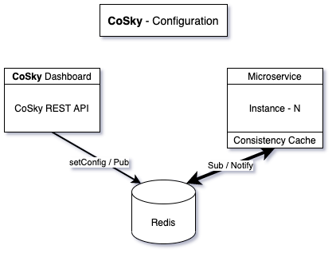
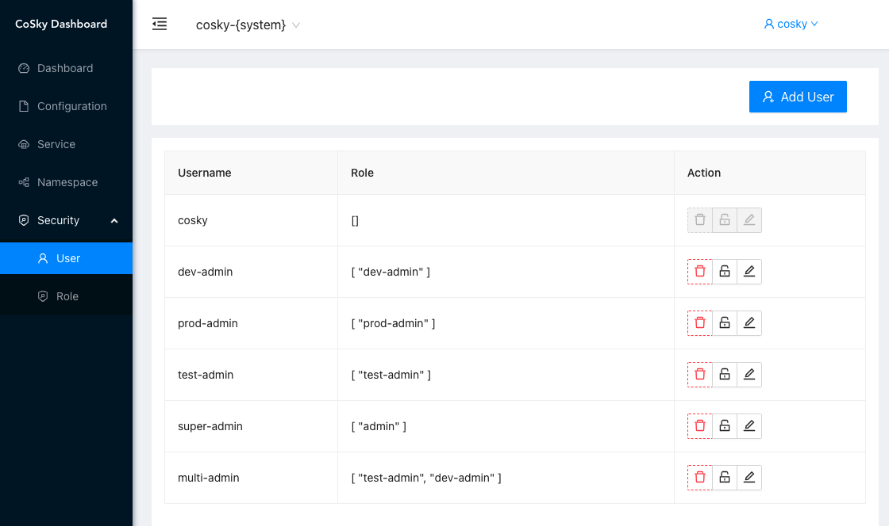
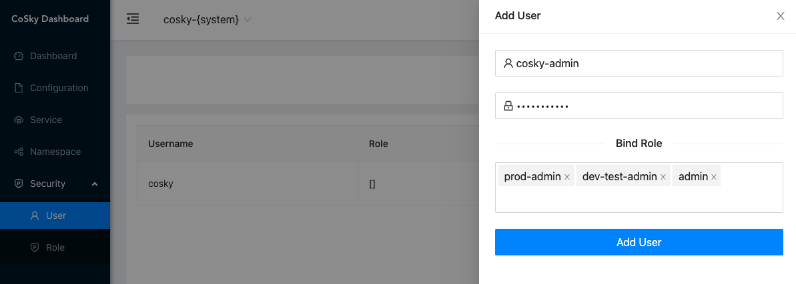

# [CoSky](https://github.com/Ahoo-Wang/CoSky) - 高性能、低成本微服务治理平台

[](https://www.apache.org/licenses/LICENSE-2.0.html)
[](https://github.com/Ahoo-Wang/CoSky/releases)
[](https://central.sonatype.com/artifact/me.ahoo.cosky/cosky-core)

[](https://www.codacy.com/gh/Ahoo-Wang/CoSky/dashboard?utm_source=github.com&amp;utm_medium=referral&amp;utm_content=Ahoo-Wang/CoSky&amp;utm_campaign=Badge_Grade)
[](https://codecov.io/gh/Ahoo-Wang/CoSky)
[](https://github.com/Ahoo-Wang/CoSky)
[](https://deepwiki.com/Ahoo-Wang/CoSky)

> [English Document](https://github.com/Ahoo-Wang/CoSky/blob/main/README.md)

*[CoSky](https://github.com/Ahoo-Wang/CoSky)* 是一个轻量级、低成本的服务注册、服务发现、配置服务 SDK，通过使用现有基础设施中的 Redis（相信您已经部署了 Redis），无需给运维部署带来额外的成本与负担。借助 Redis 的高性能，*CoSky* 提供了超高的 TPS&QPS (10W+/s [JMH 基准测试](#jmh-benchmark))。*CoSky* 结合本地进程缓存策略 + *Redis PubSub*，实现实时进程缓存刷新，兼具无与伦比的 QPS 性能 (7000W+/s [JMH 基准测试](#jmh-benchmark)) 和进程缓存与 Redis 的实时一致性。

## 服务注册与发现

<p align="center">
     
</p>

## 配置中心

<p align="center">
     
</p>

## Examples

[Service Consumer --RPC--> Service Provider Examples](https://github.com/Ahoo-Wang/CoSky/tree/main/examples)

## 安装

### Gradle

> Kotlin DSL

``` kotlin
    val coskyVersion = "lastVersion";
    implementation("me.ahoo.cosky:spring-cloud-starter-cosky-config:${coskyVersion}")
    implementation("me.ahoo.cosky:spring-cloud-starter-cosky-discovery:${coskyVersion}")
    implementation("org.springframework.cloud:spring-cloud-starter-loadbalancer:3.0.3")
```

### Maven

```xml
<?xml version="1.0" encoding="UTF-8"?>

<project xmlns="http://maven.apache.org/POM/4.0.0"
         xmlns:xsi="http://www.w3.org/2001/XMLSchema-instance"
         xsi:schemaLocation="http://maven.apache.org/POM/4.0.0 http://maven.apache.org/xsd/maven-4.0.0.xsd">

  <modelVersion>4.0.0</modelVersion>
  <artifactId>demo</artifactId>
  <properties>
    <cosky.version>lastVersion</cosky.version>
  </properties>

  <dependencies>
    <dependency>
      <groupId>me.ahoo.cosky</groupId>
      <artifactId>spring-cloud-starter-cosky-config</artifactId>
      <version>${cosky.version}</version>
    </dependency>
    <dependency>
      <groupId>me.ahoo.cosky</groupId>
      <artifactId>spring-cloud-starter-cosky-discovery</artifactId>
      <version>${cosky.version}</version>
    </dependency>
    <dependency>
      <groupId>org.springframework.cloud</groupId>
      <artifactId>spring-cloud-starter-loadbalancer</artifactId>
      <version>3.0.3</version>
    </dependency>
  </dependencies>

</project>
```

### bootstrap.yaml (Spring-Cloud-Config)

```yaml
spring:
  application:
    name: ${service.name:cosky}
  data:
    redis:
      url: redis://localhost:6379
  cloud:
    cosky:
      namespace: ${cosky.namespace:cosky-{system}}
      config:
        config-id: ${spring.application.name}.yaml
    service-registry:
      auto-registration:
        enabled: ${cosky.auto-registry:true}
logging:
  file:
    name: logs/${spring.application.name}.log
```

## 🌐 REST-API Server（可选）

根据您的环境选择三种部署方式之一：

### 🖥️ 方式一：独立可执行文件

下载最新版本并直接运行：

```shell
# 下载 cosky-server
wget https://github.com/Ahoo-Wang/cosky/releases/latest/download/cosky-server.tar

# 解压并运行
tar -xvf cosky-server.tar
cd cosky-server
bin/cosky --server.port=8080 --spring.data.redis.url=redis://localhost:6379
```

### 🐳 方式二：Docker 部署

使用 Docker 快速部署：

```shell
docker pull ahoowang/cosky:latest
docker run --name cosky -d -p 8080:8080 \
  -e SPRING_DATA_REDIS_URL=redis://your-redis-host:6379 \
  ahoowang/cosky:latest
```

### ☸️ 方式三：Kubernetes 部署

在 Kubernetes 集群中部署：

```yaml
apiVersion: apps/v1
kind: Deployment
metadata:
  name: cosky
  labels:
    app: cosky
spec:
  replicas: 1
  selector:
    matchLabels:
      app: cosky
  template:
    metadata:
      labels:
        app: cosky
    spec:
      containers:
        - name: cosky
          image: ahoowang/cosky:latest
          ports:
            - containerPort: 8080
              protocol: TCP
          env:
            - name: SPRING_DATA_REDIS_URL
              value: redis://your-redis-host:6379
          resources:
            requests:
              cpu: 250m
              memory: 1024Mi
            limits:
              cpu: "1"
              memory: 1280Mi
          volumeMounts:
            - name: volume-localtime
              mountPath: /etc/localtime
      volumes:
        - name: volume-localtime
          hostPath:
            path: /etc/localtime
            type: ""

---
apiVersion: v1
kind: Service
metadata:
  name: cosky
  labels:
    app: cosky
spec:
  selector:
    app: cosky
  ports:
    - name: rest
      port: 80
      protocol: TCP
      targetPort: 8080
```

### 🎨 Dashboard

访问基于Web的管理界面：
> [http://localhost:8080/dashboard](http://localhost:8080/dashboard)

<p align="center">
     
</p>

CoSky Dashboard 提供以下功能：
- 实时服务监控和管理
- 配置管理（含版本控制）
- 命名空间隔离和管理
- 基于角色的访问控制（RBAC）
- 审计日志用于合规性
- 服务拓扑可视化
- 简单的导入/导出功能

### 服务依赖拓扑

<p align="center">
     
</p>

### 基于角色的访问控制(RBAC)

- cosky: 保留用户名，超级用户，拥有最高权限。应用首次启动时会初始化超级用户(*cosky*)的密码，并打印在控制台。忘记密码也不用担心，可以通过配置 `enforce-init-super-user: true`，*CoSky* 会帮助你重新初始化密码并打印在控制台。

```log
---------------- ****** CoSky -  init super user:[cosky] password:[6TrmOux4Oj] ****** ----------------
```

- admin: 保留角色，超级管理员角色，拥有所有权限，一个用户可以绑定多个角色，一个角色可以绑定多个资源操作权限。
- 权限控制粒度为命名空间，读写操作

#### 角色权限

<p align="center">
     
</p>

##### 添加角色

<p align="center">
     
</p>

#### 用户管理

<p align="center">
     
</p>

##### 添加用户

<p align="center">
     
</p>

#### 审计日志

<p align="center">
     
</p>

#### 命名空间管理

<p align="center">
     
</p>

#### 配置管理

<p align="center">
     
</p>

##### 编辑配置

<p align="center">
     
</p>

##### 回滚配置

<p align="center">
     
</p>

##### 从 Nacos 导入配置

<p align="center">
     
</p>

#### 服务管理

<p align="center">
     
</p>

##### 编辑服务实例信息

<p align="center">
     
</p>

### REST-API

> https://ahoo-cosky.apifox.cn/

## 🚀 性能基准测试

<p align="center">
  <strong>CoSky 提供卓越的性能，相比其他方案性能提升数个数量级</strong>
</p>

### 测试环境
- **硬件**: MacBook Pro (M1)
- **Redis**: 在同一台机器上本地部署
- **方法论**: 所有基准测试均使用 JMH (Java Microbenchmark Harness) 进行

### 配置服务性能

```shell
gradle cosky-config:jmh
# or
java -jar cosky-config/build/libs/cosky-config-lastVersion-jmh.jar -bm thrpt -t 25 -wi 1 -rf json -f 1
```

#### 测试结果
```
Benchmark                                          Mode  Cnt          Score   Error  Units
ConsistencyRedisConfigServiceBenchmark.getConfig  thrpt       256733987.827          ops/s
RedisConfigServiceBenchmark.getConfig             thrpt          241787.679          ops/s
RedisConfigServiceBenchmark.setConfig             thrpt          140461.112          ops/s
```

### 服务发现性能

```shell
gradle cosky-discovery:jmh
# or
java -jar cosky-discovery/build/libs/cosky-discovery-lastVersion-jmh.jar -bm thrpt -t 25 -wi 1 -rf json -f 1
```

#### 测试结果
```
Benchmark                                                Mode  Cnt          Score   Error  Units
ConsistencyRedisServiceDiscoveryBenchmark.getInstances  thrpt        76621729.048          ops/s
ConsistencyRedisServiceDiscoveryBenchmark.getServices   thrpt       455760632.346          ops/s
RedisServiceDiscoveryBenchmark.getInstances             thrpt          226909.985          ops/s
RedisServiceDiscoveryBenchmark.getServices              thrpt          304979.150          ops/s
RedisServiceRegistryBenchmark.deregister                thrpt          255305.648          ops/s
RedisServiceRegistryBenchmark.register                  thrpt          110664.160          ops/s
RedisServiceRegistryBenchmark.renew                     thrpt          210960.325          ops/s
```

> 🔥 **关键洞察**: CoSky 的一致性层在配置检索方面提供超过 800 倍的性能提升，在服务发现方面提供超过 250 倍的性能提升，相比标准 Redis 操作。

## 🔁 CoSky-Mirror （实时同步服务实例变更状态）

> CoSky-Mirror 就像一座桥梁连接 Nacos 和 CoSky，构建一个统一的服务发现平台，实现无缝集成。

<p align="center">
     
</p>

<p align="center">
     
</p>

通过 CoSky-Mirror，您可以：
- 在 Nacos 和 CoSky 之间实时同步服务实例
- 保持不同服务注册中心之间的一致性
- 零停机从 Nacos 迁移到 CoSky
- 构建混合服务发现架构

## 📊 功能对比

| 功能                         | CoSky            | Eureka        | Consul            | CoreDNS       | Zookeeper     | Nacos                        | Apollo        |
|----------------------------|------------------|---------------|-------------------|---------------|---------------|------------------------------|---------------|
| **CAP**                    | CP+AP            | AP            | CP                | CP            | CP            | CP+AP                        | CP+AP         |
| **健康检查**                 | Client Beat      | Client Beat   | TCP/HTTP/gRPC/Cmd | Keep Alive    | Keep Alive    | TCP/HTTP/Client Beat         | Client Beat   |
| **负载均衡策略**              | Weight/Selector  | Ribbon        | Fabio             | RoundRobin    | RoundRobin    | Weight/metadata/RoundRobin   | RoundRobin    |
| **雪崩保护**                 | ❌               | ✅            | ❌                | ❌            | ❌            | ✅                           | ❌            |
| **自动注销实例**              | ✅               | ✅            | ❌                | ❌            | ✅            | ✅                           | ✅            |
| **访问协议**                 | HTTP/Redis       | HTTP          | HTTP/DNS          | DNS           | TCP           | HTTP/DNS                     | HTTP          |
| **监听支持**                 | ✅               | ✅            | ✅                | ❌            | ✅            | ✅                           | ✅            |
| **多数据中心**               | ✅               | ✅            | ✅                | ❌            | ❌            | ✅                           | ✅            |
| **跨注册中心同步**            | ✅               | ❌            | ✅                | ❌            | ❌            | ✅                           | ❌            |
| **SpringCloud集成**        | ✅               | ✅            | ✅                | ❌            | ❌            | ✅                           | ✅            |
| **Dubbo集成**              | ✅               | ❌            | ❌                | ❌            | ✅            | ✅                           | ✅            |
| **K8S集成**                | ✅               | ❌            | ✅                | ✅            | ❌            | ✅                           | ❌            |
| **持久化**                  | Redis            | -             | -                 | -             | -             | MySql                        | MySql         |

> ✅ **CoSky 的核心优势**:
> - **混合 CP+AP 模型**兼顾一致性和可用性
> - **基于 Redis 的超高性能**（10万+ QPS）
> - **跨注册中心同步**能力
> - **轻量级部署**，运维成本极低
> - **全面的生态系统集成**（Spring Cloud、Dubbo、K8S）

---

## 🤝 贡献

欢迎社区贡献！无论是报告错误、提出功能建议还是提交拉取请求，您的参与都能帮助 CoSky 变得更好。

## 📄 许可证

CoSky 是基于 [Apache License 2.0](https://www.apache.org/licenses/LICENSE-2.0.html) 许可的开源软件。
