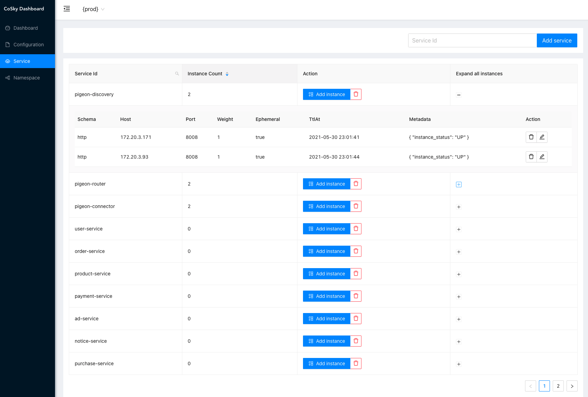
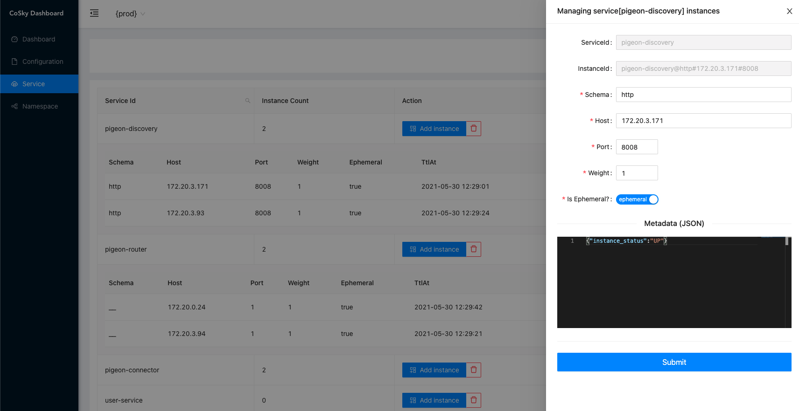

# [CoSky](https://github.com/Ahoo-Wang/CoSky) 高性能、低成本微服务治理平台（服务注册/发现 & 配置中心）

[](https://www.apache.org/licenses/LICENSE-2.0.html)
[](https://github.com/Ahoo-Wang/CoSky/releases)
[](https://maven-badges.herokuapp.com/maven-central/me.ahoo.cosky/cosky-core)
[](https://www.codacy.com/gh/Ahoo-Wang/CoSky/dashboard?utm_source=github.com&amp;utm_medium=referral&amp;utm_content=Ahoo-Wang/CoSky&amp;utm_campaign=Badge_Grade)
[](https://codecov.io/gh/Ahoo-Wang/CoSky)


> [English Document](https://github.com/Ahoo-Wang/CoSky/blob/main/README.md)

*[CoSky](https://github.com/Ahoo-Wang/CoSky)* 是一个轻量级、低成本的服务注册、服务发现、 配置服务 SDK，通过使用现有基础设施中的 Redis （相信你已经部署了Redis），不用给运维部署带来额外的成本与负担。 借助于 Redis 的高性能， *CoSky* 提供了超高TPS&QPS (10W+/s [JMH 基准测试](#jmh-benchmark))。*CoSky* 结合本地进程缓存策略 + *Redis PubSub*，实现实时进程缓存刷新，兼具无与伦比的QPS性能 (7000W+/s [JMH 基准测试](#jmh-benchmark))、进程缓存与 Redis 的实时一致性。

## 服务注册与发现

<p align="center">
     
</p>

## 配置中心

<p align="center">
     
</p>

## Examples

[Service Consumer --RPC--> Service Provider Examples](https://github.com/Ahoo-Wang/CoSky/tree/main/examples)

## 安装

### Gradle

> Kotlin DSL

``` kotlin
    val coskyVersion = "lastVersion";
    implementation("me.ahoo.cosky:spring-cloud-starter-cosky-config:${coskyVersion}")
    implementation("me.ahoo.cosky:spring-cloud-starter-cosky-discovery:${coskyVersion}")
    implementation("org.springframework.cloud:spring-cloud-starter-loadbalancer:3.0.3")
```

### Maven

```xml
<?xml version="1.0" encoding="UTF-8"?>

<project xmlns="http://maven.apache.org/POM/4.0.0"
         xmlns:xsi="http://www.w3.org/2001/XMLSchema-instance"
         xsi:schemaLocation="http://maven.apache.org/POM/4.0.0 http://maven.apache.org/xsd/maven-4.0.0.xsd">

  <modelVersion>4.0.0</modelVersion>
  <artifactId>demo</artifactId>
  <properties>
    <cosky.version>lastVersion</cosky.version>
  </properties>

  <dependencies>
    <dependency>
      <groupId>me.ahoo.cosky</groupId>
      <artifactId>spring-cloud-starter-cosky-config</artifactId>
      <version>${cosky.version}</version>
    </dependency>
    <dependency>
      <groupId>me.ahoo.cosky</groupId>
      <artifactId>spring-cloud-starter-cosky-discovery</artifactId>
      <version>${cosky.version}</version>
    </dependency>
    <dependency>
      <groupId>org.springframework.cloud</groupId>
      <artifactId>spring-cloud-starter-loadbalancer</artifactId>
      <version>3.0.3</version>
    </dependency>
  </dependencies>

</project>
```

### bootstrap.yaml (Spring-Cloud-Config)

```yaml
spring:
  application:
    name: ${service.name:cosky-rest-api}
  redis:
    url: redis://localhost:6379
  cloud:
    cosky:
      namespace: ${cosky.namespace:cosky-{system}}
      config:
        config-id: ${spring.application.name}.yaml
    service-registry:
      auto-registration:
        enabled: ${cosky.auto-registry:true}
logging:
  file:
    name: logs/${spring.application.name}.log
```

## REST-API Server (``Optional``)

### 安装 REST-API Server

#### 方式一：下载可执行文件

> 下载 [cosky-rest-api-server](https://github.com/Ahoo-Wang/cosky/releases/download/v2.0.0/cosky-rest-api-2.0.0.tar)

> 解压 *cosky-rest-api-lastVersion.tar*

```shell
cd cosky-rest-api-lastVersion
# 工作目录: cosky-rest-api
bin/cosky-rest-api --server.port=8080 --spring.redis.uri=redis://localhost:6379
```

#### 方式二：在 Docker 中运行

```shell
docker pull ahoowang/cosky-rest-api:lastVersion
docker run --name cosky-rest-api -d -p 8080:8080 --link redis -e SPRING_REDIS_URL=redis://redis:6379  ahoowang/cosky-rest-api:lastVersion
```

#### 方式三：在 Kubernetes 中运行

```yaml
apiVersion: apps/v1
kind: Deployment
metadata:
  name: cosky-rest-api
  labels:
    app: cosky-rest-api
spec:
  replicas: 1
  selector:
    matchLabels:
      app: cosky-rest-api
  template:
    metadata:
      labels:
        app: cosky-rest-api
    spec:
      containers:
        - env:
            - name: SPRING_REDIS_URL
              value: redis://redis-uri:6379
          image: ahoowang/cosky-rest-api:lastVersion
          name: cosky-rest-api
          ports:
            - containerPort: 8080
              protocol: TCP
          resources:
            limits:
              cpu: "1"
              memory: 1280Mi
            requests:
              cpu: 250m
              memory: 1024Mi
          volumeMounts:
            - mountPath: /etc/localtime
              name: volume-localtime
      volumes:
        - hostPath:
            path: /etc/localtime
            type: ""
          name: volume-localtime

---
apiVersion: v1
kind: Service
metadata:
  name: cosky-rest-api
  labels:
    app: cosky-rest-api
spec:
  selector:
    app: cosky-rest-api
  ports:
    - name: rest
      port: 80
      protocol: TCP
      targetPort: 8080
```

### Dashboard

> [http://localhost:8080/dashboard](http://localhost:8080/dashboard)

<p align="center">
     
</p>

### 服务依赖拓扑

<p align="center">
     
</p>

### 基于角色的访问控制(RBAC)

- cosky: 保留用户名，超级用户，拥有最高权限。应用首次启动时会初始化超级用户(*cosky*)的密码，并打印在控制台。忘记密码也不用担心，可以通过配置 `enforce-init-super-user: true`，*CoSky* 会帮助你重新初始化密码并打印在控制台。

```log
---------------- ****** CoSky -  init super user:[cosky] password:[6TrmOux4Oj] ****** ----------------
```

- admin: 保留角色，超级管理员角色，拥有所有权限，一个用户可以绑定多个角色，一个角色可以绑定多个资源操作权限。
- 权限控制粒度为命名空间，读写操作

#### 角色权限

<p align="center">
     
</p>

##### 添加角色

<p align="center">
     
</p>

#### 用户管理

<p align="center">
     
</p>

##### 添加用户

<p align="center">
     
</p>

#### 审计日志

<p align="center">
     
</p>

#### 命名空间管理

<p align="center">
     
</p>

#### 配置管理

<p align="center">
     
</p>

##### 编辑配置

<p align="center">
     
</p>

##### 回滚配置

<p align="center">
     
</p>

##### 从 Nacos 导入配置

<p align="center">
     
</p>

#### 服务管理

<p align="center">
     
</p>

##### 编辑服务实例信息

<p align="center">
     
</p>

### REST-API

> http://localhost:8080/swagger-ui/index.html#/

##### Namespace

<p align="center">
     
</p>

- /v1/namespaces
  - GET
- /v1/namespaces/{namespace}
  - PUT
  - GET
- /v1/namespaces/current
  - GET
- /v1/namespaces/current/{namespace}
  - PUT

##### Config

<p align="center">
     
</p>

- /v1/namespaces/{namespace}/configs
  - GET
- /v1/namespaces/{namespace}/configs/{configId}
  - GET
  - PUT
    - DELETE
- /v1/namespaces/{namespace}/configs/{configId}/versions
  - GET
- /v1/namespaces/{namespace}/configs/{configId}/versions/{version}
  - GET
- /v1/namespaces/{namespace}/configs/{configId}/to/{targetVersion}
  - PUT

#### Service

<p align="center">
     
</p>

- /v1/namespaces/{namespace}/services/
  - GET
- /v1/namespaces/{namespace}/services/{serviceId}/instances
  - GET
  - PUT
- /v1/namespaces/{namespace}/services/{serviceId}/instances/{instanceId}
  - DELETE
- /v1/namespaces/{namespace}/services/{serviceId}/instances/{instanceId}/metadata
  - PUT
- /v1/namespaces/{namespace}/services/{serviceId}/lb
  - GET

## JMH-Benchmark

- 基准测试运行环境：笔记本开发机 ( MacBook Pro (M1) )
- 所有基准测试都在开发笔记本上执行。
- Redis 部署环境也在该笔记本开发机上。

### ConfigService

``` shell
gradle cosky-config:jmh
# or
java -jar cosky-config/build/libs/cosky-config-lastVersion-jmh.jar -bm thrpt -t 25 -wi 1 -rf json -f 1
```

```
Benchmark                                          Mode  Cnt          Score   Error  Units
ConsistencyRedisConfigServiceBenchmark.getConfig  thrpt       256733987.827          ops/s
RedisConfigServiceBenchmark.getConfig             thrpt          241787.679          ops/s
RedisConfigServiceBenchmark.setConfig             thrpt          140461.112          ops/s
```

### ServiceDiscovery

``` shell
gradle cosky-discovery:jmh
# or
java -jar cosky-discovery/build/libs/cosky-discovery-lastVersion-jmh.jar -bm thrpt -t 25 -wi 1 -rf json -f 1
```

```
Benchmark                                                Mode  Cnt          Score   Error  Units
ConsistencyRedisServiceDiscoveryBenchmark.getInstances  thrpt        76621729.048          ops/s
ConsistencyRedisServiceDiscoveryBenchmark.getServices   thrpt       455760632.346          ops/s
RedisServiceDiscoveryBenchmark.getInstances             thrpt          226909.985          ops/s
RedisServiceDiscoveryBenchmark.getServices              thrpt          304979.150          ops/s
RedisServiceRegistryBenchmark.deregister                thrpt          255305.648          ops/s
RedisServiceRegistryBenchmark.register                  thrpt          110664.160          ops/s
RedisServiceRegistryBenchmark.renew                     thrpt          210960.325          ops/s
```

## CoSky-Mirror （实时同步服务实例变更状态）

> CoSky-Mirror 就像一个镜子放在 Nacos、CoSky 中间，构建一个统一的服务发现平台。

<p align="center">
     
</p>

<p align="center">
     
</p>

## 其他同类产品对比
|               | CoSky          | 	Eureka       | 	Consul           | 	CoreDNS     | 	Zookeeper   | 	Nacos                 | 	Apollo      |
|---------------|----------------|---------------|-------------------|--------------|--------------|------------------------|--------------|
| CAP           | CP+AP          | 	AP           | 	CP               | 	CP          | 	CP          | 	CP+AP                 | 	CP+AP       |
| 健康检查          | 	Client Beat   | 	Client Beat	 | TCP/HTTP/gRPC/Cmd | 	Keep Alive  | 	Keep Alive  | 	TCP/HTTP/Client Beat  | 	Client Beat |
| 负载均衡策略        | 	权重/RoundRobin | 	Ribbon       | 	Fabio	           | 	RoundRobin	 | 	RoundRobin	 | 	权重/metadata/Selector	 | 	RoundRobin	 |
| 雪崩保护          | 	无             | 	有            | 	无	               | 	无	          | 	无	          | 	有	                    | 	无	          |
| 自动注销实例        | 	支持            | 	支持           | 	不支持	             | 	不支持	        | 	支持          | 	支持                    | 	支持	         |
| 访问协议          | 	HTTP/Redis    | 	HTTP         | 	HTTP/DNS	        | 	DNS	        | 	TCP	        | 	HTTP/DNS	             | 	HTTP	       |
| 监听支持          | 	支持            | 	支持           | 	支持	              | 	不支持	        | 	支持	         | 	支持	                   | 	支持	         |
| 多数据中心         | 	支持            | 	支持           | 	支持	              | 	不支持	        | 	不支持	        | 	支持	                   | 	支持	         |
| 跨注册中心同步       | 	支持            | 	不支持          | 	支持	              | 	不支持	        | 	不支持	        | 	支持	                   | 	不支持	        |
| SpringCloud集成 | 	支持            | 	支持           | 	支持	              | 	不支持	        | 	不支持	        | 	支持                    | 	支持	         |
| Dubbo集成       | 	支持            | 	不支持          | 	不支持	             | 	不支持	        | 	支持	         | 	支持	                   | 	支持	         |
| K8S集成         | 	支持            | 	不支持          | 	支持	              | 	支持	         | 	不支持	        | 	支持	                   | 	不支持	        |
| 持久化           | 	Redis         | 		            | 		                | 		           |              | 	MySql                 | 	MySql       |
