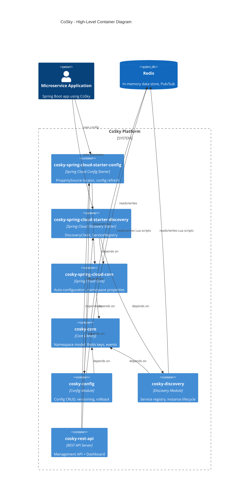
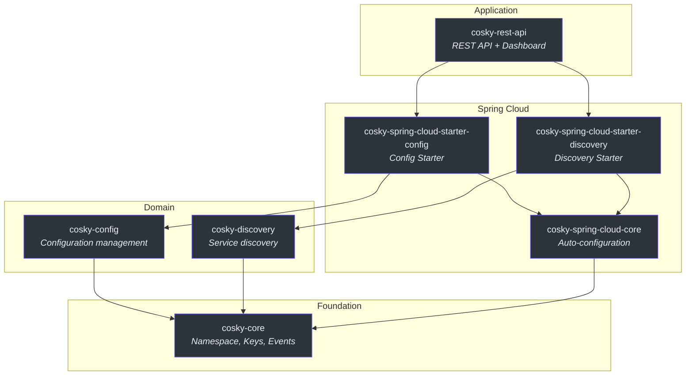
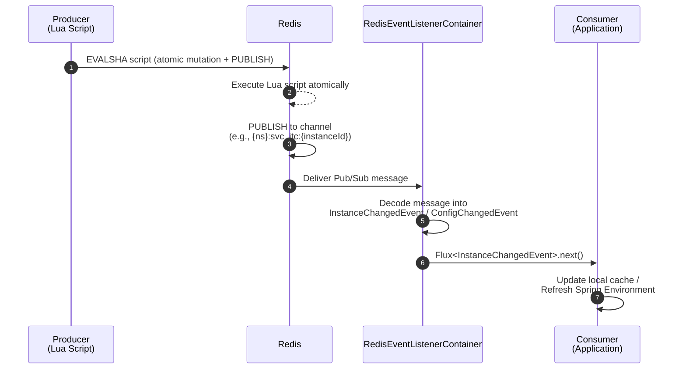
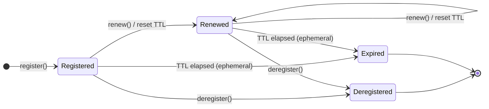

# Architecture Overview

CoSky is a high-performance microservice governance platform that provides service discovery and configuration management backed by Redis. Rather than requiring separate infrastructure components like ZooKeeper or Consul, CoSky leverages Redis -- a technology most microservice deployments already depend on -- as the single source of truth. This design eliminates operational complexity while delivering sub-millisecond reads through Redis's in-memory data structures, Lua-script atomicity guarantees for writes, and Pub/Sub for real-time change propagation.

The architecture follows a layered, module-driven design inspired by Clean Architecture principles. Core domain abstractions live in `cosky-core`, domain-specific logic splits into `cosky-config` and `cosky-discovery`, and Spring Cloud integration is provided by dedicated starter modules. This separation ensures that teams can adopt only the capability they need (configuration alone, discovery alone, or both) without pulling in unnecessary transitive dependencies.

## At a Glance

| Module | Responsibility | Key File | Source |
|--------|---------------|----------|--------|
| `cosky-core` | Namespace model, Redis key utilities, event listener abstractions, brand constants | `CoSky.kt`, `Namespaced.kt`, `NamespacedContext.kt`, `RedisKeys.kt`, `EventListenerContainer.kt` | [cosky-core/src/main/kotlin/me/ahoo/cosky/core](https://github.com/Ahoo-Wang/CoSky/tree/main/cosky-core/src/main/kotlin/me/ahoo/cosky/core) |
| `cosky-config` | Configuration CRUD, versioning, rollback, change events | `ConfigService.kt`, `ConfigKeyGenerator.kt`, `ConfigChangedEvent.kt` | [cosky-config/src/main/kotlin/me/ahoo/cosky/config](https://github.com/Ahoo-Wang/CoSky/tree/main/cosky-config/src/main/kotlin/me/ahoo/cosky/config) |
| `cosky-discovery` | Service registry, discovery, instance lifecycle, topology | `ServiceRegistry.kt`, `ServiceDiscovery.kt`, `DiscoveryKeyGenerator.kt` | [cosky-discovery/src/main/kotlin/me/ahoo/cosky/discovery](https://github.com/Ahoo-Wang/CoSky/tree/main/cosky-discovery/src/main/kotlin/me/ahoo/cosky/discovery) |
| `cosky-spring-cloud-core` | Spring Boot auto-configuration, namespace properties, Redis template wiring | `CoSkyAutoConfiguration.kt`, `CoSkyProperties.kt` | [cosky-spring-cloud-core/src/main/kotlin/me/ahoo/cosky/spring/cloud](https://github.com/Ahoo-Wang/CoSky/tree/main/cosky-spring-cloud-core/src/main/kotlin/me/ahoo/cosky/spring/cloud) |
| `cosky-spring-cloud-starter-config` | Spring Cloud Config `PropertySourceLocator` integration, config refresh | `CoSkyPropertySourceLocator.kt`, `CoSkyConfigRefresher.kt` | [cosky-spring-cloud-starter-config](https://github.com/Ahoo-Wang/CoSky/tree/main/cosky-spring-cloud-starter-config) |
| `cosky-spring-cloud-starter-discovery` | Spring Cloud `DiscoveryClient` and `ServiceRegistry` integration | `CoSkyDiscoveryClient.kt`, `CoSkyServiceRegistry.kt` | [cosky-spring-cloud-starter-discovery](https://github.com/Ahoo-Wang/CoSky/tree/main/cosky-spring-cloud-starter-discovery) |
| `cosky-rest-api` | RESTful management API and dashboard server | `RestApiServer.kt`, `ConfigController.kt`, `ServiceController.kt` | [cosky-rest-api](https://github.com/Ahoo-Wang/CoSky/tree/main/cosky-rest-api) |

## High-Level C4 Container Diagram

The following diagram shows how a Spring Boot application integrates with CoSky through the starter modules, which in turn depend on the core libraries backed by Redis.

<!-- Sources: settings.gradle.kts:14-28, build.gradle.kts:28-43 -->

## Module Dependency Graph

The Gradle module structure forms a directed acyclic graph. `cosky-core` is the foundation; every other module depends on it either directly or transitively.

<!-- Sources: cosky-config/build.gradle.kts:1, cosky-discovery/build.gradle.kts:1, cosky-spring-cloud-core/build.gradle.kts:1, cosky-spring-cloud-starter-config/build.gradle.kts:1, cosky-spring-cloud-starter-discovery/build.gradle.kts:1, cosky-rest-api/build.gradle.kts:1 -->

## Redis Key Design

All data in CoSky is stored in Redis using a consistent key naming strategy. Keys are composed of a namespace prefix, a domain-specific segment, and a resource identifier, separated by the `:` character (defined as `CoSky.KEY_SEPARATOR`). The [`RedisKeys`](https://github.com/Ahoo-Wang/CoSky/blob/main/cosky-core/src/main/kotlin/me/ahoo/cosky/core/util/RedisKeys.kt) utility handles Redis Cluster hash-tag wrapping to ensure keys within the same namespace route to the same slot.

| Domain | Key Pattern | Redis Type | Purpose | Source |
|--------|------------|------------|---------|--------|
| Namespace index | `{cosky-system}:ns_idx` | SET | Stores all registered namespaces | [RedisNamespaceService.kt:28](https://github.com/Ahoo-Wang/CoSky/blob/main/cosky-core/src/main/kotlin/me/ahoo/cosky/core/redis/RedisNamespaceService.kt#L28) |
| Service index | `{namespace}:svc_idx` | SET | Stores all service IDs in a namespace | [DiscoveryKeyGenerator.kt:32](https://github.com/Ahoo-Wang/CoSky/blob/main/cosky-discovery/src/main/kotlin/me/ahoo/cosky/discovery/DiscoveryKeyGenerator.kt#L32) |
| Instance index | `{namespace}:svc_itc_idx:{serviceId}` | SET | Stores instance IDs for a service | [DiscoveryKeyGenerator.kt:55](https://github.com/Ahoo-Wang/CoSky/blob/main/cosky-discovery/src/main/kotlin/me/ahoo/cosky/discovery/DiscoveryKeyGenerator.kt#L55) |
| Instance data | `{namespace}:svc_itc:{instanceId}` | STRING (with TTL) | Encoded instance details, expires for ephemeral instances | [DiscoveryKeyGenerator.kt:63](https://github.com/Ahoo-Wang/CoSky/blob/main/cosky-discovery/src/main/kotlin/me/ahoo/cosky/discovery/DiscoveryKeyGenerator.kt#L63) |
| Service stats | `{namespace}:svc_stat` | HASH | Instance count statistics per service | [DiscoveryKeyGenerator.kt:41](https://github.com/Ahoo-Wang/CoSky/blob/main/cosky-discovery/src/main/kotlin/me/ahoo/cosky/discovery/DiscoveryKeyGenerator.kt#L41) |
| Config index | `{namespace}:cfg_idx` | SET | Stores all config IDs in a namespace | [ConfigKeyGenerator.kt:36](https://github.com/Ahoo-Wang/CoSky/blob/main/cosky-config/src/main/kotlin/me/ahoo/cosky/config/ConfigKeyGenerator.kt#L36) |
| Config data | `{namespace}:cfg:{configId}` | HASH | Current config data (data, hash, version, update time) | [ConfigKeyGenerator.kt:60](https://github.com/Ahoo-Wang/CoSky/blob/main/cosky-config/src/main/kotlin/me/ahoo/cosky/config/ConfigKeyGenerator.kt#L60) |
| Config history index | `{namespace}:cfg_htr_idx:{configId}` | ZSET | Ordered list of version history keys | [ConfigKeyGenerator.kt:44](https://github.com/Ahoo-Wang/CoSky/blob/main/cosky-config/src/main/kotlin/me/ahoo/cosky/config/ConfigKeyGenerator.kt#L44) |
| Config history | `{namespace}:cfg_htr:{configId}:{version}` | HASH | Historical config snapshot per version | [ConfigKeyGenerator.kt:52](https://github.com/Ahoo-Wang/CoSky/blob/main/cosky-config/src/main/kotlin/me/ahoo/cosky/config/ConfigKeyGenerator.kt#L52) |

## Event-Driven Architecture

CoSky uses Redis Pub/Sub for real-time change notification. When mutations occur (service register/deregister, config set/remove), the Lua scripts that perform the atomic operations also `PUBLISH` a message to the relevant channel. Consumers subscribe via `EventListenerContainer` implementations that wrap Spring's `ReactiveRedisMessageListenerContainer`.

<!-- Sources: cosky-core/src/main/kotlin/me/ahoo/cosky/core/redis/RedisEventListenerContainer.kt:10-41, cosky-discovery/src/main/kotlin/me/ahoo/cosky/discovery/redis/RedisInstanceEventListenerContainer.kt:17-51, cosky-config/src/main/kotlin/me/ahoo/cosky/config/redis/RedisConfigEventListenerContainer.kt:14-30 -->

## Technology Stack

| Technology | Version | Purpose | Source |
|-----------|---------|---------|--------|
| Kotlin | 2.x (JVM 17 toolchain) | Primary language | [build.gradle.kts:92-93](https://github.com/Ahoo-Wang/CoSky/blob/main/build.gradle.kts#L92-L93) |
| Spring Boot | 4.x | Application framework | [cosky-spring-cloud-core/build.gradle.kts](https://github.com/Ahoo-Wang/CoSky/blob/main/cosky-spring-cloud-core/build.gradle.kts) |
| Spring Cloud | 2025.x | Cloud-native abstractions (DiscoveryClient, PropertySourceLocator) | [cosky-spring-cloud-core/build.gradle.kts](https://github.com/Ahoo-Wang/CoSky/blob/main/cosky-spring-cloud-core/build.gradle.kts) |
| Spring Data Redis | latest | Reactive Redis operations (ReactiveStringRedisTemplate) | [cosky-core/build.gradle.kts](https://github.com/Ahoo-Wang/CoSky/blob/main/cosky-core/build.gradle.kts) |
| Lettuce | latest | Redis client driver (async, reactive) | [cosky-core/build.gradle.kts](https://github.com/Ahoo-Wang/CoSky/blob/main/cosky-core/build.gradle.kts) |
| Project Reactor | latest | Reactive programming model (Flux, Mono) | [cosky-core/build.gradle.kts](https://github.com/Ahoo-Wang/CoSky/blob/main/cosky-core/build.gradle.kts) |
| Lua (Redis scripting) | N/A | Atomic multi-step operations | [DiscoveryRedisScripts.kt](https://github.com/Ahoo-Wang/CoSky/blob/main/cosky-discovery/src/main/kotlin/me/ahoo/cosky/discovery/redis/DiscoveryRedisScripts.kt) |
| Gradle (Kotlin DSL) | 8.x | Build system | [settings.gradle.kts](https://github.com/Ahoo-Wang/CoSky/blob/main/settings.gradle.kts) |

## Design Principles

### CP + AP Flexibility

CoSky supports both **ephemeral** (AP, eventually consistent) and **persistent** (CP, strongly consistent) service instances. Ephemeral instances use Redis TTL-based expiry -- if the registering client fails to renew, the instance automatically expires. Persistent instances have no TTL (`TTL_AT_FOREVER = -1`) and must be explicitly deregistered. This mirrors the design philosophy of Nacos while using Redis as the backing store.

<!-- Sources: cosky-discovery/src/main/kotlin/me/ahoo/cosky/discovery/ServiceInstance.kt:29-39, cosky-discovery/src/main/kotlin/me/ahoo/cosky/discovery/redis/RedisServiceRegistry.kt:92-100, cosky-discovery/src/main/kotlin/me/ahoo/cosky/discovery/RenewInstanceService.kt:34-97 -->

### Lua Scripts for Atomicity

Critical write operations (register, deregister, config set, config rollback) are executed as Lua scripts on the Redis server. This guarantees atomicity -- for example, the register script atomically adds the instance to the service index, stores instance data, publishes a change event, and updates statistics, all in a single Redis command. There are **16 Lua scripts** across the discovery (13) and config (3) modules.

```mermaid
flowchart LR
    subgraph Discovery Lua Scripts
        A[registry_register.lua]
        B[registry_deregister.lua]
        C[registry_renew.lua]
        D[registry_set_service.lua]
        E[registry_remove_service.lua]
        F[registry_set_metadata.lua]
        G[discovery_get_instances.lua]
        H[discovery_get_instance.lua]
        I[discovery_get_instance_ttl.lua]
        J[instance_count_stat.lua]
        K[service_stat.lua]
        L[service_topology_add.lua]
        M[service_topology_get.lua]
    end

    subgraph Config Lua Scripts
        N[config_set.lua]
        O[config_remove.lua]
        P[config_rollback.lua]
    end

    style A fill:#2d333b,stroke:#6d5dfc,color:#e6edf3
    style B fill:#2d333b,stroke:#6d5dfc,color:#e6edf3
    style C fill:#2d333b,stroke:#6d5dfc,color:#e6edf3
    style D fill:#2d333b,stroke:#6d5dfc,color:#e6edf3
    style E fill:#2d333b,stroke:#6d5dfc,color:#e6edf3
    style F fill:#2d333b,stroke:#6d5dfc,color:#e6edf3
    style G fill:#2d333b,stroke:#6d5dfc,color:#e6edf3
    style H fill:#2d333b,stroke:#6d5dfc,color:#e6edf3
    style I fill:#2d333b,stroke:#6d5dfc,color:#e6edf3
    style J fill:#2d333b,stroke:#6d5dfc,color:#e6edf3
    style K fill:#2d333b,stroke:#6d5dfc,color:#e6edf3
    style L fill:#2d333b,stroke:#6d5dfc,color:#e6edf3
    style M fill:#2d333b,stroke:#6d5dfc,color:#e6edf3
    style N fill:#2d333b,stroke:#6d5dfc,color:#e6edf3
    style O fill:#2d333b,stroke:#6d5dfc,color:#e6edf3
    style P fill:#2d333b,stroke:#6d5dfc,color:#e6edf3
```

<!-- Sources: cosky-discovery/src/main/kotlin/me/ahoo/cosky/discovery/redis/DiscoveryRedisScripts.kt:24-71, cosky-config/src/main/kotlin/me/ahoo/cosky/config/redis/ConfigRedisScripts.kt:24-33 -->

### Local Caching for Performance

The `ConsistencyRedisServiceDiscovery` decorator maintains an in-memory `ConcurrentHashMap` of service instances, kept up-to-date via Pub/Sub event subscriptions. This means that once the first `getInstances()` call fetches data from Redis, subsequent calls serve from local cache until a change event arrives. This pattern delivers sub-microsecond latency for read-heavy workloads like load balancers while maintaining consistency through event-driven invalidation.

## Cross-References

- [Core Module Deep Dive](./core) -- Detailed walkthrough of the namespace model, key generation, and event system.
- [Configuration Module](./config-service) -- Config CRUD, versioning, rollback, and Spring Cloud PropertySource integration.
- [Service Discovery Module](./service-discovery) -- Service registry, instance lifecycle, load balancing, and topology.
- [REST API](./rest-api) -- Management API endpoints and dashboard.

## References

- [CoSky.kt -- Brand constants (COSKY, KEY_SEPARATOR)](https://github.com/Ahoo-Wang/CoSky/blob/main/cosky-core/src/main/kotlin/me/ahoo/cosky/core/CoSky.kt)
- [Namespaced.kt -- Default and system namespace constants](https://github.com/Ahoo-Wang/CoSky/blob/main/cosky-core/src/main/kotlin/me/ahoo/cosky/core/Namespaced.kt)
- [NamespacedContext.kt -- Thread-scoped namespace context](https://github.com/Ahoo-Wang/CoSky/blob/main/cosky-core/src/main/kotlin/me/ahoo/cosky/core/NamespacedContext.kt)
- [NamespaceService.kt -- Namespace CRUD interface](https://github.com/Ahoo-Wang/CoSky/blob/main/cosky-core/src/main/kotlin/me/ahoo/cosky/core/NamespaceService.kt)
- [RedisNamespaceService.kt -- Redis SET-based namespace storage](https://github.com/Ahoo-Wang/CoSky/blob/main/cosky-core/src/main/kotlin/me/ahoo/cosky/core/redis/RedisNamespaceService.kt)
- [RedisKeys.kt -- Cluster hash-tag utility](https://github.com/Ahoo-Wang/CoSky/blob/main/cosky-core/src/main/kotlin/me/ahoo/cosky/core/util/RedisKeys.kt)
- [EventListenerContainer.kt -- Reactive event subscription interface](https://github.com/Ahoo-Wang/CoSky/blob/main/cosky-core/src/main/kotlin/me/ahoo/cosky/core/EventListenerContainer.kt)
- [RedisEventListenerContainer.kt -- Redis Pub/Sub implementation](https://github.com/Ahoo-Wang/CoSky/blob/main/cosky-core/src/main/kotlin/me/ahoo/cosky/core/redis/RedisEventListenerContainer.kt)
- [settings.gradle.kts -- Module declarations](https://github.com/Ahoo-Wang/CoSky/blob/main/settings.gradle.kts)
- [build.gradle.kts -- Root build configuration](https://github.com/Ahoo-Wang/CoSky/blob/main/build.gradle.kts)
