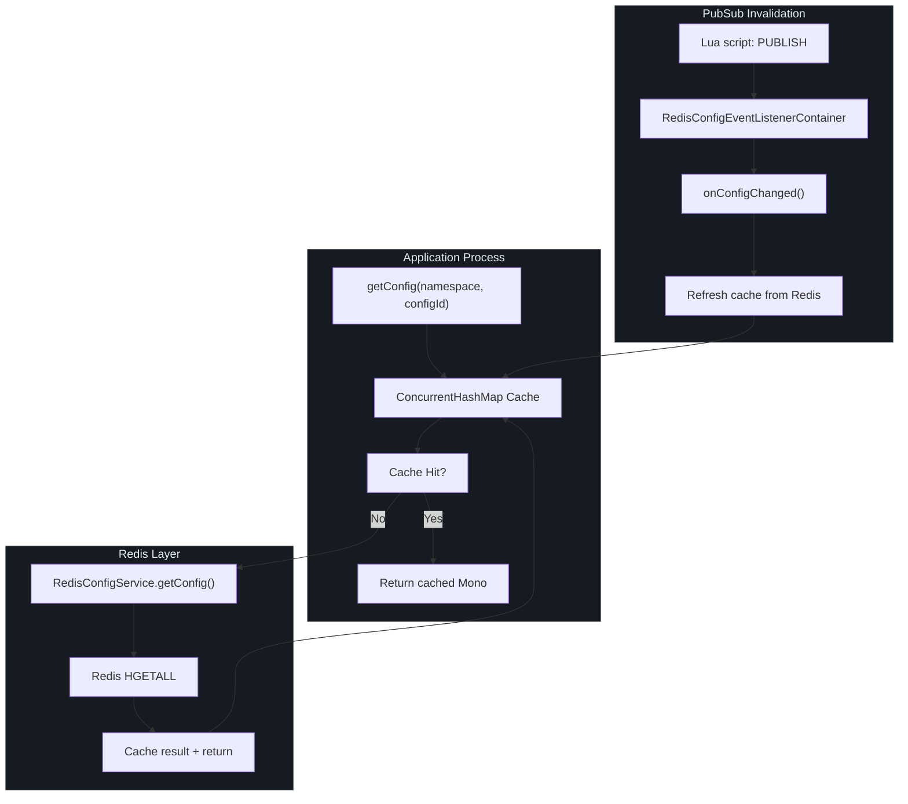
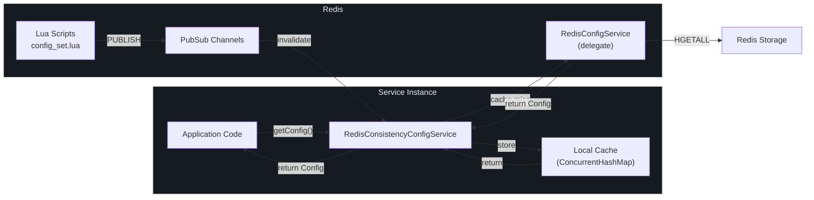
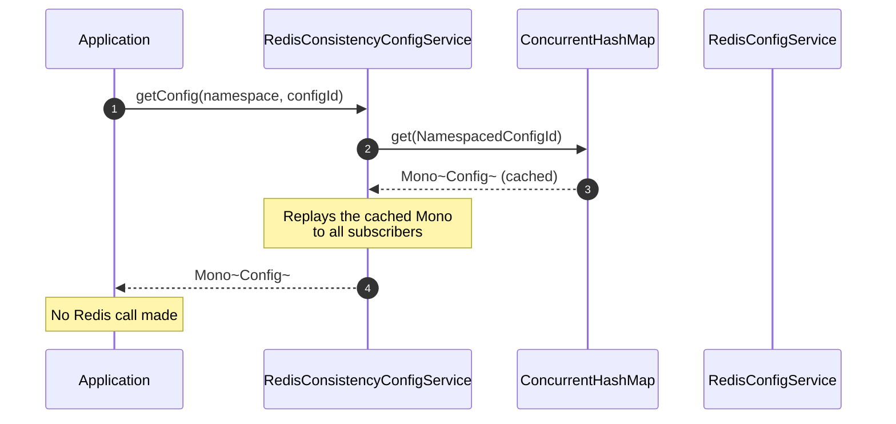
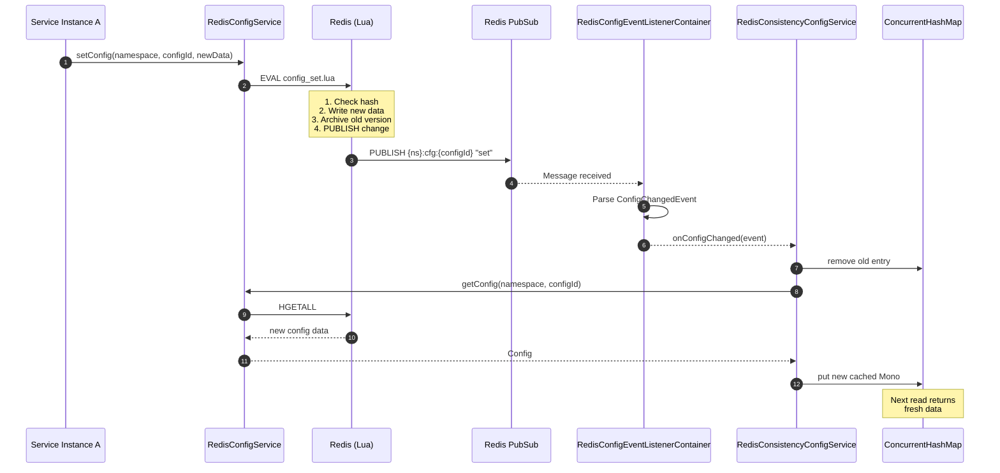
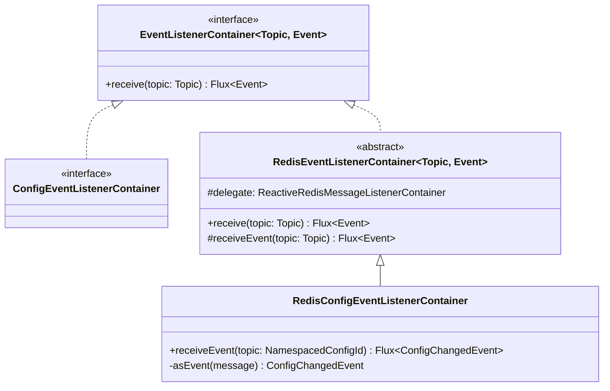
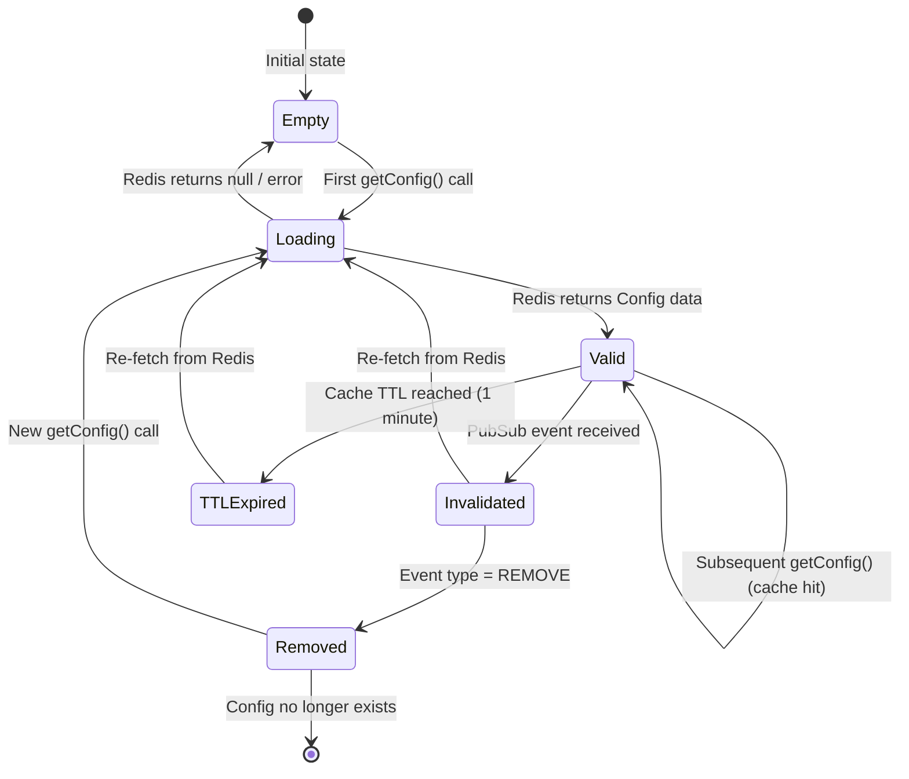
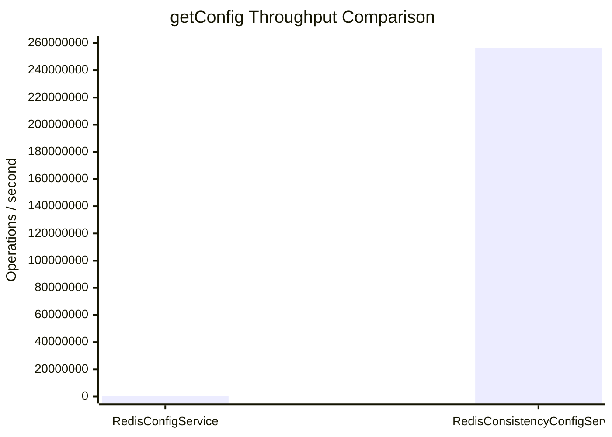

# Consistency Layer

Every `getConfig` call to Redis involves network I/O, serialization, and round-trip latency. At scale with thousands of service instances polling for configuration, this becomes a critical bottleneck -- the raw `RedisConfigService` achieves approximately 241,787 ops/s for reads. CoSky's Consistency Layer solves this by combining a local in-process cache (`ConcurrentHashMap`) with Redis PubSub-based invalidation. When a configuration changes, the Lua script that writes the new value also publishes a notification on the config's Redis key channel. All application instances subscribed to that channel receive the invalidation event and refresh their local cache. The result: `getConfig` jumps to **256,733,987 ops/s** -- a roughly 1000x improvement -- while maintaining eventual consistency within milliseconds.

## At a Glance

| Component | Responsibility | Key File | Source |
|---|---|---|---|
| **RedisConsistencyConfigService** | Decorator around ConfigService that adds local caching with PubSub invalidation | `RedisConsistencyConfigService.kt` | [RedisConsistencyConfigService.kt:33](https://github.com/Ahoo-Wang/CoSky/blob/main/cosky-config/src/main/kotlin/me/ahoo/cosky/config/redis/RedisConsistencyConfigService.kt#L33) |
| **ConfigEventListenerContainer** | Interface for subscribing to config change events | `ConfigEventListenerContainer.kt` | [ConfigEventListenerContainer.kt:22](https://github.com/Ahoo-Wang/CoSky/blob/main/cosky-config/src/main/kotlin/me/ahoo/cosky/config/ConfigEventListenerContainer.kt#L22) |
| **RedisConfigEventListenerContainer** | Redis PubSub implementation that listens to config key channels | `RedisConfigEventListenerContainer.kt` | [RedisConfigEventListenerContainer.kt:14](https://github.com/Ahoo-Wang/CoSky/blob/main/cosky-config/src/main/kotlin/me/ahoo/cosky/config/redis/RedisConfigEventListenerContainer.kt#L14) |
| **RedisConfigService** | Standard Redis-backed config service (the delegate) | `RedisConfigService.kt` | [RedisConfigService.kt:41](https://github.com/Ahoo-Wang/CoSky/blob/main/cosky-config/src/main/kotlin/me/ahoo/cosky/config/redis/RedisConfigService.kt#L41) |
| **ConfigChangedEvent** | Event model representing a config change with operation type | `ConfigChangedEvent.kt` | [ConfigChangedEvent.kt:20](https://github.com/Ahoo-Wang/CoSky/blob/main/cosky-config/src/main/kotlin/me/ahoo/cosky/config/ConfigChangedEvent.kt#L20) |

## The Performance Problem

In a typical microservice deployment, configuration is read far more frequently than it is written. A cluster of 100 service instances, each reading its configuration on startup and periodically refreshing it, generates thousands of read requests per second. When every `getConfig` call crosses the network to Redis, the throughput is limited by:

- Network round-trip latency (even on localhost)
- Redis command processing overhead
- Reactive pipeline scheduling and context switching

The JMH benchmark results for `RedisConfigService.getConfig` confirm this constraint:

```
RedisConfigServiceBenchmark.getConfig   thrpt   241,787.679   ops/s
```

This is excellent for a single Redis-backed service, but it means every configuration read competes for the same Redis connection pool.

Source: [jmh-cosky-config.json](https://github.com/Ahoo-Wang/CoSky/blob/main/docs/jmh/jmh-cosky-config.json)

## The Solution: RedisConsistencyConfigService

`RedisConsistencyConfigService` is a decorator that wraps any `ConfigService` implementation (by default, `RedisConfigService`) and adds a two-layer caching strategy:

1. **Local cache** -- A `ConcurrentHashMap<NamespacedConfigId, Mono<Config>>` stores the most recently fetched config as a cached `Mono`. Subsequent `getConfig` calls for the same configId return the cached value without hitting Redis.

2. **PubSub invalidation** -- When any write operation (`setConfig`, `removeConfig`, `rollback`) modifies a configuration, the underlying Lua script publishes a message on the Redis channel corresponding to that config's key. The `RedisConfigEventListenerContainer` subscribes to these channels and triggers cache invalidation in the consistency service.



<!-- Sources: RedisConsistencyConfigService.kt:33, RedisConfigEventListenerContainer.kt:14, RedisConfigService.kt:41 -->

## Architecture

The consistency layer sits between the application code and the raw Redis operations, intercepting reads and subscribing to change notifications.



<!-- Sources: RedisConsistencyConfigService.kt:33, RedisConfigService.kt:41, config_set.lua:1 -->

## Cache Hit Flow

When a configuration has been previously loaded, the consistency service returns the cached `Mono<Config>` directly without touching Redis.



<!-- Sources: RedisConsistencyConfigService.kt:46, RedisConsistencyConfigService.kt:50 -->

The key detail is that the cache stores a `Mono<Config>` that has been `.cache()`-d by Reactor. This means the initial subscription triggers the Redis call, but all subsequent subscribers receive the same result without re-executing the reactive pipeline. When `computeIfAbsent` inserts a new entry, it also subscribes to the PubSub channel for that configId to listen for future changes.

## Cache Invalidation Flow

When any process modifies a configuration, the Lua script publishes a change event on the Redis PubSub channel. Every instance listening on that channel receives the invalidation and refreshes its cache.



<!-- Sources: RedisConsistencyConfigService.kt:68, RedisConfigEventListenerContainer.kt:18, config_set.lua:1 -->

## Event Listener Container

The `ConfigEventListenerContainer` interface abstracts the subscription to configuration change events. Its Redis implementation, `RedisConfigEventListenerContainer`, wraps a `ReactiveRedisMessageListenerContainer` and subscribes to Redis PubSub channels using the config's Redis key as the channel name.



<!-- Sources: ConfigEventListenerContainer.kt:22, RedisConfigEventListenerContainer.kt:14 -->

The channel naming convention uses the same key pattern as the configuration hash itself: `{namespace}:cfg:{configId}`. This means the PubSub channel is naturally namespaced and config-specific, so each service instance only subscribes to the configurations it actually uses.

Source: [RedisConfigEventListenerContainer.kt:18](https://github.com/Ahoo-Wang/CoSky/blob/main/cosky-config/src/main/kotlin/me/ahoo/cosky/config/redis/RedisConfigEventListenerContainer.kt#L18)

## Cache State Machine

The local cache for each configuration entry goes through a well-defined set of states as requests and invalidation events occur.



<!-- Sources: RedisConsistencyConfigService.kt:40, RedisConsistencyConfigService.kt:46 -->

The `CONFIG_CACHE_TTL` is set to `Duration.ofMinutes(1)`. When a cache entry is refreshed due to a PubSub invalidation event, the new `Mono` is created with `.cache(CONFIG_CACHE_TTL)`, ensuring that even without further invalidation events, stale data is eventually evicted.

Source: [RedisConsistencyConfigService.kt:40](https://github.com/Ahoo-Wang/CoSky/blob/main/cosky-config/src/main/kotlin/me/ahoo/cosky/config/redis/RedisConsistencyConfigService.kt#L40)

## Performance Benchmarks

The JMH benchmarks (run on MacBook Pro M1 with local Redis, 50 threads) demonstrate the dramatic performance difference between the standard and consistency-backed config services.

| Operation | Implementation | Throughput (ops/s) | Improvement | Source |
|---|---|---|---|---|
| `getConfig` | `RedisConfigService` | 241,787 | baseline | [jmh-cosky-config.json](https://github.com/Ahoo-Wang/CoSky/blob/main/docs/jmh/jmh-cosky-config.json) |
| `getConfig` | `RedisConsistencyConfigService` | 256,733,987 | ~1062x | [jmh-cosky-config.json](https://github.com/Ahoo-Wang/CoSky/blob/main/docs/jmh/jmh-cosky-config.json) |
| `setConfig` | `RedisConfigService` | 140,461 | N/A (write) | [jmh-cosky-config.json](https://github.com/Ahoo-Wang/CoSky/blob/main/docs/jmh/jmh-cosky-config.json) |



<!-- Sources: jmh-cosky-config.json:1 -->

The consistency service achieves **256,733,987 ops/s** because after the first read, all subsequent `getConfig` calls resolve from the in-process `ConcurrentHashMap` without any network I/O. The only Redis traffic is the initial load and the PubSub invalidation messages (which are infrequent since configuration changes are rare relative to reads).

Source: [jmh-cosky-config.json](https://github.com/Ahoo-Wang/CoSky/blob/main/docs/jmh/jmh-cosky-config.json)

## Trade-offs

The consistency layer introduces a set of trade-offs that are important to understand:

### Eventual Consistency

When a configuration is updated, there is a brief window (typically sub-millisecond on a local network, slightly longer across data centers) during which some instances may serve stale data. The propagation path is:

```
Lua script PUBLISH -> Redis PubSub channel -> subscriber callback -> cache refresh
```

For most microservice configuration use cases (feature flags, connection pool sizes, timeout values), this sub-second eventual consistency is acceptable. It would not be appropriate for configuration that requires strict linearizable reads.

### Memory Overhead

Each cached configuration entry occupies memory in the JVM heap for the `ConcurrentHashMap` entry and the cached `Mono<Config>`. For services with hundreds of configurations, this is negligible. For services with tens of thousands of configurations, monitor heap usage.

### PubSub Reliability

Redis PubSub is a fire-and-forget protocol -- if an instance is temporarily disconnected (network blip, GC pause), it will miss invalidation messages. CoSky mitigates this through the `CONFIG_CACHE_TTL` of 1 minute: even if an invalidation event is missed, the cache entry will expire and be re-fetched from Redis within 60 seconds.

### Delegation Pattern

`RedisConsistencyConfigService` uses Kotlin's `by delegate` syntax to forward all non-`getConfig` methods directly to the underlying `RedisConfigService`. This means write operations (`setConfig`, `removeConfig`, `rollback`) always go to Redis and trigger PubSub events. The consistency optimization only applies to reads.

Source: [RedisConsistencyConfigService.kt:37](https://github.com/Ahoo-Wang/CoSky/blob/main/cosky-config/src/main/kotlin/me/ahoo/cosky/config/redis/RedisConsistencyConfigService.kt#L37)

## Related Pages

- [Configuration Management](./config-service.md) -- Core configuration CRUD operations, data model, and Redis implementation
- [Service Discovery](./discovery-service.md) -- Service registration with a similar consistency optimization pattern
- [REST API](./rest-api.md) -- HTTP endpoints for managing configuration

## References

- [RedisConsistencyConfigService.kt](https://github.com/Ahoo-Wang/CoSky/blob/main/cosky-config/src/main/kotlin/me/ahoo/cosky/config/redis/RedisConsistencyConfigService.kt) -- Consistency layer implementation
- [RedisConfigService.kt](https://github.com/Ahoo-Wang/CoSky/blob/main/cosky-config/src/main/kotlin/me/ahoo/cosky/config/redis/RedisConfigService.kt) -- Standard Redis config service (delegate)
- [ConfigEventListenerContainer.kt](https://github.com/Ahoo-Wang/CoSky/blob/main/cosky-config/src/main/kotlin/me/ahoo/cosky/config/ConfigEventListenerContainer.kt) -- Event listener container interface
- [RedisConfigEventListenerContainer.kt](https://github.com/Ahoo-Wang/CoSky/blob/main/cosky-config/src/main/kotlin/me/ahoo/cosky/config/redis/RedisConfigEventListenerContainer.kt) -- Redis PubSub event listener implementation
- [ConfigChangedEvent.kt](https://github.com/Ahoo-Wang/CoSky/blob/main/cosky-config/src/main/kotlin/me/ahoo/cosky/config/ConfigChangedEvent.kt) -- Change event model with SET/REMOVE/ROLLBACK operations
- [NamespacedConfigId.kt](https://github.com/Ahoo-Wang/CoSky/blob/main/cosky-config/src/main/kotlin/me/ahoo/cosky/config/NamespacedConfigId.kt) -- Namespaced identifier used as cache key
- [jmh-cosky-config.json](https://github.com/Ahoo-Wang/CoSky/blob/main/docs/jmh/jmh-cosky-config.json) -- JMH benchmark raw results
- [config_set.lua](https://github.com/Ahoo-Wang/CoSky/blob/main/cosky-config/src/main/resources/config_set.lua) -- Lua script that publishes change events
