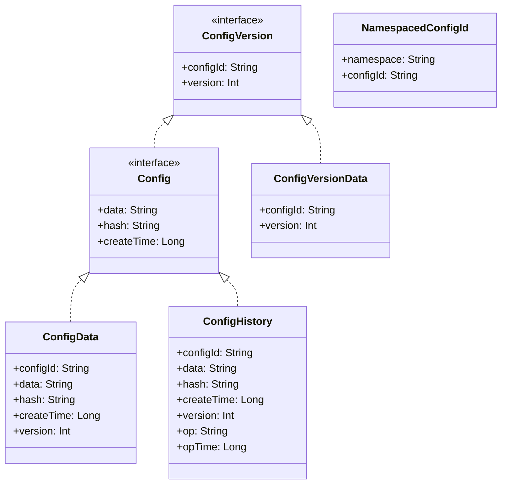
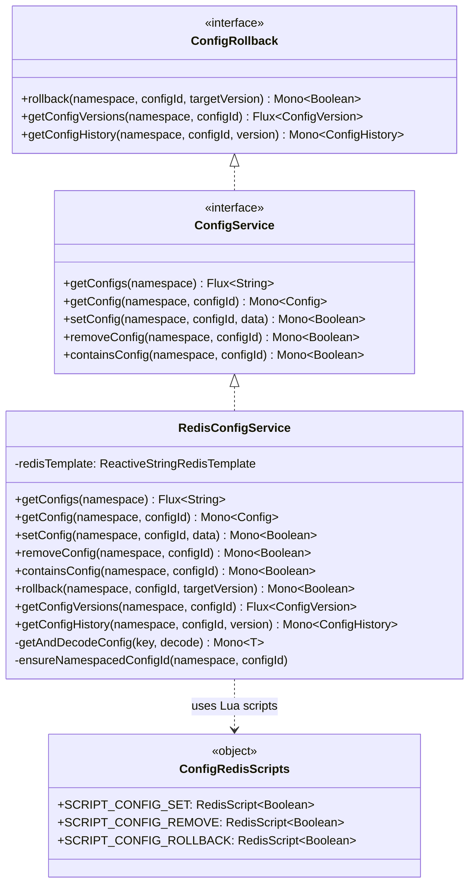
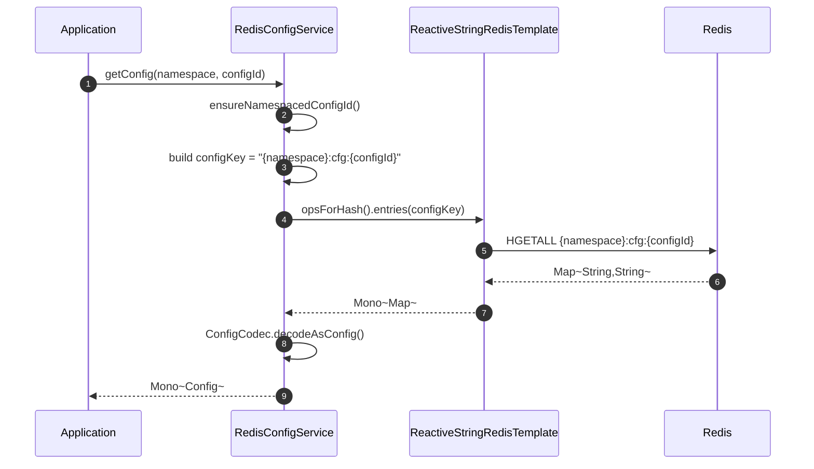
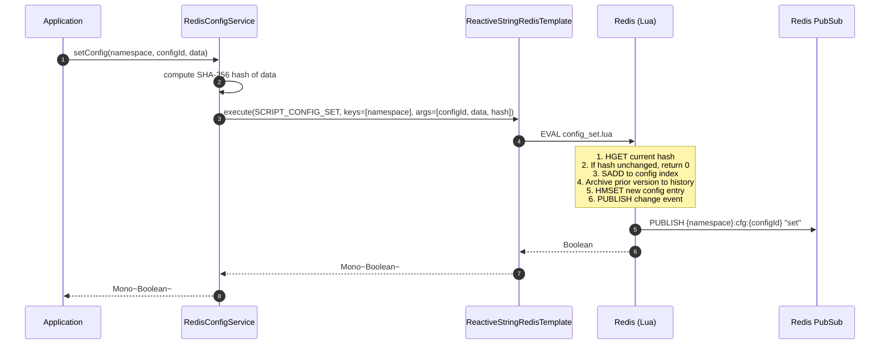
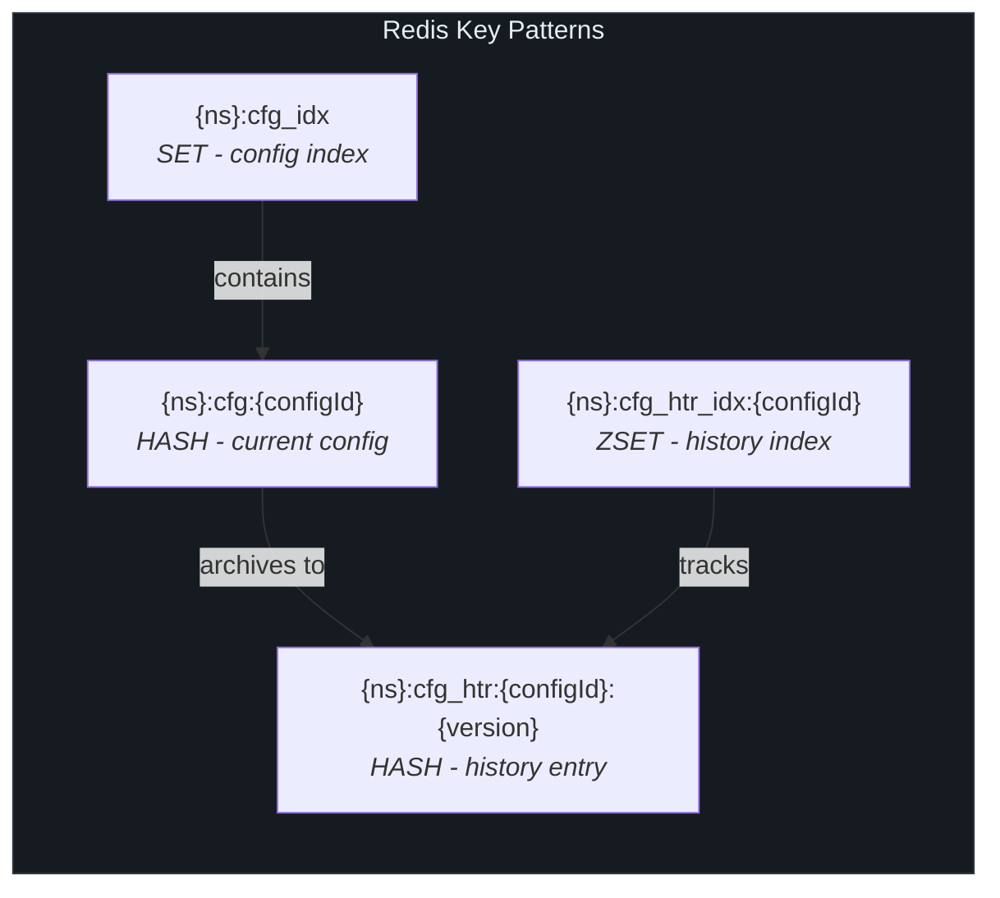
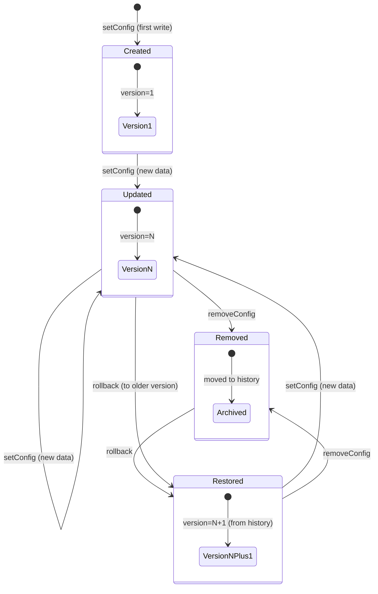
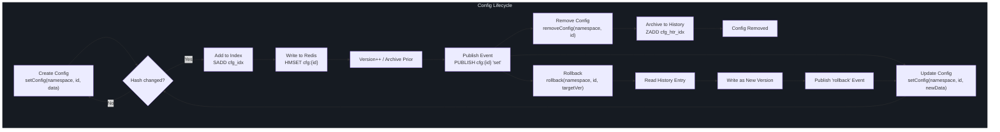

# Configuration Management

CoSky's Configuration Management subsystem provides a centralized, versioned, and auditable way to store and distribute microservice configuration data backed by Redis. In a distributed microservice environment, dozens or hundreds of services need consistent, real-time access to shared configuration -- connection strings, feature flags, feature toggles, and operational parameters. CoSky solves this by leveraging Redis's native hash structures and Lua scripting to deliver atomic, high-throughput configuration operations with automatic version history and rollback capabilities, all without requiring any additional infrastructure beyond the Redis instance you already run.

## At a Glance

| Component | Responsibility | Key File | Source |
|---|---|---|---|
| **ConfigService** | Core CRUD interface for configuration operations | `ConfigService.kt` | [ConfigService.kt:24](https://github.com/Ahoo-Wang/CoSky/blob/main/cosky-config/src/main/kotlin/me/ahoo/cosky/config/ConfigService.kt#L24) |
| **Config / ConfigData** | Data model holding config payload, hash, version, timestamps | `Config.kt` | [Config.kt:20](https://github.com/Ahoo-Wang/CoSky/blob/main/cosky-config/src/main/kotlin/me/ahoo/cosky/config/Config.kt#L20) |
| **ConfigCodec** | Serialization/deserialization between Redis hash maps and domain objects | `ConfigCodec.kt` | [ConfigCodec.kt:20](https://github.com/Ahoo-Wang/CoSky/blob/main/cosky-config/src/main/kotlin/me/ahoo/cosky/config/ConfigCodec.kt#L20) |
| **ConfigHistory** | Extended config model with operation type and operation timestamp | `ConfigHistory.kt` | [ConfigHistory.kt:20](https://github.com/Ahoo-Wang/CoSky/blob/main/cosky-config/src/main/kotlin/me/ahoo/cosky/config/ConfigHistory.kt#L20) |
| **ConfigVersion** | Lightweight interface pairing a configId with its version number | `ConfigVersion.kt` | [ConfigVersion.kt:20](https://github.com/Ahoo-Wang/CoSky/blob/main/cosky-config/src/main/kotlin/me/ahoo/cosky/config/ConfigVersion.kt#L20) |
| **ConfigRollback** | Interface for rolling back to a prior config version | `ConfigRollback.kt` | [ConfigRollback.kt:24](https://github.com/Ahoo-Wang/CoSky/blob/main/cosky-config/src/main/kotlin/me/ahoo/cosky/config/ConfigRollback.kt#L24) |
| **ConfigKeyGenerator** | Generates Redis key patterns for config indices, history, and entries | `ConfigKeyGenerator.kt` | [ConfigKeyGenerator.kt:22](https://github.com/Ahoo-Wang/CoSky/blob/main/cosky-config/src/main/kotlin/me/ahoo/cosky/config/ConfigKeyGenerator.kt#L22) |
| **RedisConfigService** | Redis-backed implementation of ConfigService using Lua scripts | `RedisConfigService.kt` | [RedisConfigService.kt:41](https://github.com/Ahoo-Wang/CoSky/blob/main/cosky-config/src/main/kotlin/me/ahoo/cosky/config/redis/RedisConfigService.kt#L41) |
| **ConfigRedisScripts** | Loads and caches the Lua scripts for atomic config operations | `ConfigRedisScripts.kt` | [ConfigRedisScripts.kt:24](https://github.com/Ahoo-Wang/CoSky/blob/main/cosky-config/src/main/kotlin/me/ahoo/cosky/config/redis/ConfigRedisScripts.kt#L24) |
| **ConfigChangedEvent** | Event emitted on config changes (set, remove, rollback) via Redis PubSub | `ConfigChangedEvent.kt` | [ConfigChangedEvent.kt:20](https://github.com/Ahoo-Wang/CoSky/blob/main/cosky-config/src/main/kotlin/me/ahoo/cosky/config/ConfigChangedEvent.kt#L20) |

## ConfigService Interface

The `ConfigService` interface defines the complete contract for configuration CRUD operations. It extends `ConfigRollback` to inherit version history and rollback capabilities. All methods return Project Reactor types (`Mono` / `Flux`) for non-blocking, reactive execution.

| Method | Return Type | Description | Source |
|---|---|---|---|
| `getConfigs(namespace)` | `Flux<String>` | Lists all config IDs in a namespace by reading the config index set | [ConfigService.kt:25](https://github.com/Ahoo-Wang/CoSky/blob/main/cosky-config/src/main/kotlin/me/ahoo/cosky/config/ConfigService.kt#L25) |
| `getConfig(namespace, configId)` | `Mono<Config>` | Retrieves a single configuration entry with its data, hash, version, and timestamps | [ConfigService.kt:26](https://github.com/Ahoo-Wang/CoSky/blob/main/cosky-config/src/main/kotlin/me/ahoo/cosky/config/ConfigService.kt#L26) |
| `setConfig(namespace, configId, data)` | `Mono<Boolean>` | Creates or updates a configuration; atomically stores data, increments version, archives prior version as history, and publishes a change event | [ConfigService.kt:27](https://github.com/Ahoo-Wang/CoSky/blob/main/cosky-config/src/main/kotlin/me/ahoo/cosky/config/ConfigService.kt#L27) |
| `removeConfig(namespace, configId)` | `Mono<Boolean>` | Removes a configuration and archives it to history; publishes a remove event | [ConfigService.kt:28](https://github.com/Ahoo-Wang/CoSky/blob/main/cosky-config/src/main/kotlin/me/ahoo/cosky/config/ConfigService.kt#L28) |
| `containsConfig(namespace, configId)` | `Mono<Boolean>` | Checks whether a configuration entry exists via Redis `EXISTS` | [ConfigService.kt:29](https://github.com/Ahoo-Wang/CoSky/blob/main/cosky-config/src/main/kotlin/me/ahoo/cosky/config/ConfigService.kt#L29) |

In addition, the inherited `ConfigRollback` interface adds:

| Method | Return Type | Description | Source |
|---|---|---|---|
| `rollback(namespace, configId, targetVersion)` | `Mono<Boolean>` | Restores configuration to a prior version; archives current version and publishes a rollback event | [ConfigRollback.kt:30](https://github.com/Ahoo-Wang/CoSky/blob/main/cosky-config/src/main/kotlin/me/ahoo/cosky/config/ConfigRollback.kt#L30) |
| `getConfigVersions(namespace, configId)` | `Flux<ConfigVersion>` | Lists the version history (up to 10 entries) in reverse chronological order | [ConfigRollback.kt:32](https://github.com/Ahoo-Wang/CoSky/blob/main/cosky-config/src/main/kotlin/me/ahoo/cosky/config/ConfigRollback.kt#L32) |
| `getConfigHistory(namespace, configId, version)` | `Mono<ConfigHistory>` | Retrieves the archived configuration for a specific version | [ConfigRollback.kt:34](https://github.com/Ahoo-Wang/CoSky/blob/main/cosky-config/src/main/kotlin/me/ahoo/cosky/config/ConfigRollback.kt#L34) |

## Data Model

The configuration data model is built on a clean interface hierarchy that separates versioning from full configuration data.



<!-- Sources: Config.kt:20, ConfigVersion.kt:20, ConfigHistory.kt:20, NamespacedConfigId.kt:22 -->

### Config

The `Config` interface extends `ConfigVersion` and adds the payload (`data`), content hash (`hash`), and creation timestamp. The `ConfigData` data class is the concrete implementation used for current configuration entries.

- **configId** -- Unique identifier for the configuration within a namespace
- **data** -- The raw configuration payload (typically YAML, JSON, or properties text)
- **hash** -- SHA-256 hash of the data, used for change detection and deduplication
- **version** -- Monotonically increasing version number
- **createTime** -- Unix timestamp when the version was created

Source: [Config.kt:20](https://github.com/Ahoo-Wang/CoSky/blob/main/cosky-config/src/main/kotlin/me/ahoo/cosky/config/Config.kt#L20)

### ConfigHistory

`ConfigHistory` extends `Config` with two additional fields that record audit information for archived versions:

- **op** -- The operation that caused this version to be archived: `set`, `remove`, or `rollback`
- **opTime** -- Unix timestamp when the archive operation occurred

Source: [ConfigHistory.kt:20](https://github.com/Ahoo-Wang/CoSky/blob/main/cosky-config/src/main/kotlin/me/ahoo/cosky/config/ConfigHistory.kt#L20)

### ConfigCodec

`ConfigCodec` is a singleton object providing Kotlin extension functions to decode Redis hash maps (`Map<String, String>`) into domain objects:

- `decodeAsConfig()` -- Converts a hash map into a `ConfigData` instance
- `decodeAsHistory()` -- Converts a hash map into a `ConfigHistory` instance (includes `op` and `opTime` fields)

Source: [ConfigCodec.kt:20](https://github.com/Ahoo-Wang/CoSky/blob/main/cosky-config/src/main/kotlin/me/ahoo/cosky/config/ConfigCodec.kt#L20)

## Redis Implementation

The `RedisConfigService` implements all `ConfigService` and `ConfigRollback` operations using Redis hash structures and atomic Lua scripts. This ensures that multi-step operations (version increment + history archival + event publishing) execute as a single atomic unit.



<!-- Sources: RedisConfigService.kt:41, ConfigRedisScripts.kt:24, ConfigService.kt:24, ConfigRollback.kt:24 -->

### ConfigRedisScripts

The `ConfigRedisScripts` object pre-loads three Lua scripts from the classpath at startup. Each script corresponds to a write operation and is evaluated atomically by Redis:

| Script | Resource File | Purpose |
|---|---|---|
| `SCRIPT_CONFIG_SET` | `config_set.lua` | Atomically sets config data, increments version, archives previous version to history, and publishes a `set` change event via Redis PubSub |
| `SCRIPT_CONFIG_REMOVE` | `config_remove.lua` | Atomically removes a config from the index, archives it to history, and publishes a `remove` change event |
| `SCRIPT_CONFIG_ROLLBACK` | `config_rollback.lua` | Atomically restores config to a target version from history, creates a new version entry, and publishes a `rollback` change event |

Source: [ConfigRedisScripts.kt:24](https://github.com/Ahoo-Wang/CoSky/blob/main/cosky-config/src/main/kotlin/me/ahoo/cosky/config/redis/ConfigRedisScripts.kt#L24)

### getConfig Flow

When an application reads configuration, the request flows through the reactive pipeline to retrieve the Redis hash and decode it.



<!-- Sources: RedisConfigService.kt:61, RedisConfigService.kt:136, ConfigCodec.kt:30 -->

### setConfig Flow

Writing configuration is an atomic operation performed by a Lua script that handles version management, history archival, change detection, and event publishing in a single Redis call.



<!-- Sources: RedisConfigService.kt:75, config_set.lua:1 -->

## Redis Key Structure

The `ConfigKeyGenerator` object generates all Redis keys following a consistent namespaced pattern. This ensures key isolation across namespaces and provides human-readable key names.



<!-- Sources: ConfigKeyGenerator.kt:22 -->

| Key Pattern | Redis Type | Purpose |
|---|---|---|
| `{namespace}:cfg_idx` | SET | Index of all current config keys in a namespace |
| `{namespace}:cfg:{configId}` | HASH | Current config entry with fields: `configId`, `data`, `hash`, `version`, `createTime` |
| `{namespace}:cfg_htr_idx:{configId}` | ZSET | Sorted set of history entries for a config, scored by version number (up to 10 entries) |
| `{namespace}:cfg_htr:{configId}:{version}` | HASH | Archived config snapshot with additional `op` and `opTime` fields |

Source: [ConfigKeyGenerator.kt:22](https://github.com/Ahoo-Wang/CoSky/blob/main/cosky-config/src/main/kotlin/me/ahoo/cosky/config/ConfigKeyGenerator.kt#L22)

## API Usage Examples

When integrated with Spring Cloud, CoSky serves as a `PropertySource` that loads configuration from Redis. Here is a typical `bootstrap.yaml` setup:

```yaml
spring:
  application:
    name: ${service.name:cosky}
  data:
    redis:
      url: redis://localhost:6379
  cloud:
    cosky:
      namespace: ${cosky.namespace:cosky-production}
      config:
        config-id: ${spring.application.name}.yaml
```

| Config Property | Description | Example |
|---|---|---|
| `spring.data.redis.url` | Redis connection URL | `redis://localhost:6379` |
| `spring.cloud.cosky.namespace` | Namespace for config isolation | `cosky-production` |
| `spring.cloud.cosky.config.config-id` | The configId to load (typically `{app}.yaml`) | `order-service.yaml` |

Source: [README.md:89](https://github.com/Ahoo-Wang/CoSky/blob/main/README.md#L89)

## Rollback Mechanism

CoSky maintains up to 10 historical versions per configuration entry (defined by `ConfigRollback.HISTORY_SIZE`). Each time a configuration is set or removed, the prior version is atomically archived to a history entry via the Lua script. The rollback operation restores a target version by reading its archived data and creating a new version.



<!-- Sources: ConfigRollback.kt:24, config_rollback.lua:1, config_set.lua:1 -->

The `config_rollback.lua` script performs the following steps atomically:

1. Reads the target version's history entry
2. Compares hashes to avoid no-op rollbacks
3. Archives the current version to history
4. Writes the historical data as a new version with an incremented version number
5. Publishes a `rollback` event via Redis PubSub

Source: [config_rollback.lua:1](https://github.com/Ahoo-Wang/CoSky/blob/main/cosky-config/src/main/resources/config_rollback.lua#L1)

## Configuration Lifecycle

The following diagram illustrates the complete lifecycle of a configuration entry from creation through versioned updates, rollbacks, and removal.



<!-- Sources: config_set.lua:1, config_remove.lua:1, config_rollback.lua:1, RedisConfigService.kt:41 -->

## Related Pages

- [Consistency Layer](./config-consistency.md) -- Learn how CoSky achieves 1000x performance improvement through local caching and Redis PubSub invalidation
- [Service Discovery](./discovery-service.md) -- Service registration and discovery with similar architecture patterns
- [REST API](./rest-api.md) -- HTTP endpoints for configuration management

## References

- [ConfigService.kt](https://github.com/Ahoo-Wang/CoSky/blob/main/cosky-config/src/main/kotlin/me/ahoo/cosky/config/ConfigService.kt) -- Core configuration service interface
- [Config.kt](https://github.com/Ahoo-Wang/CoSky/blob/main/cosky-config/src/main/kotlin/me/ahoo/cosky/config/Config.kt) -- Configuration data model
- [ConfigCodec.kt](https://github.com/Ahoo-Wang/CoSky/blob/main/cosky-config/src/main/kotlin/me/ahoo/cosky/config/ConfigCodec.kt) -- Serialization codec
- [ConfigHistory.kt](https://github.com/Ahoo-Wang/CoSky/blob/main/cosky-config/src/main/kotlin/me/ahoo/cosky/config/ConfigHistory.kt) -- Historical config model
- [ConfigVersion.kt](https://github.com/Ahoo-Wang/CoSky/blob/main/cosky-config/src/main/kotlin/me/ahoo/cosky/config/ConfigVersion.kt) -- Version model
- [ConfigRollback.kt](https://github.com/Ahoo-Wang/CoSky/blob/main/cosky-config/src/main/kotlin/me/ahoo/cosky/config/ConfigRollback.kt) -- Rollback interface
- [ConfigKeyGenerator.kt](https://github.com/Ahoo-Wang/CoSky/blob/main/cosky-config/src/main/kotlin/me/ahoo/cosky/config/ConfigKeyGenerator.kt) -- Redis key generation
- [ConfigChangedEvent.kt](https://github.com/Ahoo-Wang/CoSky/blob/main/cosky-config/src/main/kotlin/me/ahoo/cosky/config/ConfigChangedEvent.kt) -- Change event model
- [NamespacedConfigId.kt](https://github.com/Ahoo-Wang/CoSky/blob/main/cosky-config/src/main/kotlin/me/ahoo/cosky/config/NamespacedConfigId.kt) -- Namespaced identifier
- [ConfigEventListenerContainer.kt](https://github.com/Ahoo-Wang/CoSky/blob/main/cosky-config/src/main/kotlin/me/ahoo/cosky/config/ConfigEventListenerContainer.kt) -- Event listener interface
- [RedisConfigService.kt](https://github.com/Ahoo-Wang/CoSky/blob/main/cosky-config/src/main/kotlin/me/ahoo/cosky/config/redis/RedisConfigService.kt) -- Redis implementation
- [ConfigRedisScripts.kt](https://github.com/Ahoo-Wang/CoSky/blob/main/cosky-config/src/main/kotlin/me/ahoo/cosky/config/redis/ConfigRedisScripts.kt) -- Lua script loader
- [RedisConfigEventListenerContainer.kt](https://github.com/Ahoo-Wang/CoSky/blob/main/cosky-config/src/main/kotlin/me/ahoo/cosky/config/redis/RedisConfigEventListenerContainer.kt) -- Redis PubSub event listener
- [config_set.lua](https://github.com/Ahoo-Wang/CoSky/blob/main/cosky-config/src/main/resources/config_set.lua) -- Lua script for setting config
- [config_remove.lua](https://github.com/Ahoo-Wang/CoSky/blob/main/cosky-config/src/main/resources/config_remove.lua) -- Lua script for removing config
- [config_rollback.lua](https://github.com/Ahoo-Wang/CoSky/blob/main/cosky-config/src/main/resources/config_rollback.lua) -- Lua script for rolling back config
