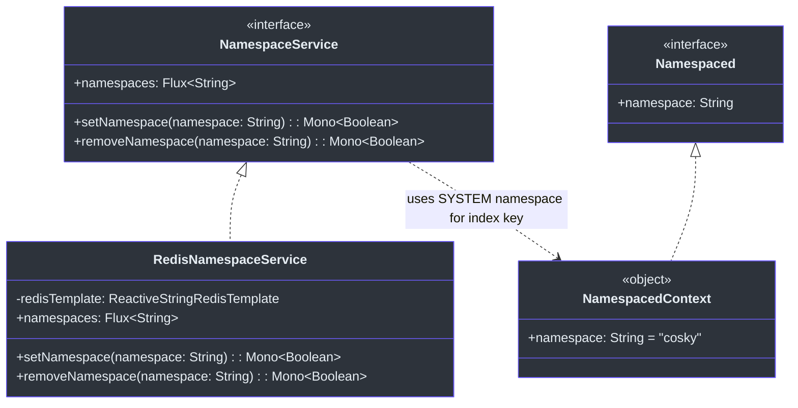
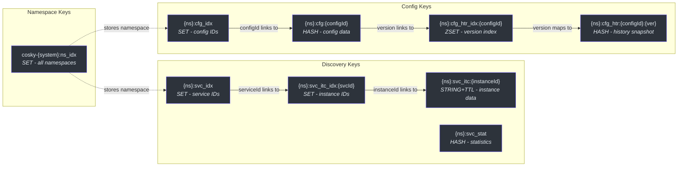
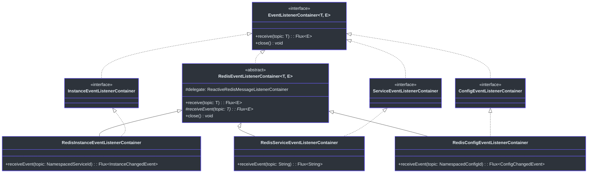
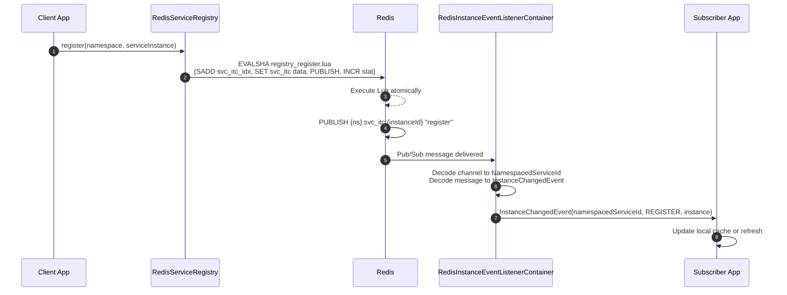
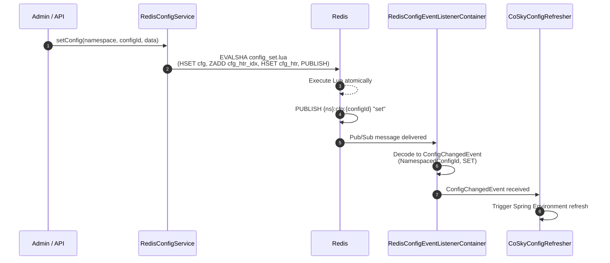
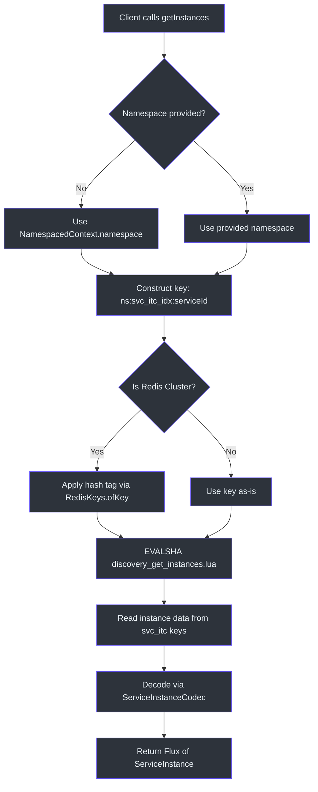

# Core Module

The `cosky-core` module is the foundation of the entire CoSky platform. Every other module -- config, discovery, Spring Cloud starters, and the REST API -- depends on it either directly or transitively. Core provides three fundamental abstractions: the **namespace model** for multi-tenant resource isolation, the **Redis key generation** framework for consistent key naming and cluster compatibility, and the **event listener container** interface for reactive Pub/Sub consumption. This module has zero knowledge of service discovery or configuration semantics; it operates purely at the infrastructure level.

## At a Glance

| Component | Type | Responsibility | Key File |
|-----------|------|---------------|----------|
| `CoSky` | Object | Brand constants: `COSKY = "cosky"`, `KEY_SEPARATOR = ":"`, `VERSION` | [CoSky.kt](https://github.com/Ahoo-Wang/CoSky/blob/main/cosky-core/src/main/kotlin/me/ahoo/cosky/core/CoSky.kt) |
| `Namespaced` | Interface | Contract for components that operate within a namespace | [Namespaced.kt](https://github.com/Ahoo-Wang/CoSky/blob/main/cosky-core/src/main/kotlin/me/ahoo/cosky/core/Namespaced.kt) |
| `NamespacedContext` | Object | Volatile global namespace holder (default: `"cosky"`) | [NamespacedContext.kt](https://github.com/Ahoo-Wang/CoSky/blob/main/cosky-core/src/main/kotlin/me/ahoo/cosky/core/NamespacedContext.kt) |
| `NamespaceService` | Interface | CRUD operations for namespaces (reactive Flux/Mono) | [NamespaceService.kt](https://github.com/Ahoo-Wang/CoSky/blob/main/cosky-core/src/main/kotlin/me/ahoo/cosky/core/NamespaceService.kt) |
| `RedisNamespaceService` | Class | Redis SET-backed implementation of `NamespaceService` | [RedisNamespaceService.kt](https://github.com/Ahoo-Wang/CoSky/blob/main/cosky-core/src/main/kotlin/me/ahoo/cosky/core/redis/RedisNamespaceService.kt) |
| `RedisKeys` | Object | Hash-tag wrapping and key utilities for Redis Cluster | [RedisKeys.kt](https://github.com/Ahoo-Wang/CoSky/blob/main/cosky-core/src/main/kotlin/me/ahoo/cosky/core/util/RedisKeys.kt) |
| `EventListenerContainer` | Interface | Reactive event subscription contract (`receive(topic): Flux<E>`) | [EventListenerContainer.kt](https://github.com/Ahoo-Wang/CoSky/blob/main/cosky-core/src/main/kotlin/me/ahoo/cosky/core/EventListenerContainer.kt) |
| `RedisEventListenerContainer` | Abstract Class | Redis Pub/Sub base implementation with error handling and logging | [RedisEventListenerContainer.kt](https://github.com/Ahoo-Wang/CoSky/blob/main/cosky-core/src/main/kotlin/me/ahoo/cosky/core/redis/RedisEventListenerContainer.kt) |

## Namespace Model

Every resource in CoSky -- service instances, configurations, statistics -- is scoped to a **namespace**. This provides logical multi-tenancy within a single Redis instance. The namespace model consists of three cooperating components.

### The `Namespaced` Interface

The [`Namespaced`](https://github.com/Ahoo-Wang/CoSky/blob/main/cosky-core/src/main/kotlin/me/ahoo/cosky/core/Namespaced.kt) interface declares a single property:

```kotlin
interface Namespaced {
    val namespace: String
        get() = DEFAULT

    companion object {
        const val DEFAULT: String = "${CoSky.COSKY}-{default}"   // "cosky-{default}"
        const val SYSTEM: String = "${CoSky.COSKY}-{system}"     // "cosky-{system}"
    }
}
```

The `DEFAULT` namespace is the conventional namespace for general-purpose use. The `SYSTEM` namespace (`cosky-{system}`) is reserved for platform-internal data such as the namespace index itself. Implementors can override the default to provide custom namespace resolution.

### `NamespacedContext` -- Global Namespace State

[`NamespacedContext`](https://github.com/Ahoo-Wang/CoSky/blob/main/cosky-core/src/main/kotlin/me/ahoo/cosky/core/NamespacedContext.kt) is a singleton object that holds the current process-wide namespace:

```kotlin
object NamespacedContext : Namespaced {
    @Volatile
    override var namespace: String = CoSky.COSKY
}
```

The `@Volatile` annotation ensures visibility across threads. Spring Cloud auto-configuration sets this value at startup from `spring.cloud.cosky.namespace` in `CoSkyAutoConfiguration`:

```kotlin
init {
    NamespacedContext.namespace = coSkyProperties.namespace
}
```

This design allows service methods throughout the codebase to use `NamespacedContext.namespace` as a default parameter, so callers rarely need to pass the namespace explicitly. For example, [`ConfigService.getConfig()`](https://github.com/Ahoo-Wang/CoSky/blob/main/cosky-config/src/main/kotlin/me/ahoo/cosky/config/ConfigService.kt#L26) defaults to `NamespacedContext.namespace`.

### `NamespaceService` -- Namespace CRUD

The [`NamespaceService`](https://github.com/Ahoo-Wang/CoSky/blob/main/cosky-core/src/main/kotlin/me/ahoo/cosky/core/NamespaceService.kt) interface provides reactive operations for managing namespaces:



<!-- Sources: cosky-core/src/main/kotlin/me/ahoo/cosky/core/NamespaceService.kt:23-27, cosky-core/src/main/kotlin/me/ahoo/cosky/core/redis/RedisNamespaceService.kt:26-59, cosky-core/src/main/kotlin/me/ahoo/cosky/core/NamespacedContext.kt:20-23, cosky-core/src/main/kotlin/me/ahoo/cosky/core/Namespaced.kt:20-33 -->

`RedisNamespaceService` stores all namespace names in a Redis SET at the key `cosky-{system}:ns_idx`:

```kotlin
companion object {
    const val NAMESPACE_IDX_KEY = "${Namespaced.SYSTEM}:ns_idx"
}
```

- `setNamespace(namespace)` -- `SADD` the namespace to the SET, returns `true` if newly added
- `removeNamespace(namespace)` -- `SREM` the namespace from the SET, returns `true` if existed
- `namespaces` -- `SMEMBERS` to list all registered namespaces

## Key Generation

All Redis keys in CoSky follow a consistent pattern: `{namespace}:{domain_segment}:{identifier}`. The colon (`:`) separator is defined in [`CoSky.KEY_SEPARATOR`](https://github.com/Ahoo-Wang/CoSky/blob/main/cosky-core/src/main/kotlin/me/ahoo/cosky/core/CoSky.kt#L22).

### The `RedisKeys` Utility

The [`RedisKeys`](https://github.com/Ahoo-Wang/CoSky/blob/main/cosky-core/src/main/kotlin/me/ahoo/cosky/core/util/RedisKeys.kt) object provides cluster-aware key wrapping. In Redis Cluster, keys sharing the same hash tag `{...}` are guaranteed to land on the same hash slot, enabling multi-key Lua scripts:

```kotlin
object RedisKeys {
    fun ofKey(isCluster: Boolean, key: String): String {
        return if (!isCluster) key else hashTag(key)
    }

    fun hasWrap(key: String): Boolean { /* checks for { } */ }
    fun wrap(key: String): String = "{$key}"
    fun unwrap(key: String): String { /* strips { } */ }
    fun hashTag(key: String): String { /* wraps if not already wrapped */ }
}
```

### Key Pattern Reference

The following table shows how keys are structured across all domains. Each module contributes its own key generator (`DiscoveryKeyGenerator`, `ConfigKeyGenerator`) that uses the same `{namespace}:` prefix convention:



<!-- Sources: cosky-core/src/main/kotlin/me/ahoo/cosky/core/redis/RedisNamespaceService.kt:28, cosky-discovery/src/main/kotlin/me/ahoo/cosky/discovery/DiscoveryKeyGenerator.kt:22-90, cosky-config/src/main/kotlin/me/ahoo/cosky/config/ConfigKeyGenerator.kt:22-82 -->

| Pattern | Segment | Generator Method | Example |
|---------|---------|-----------------|---------|
| `{cosky-system}:ns_idx` | Namespace index | Hardcoded in `RedisNamespaceService` | `cosky-{system}:ns_idx` |
| `{ns}:svc_idx` | Service index | `DiscoveryKeyGenerator.getServiceIdxKey()` | `cosky-{default}:svc_idx` |
| `{ns}:svc_itc_idx:{serviceId}` | Instance index | `DiscoveryKeyGenerator.getInstanceIdxKey()` | `cosky-{default}:svc_itc_idx:order-service` |
| `{ns}:svc_itc:{instanceId}` | Instance data | `DiscoveryKeyGenerator.getInstanceKey()` | `cosky-{default}:svc_itc:order-service@http#10.0.0.1#8080` |
| `{ns}:svc_stat` | Service statistics | `DiscoveryKeyGenerator.getServiceStatKey()` | `cosky-{default}:svc_stat` |
| `{ns}:cfg_idx` | Config index | `ConfigKeyGenerator.getConfigIdxKey()` | `cosky-{default}:cfg_idx` |
| `{ns}:cfg:{configId}` | Config data | `ConfigKeyGenerator.getConfigKey()` | `cosky-{default}:cfg:application.yaml` |
| `{ns}:cfg_htr_idx:{configId}` | History index | `ConfigKeyGenerator.getConfigHistoryIdxKey()` | `cosky-{default}:cfg_htr_idx:application.yaml` |
| `{ns}:cfg_htr:{configId}:{version}` | History data | `ConfigKeyGenerator.getConfigHistoryKey()` | `cosky-{default}:cfg_htr:application.yaml:3` |

## Event System

CoSky uses an event-driven architecture built on Redis Pub/Sub to propagate changes in real time. The event system is defined by two layers: a generic interface in `cosky-core` and domain-specific implementations in `cosky-discovery` and `cosky-config`.

### `EventListenerContainer` Interface

The [`EventListenerContainer<T, E>`](https://github.com/Ahoo-Wang/CoSky/blob/main/cosky-core/src/main/kotlin/me/ahoo/cosky/core/EventListenerContainer.kt) interface is a minimal reactive contract:

```kotlin
interface EventListenerContainer<T, E : Any> : AutoCloseable {
    fun receive(topic: T): Flux<E>
}
```

- `T` is the topic type (e.g., `String` for namespace-level events, `NamespacedServiceId` for instance-level events, `NamespacedConfigId` for config events)
- `E` is the event type (e.g., `String` for service change notifications, `InstanceChangedEvent` for instance mutations, `ConfigChangedEvent` for config mutations)
- Extends `AutoCloseable` for lifecycle management

### `RedisEventListenerContainer` Base Class

The [`RedisEventListenerContainer`](https://github.com/Ahoo-Wang/CoSky/blob/main/cosky-core/src/main/kotlin/me/ahoo/cosky/core/redis/RedisEventListenerContainer.kt) abstract class wraps Spring's `ReactiveRedisMessageListenerContainer` and provides error handling (specifically for `CancellationException`) and lifecycle management:



<!-- Sources: cosky-core/src/main/kotlin/me/ahoo/cosky/core/EventListenerContainer.kt:5-7, cosky-core/src/main/kotlin/me/ahoo/cosky/core/redis/RedisEventListenerContainer.kt:10-41, cosky-discovery/src/main/kotlin/me/ahoo/cosky/discovery/InstanceEventListenerContainer.kt:5, cosky-discovery/src/main/kotlin/me/ahoo/cosky/discovery/ServiceEventListenerContainer.kt:5, cosky-config/src/main/kotlin/me/ahoo/cosky/config/ConfigEventListenerContainer.kt:22 -->

### Event Flow -- Service Instance Registration

The following sequence diagram traces the complete event flow when a service instance is registered and an external subscriber observes the change:



<!-- Sources: cosky-discovery/src/main/kotlin/me/ahoo/cosky/discovery/redis/RedisServiceRegistry.kt:43-64, cosky-discovery/src/main/kotlin/me/ahoo/cosky/discovery/redis/RedisInstanceEventListenerContainer.kt:23-51, cosky-discovery/src/main/kotlin/me/ahoo/cosky/discovery/InstanceChangedEvent.kt:20-47 -->

### Event Flow -- Config Change Propagation

Configuration changes follow a similar Pub/Sub pattern. When a config is set or rolled back, the Lua script publishes to the config key channel, and `RedisConfigEventListenerContainer` decodes the message into a `ConfigChangedEvent`:



<!-- Sources: cosky-config/src/main/kotlin/me/ahoo/cosky/config/redis/RedisConfigService.kt:75-86, cosky-config/src/main/kotlin/me/ahoo/cosky/config/redis/RedisConfigEventListenerContainer.kt:14-30, cosky-config/src/main/kotlin/me/ahoo/cosky/config/ConfigChangedEvent.kt:20-36 -->

### Event Types

| Module | Event Class | Topic Type | Possible Events |
|--------|------------|------------|-----------------|
| Discovery | `InstanceChangedEvent` | `NamespacedServiceId` | `REGISTER`, `DEREGISTER`, `EXPIRED`, `RENEW`, `SET_METADATA` |
| Discovery | `String` (namespace name) | `String` | Service index changed (service added/removed) |
| Config | `ConfigChangedEvent` | `NamespacedConfigId` | `SET`, `ROLLBACK`, `REMOVE` |

## Namespace-Scoped Operations Flow

Every operation in CoSky flows through the namespace model. The following diagram illustrates how a typical service discovery request resolves keys within a namespace scope:



<!-- Sources: cosky-core/src/main/kotlin/me/ahoo/cosky/core/NamespacedContext.kt:20-23, cosky-core/src/main/kotlin/me/ahoo/cosky/core/util/RedisKeys.kt:24-31, cosky-discovery/src/main/kotlin/me/ahoo/cosky/discovery/redis/RedisServiceDiscovery.kt:33-54, cosky-discovery/src/main/kotlin/me/ahoo/cosky/discovery/redis/DiscoveryRedisScripts.kt:47-49 -->

## Cross-References

- [Architecture Overview](./architecture) -- High-level module structure and design principles.
- [Configuration Module](./config-service) -- How `cosky-config` builds on core's namespace and event abstractions.
- [Service Discovery Module](./service-discovery) -- How `cosky-discovery` builds on core's namespace and event abstractions.

## References

- [CoSky.kt -- Brand constants](https://github.com/Ahoo-Wang/CoSky/blob/main/cosky-core/src/main/kotlin/me/ahoo/cosky/core/CoSky.kt)
- [Namespaced.kt -- Namespace contract and constants](https://github.com/Ahoo-Wang/CoSky/blob/main/cosky-core/src/main/kotlin/me/ahoo/cosky/core/Namespaced.kt)
- [NamespacedContext.kt -- Global namespace state](https://github.com/Ahoo-Wang/CoSky/blob/main/cosky-core/src/main/kotlin/me/ahoo/cosky/core/NamespacedContext.kt)
- [NamespaceService.kt -- Namespace CRUD interface](https://github.com/Ahoo-Wang/CoSky/blob/main/cosky-core/src/main/kotlin/me/ahoo/cosky/core/NamespaceService.kt)
- [RedisNamespaceService.kt -- Redis SET-backed namespace storage](https://github.com/Ahoo-Wang/CoSky/blob/main/cosky-core/src/main/kotlin/me/ahoo/cosky/core/redis/RedisNamespaceService.kt)
- [RedisKeys.kt -- Cluster hash-tag and key utilities](https://github.com/Ahoo-Wang/CoSky/blob/main/cosky-core/src/main/kotlin/me/ahoo/cosky/core/util/RedisKeys.kt)
- [EventListenerContainer.kt -- Reactive event subscription interface](https://github.com/Ahoo-Wang/CoSky/blob/main/cosky-core/src/main/kotlin/me/ahoo/cosky/core/EventListenerContainer.kt)
- [RedisEventListenerContainer.kt -- Redis Pub/Sub base class](https://github.com/Ahoo-Wang/CoSky/blob/main/cosky-core/src/main/kotlin/me/ahoo/cosky/core/redis/RedisEventListenerContainer.kt)
- [DiscoveryKeyGenerator.kt -- Service discovery key patterns](https://github.com/Ahoo-Wang/CoSky/blob/main/cosky-discovery/src/main/kotlin/me/ahoo/cosky/discovery/DiscoveryKeyGenerator.kt)
- [ConfigKeyGenerator.kt -- Configuration key patterns](https://github.com/Ahoo-Wang/CoSky/blob/main/cosky-config/src/main/kotlin/me/ahoo/cosky/config/ConfigKeyGenerator.kt)
- [InstanceChangedEvent.kt -- Discovery event types](https://github.com/Ahoo-Wang/CoSky/blob/main/cosky-discovery/src/main/kotlin/me/ahoo/cosky/discovery/InstanceChangedEvent.kt)
- [ConfigChangedEvent.kt -- Config event types](https://github.com/Ahoo-Wang/CoSky/blob/main/cosky-config/src/main/kotlin/me/ahoo/cosky/config/ConfigChangedEvent.kt)
