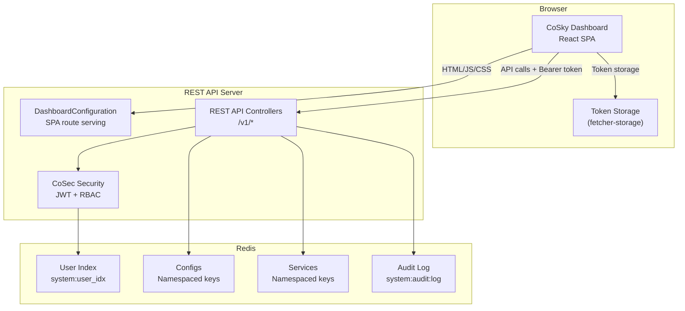
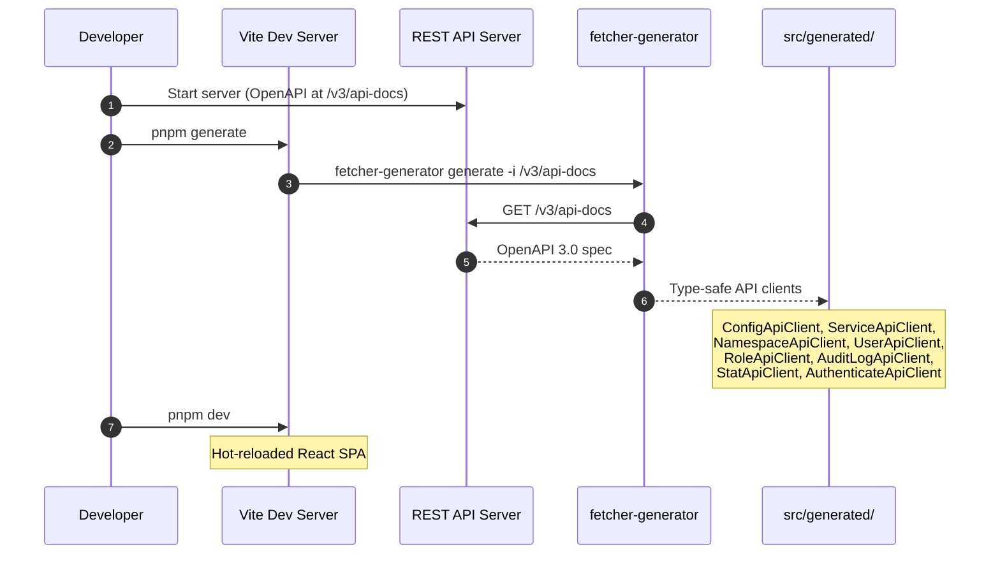
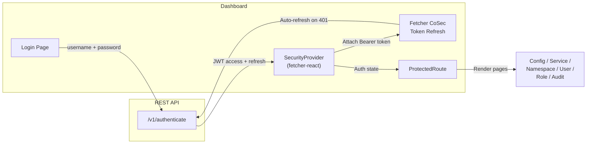

# Dashboard

The CoSky Dashboard is a modern single-page application built with React 19, TypeScript, and Ant Design 6. It provides a visual management interface for all CoSky capabilities: service monitoring, configuration management, service topology visualization, RBAC administration, user management, and audit log review. The dashboard is served directly by the REST API server as static assets and communicates with the backend exclusively through the CoSky REST API.

## At a Glance

| Aspect | Detail | Key File | Source |
|--------|--------|----------|--------|
| Frontend app | React 19 SPA with Ant Design 6 | `dashboard/package.json` | [dashboard/package.json](https://github.com/Ahoo-Wang/CoSky/blob/main/dashboard/package.json) |
| SPA route serving | Serves `index.html` for all dashboard routes | `DashboardConfiguration.kt` | [cosky-rest-api/.../DashboardConfiguration.kt:30](https://github.com/Ahoo-Wang/CoSky/blob/main/cosky-rest-api/src/main/kotlin/me/ahoo/cosky/rest/dashboard/DashboardConfiguration.kt#L30) |
| API client | Auto-generated from OpenAPI spec | `dashboard/src/generated/` | [dashboard/package.json:12](https://github.com/Ahoo-Wang/CoSky/blob/main/dashboard/package.json#L12) |

## Tech Stack

| Technology | Version | Purpose |
|-----------|---------|---------|
| React | 19.2.6 | UI framework |
| TypeScript | ~5.9.3 | Type-safe development |
| Vite | 8.0.11 | Build tool and dev server |
| Ant Design | 6.3.7 | UI component library |
| React Router DOM | 7.15.0 | Client-side routing |
| @xyflow/react | 12.10.2 | Service topology visualization |
| Monaco Editor | 0.55.1 | Configuration text editor |
| @ahoo-wang/fetcher | 3.16.2 | HTTP client with CoSec auth |
| @ahoo-wang/fetcher-react | 3.16.2 | React hooks for API calls |
| @ahoo-wang/fetcher-cosec | 3.16.2 | CoSec token refresh integration |
| @ahoo-wang/fetcher-viewer | 3.16.2 | Data table and filter components |
| @ahoo-wang/fetcher-generator | 3.16.2 | OpenAPI code generation |

Source: [dashboard/package.json](https://github.com/Ahoo-Wang/CoSky/blob/main/dashboard/package.json)

## DashboardConfiguration

`DashboardConfiguration` is a Spring `@Controller` that serves the SPA's `index.html` for all frontend routes. When the user navigates to any dashboard path, the server returns the same `index.html` file, and React Router handles client-side routing.

Mapped routes: `/`, `/home`, `/config`, `/service`, `/namespace`, `/user`, `/role`, `/audit-log`, `/login`.

Additionally, the legacy `/dashboard/**` path redirects (301 Moved Permanently) to `/home` for backward compatibility.

Source: [cosky-rest-api/.../DashboardConfiguration.kt:30-78](https://github.com/Ahoo-Wang/CoSky/blob/main/cosky-rest-api/src/main/kotlin/me/ahoo/cosky/rest/dashboard/DashboardConfiguration.kt#L30)

## Feature Gallery

### Service Monitoring

The service dashboard provides an overview of all registered services within the selected namespace, including instance counts and health status.

### Configuration Management

The configuration management page supports CRUD operations on configs, version history browsing, rollback, and bulk import/export via ZIP files. The Monaco Editor provides syntax highlighting for config content.

### Service Topology

The topology view renders an interactive dependency graph of services using @xyflow/react, showing how services depend on each other within a namespace.

### RBAC Management

The role management page allows administrators to create roles and assign namespace-scoped permissions (READ, WRITE, or READ_WRITE) to each role.

### User Management

User management supports creating users, assigning roles, changing passwords, and unlocking locked accounts.

### Audit Log

The audit log page displays a paginated list of all audited operations with operator, IP, path, action, status, and timestamp columns.

### Login

The login page authenticates users against the CoSky REST API and stores the JWT token pair in browser storage for subsequent requests.

## Architecture

<!-- Sources: dashboard/package.json:1, cosky-rest-api/src/main/kotlin/me/ahoo/cosky/rest/dashboard/DashboardConfiguration.kt:30 -->

### Data Flow: API Client Generation

<!-- Sources: dashboard/package.json:12, dashboard/package.json:13 -->

### Authentication Flow in Dashboard

<!-- Sources: dashboard/package.json:14, dashboard/package.json:15 -->

## Related Pages

- [REST API Server](/guide/rest-api) -- API endpoints consumed by the dashboard
- [Security & RBAC](/guide/security-rbac) -- Authentication and authorization details

## References

- [dashboard/package.json](https://github.com/Ahoo-Wang/CoSky/blob/main/dashboard/package.json)
- [DashboardConfiguration.kt](https://github.com/Ahoo-Wang/CoSky/blob/main/cosky-rest-api/src/main/kotlin/me/ahoo/cosky/rest/dashboard/DashboardConfiguration.kt)
- [dashboard/CLAUDE.md](https://github.com/Ahoo-Wang/CoSky/blob/main/dashboard/CLAUDE.md)
