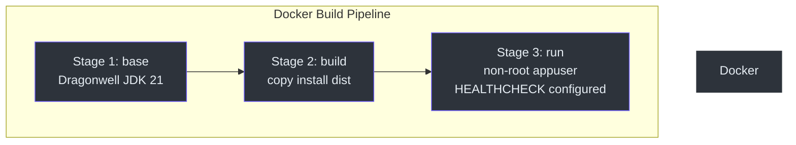
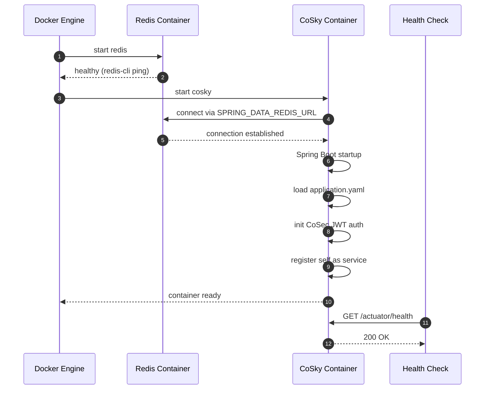

# Docker Deployment

## Overview

Docker provides the fastest path to running CoSky in production. The official multi-arch image (`ahoowang/cosky`) supports both `linux/amd64` and `linux/arm64` platforms and is published to Docker Hub, GitHub Container Registry (GHCR), and Alibaba Cloud Container Registry on every release. The image bundles the CoSky REST API server, the built-in dashboard UI, and all required runtime dependencies into a single container that only needs a Redis instance to connect to.

## Quick Start

Pull the latest image and start CoSky with a single command:

```bash
# Pull the latest image
docker pull ahoowang/cosky:latest

# Run CoSky
docker run --name cosky -d -p 8080:8080 \
  -e SPRING_DATA_REDIS_URL=redis://your-redis-host:6379 \
  ahoowang/cosky:latest
```

Once the container is running, open [http://localhost:8080](http://localhost:8080) to access the CoSky Dashboard. On first launch the super-user password is printed to the console log:

```bash
docker logs cosky
```

Look for a line like:

```
---------------- ****** CoSky -  init super user:[cosky] password:[xxxxxxxx] ****** ----------------
```

## Container Architecture

The Docker image is built from a multi-stage Dockerfile based on Dragonwell JDK 21. The build stage installs the Gradle distribution, and the runtime stage runs as a non-root user (`appuser`) with a built-in health check.



<!-- Sources: cosky-rest-api/Dockerfile:1, .github/workflows/docker-deploy.yml:113 -->

## Deployment Topology

A typical Docker Compose deployment consists of the CoSky container and a Redis container connected via an internal Docker networ```mermaid
flowchart LR
    subgraph docker-compose network
        style docker-compose network fill:#161b22,stroke:#30363d,color:#e6edf3
        C["CoSky Container<br>:8080"] -->|"SPRING_DATA_REDIS_URL<br>redis://redis:6379"| R["Redis Container<br>:6379"]
        U["User / Browser"] -->|"HTTP :8080"| C
        C -.->|"Health Check<br>/actuator/health"| C
    end

    C:::node
    R:::node
    U:::node

    classDef node fill:#2d333b,stroke:#6d5dfc,color:#e6edf3
```
```

<!-- Sources: cosky-rest-api/Dockerfile:1, README.md:134, cosky-rest-api/src/main/resources/application.yaml:1 -->

## Environment Variables

| Variable | Default | Description |
|----------|---------|-------------|
| `SPRING_DATA_REDIS_URL` | *(required)* | Redis connection URL (e.g. `redis://localhost:6379`) |
| `SPRING_DATA_REDIS_HOST` | `localhost` | Redis host (alternative to URL) |
| `SPRING_DATA_REDIS_PASSWORD` | *(none)* | Redis password |
| `SERVER_PORT` | `8080` | HTTP port for the REST API and dashboard |
| `COSKY_SECURITY_ENABLED` | `true` | Enable CoSec JWT authentication |
| `COSKY_SUPER_INIT` | `false` | Force re-initialization of the super-user password |
| `COSKY_SECURITY_KEY` | built-in secret | JWT signing secret for CoSec tokens |
| `COSKY_NAMESPACE` | `cosky-{system}` | Default namespace |
| `COSKY_AUTO_REGISTRY` | `true` | Auto-register CoSky itself as a service |
| `LANG` | *(none)* | Set locale (e.g. `C.utf8`) |
| `TZ` | *(none)* | Timezone (e.g. `Asia/Shanghai`) |

> When running in cluster mode with Redis Cluster, use `SPRING_DATA_REDIS_CLUSTER_NODES` instead of `SPRING_DATA_REDIS_URL`, and set `SPRING_DATA_REDIS_CLUSTER_MAX_REDIRECTS=3`.

## Docker Compose Example

The following `docker-compose.yml` starts CoSky together with Redis:

```yaml
version: "3.8"

services:
  redis:
    image: redis:7-alpine
    ports:
      - "6379:6379"
    volumes:
      - redis-data:/data
    healthcheck:
      test: ["CMD", "redis-cli", "ping"]
      interval: 10s
      timeout: 5s
      retries: 5

  cosky:
    image: ahoowang/cosky:latest
    ports:
      - "8080:8080"
    environment:
      SPRING_DATA_REDIS_URL: redis://redis:6379
      COSKY_SECURITY_ENABLED: "true"
      TZ: Asia/Shanghai
    depends_on:
      redis:
        condition: service_healthy
    healthcheck:
      test: ["CMD", "curl", "-f", "http://localhost:8080/actuator/health"]
      interval: 30s
      timeout: 3s
      retries: 3

volumes:
  redis-data:
```

## Startup Sequence

The following diagram illustrates the container startup and health check flow:



<!-- Sources: cosky-rest-api/Dockerfile:26, cosky-rest-api/src/main/resources/application.yaml:1, .github/workflows/docker-deploy.yml:1 -->

## Volume Mounts

| Mount Path | Purpose | Required |
|-----------|---------|----------|
| `/etc/localtime` | Sync container timezone with host | Recommended |

The CoSky container mounts the host's `/etc/localtime` to ensure log timestamps and audit records match the host timezone. This is configured in both the Kubernetes manifests and the Docker Compose example above.

## Health Check Configuration

The Docker image includes a built-in `HEALTHCHECK` instruction that pings the Spring Boot Actuator health endpoint:

```dockerfile
HEALTHCHECK --interval=30s --timeout=3s --retries=3 \
  CMD curl -f http://localhost:8080/actuator/health || exit 1
```

For Kubernetes deployments, the following probe paths are available:

| Probe | Path | Purpose |
|-------|------|---------|
| Startup | `/actuator/health` | Verifies the application has fully started |
| Readiness | `/actuator/health/readiness` | Indicates the pod can accept traffic |
| Liveness | `/actuator/health/liveness` | Confirms the application is still running |

## Networking

CoSky exposes port `8080` by default. In the Docker Compose setup, the CoSky and Redis containers share an internal network where Redis is reachable by its service name (`redis://redis:6379`). No Redis ports need to be exposed to the host unless you want direct access for debu```mermaid
flowchart TB
    subgraph Docker Network
        style Docker Network fill:#161b22,stroke:#30363d,color:#e6edf3
        subgraph cosky container
            style cosky container fill:#161b22,stroke:#30363d,color:#e6edf3
            A["Spring Boot App<br>port 8080"] --> B["Dashboard UI<br>static files"]
            A --> C["REST API<br>/actuator/*"]
            A --> D["CoSec Auth<br>JWT validation"]
        end
        subgraph redis container
            style redis container fill:#161b22,stroke:#30363d,color:#e6edf3
            E["Redis Server<br>port 6379"]
        end
        A -->|"Lettuce client"| E
        F["External Client"] -->|":8080"| A
    end

    A:::node
    B:::node
    C:::node
    D:::node
    E:::node
    F:::node

    classDef node fill:#2d333b,stroke:#6d5dfc,color:#e6edf3
```edf3
```

<!-- Sources: cosky-rest-api/Dockerfile:26, cosky-rest-api/src/main/resources/application.yaml:14, README.md:134 -->

## CI/CD Pipeline

The [Docker Image Deploy workflow](https://github.com/Ahoo-Wang/CoSky/blob/main/.github/workflows/docker-deploy.yml) builds and pushes images on every push and tag. The pipeline builds the dashboard UI with pnpm, creates the Gradle distribution, then uses Docker Buildx to produce multi-arch images for `linux/amd64` and `linux/arm64`.

Images are published to three registries:

| Registry | Image |
|----------|-------|
| Docker Hub | `ahoowang/cosky` |
| GitHub Container Registry | `ghcr.io/ahoo-wang/cosky` |
| Alibaba Cloud CR | `registry.cn-shanghai.aliyuncs.com/ahoo/cosky` |

## Feature Comparison

| Feature | CoSky | Eureka | Consul | Nacos | Apollo |
|---------|-------|--------|--------|-------|--------|
| CAP | CP+AP | AP | CP | CP+AP | CP+AP |
| Health Check | Client Beat | Client Beat | TCP/HTTP/gRPC | TCP/HTTP/Client Beat | Client Beat |
| Access Protocol | HTTP/Redis | HTTP | HTTP/DNS | HTTP/DNS | HTTP |
| K8S Integration | Yes | No | Yes | Yes | No |
| Persistence | Redis | - | - | MySQL | MySQL |
| Cross Registry Sync | Yes | No | Yes | Yes | No |

## Related Pages

- [Kubernetes Deployment](./deployment-kubernetes.md) - Deploy CoSky in a K8s cluster
- [Standalone Deployment](./deployment-standalone.md) - Run CoSky without containers
- [Performance Benchmarks](./performance.md) - JMH benchmark results

## References

- [cosky-rest-api/Dockerfile](https://github.com/Ahoo-Wang/CoSky/blob/main/cosky-rest-api/Dockerfile)
- [cosky-rest-api/src/main/resources/application.yaml](https://github.com/Ahoo-Wang/CoSky/blob/main/cosky-rest-api/src/main/resources/application.yaml)
- [cosky-rest-api/src/main/resources/bootstrap.yaml](https://github.com/Ahoo-Wang/CoSky/blob/main/cosky-rest-api/src/main/resources/bootstrap.yaml)
- [cosky-rest-api/src/dist/config/application.yaml](https://github.com/Ahoo-Wang/CoSky/blob/main/cosky-rest-api/src/dist/config/application.yaml)
- [.github/workflows/docker-deploy.yml](https://github.com/Ahoo-Wang/CoSky/blob/main/.github/workflows/docker-deploy.yml)
- [README.md - Docker Deployment](https://github.com/Ahoo-Wang/CoSky/blob/main/README.md)
