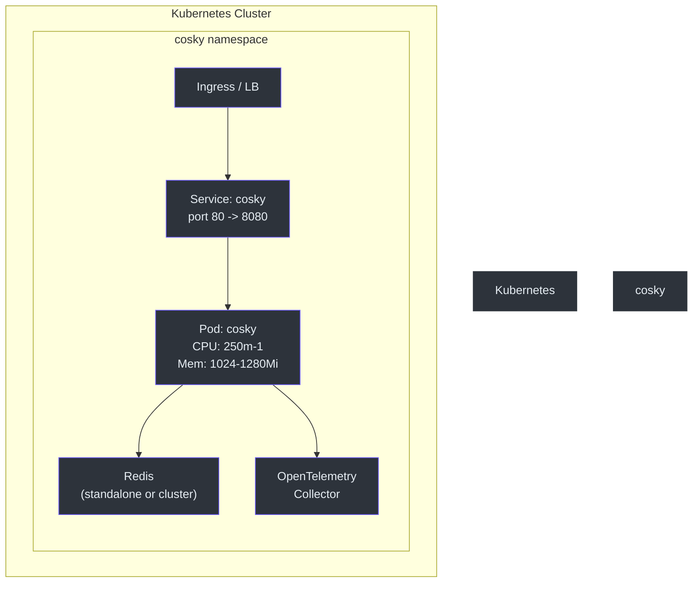
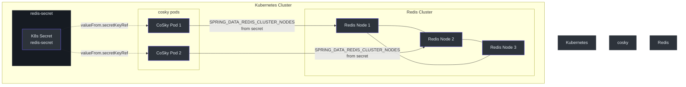
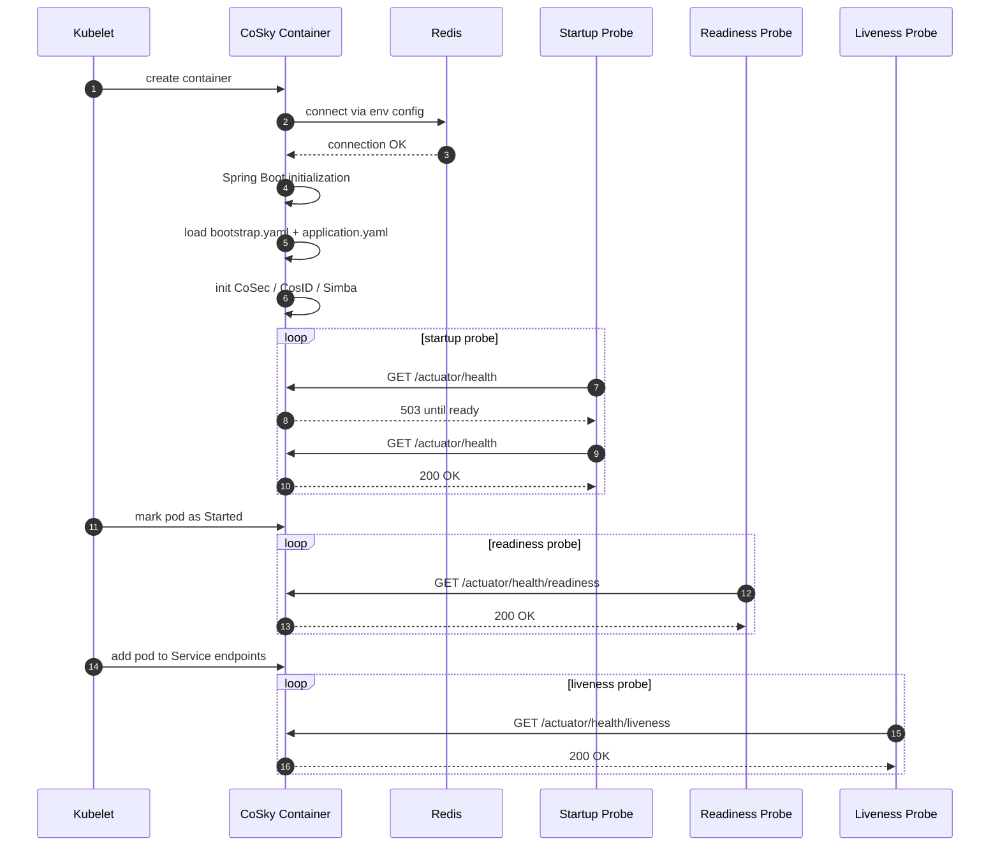
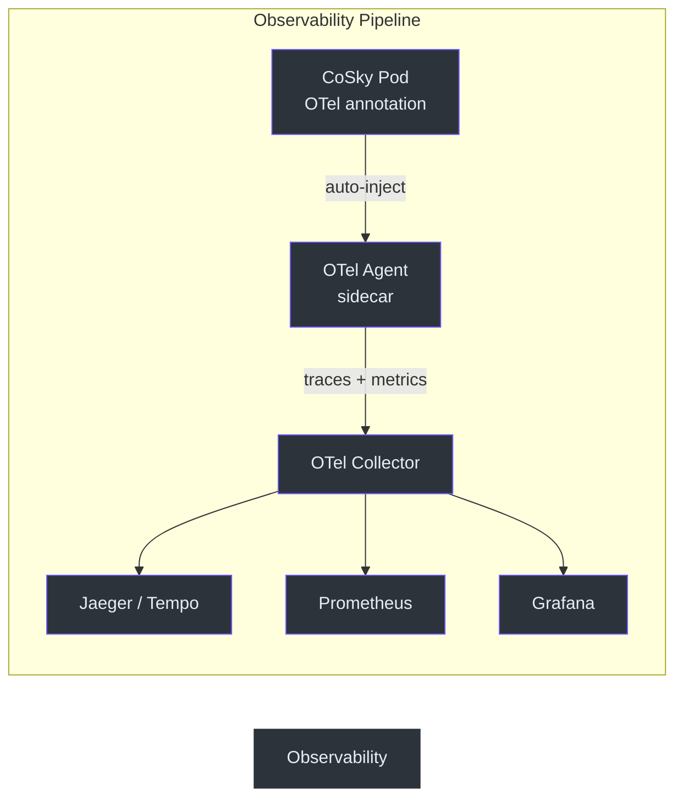

# Kubernetes Deployment

## Overview

Kubernetes is the recommended deployment platform for CoSky in production environments. The project ships with ready-to-use manifest files for both single-replica and clustered Redis setups, a Kubernetes Service for stable network access, and OpenTelemetry annotations for automatic observability instrumentation. CoSky's lightweight resource footprint (250m CPU / 1024Mi memory requests) makes it well-suited for shared cluster environments.

## Deployment Manifest (Single Node Redis)

The base deployment manifest creates a single CoSky replica connected to a standalone Redis instance:

```yaml
apiVersion: apps/v1
kind: Deployment
metadata:
  name: cosky
  labels:
    app: cosky
spec:
  replicas: 1
  selector:
    matchLabels:
      app: cosky
  template:
    metadata:
      labels:
        app: cosky
      annotations:
        instrumentation.opentelemetry.io/inject-java: "true"
    spec:
      containers:
        - name: cosky
          image: registry.cn-shanghai.aliyuncs.com/ahoo/cosky:5.3.5
          ports:
            - name: http
              containerPort: 8080
              protocol: TCP
          env:
            - name: SPRING_DATA_REDIS_HOST
              value: redis-uri:6379
            - name: SPRING_DATA_REDIS_PASSWORD
              value: redis-pwd
            - name: TZ
              value: Asia/Shanghai
          startupProbe:
            httpGet:
              port: http
              path: /actuator/health
          readinessProbe:
            httpGet:
              port: http
              path: /actuator/health/readiness
          livenessProbe:
            httpGet:
              port: http
              path: /actuator/health/liveness
          resources:
            limits:
              cpu: "1"
              memory: 1280Mi
            requests:
              cpu: 250m
              memory: 1024Mi
          volumeMounts:
            - mountPath: /etc/localtime
              name: volume-localtime
      volumes:
        - hostPath:
            path: /etc/localtime
            type: ""
          name: volume-localtime
```

<!-- Sources: k8s/deployment/cosky.yml:1, cosky-rest-api/src/main/resources/application.yaml:1 -->

## Clustered Redis Deployment

For production environments with Redis Cluster, use the cluster manifest which reads connection details from a Kubernetes Secret:

```yaml
apiVersion: apps/v1
kind: Deployment
metadata:
  name: cosky
  labels:
    app: cosky
spec:
  replicas: 1
  selector:
    matchLabels:
      app: cosky
  template:
    metadata:
      labels:
        app: cosky
      annotations:
        instrumentation.opentelemetry.io/inject-java: "true"
    spec:
      containers:
        - name: cosky
          image: registry.cn-shanghai.aliyuncs.com/ahoo/cosky:5.3.5
          env:
            - name: SPRING_DATA_REDIS_CLUSTER_NODES
              valueFrom:
                secretKeyRef:
                  name: redis-secret
                  key: nodes
            - name: SPRING_DATA_REDIS_PASSWORD
              valueFrom:
                secretKeyRef:
                  name: redis-secret
                  key: password
            - name: SPRING_DATA_REDIS_CLUSTER_MAX_REDIRECTS
              value: "3"
            - name: SPRING_DATA_REDIS_LETTUCE_CLUSTER_REFRESH_ADAPTIVE
              value: "true"
            - name: SPRING_DATA_REDIS_LETTUCE_CLUSTER_REFRESH_PERIOD
              value: 30s
            - name: TZ
              value: Asia/Shanghai
          # ... same probes, resources, and volumes as above
```

<!-- Sources: k8s/deployment/cosky-cluster.yml:1 -->

## Kubernetes Service

The Service exposes CoSky on port 80, forwarding to the container port 8080:

```yaml
apiVersion: v1
kind: Service
metadata:
  name: cosky
  labels:
    app: cosky
spec:
  selector:
    app: cosky
  ports:
    - name: rest
      port: 80
      protocol: TCP
      targetPort: 8080
```

<!-- Sources: k8s/deployment/cosky-service.yaml:1 -->

## Architecture Overview

The following diagram shows the Kubernetes deployment topology for a single-replica setup:



<!-- Sources: k8s/deployment/cosky.yml:1, k8s/deployment/cosky-service.yaml:1 -->

## Clustered Redis Topology

When using Redis Cluster, CoSky connects through the Lettuce client with adaptive topology refresh.



<!-- Sources: k8s/deployment/cosky-cluster.yml:1, k8s/deployment/cosky-service.yaml:1 -->

## Pod Startup Sequence



<!-- Sources: k8s/deployment/cosky.yml:28, cosky-rest-api/src/main/resources/application.yaml:1, cosky-rest-api/src/main/resources/bootstrap.yaml:1 -->

## Resource Configuration

| Resource | Requests | Limits | Notes |
|----------|----------|--------|-------|
| CPU | 250m | 1 core | Suitable for moderate traffic |
| Memory | 1024Mi | 1280Mi | Includes JVM heap + off-heap |
| Startup Probe | `/actuator/health` | - | Allows up to `failureThreshold * periodSeconds` for cold start |
| Readiness Probe | `/actuator/health/readiness` | - | Controls traffic routing |
| Liveness Probe | `/actuator/health/liveness` | - | Restarts unhealthy pods |

## Environment Variables

### Standalone Redis

| Variable | Source | Description |
|----------|--------|-------------|
| `SPRING_DATA_REDIS_HOST` | Direct value | Redis host and port (e.g. `redis-uri:6379`) |
| `SPRING_DATA_REDIS_PASSWORD` | Direct value or Secret | Redis authentication password |
| `TZ` | Direct value | Container timezone |
| `LANG` | Direct value | Locale setting |

### Clustered Redis

| Variable | Source | Description |
|----------|--------|-------------|
| `SPRING_DATA_REDIS_CLUSTER_NODES` | Secret (`redis-secret.nodes`) | Comma-separated cluster node addresses |
| `SPRING_DATA_REDIS_PASSWORD` | Secret (`redis-secret.password`) | Cluster authentication password |
| `SPRING_DATA_REDIS_CLUSTER_MAX_REDIRECTS` | Direct value (`3`) | Maximum cluster redirect hops |
| `SPRING_DATA_REDIS_LETTUCE_CLUSTER_REFRESH_ADAPTIVE` | Direct value (`true`) | Enable adaptive topology refresh |
| `SPRING_DATA_REDIS_LETTUCE_CLUSTER_REFRESH_PERIOD` | Direct value (`30s`) | Topology refresh interval |
| `TZ` | Direct value | Container timezone |

## Health Probes

CoSky exposes three Spring Boot Actuator health endpoints used by Kubernetes probes:

| Probe Type | Endpoint | Configuration |
|-----------|----------|---------------|
| **Startup** | `GET /actuator/health` | Default `failureThreshold` and `periodSeconds` |
| **Readiness** | `GET /actuator/health/readiness` | Default settings |
| **Liveness** | `GET /actuator/health/liveness` | Default settings |

The startup probe prevents Kubernetes from killing the pod before Spring Boot finishes initializing. Once the startup probe succeeds, the readiness and liveness probes take over.

## OpenTelemetry Integration

The deployment manifests include the annotation `instrumentation.opentelemetry.io/inject-java: "true"`, which enables automatic Java instrumentation by an OpenTelemetry operator sidecar. This provides distributed tracing, metrics, and log correlation without code changes.

## Volume Mounts

| Volume | Mount Path | Type | Purpose |
|--------|-----------|------|---------|
| `volume-localtime` | `/etc/localtime` | `hostPath` | Synchronize container clock with host |

## Applying the Manifests

```bash
# Create the Redis secret (for cluster mode)
kubectl create secret generic redis-secret \
  --from-literal=nodes="redis-node-1:6379,redis-node-2:6379,redis-node-3:6379" \
  --from-literal=password="your-redis-password"

# Deploy CoSky
kubectl apply -f k8s/deployment/cosky.yml

# Or deploy with cluster Redis
kubectl apply -f k8s/deployment/cosky-cluster.yml

# Create the Service
kubectl apply -f k8s/deployment/cosky-service.yaml

# Verify deployment
kubectl get pods -l app=cosky
kubectl get svc cosky
```

## Observability



<!-- Sources: k8s/deployment/cosky.yml:17, .github/workflows/docker-deploy.yml:1 -->

## Related Pages

- [Docker Deployment](./deployment-docker.md) - Docker and Docker Compose deployment
- [Standalone Deployment](./deployment-standalone.md) - Run CoSky without containers
- [Performance Benchmarks](./performance.md) - JMH benchmark results

## References

- [k8s/deployment/cosky.yml](https://github.com/Ahoo-Wang/CoSky/blob/main/k8s/deployment/cosky.yml)
- [k8s/deployment/cosky-cluster.yml](https://github.com/Ahoo-Wang/CoSky/blob/main/k8s/deployment/cosky-cluster.yml)
- [k8s/deployment/cosky-service.yaml](https://github.com/Ahoo-Wang/CoSky/blob/main/k8s/deployment/cosky-service.yaml)
- [cosky-rest-api/src/main/resources/application.yaml](https://github.com/Ahoo-Wang/CoSky/blob/main/cosky-rest-api/src/main/resources/application.yaml)
- [cosky-rest-api/src/main/resources/bootstrap.yaml](https://github.com/Ahoo-Wang/CoSky/blob/main/cosky-rest-api/src/main/resources/bootstrap.yaml)
- [.github/workflows/docker-deploy.yml](https://github.com/Ahoo-Wang/CoSky/blob/main/.github/workflows/docker-deploy.yml)
- [README.md - Kubernetes Deployment](https://github.com/Ahoo-Wang/CoSky/blob/main/README.md)
