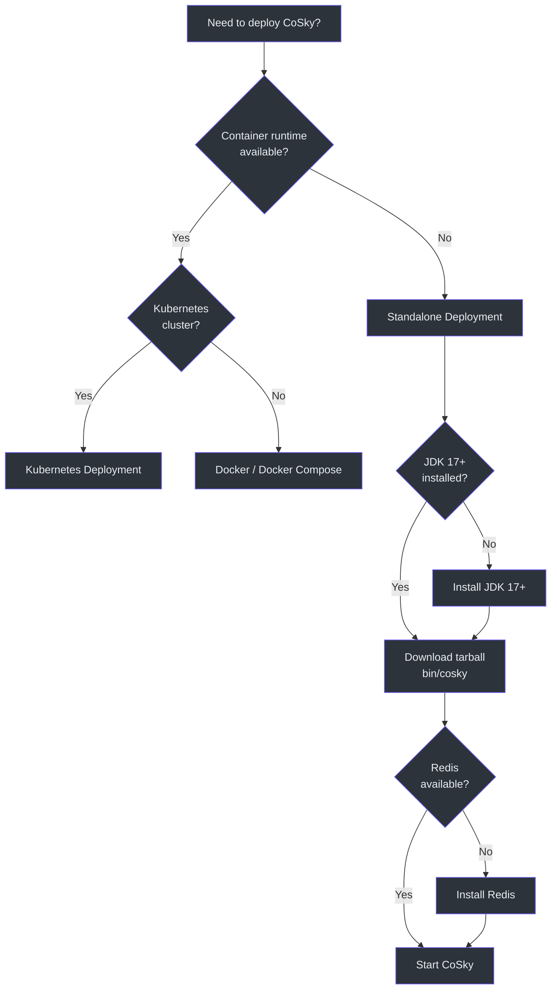
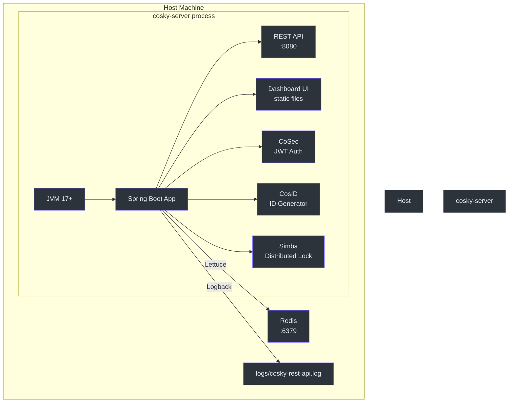
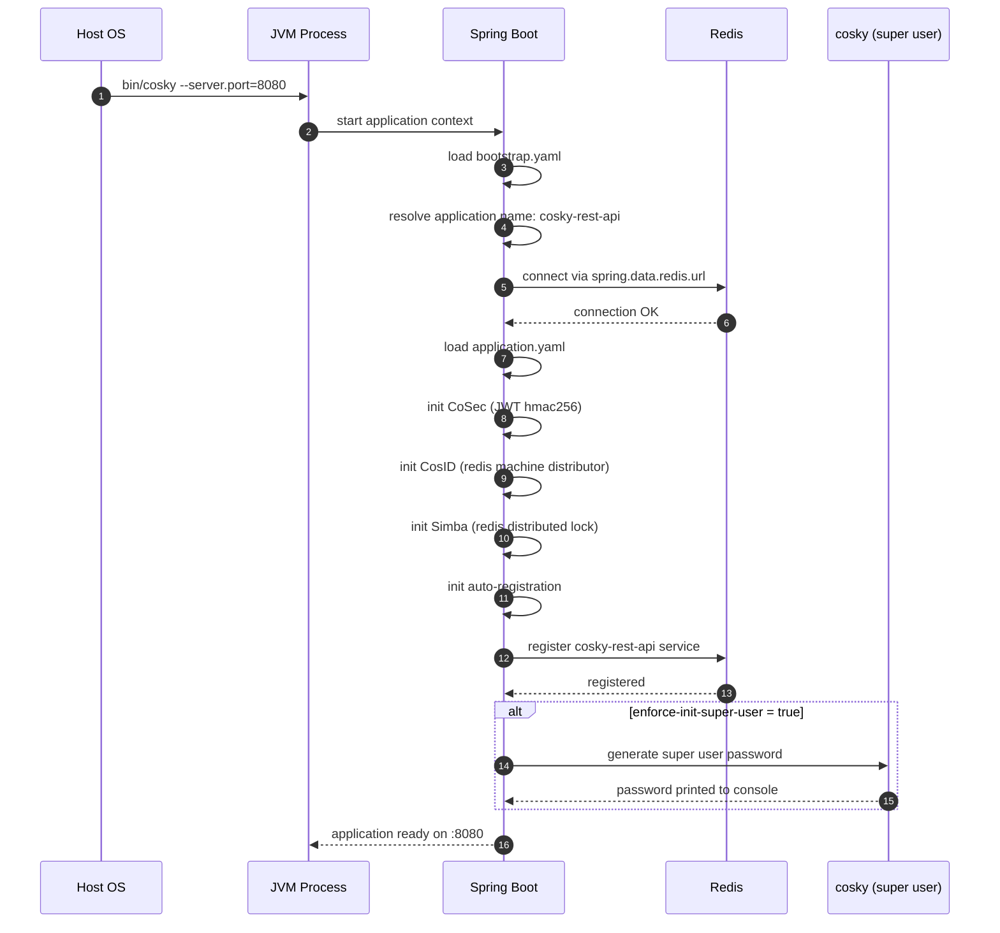

# Standalone Deployment

## Overview

The standalone deployment option lets you run CoSky directly on a host machine without Docker or Kubernetes. This approach is ideal for development environments, small-scale deployments, or environments where container runtimes are not available. The standalone distribution packages CoSky as a self-contained application with startup scripts, configuration files, and the built-in dashboard UI.

## Download and Extract

Download the latest release tarball and extract it:

```bash
# Download the latest release
wget https://github.com/Ahoo-Wang/cosky/releases/latest/download/cosky-server.tar

# Extract
tar -xvf cosky-server.tar

# Enter the directory
cd cosky-server
```

The extracted directory structure contains:

```
cosky-server/
  bin/
    cosky              # Startup script (Unix)
  config/
    application.yaml   # Application configuration
    bootstrap.yaml     # Bootstrap configuration
  dashboard/
    dist/              # Dashboard UI static files
  lib/
    *.jar              # Runtime dependencies
```

## Run Command

Start CoSky with the required Redis connection parameter:

```bash
bin/cosky --server.port=8080 --spring.data.redis.url=redis://localhost:6379
```

All Spring Boot properties can be passed as command-line arguments using the `--property=value` format. Alternatively, set them as environment variables or edit the configuration files directly.

## Deployment Decision Tree

The following flowchart helps you choose the right deployment approach:



<!-- Sources: README.md:117, cosky-rest-api/Dockerfile:1 -->

## Configuration Files

### application.yaml

The main application configuration controls the REST API server, security, identity generation, and distributed locking:

```yaml
server:
  compression:
    enabled: true
spring:
  cloud:
    cosky:
      discovery:
        registry:
          weight: 8
  web:
    resources:
      static-locations: file:./dashboard/dist/
cosky:
  security:
    enabled: true
    audit-log:
      action: write
    enforce-init-super-user: ${cosky.super.init:false}
cosec:
  jwt:
    algorithm: hmac256
    secret: ${cosky.security.key:FyN0Igd80Gas3stTavArGKOYnS9uLWGA$}
    token-validity:
      access: 15m
      refresh: 3H
cosid:
  namespace: ${spring.application.name}
  machine:
    enabled: true
    distributor:
      type: redis
  generator:
    enabled: true
simba:
  redis:
    enabled: true
logging:
  file:
    name: logs/${spring.application.name}.log
```

<!-- Sources: cosky-rest-api/src/main/resources/application.yaml:1, cosky-rest-api/src/dist/config/application.yaml:1 -->

### bootstrap.yaml

The bootstrap configuration defines the service identity, namespace, and auto-registration behavior:

```yaml
spring:
  application:
    name: ${service.name:cosky-rest-api}
  cloud:
    cosky:
      namespace: ${cosky.namespace:cosky-{system}}
      config:
        config-id: ${spring.application.name}.yaml
    service-registry:
      auto-registration:
        enabled: ${cosky.auto-registry:true}
```

<!-- Sources: cosky-rest-api/src/main/resources/bootstrap.yaml:1, cosky-rest-api/src/dist/config/bootstrap.yaml:1 -->

## Standalone Architecture



<!-- Sources: cosky-rest-api/src/main/resources/application.yaml:1, cosky-rest-api/src/main/resources/bootstrap.yaml:1 -->

## Component Initialization Sequence



<!-- Sources: cosky-rest-api/src/main/resources/application.yaml:1, cosky-rest-api/src/main/resources/bootstrap.yaml:1, README.md:239 -->

## Configuration Precedence

Spring Boot properties are resolved in the following order (highest priority first```mermaid
flowchart TD
    A["Command-line arguments<br>--server.port=8080"] --> B["Environment variables<br>SPRING_DATA_REDIS_URL"]
    B --> C["application.yaml<br>(config/ directory)"]
    C --> D["bootstrap.yaml<br>(config/ directory)"]
    D --> E["Default values<br>in code"]

    A:::node
    B:::node
    C:::node
    D:::node
    E:::node

    classDef node fill:#2d333b,stroke:#6d5dfc,color:#e6edf3
```
```

<!-- Sources: cosky-rest-api/src/main/resources/application.yaml:1, cosky-rest-api/src/dist/config/application.yaml:1 -->

## JVM Options

| Option | Recommended Value | Description |
|--------|------------------|-------------|
| `-Xms` | `512m` | Initial heap size |
| `-Xmx` | `1024m` | Maximum heap size |
| `-XX:+UseG1GC` | - | Use G1 garbage collector |
| `-XX:MaxGCPauseMillis` | `200` | Target max GC pause |
| `-Dfile.encoding` | `UTF-8` | Character encoding |
| `-Duser.timezone` | `Asia/Shanghai` | Default timezone (or match your locale) |
| `-XX:+HeapDumpOnOutOfMemoryError` | - | Generate heap dump on OOM |
| `-XX:HeapDumpPath` | `logs/` | Directory for heap dumps |

To pass JVM options through the startup script, set the `JAVA_OPTS` environment variable:

```bash
export JAVA_OPTS="-Xms512m -Xmx1024m -XX:+UseG1GC"
bin/cosky --server.port=8080 --spring.data.redis.url=redis://localhost:6379
```

## Service Discovery and Self-Registration

When `cosky.auto-registry` is enabled (the default), CoSky registers itself as a service instance. The `cosky.rest.api` service appears in the dashboard with a default weight of `8`. This allows other microservices using the CoSky SDK to discover the REST API server through standard service discovery mecha```mermaid
flowchart LR
    subgraph Service Ecosystem
        style Service Ecosystem fill:#161b22,stroke:#30363d,color:#e6edf3
        S1["Service A<br>(CoSky SDK)"] -->|"discover"| CO["CoSky Server<br>self-registered"]
        S2["Service B<br>(CoSky SDK)"] -->|"discover"| CO
        S3["Service C<br>(CoSky SDK)"] -->|"discover"| CO
        CO -->|"config + discovery"| R["Redis"]
        S1 -->|"config + discovery"| R
        S2 -->|"config + discovery"| R
        S3 -->|"config + discovery"| R
    end

    S1:::node
    S2:::node
    S3:::node
    CO:::node
    R:::node

    classDef node fill:#2d333b,stroke:#6d5dfc,color:#e6edf3
```edf3
```

<!-- Sources: cosky-rest-api/src/main/resources/bootstrap.yaml:8, cosky-rest-api/src/main/resources/application.yaml:8 -->

## Logging

Logs are written to `logs/cosky-rest-api.log` by default. The logging path is configured in `application.yaml`:

```yaml
logging:
  file:
    name: logs/${spring.application.name}.log
```

To change the log location, override the `logging.file.name` property:

```bash
bin/cosky --logging.file.name=/var/log/cosky/cosky.log
```

## Related Pages

- [Docker Deployment](./deployment-docker.md) - Container-based deployment
- [Kubernetes Deployment](./deployment-kubernetes.md) - Deploy in a K8s cluster
- [Performance Benchmarks](./performance.md) - JMH benchmark results

## References

- [README.md - Standalone Deployment](https://github.com/Ahoo-Wang/CoSky/blob/main/README.md)
- [cosky-rest-api/src/main/resources/application.yaml](https://github.com/Ahoo-Wang/CoSky/blob/main/cosky-rest-api/src/main/resources/application.yaml)
- [cosky-rest-api/src/main/resources/bootstrap.yaml](https://github.com/Ahoo-Wang/CoSky/blob/main/cosky-rest-api/src/main/resources/bootstrap.yaml)
- [cosky-rest-api/src/dist/config/application.yaml](https://github.com/Ahoo-Wang/CoSky/blob/main/cosky-rest-api/src/dist/config/application.yaml)
- [cosky-rest-api/src/dist/config/bootstrap.yaml](https://github.com/Ahoo-Wang/CoSky/blob/main/cosky-rest-api/src/dist/config/bootstrap.yaml)
- [cosky-rest-api/Dockerfile](https://github.com/Ahoo-Wang/CoSky/blob/main/cosky-rest-api/Dockerfile)
