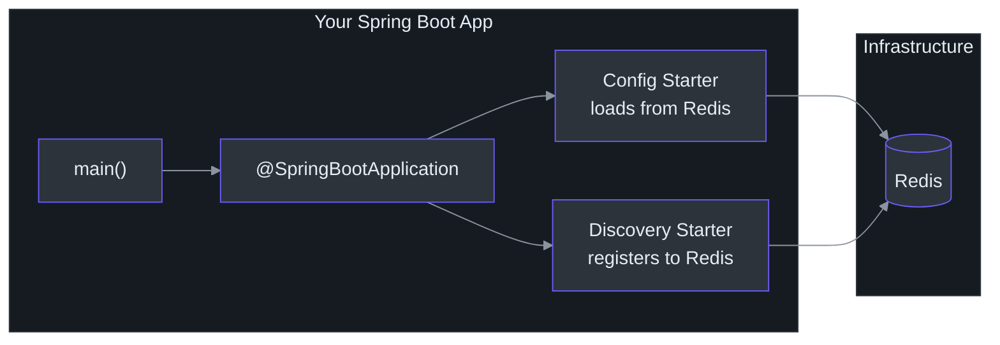
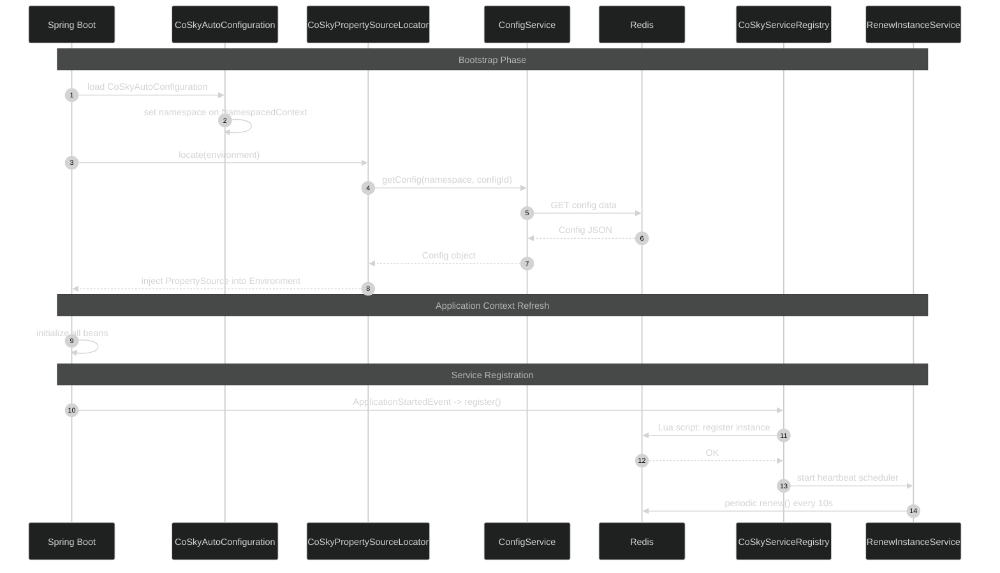
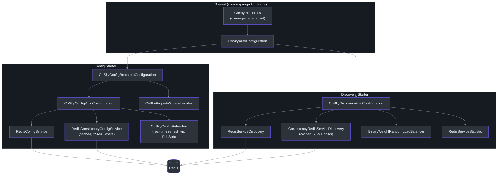

# Getting Started

This guide walks you through adding CoSky service discovery and configuration management to a Spring Cloud application. By the end, your application will register with a Redis-backed service discovery, load its configuration from CoSky, and be ready for production traffic.

## Overview

You will build a Spring Boot microservice that:

- Loads configuration from Redis via the CoSky config starter
- Registers itself as a service instance on startup
- Renewing its registration via periodic heartbeat
- Can discover other services through the CoSky discovery client



<!-- Sources: ProviderServer.kt:24, CoSkyAutoConfiguration.kt:32 -->

## Prerequisites

| Requirement | Version | Purpose | Notes |
|-------------|---------|---------|-------|
| **Java** | 17+ | JVM runtime | CoSky uses JVM 17 toolchain ([build.gradle.kts:93](https://github.com/Ahoo-Wang/CoSky/blob/main/build.gradle.kts#L93)) |
| **Redis** | 5.0+ | Backend storage for services and configs | Standalone or cluster mode |
| **Gradle** or **Maven** | Any | Build tool | Kotlin DSL shown for Gradle |
| **Spring Boot** | 4.x | Application framework | Spring Cloud compatible |

## Quick Start

### Step 1: Add Dependencies

#### Gradle (Kotlin DSL)

```kotlin
val coskyVersion = "5.6.0"

dependencies {
    implementation(platform("me.ahoo.cosky:cosky-dependencies:${coskyVersion}"))
    implementation("me.ahoo.cosky:spring-cloud-starter-cosky-config")
    implementation("me.ahoo.cosky:spring-cloud-starter-cosky-discovery")
    implementation("org.springframework.cloud:spring-cloud-starter-loadbalancer")
}
```

#### Maven

```xml
<properties>
    <cosky.version>5.6.0</cosky.version>
</properties>
<dependencyManagement>
    <dependencies>
        <dependency>
            <groupId>me.ahoo.cosky</groupId>
            <artifactId>cosky-dependencies</artifactId>
            <version>${cosky.version}</version>
            <type>pom</type>
            <scope>import</scope>
        </dependency>
    </dependencies>
</dependencyManagement>
<dependencies>
    <dependency>
        <groupId>me.ahoo.cosky</groupId>
        <artifactId>spring-cloud-starter-cosky-config</artifactId>
    </dependency>
    <dependency>
        <groupId>me.ahoo.cosky</groupId>
        <artifactId>spring-cloud-starter-cosky-discovery</artifactId>
    </dependency>
    <dependency>
        <groupId>org.springframework.cloud</groupId>
        <artifactId>spring-cloud-starter-loadbalancer</artifactId>
    </dependency>
</dependencies>
```

Current version defined in [gradle.properties:14](https://github.com/Ahoo-Wang/CoSky/blob/main/gradle.properties#L14).

### Step 2: Configure Bootstrap

Create `src/main/resources/bootstrap.yaml`:

```yaml
spring:
  application:
    name: ${service.name:my-service}
  data:
    redis:
      url: redis://localhost:6379
  cloud:
    cosky:
      namespace: ${cosky.namespace:cosky-{default}}
      config:
        config-id: ${spring.application.name}.yaml
    service-registry:
      auto-registration:
        enabled: ${cosky.auto-registry:true}
logging:
  file:
    name: logs/${spring.application.name}.log
```

| Property | Default | Description |
|----------|---------|-------------|
| `spring.data.redis.url` | _(required)_ | Redis connection URL |
| `spring.cloud.cosky.namespace` | `cosky-{default}` | Namespace for service/config isolation ([CoSkyProperties.kt:30](https://github.com/Ahoo-Wang/CoSky/blob/main/cosky-spring-cloud-core/src/main/kotlin/me/ahoo/cosky/spring/cloud/CoSkyProperties.kt#L30)) |
| `spring.cloud.cosky.config.config-id` | `${spring.application.name}.yaml` | Config file ID to load ([CoSkyConfigAutoConfiguration.kt:48](https://github.com/Ahoo-Wang/CoSky/blob/main/cosky-spring-cloud-starter-config/src/main/kotlin/me/ahoo/cosky/config/spring/cloud/CoSkyConfigAutoConfiguration.kt#L48)) |
| `spring.cloud.service-registry.auto-registration.enabled` | `true` | Auto-register service on startup |
| `spring.cloud.cosky.config.file-extension` | `yaml` | Default file extension for config lookup ([CoSkyConfigProperties.kt:27](https://github.com/Ahoo-Wang/CoSky/blob/main/cosky-spring-cloud-starter-config/src/main/kotlin/me/ahoo/cosky/config/spring/cloud/CoSkyConfigProperties.kt#L27)) |

Source: [examples/cosky-service-provider/src/main/resources/bootstrap.yaml](https://github.com/Ahoo-Wang/CoSky/blob/main/examples/cosky-service-provider/src/main/resources/bootstrap.yaml)

### Step 3: Create the Main Class

```kotlin
package com.example.myservice

import org.springframework.boot.autoconfigure.SpringBootApplication
import org.springframework.boot.runApplication

@SpringBootApplication
class MyServiceApplication

fun main(args: Array<String>) {
    runApplication<MyServiceApplication>(*args)
}
```

That's it. CoSky's auto-configuration handles everything else. When the application starts:

1. **CoSkyAutoConfiguration** sets the namespace context from your properties ([CoSkyAutoConfiguration.kt:33](https://github.com/Ahoo-Wang/CoSky/blob/main/cosky-spring-cloud-core/src/main/kotlin/me/ahoo/cosky/spring/cloud/CoSkyAutoConfiguration.kt#L33))
2. **CoSkyConfigBootstrapConfiguration** loads your config from Redis into the Spring Environment ([CoSkyConfigBootstrapConfiguration.kt:28](https://github.com/Ahoo-Wang/CoSky/blob/main/cosky-spring-cloud-starter-config/src/main/kotlin/me/ahoo/cosky/config/spring/cloud/CoSkyConfigBootstrapConfiguration.kt#L28))
3. **CoSkyDiscoveryAutoConfiguration** auto-registers your service instance ([CoSkyDiscoveryAutoConfiguration.kt:42](https://github.com/Ahoo-Wang/CoSky/blob/main/cosky-spring-cloud-starter-discovery/src/main/kotlin/me/ahoo/cosky/discovery/spring/cloud/discovery/CoSkyDiscoveryAutoConfiguration.kt#L42))

## Startup Flow



<!-- Sources: CoSkyAutoConfiguration.kt:32, CoSkyPropertySourceLocator.kt:50, CoSkyServiceRegistry.kt:30, RenewProperties.kt:28 -->

## Architecture of the Starters



<!-- Sources: CoSkyConfigAutoConfiguration.kt:43, CoSkyConfigBootstrapConfiguration.kt:28, CoSkyDiscoveryAutoConfiguration.kt:47, CoSkyAutoConfiguration.kt:32 -->

## Verify It Works

1. Start Redis locally:

   ```bash
   docker run -d -p 6379:6379 redis:7
   ```

2. Run your Spring Boot application:

   ```bash
   ./gradlew bootRun
   ```

3. Check registered services in Redis:

   ```bash
   redis-cli SMEMBERS "cosky-{default}:svc_idx"
   ```

4. You should see your service name in the output, confirming registration succeeded.

## Next Steps

| Topic | Description | Link |
|-------|-------------|------|
| Installation Details | Maven, Gradle, Docker, K8s setup | [Installation](./installation) |
| Architecture Deep Dive | Module structure, Redis key design, event system | [Architecture](./architecture) |
| Configuration Management | Config CRUD, versioning, rollback, import/export | [Configuration Service](./config-service) |
| Service Discovery | Registration, heartbeat, discovery, load balancing | [Service Registry](./service-registry) |
| REST API Server | HTTP endpoints, dashboard, RBAC | [REST API](./rest-api) |

## References

- [gradle.properties](https://github.com/Ahoo-Wang/CoSky/blob/main/gradle.properties) -- current version (`5.6.0`)
- [CoSkyProperties.kt](https://github.com/Ahoo-Wang/CoSky/blob/main/cosky-spring-cloud-core/src/main/kotlin/me/ahoo/cosky/spring/cloud/CoSkyProperties.kt) -- core configuration properties
- [CoSkyConfigProperties.kt](https://github.com/Ahoo-Wang/CoSky/blob/main/cosky-spring-cloud-starter-config/src/main/kotlin/me/ahoo/cosky/config/spring/cloud/CoSkyConfigProperties.kt) -- config starter properties
- [CoSkyDiscoveryProperties.kt](https://github.com/Ahoo-Wang/CoSky/blob/main/cosky-spring-cloud-starter-discovery/src/main/kotlin/me/ahoo/cosky/discovery/spring/cloud/discovery/CoSkyDiscoveryProperties.kt) -- discovery starter properties
- [Example Provider](https://github.com/Ahoo-Wang/CoSky/blob/main/examples/cosky-service-provider/src/main/kotlin/me/ahoo/cosky/examples/service/provider/ProviderServer.kt) -- complete working example
- [Example Consumer](https://github.com/Ahoo-Wang/CoSky/blob/main/examples/cosky-service-consumer/src/main/kotlin/me/ahoo/cosky/examples/service/consumer/ConsumerServer.kt) -- Feign-based service consumer
