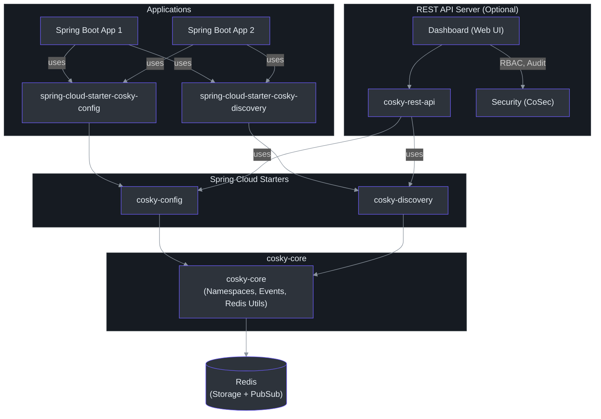
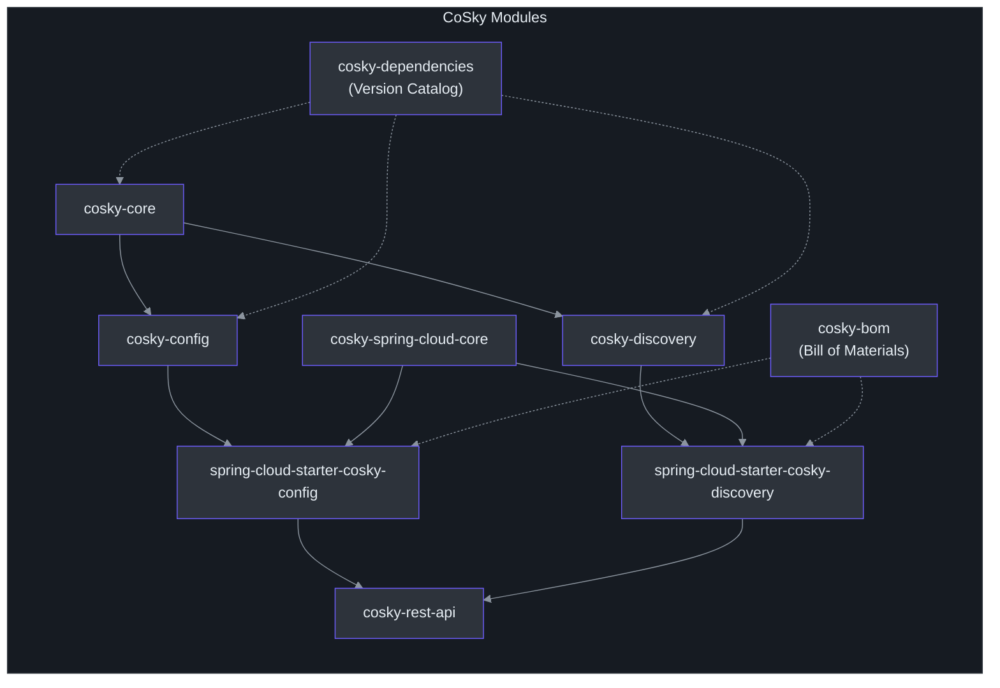
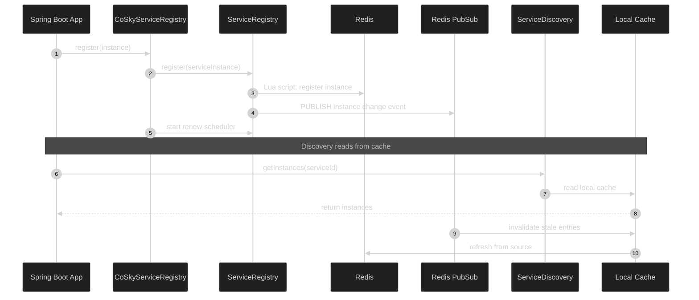
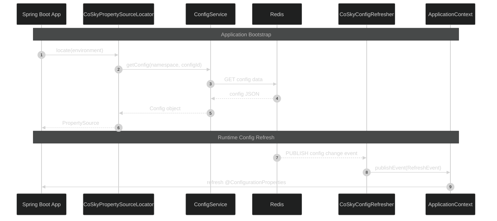
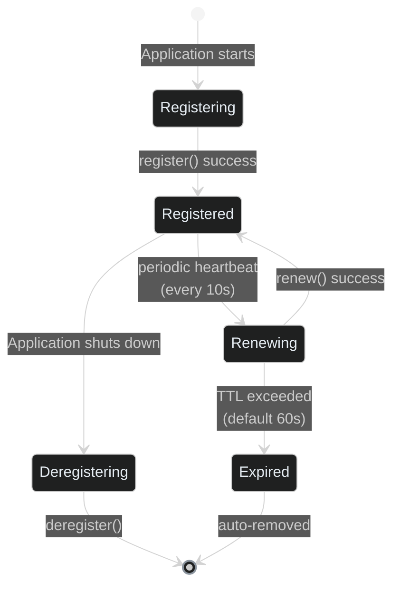

# CoSky Guide

**CoSky** is a lightweight, low-cost service registration, service discovery, and configuration service SDK. By leveraging Redis in your existing infrastructure (which you've likely already deployed), CoSky eliminates additional operational costs and deployment burdens. Powered by Redis's high performance, CoSky delivers exceptional TPS and QPS (100,000+/s). Through its combination of local process caching strategies and Redis PubSub, CoSky achieves real-time cache refreshing with outstanding QPS performance (70,000,000+/s) and maintains real-time consistency between process cache and Redis.

## Key Features

| Feature | Description | Source |
|---------|-------------|--------|
| **Service Discovery** | Register, discover, and manage service instances with automatic renewal via client heartbeat. Supports weighted load balancing and service topology. | [ServiceRegistry.kt:24](https://github.com/Ahoo-Wang/CoSky/blob/main/cosky-discovery/src/main/kotlin/me/ahoo/cosky/discovery/ServiceRegistry.kt#L24), [ServiceDiscovery.kt:24](https://github.com/Ahoo-Wang/CoSky/blob/main/cosky-discovery/src/main/kotlin/me/ahoo/cosky/discovery/ServiceDiscovery.kt#L24) |
| **Configuration Management** | Dynamic configuration with version history (last 10 versions), rollback support, and file import/export. Changes propagate instantly via Redis PubSub. | [ConfigService.kt:24](https://github.com/Ahoo-Wang/CoSky/blob/main/cosky-config/src/main/kotlin/me/ahoo/cosky/config/ConfigService.kt#L24), [ConfigRollback.kt:24](https://github.com/Ahoo-Wang/CoSky/blob/main/cosky-config/src/main/kotlin/me/ahoo/cosky/config/ConfigRollback.kt#L24) |
| **Consistency Caching** | Local process cache kept in sync via Redis PubSub, achieving 250x-800x performance improvement over direct Redis reads. | [RedisConsistencyConfigService](https://github.com/Ahoo-Wang/CoSky/blob/main/cosky-config/src/main/kotlin/me/ahoo/cosky/config/redis/RedisConsistencyConfigService.kt), [ConsistencyRedisServiceDiscovery](https://github.com/Ahoo-Wang/CoSky/blob/main/cosky-discovery/src/main/kotlin/me/ahoo/cosky/discovery/redis/ConsistencyRedisServiceDiscovery.kt) |
| **Spring Cloud Integration** | Drop-in starters for both config and discovery. Auto-configures via Spring Boot `@AutoConfiguration`. | [CoSkyConfigAutoConfiguration.kt:43](https://github.com/Ahoo-Wang/CoSky/blob/main/cosky-spring-cloud-starter-config/src/main/kotlin/me/ahoo/cosky/config/spring/cloud/CoSkyConfigAutoConfiguration.kt#L43), [CoSkyDiscoveryAutoConfiguration.kt:47](https://github.com/Ahoo-Wang/CoSky/blob/main/cosky-spring-cloud-starter-discovery/src/main/kotlin/me/ahoo/cosky/discovery/spring/cloud/discovery/CoSkyDiscoveryAutoConfiguration.kt#L47) |
| **Weighted Load Balancing** | Binary weight random load balancer integrated with service discovery for efficient instance selection. | [CoSkyDiscoveryAutoConfiguration.kt:105](https://github.com/Ahoo-Wang/CoSky/blob/main/cosky-spring-cloud-starter-discovery/src/main/kotlin/me/ahoo/cosky/discovery/spring/cloud/discovery/CoSkyDiscoveryAutoConfiguration.kt#L105) |
| **Namespace Isolation** | Multi-tenant namespace support with Redis hashtag wrapping for cluster mode compatibility. | [CoSkyProperties.kt:32](https://github.com/Ahoo-Wang/CoSky/blob/main/cosky-spring-cloud-core/src/main/kotlin/me/ahoo/cosky/spring/cloud/CoSkyProperties.kt#L32), [NamespaceService.kt:23](https://github.com/Ahoo-Wang/CoSky/blob/main/cosky-core/src/main/kotlin/me/ahoo/cosky/core/NamespaceService.kt#L23) |
| **REST API & Dashboard** | Web-based management UI with RBAC, audit logging, and service topology visualization. | [RestApiServer.kt:24](https://github.com/Ahoo-Wang/CoSky/blob/main/cosky-rest-api/src/main/kotlin/me/ahoo/cosky/rest/RestApiServer.kt#L24) |
| **Real-time Events** | Config and instance change events propagated instantly via Redis PubSub listeners. | [ConfigChangedEvent.kt:20](https://github.com/Ahoo-Wang/CoSky/blob/main/cosky-config/src/main/kotlin/me/ahoo/cosky/config/ConfigChangedEvent.kt#L20), [EventListenerContainer.kt:5](https://github.com/Ahoo-Wang/CoSky/blob/main/cosky-core/src/main/kotlin/me/ahoo/cosky/core/EventListenerContainer.kt#L5) |

## Architecture Overview

<!-- Sources: settings.gradle.kts:14-27, build.gradle.kts:32-43, RestApiServer.kt:24 -->

### Module Dependency Graph

<!-- Sources: settings.gradle.kts:14-27, build.gradle.kts:32-43 -->

### Data Flow: Service Discovery

<!-- Sources: CoSkyServiceRegistry.kt:30, ServiceRegistry.kt:33, ServiceDiscovery.kt:26, CoSkyDiscoveryAutoConfiguration.kt:82 -->

### Data Flow: Configuration

<!-- Sources: CoSkyPropertySourceLocator.kt:35, ConfigService.kt:27, CoSkyConfigRefresher.kt:33 -->

### Instance Lifecycle

<!-- Sources: RegistryProperties.kt:23, RenewProperties.kt:22, ServiceInstance.kt:33, CoSkyServiceRegistry.kt:30 -->

## Documentation Map

| Page | Description |
|------|-------------|
| [Getting Started](./getting-started) | Quick start guide: set up a Spring Boot app with CoSky in 5 minutes |
| [Installation](./installation) | All installation methods: Maven, Gradle, Docker, Kubernetes |
| [Architecture](./architecture) | Detailed architecture, module structure, Redis key design, and event system |
| [Configuration Service](./config-service) | Configuration CRUD, versioning, rollback, import/export |
| [Config Consistency](./config-consistency) | Local caching + PubSub invalidation layer |
| [Service Registry](./service-registry) | Instance registration, heartbeat, deregistration |
| [Spring Cloud Config](./spring-cloud-config) | PropertySourceLocator, `@RefreshScope`, auto-configuration |
| [REST API Server](./rest-api) | HTTP endpoints for all operations, dashboard, security |

## Related Pages

- [CoSky Home](../index.md) -- Landing page with project overview
- [CoSky GitHub Repository](https://github.com/Ahoo-Wang/CoSky) -- Source code, issues, and releases
- [Examples](https://github.com/Ahoo-Wang/CoSky/tree/main/examples) -- Service provider and consumer examples with Feign RPC integration
- [REST API Documentation](https://ahoo-cosky.apifox.cn/) -- Interactive API documentation (Apifox)
