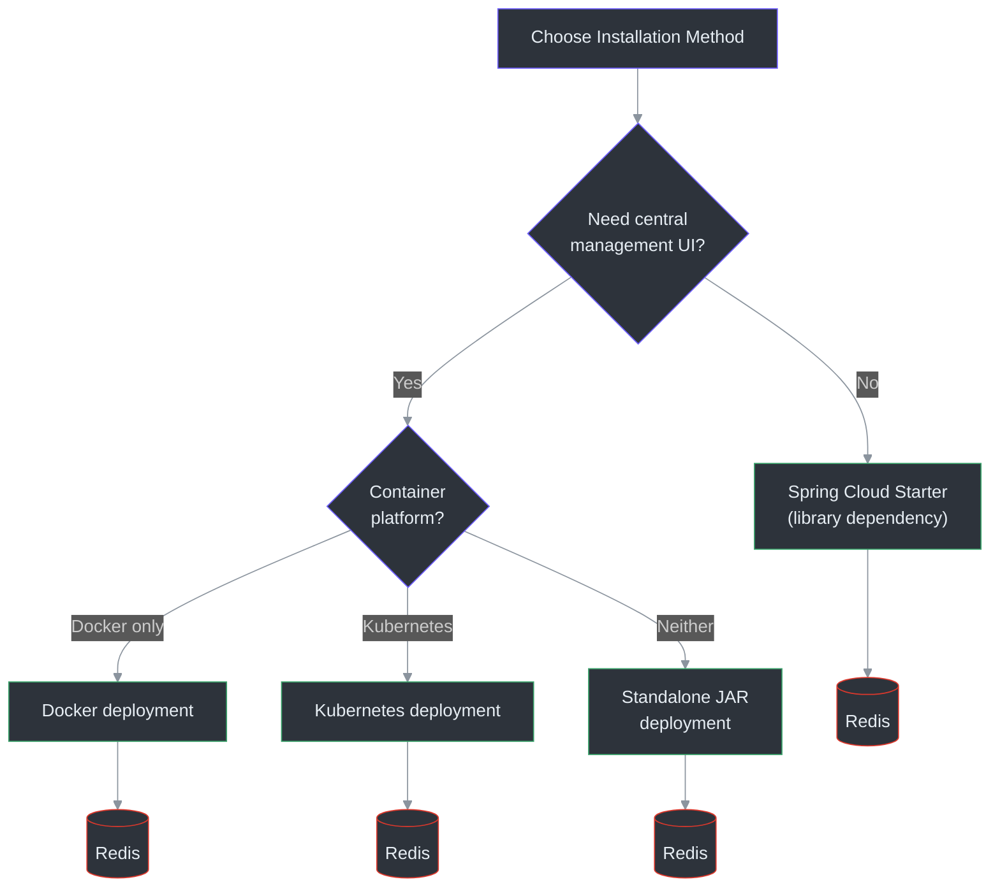
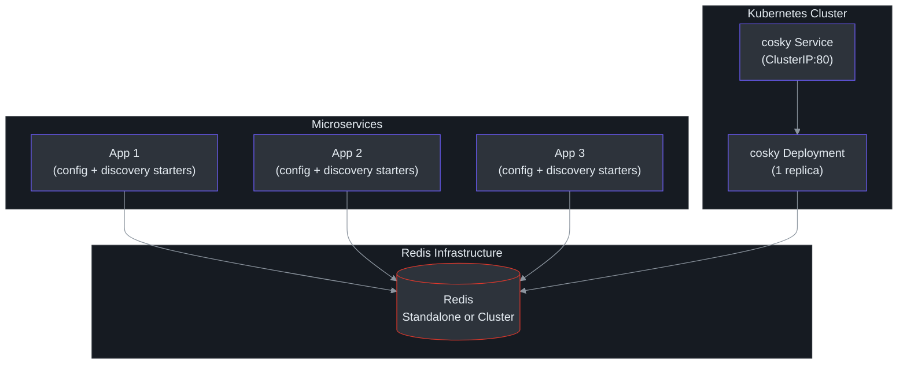
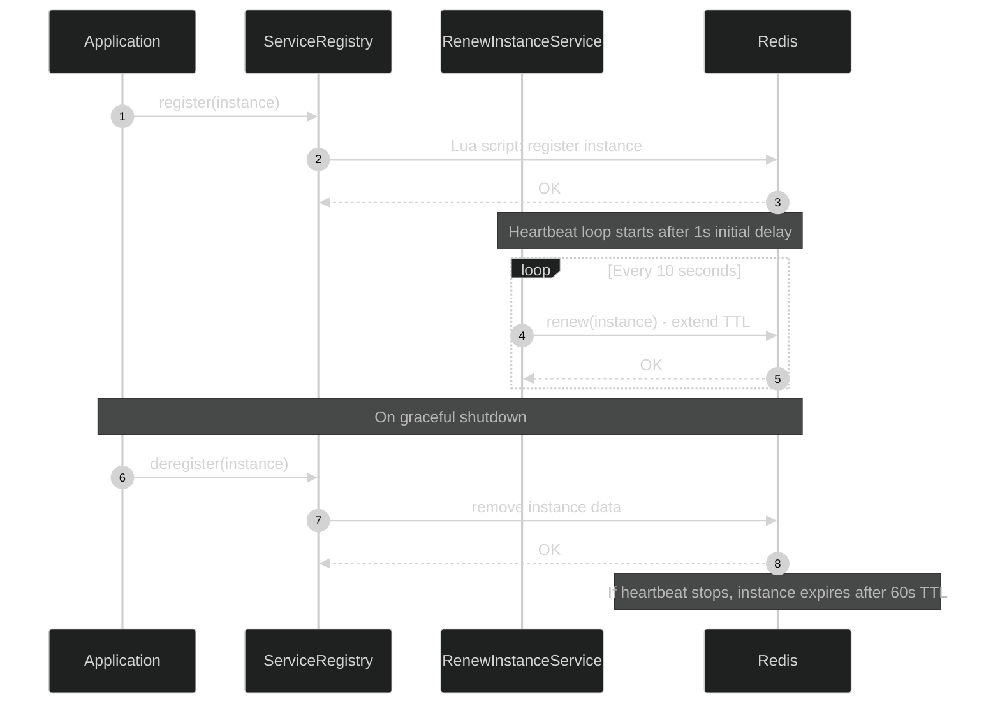

# Installation

CoSky can be used in two ways: as a **library dependency** integrated into your Spring Cloud application, or as a **standalone REST API server** for centralized management with a web dashboard. This page covers all installation methods.

## Installation Methods Comparison

| Method | Pros | Cons | Best For |
|--------|------|------|----------|
| **Spring Cloud Starter** | Zero extra infrastructure; integrates directly into your app | No management UI; each app connects to Redis independently | Microservices that self-register and self-configure |
| **Standalone JAR** | Full dashboard; RBAC; audit logs | Requires a dedicated JVM process | Teams wanting a management console without containers |
| **Docker** | Portable; reproducible; easy to scale | Requires Docker runtime | Containerized environments, dev/test setups |
| **Kubernetes** | Cloud-native; health probes; auto-restart | Requires K8s cluster | Production cloud-native deployments |



<!-- Sources: README.md:111-201, k8s/deployment/cosky.yml -->

## As a Library Dependency

Add CoSky starters to your Spring Cloud application. These are published to Maven Central under `me.ahoo.cosky`.

### Gradle (Kotlin DSL)

```kotlin
val coskyVersion = "5.6.0"

dependencies {
    implementation("me.ahoo.cosky:spring-cloud-starter-cosky-config:${coskyVersion}")
    implementation("me.ahoo.cosky:spring-cloud-starter-cosky-discovery:${coskyVersion}")
    implementation("org.springframework.cloud:spring-cloud-starter-loadbalancer:3.0.3")
}
```

### Maven

```xml
<?xml version="1.0" encoding="UTF-8"?>
<project xmlns="http://maven.apache.org/POM/4.0.0"
         xmlns:xsi="http://www.w3.org/2001/XMLSchema-instance"
         xsi:schemaLocation="http://maven.apache.org/POM/4.0.0 http://maven.apache.org/xsd/maven-4.0.0.xsd">
    <modelVersion>4.0.0</modelVersion>
    <artifactId>demo</artifactId>
    <properties>
        <cosky.version>5.6.0</cosky.version>
    </properties>

    <dependencies>
        <dependency>
            <groupId>me.ahoo.cosky</groupId>
            <artifactId>spring-cloud-starter-cosky-config</artifactId>
            <version>${cosky.version}</version>
        </dependency>
        <dependency>
            <groupId>me.ahoo.cosky</groupId>
            <artifactId>spring-cloud-starter-cosky-discovery</artifactId>
            <version>${cosky.version}</version>
        </dependency>
        <dependency>
            <groupId>org.springframework.cloud</groupId>
            <artifactId>spring-cloud-starter-loadbalancer</artifactId>
            <version>3.0.3</version>
        </dependency>
    </dependencies>
</project>
```

Source: [gradle.properties:14](https://github.com/Ahoo-Wang/CoSky/blob/main/gradle.properties#L14), [README.md:46-87](https://github.com/Ahoo-Wang/CoSky/blob/main/README.md#L46-L87)

### Available Artifacts

| Artifact | Purpose | Module |
|----------|---------|--------|
| `spring-cloud-starter-cosky-config` | Spring Cloud config loading and real-time refresh | [cosky-spring-cloud-starter-config](https://github.com/Ahoo-Wang/CoSky/blob/main/cosky-spring-cloud-starter-config) |
| `spring-cloud-starter-cosky-discovery` | Spring Cloud service registration and discovery | [cosky-spring-cloud-starter-discovery](https://github.com/Ahoo-Wang/CoSky/blob/main/cosky-spring-cloud-starter-discovery) |
| `cosky-bom` | Bill of Materials for dependency version management | [cosky-bom](https://github.com/Ahoo-Wang/CoSky/blob/main/cosky-bom) |

## REST API Server Installation

The REST API server provides a management dashboard, REST endpoints, security (RBAC), and audit logging. It is optional -- your services work perfectly without it using just the library starters.

### Option 1: Standalone JAR

Download the latest release and run directly:

```bash
# Download cosky-server
wget https://github.com/Ahoo-Wang/cosky/releases/latest/download/cosky-server.tar

# Extract
tar -xvf cosky-server.tar
cd cosky-server

# Run with Redis connection
bin/cosky --server.port=8080 --spring.data.redis.url=redis://localhost:6379
```

On first startup, CoSky initializes the super user and prints the generated password to the console:

```log
---------------- ****** CoSky -  init super user:[cosky] password:[6TrmOux4Oj] ****** ----------------
```

To reinitialize the password, set `enforce-init-super-user: true` in your configuration.

Source: [README.md:119-127](https://github.com/Ahoo-Wang/CoSky/blob/main/README.md#L119-L127)

### Option 2: Docker

Quick deployment with Docker:

```bash
# Pull the image
docker pull ahoowang/cosky:latest

# Run as a container
docker run --name cosky -d -p 8080:8080 \
  -e SPRING_DATA_REDIS_URL=redis://your-redis-host:6379 \
  ahoowang/cosky:latest
```

#### Docker Compose

For local development with Redis:

```yaml
version: "3.8"
services:
  redis:
    image: redis:7
    ports:
      - "6379:6379"
  cosky:
    image: ahoowang/cosky:latest
    ports:
      - "8080:8080"
    environment:
      - SPRING_DATA_REDIS_URL=redis://redis:6379
    depends_on:
      - redis
```

Source: [README.md:132-137](https://github.com/Ahoo-Wang/CoSky/blob/main/README.md#L132-L137)

### Option 3: Kubernetes

Deploy CoSky in your Kubernetes cluster. The project provides deployment manifests for both standalone Redis and Redis Cluster configurations.

#### Standalone Redis

```yaml
apiVersion: apps/v1
kind: Deployment
metadata:
  name: cosky
  labels:
    app: cosky
spec:
  replicas: 1
  selector:
    matchLabels:
      app: cosky
  template:
    metadata:
      labels:
        app: cosky
    spec:
      containers:
        - name: cosky
          image: ahoowang/cosky:latest
          ports:
            - containerPort: 8080
              protocol: TCP
          env:
            - name: SPRING_DATA_REDIS_HOST
              value: redis-uri:6379
            - name: SPRING_DATA_REDIS_PASSWORD
              value: redis-pwd
            - name: TZ
              value: Asia/Shanghai
          startupProbe:
            httpGet:
              port: http
              path: /actuator/health
          readinessProbe:
            httpGet:
              port: http
              path: /actuator/health/readiness
          livenessProbe:
            httpGet:
              port: http
              path: /actuator/health/liveness
          resources:
            requests:
              cpu: 250m
              memory: 1024Mi
            limits:
              cpu: "1"
              memory: 1280Mi
          volumeMounts:
            - name: volume-localtime
              mountPath: /etc/localtime
      volumes:
        - name: volume-localtime
          hostPath:
            path: /etc/localtime
```

Source: [k8s/deployment/cosky.yml](https://github.com/Ahoo-Wang/CoSky/blob/main/k8s/deployment/cosky.yml)

#### Redis Cluster

For production environments using Redis Cluster, reference secrets for node and password configuration:

```yaml
apiVersion: apps/v1
kind: Deployment
metadata:
  name: cosky
  labels:
    app: cosky
spec:
  replicas: 1
  selector:
    matchLabels:
      app: cosky
  template:
    metadata:
      labels:
        app: cosky
    spec:
      containers:
        - name: cosky
          image: ahoowang/cosky:latest
          env:
            - name: SPRING_DATA_REDIS_CLUSTER_NODES
              valueFrom:
                secretKeyRef:
                  name: redis-secret
                  key: nodes
            - name: SPRING_DATA_REDIS_PASSWORD
              valueFrom:
                secretKeyRef:
                  name: redis-secret
                  key: password
            - name: SPRING_DATA_REDIS_CLUSTER_MAX_REDIRECTS
              value: "3"
            - name: SPRING_DATA_REDIS_LETTUCE_CLUSTER_REFRESH_ADAPTIVE
              value: "true"
            - name: SPRING_DATA_REDIS_LETTUCE_CLUSTER_REFRESH_PERIOD
              value: 30s
```

Source: [k8s/deployment/cosky-cluster.yml](https://github.com/Ahoo-Wang/CoSky/blob/main/k8s/deployment/cosky-cluster.yml)

#### Kubernetes Service

```yaml
apiVersion: v1
kind: Service
metadata:
  name: cosky
  labels:
    app: cosky
spec:
  selector:
    app: cosky
  ports:
    - name: rest
      port: 80
      protocol: TCP
      targetPort: 8080
```

Source: [k8s/deployment/cosky-service.yaml](https://github.com/Ahoo-Wang/CoSky/blob/main/k8s/deployment/cosky-service.yaml)

## Deployment Architecture



<!-- Sources: k8s/deployment/cosky.yml, k8s/deployment/cosky-cluster.yml, k8s/deployment/cosky-service.yaml -->

## Configuration Reference

Key configuration properties for CoSky:

| Property | Default | Description | Source |
|----------|---------|-------------|--------|
| `spring.data.redis.url` | _(required)_ | Redis connection URL (standalone) | [bootstrap.yaml](https://github.com/Ahoo-Wang/CoSky/blob/main/cosky-rest-api/src/dist/config/bootstrap.yaml) |
| `spring.data.redis.cluster.nodes` | _(required for cluster)_ | Redis cluster node addresses | [cosky-cluster.yml:23](https://github.com/Ahoo-Wang/CoSky/blob/main/k8s/deployment/cosky-cluster.yml#L23) |
| `spring.data.redis.password` | — | Redis password | [cosky.yml:23](https://github.com/Ahoo-Wang/CoSky/blob/main/k8s/deployment/cosky.yml#L23) |
| `spring.cloud.cosky.namespace` | `cosky-{default}` | Isolation namespace for services and configs | [CoSkyProperties.kt:30](https://github.com/Ahoo-Wang/CoSky/blob/main/cosky-spring-cloud-core/src/main/kotlin/me/ahoo/cosky/spring/cloud/CoSkyProperties.kt#L30) |
| `spring.cloud.cosky.config.enabled` | `true` | Enable config loading from Redis | [CoSkyConfigProperties.kt:26](https://github.com/Ahoo-Wang/CoSky/blob/main/cosky-spring-cloud-starter-config/src/main/kotlin/me/ahoo/cosky/config/spring/cloud/CoSkyConfigProperties.kt#L26) |
| `spring.cloud.cosky.config.config-id` | `${spring.application.name}.yaml` | Config file ID to load | [CoSkyConfigAutoConfiguration.kt:48](https://github.com/Ahoo-Wang/CoSky/blob/main/cosky-spring-cloud-starter-config/src/main/kotlin/me/ahoo/cosky/config/spring/cloud/CoSkyConfigAutoConfiguration.kt#L48) |
| `spring.cloud.cosky.config.file-extension` | `yaml` | Default file extension | [CoSkyConfigProperties.kt:27](https://github.com/Ahoo-Wang/CoSky/blob/main/cosky-spring-cloud-starter-config/src/main/kotlin/me/ahoo/cosky/config/spring/cloud/CoSkyConfigProperties.kt#L27) |
| `spring.cloud.cosky.config.timeout` | `2s` | Timeout for config loading | [CoSkyConfigProperties.kt:28](https://github.com/Ahoo-Wang/CoSky/blob/main/cosky-spring-cloud-starter-config/src/main/kotlin/me/ahoo/cosky/config/spring/cloud/CoSkyConfigProperties.kt#L28) |
| `spring.cloud.cosky.discovery.enabled` | `true` | Enable service discovery | [CoSkyDiscoveryProperties.kt:26](https://github.com/Ahoo-Wang/CoSky/blob/main/cosky-spring-cloud-starter-discovery/src/main/kotlin/me/ahoo/cosky/discovery/spring/cloud/discovery/CoSkyDiscoveryProperties.kt#L26) |
| `spring.cloud.cosky.discovery.timeout` | `2s` | Timeout for discovery operations | [CoSkyDiscoveryProperties.kt:28](https://github.com/Ahoo-Wang/CoSky/blob/main/cosky-spring-cloud-starter-discovery/src/main/kotlin/me/ahoo/cosky/discovery/spring/cloud/discovery/CoSkyDiscoveryProperties.kt#L28) |
| `spring.cloud.service-registry.auto-registration.enabled` | `true` | Auto-register service on startup | [bootstrap.yaml:9](https://github.com/Ahoo-Wang/CoSky/blob/main/cosky-rest-api/src/dist/config/bootstrap.yaml#L9) |
| `cosky.security.enabled` | `true` | Enable security on REST API server | [application.yaml:16](https://github.com/Ahoo-Wang/CoSky/blob/main/cosky-rest-api/src/dist/config/application.yaml#L16) |
| `cosky.security.enforce-init-super-user` | `false` | Reinitialize super user password | [application.yaml:19](https://github.com/Ahoo-Wang/CoSky/blob/main/cosky-rest-api/src/dist/config/application.yaml#L19) |

## Instance Lifecycle Properties

When using the discovery starter, service instances have configurable TTL and heartbeat settings:

| Property | Default | Description | Source |
|----------|---------|-------------|--------|
| Instance TTL | `60s` | How long an instance lives before being considered expired | [RegistryProperties.kt:26](https://github.com/Ahoo-Wang/CoSky/blob/main/cosky-discovery/src/main/kotlin/me/ahoo/cosky/discovery/RegistryProperties.kt#L26) |
| Renew period | `10s` | How often the instance sends a heartbeat to renew its TTL | [RenewProperties.kt:28](https://github.com/Ahoo-Wang/CoSky/blob/main/cosky-discovery/src/main/kotlin/me/ahoo/cosky/discovery/RenewProperties.kt#L28) |
| Renew initial delay | `1s` | Delay before the first heartbeat after registration | [RenewProperties.kt:25](https://github.com/Ahoo-Wang/CoSky/blob/main/cosky-discovery/src/main/kotlin/me/ahoo/cosky/discovery/RenewProperties.kt#L25) |



<!-- Sources: RegistryProperties.kt:26, RenewProperties.kt:22-28, ServiceInstance.kt:33, CoSkyServiceRegistry.kt:30 -->

## REST API Server Bootstrap Configuration

The REST API server uses the following bootstrap configuration:

```yaml
spring:
  application:
    name: ${service.name:cosky-rest-api}
  cloud:
    cosky:
      namespace: ${cosky.namespace:cosky-{system}}
      config:
        config-id: ${spring.application.name}.yaml
    service-registry:
      auto-registration:
        enabled: ${cosky.auto-registry:true}
```

Source: [cosky-rest-api/src/dist/config/bootstrap.yaml](https://github.com/Ahoo-Wang/CoSky/blob/main/cosky-rest-api/src/dist/config/bootstrap.yaml)

## Accessing the Dashboard

Once the REST API server is running, access the web-based management interface at:

> **http://localhost:8080**

The dashboard provides:
- Real-time service monitoring and management
- Configuration management with version control and rollback
- Namespace isolation and management
- Role-based access control (RBAC)
- Audit logging for compliance
- Service topology visualization
- Import/export functionality (including Nacos migration)

Source: [README.md:206-219](https://github.com/Ahoo-Wang/CoSky/blob/main/README.md#L206-L219)

## References

- [build.gradle.kts](https://github.com/Ahoo-Wang/CoSky/blob/main/build.gradle.kts) -- root build configuration with JVM 17 toolchain
- [gradle.properties](https://github.com/Ahoo-Wang/CoSky/blob/main/gradle.properties) -- project version (`5.6.0`)
- [settings.gradle.kts](https://github.com/Ahoo-Wang/CoSky/blob/main/settings.gradle.kts) -- all module definitions
- [k8s/deployment/cosky.yml](https://github.com/Ahoo-Wang/CoSky/blob/main/k8s/deployment/cosky.yml) -- Kubernetes deployment (standalone Redis)
- [k8s/deployment/cosky-cluster.yml](https://github.com/Ahoo-Wang/CoSky/blob/main/k8s/deployment/cosky-cluster.yml) -- Kubernetes deployment (Redis Cluster)
- [k8s/deployment/cosky-service.yaml](https://github.com/Ahoo-Wang/CoSky/blob/main/k8s/deployment/cosky-service.yaml) -- Kubernetes Service manifest
- [cosky-rest-api/src/dist/config/bootstrap.yaml](https://github.com/Ahoo-Wang/CoSky/blob/main/cosky-rest-api/src/dist/config/bootstrap.yaml) -- REST API server bootstrap config
- [cosky-rest-api/src/dist/config/application.yaml](https://github.com/Ahoo-Wang/CoSky/blob/main/cosky-rest-api/src/dist/config/application.yaml) -- REST API server application config
