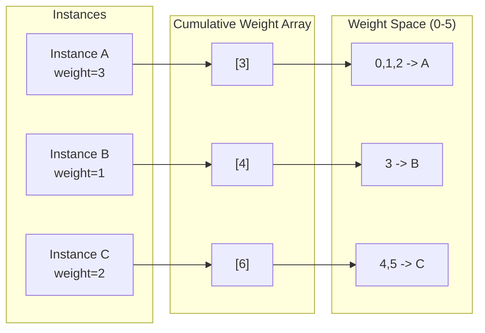
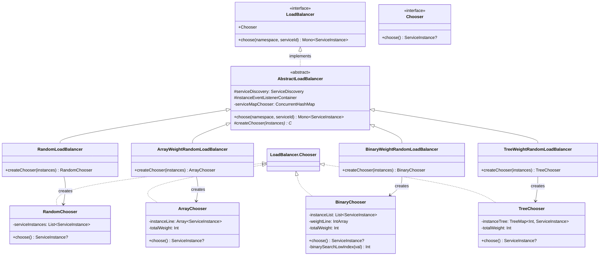
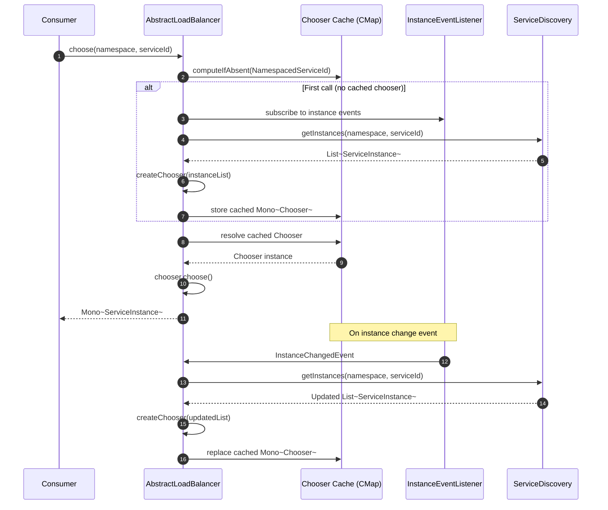

# Load Balancers

CoSky provides a pluggable load balancer framework that distributes traffic across the available instances of a service. Four implementations are available, ranging from simple random selection to weighted random algorithms with O(log n) selection time. All implementations are event-driven: when instance data changes via PubSub, the chooser is rebuilt automatically without blocking requests.

| Aspect | Detail |
|---|---|
| **Interface** | `LoadBalancer` |
| **Base Class** | `AbstractLoadBalancer` |
| **Implementations** | Random, ArrayWeightRandom, BinaryWeightRandom, TreeWeightRandom |
| **Event-Driven Updates** | Listens to `InstanceChangedEvent` via PubSub |
| **Concurrency Model** | Reactive (`Mono<ServiceInstance>`) |
| **Thread Safety** | `ConcurrentHashMap` + cached `Mono` for choosers |

## LoadBalancer Interface

The [`LoadBalancer`](https://github.com/Ahoo-Wang/CoSky/blob/main/cosky-discovery/src/main/kotlin/me/ahoo/cosky/discovery/loadbalancer/LoadBalancer.kt) interface defines a single operation and an inner `Chooser` functional interface:

```kotlin
interface LoadBalancer {
    fun choose(namespace: String, serviceId: String): Mono<ServiceInstance>

    fun interface Chooser {
        fun choose(): ServiceInstance?
    }
}
```

The `choose` method returns a `Mono<ServiceInstance>` because it may need to fetch instances from discovery on the first call. Subsequent calls for the same service hit a cached chooser.

## AbstractLoadBalancer

[`AbstractLoadBalancer`](https://github.com/Ahoo-Wang/CoSky/blob/main/cosky-discovery/src/main/kotlin/me/ahoo/cosky/discovery/loadbalancer/AbstractLoadBalancer.kt) is the shared base class for all four implementations. It manages a `ConcurrentHashMap<NamespacedServiceId, Mono<C>>` that maps each service to a cached chooser:

1. **On first access** (`computeIfAbsent`), it subscribes to instance change events and fetches instances from `ServiceDiscovery` ([AbstractLoadBalancer.kt:34](https://github.com/Ahoo-Wang/CoSky/blob/main/cosky-discovery/src/main/kotlin/me/ahoo/cosky/discovery/loadbalancer/AbstractLoadBalancer.kt#L34)).
2. **On instance change**, the chooser `Mono` is replaced with a fresh one built from the updated instance list ([AbstractLoadBalancer.kt:40](https://github.com/Ahoo-Wang/CoSky/blob/main/cosky-discovery/src/main/kotlin/me/ahoo/cosky/discovery/loadbalancer/AbstractLoadBalancer.kt#L40)).
3. **On `choose`**, the cached `Mono<C>` is resolved and `choose()` is called on the chooser instance.

Subclasses implement `createChooser(serviceInstances: List<ServiceInstance>): C` to define their selection algorithm.

## Implementation Comparison

| Implementation | Algorithm | Time Complexity | Space Complexity | Best For |
|---|---|---|---|---|
| `RandomLoadBalancer` | Uniform random | O(1) | O(n) | Equal-weight instances |
| `ArrayWeightRandomLoadBalancer` | Array-based weighted random | O(n) build, O(1) choose | O(totalWeight) | Small instance counts with varied weights |
| `BinaryWeightRandomLoadBalancer` | Cumulative weight + binary search | O(n) build, O(log n) choose | O(n) | Large instance counts with varied weights |
| `TreeWeightRandomLoadBalancer` | TreeMap tail map lookup | O(n) build, O(log n) choose | O(n) | Large instance counts, red-black tree variant |

### RandomLoadBalancer

[`RandomLoadBalancer`](https://github.com/Ahoo-Wang/CoSky/blob/main/cosky-discovery/src/main/kotlin/me/ahoo/cosky/discovery/loadbalancer/RandomLoadBalancer.kt) selects an instance uniformly at random from the list using `ThreadLocalRandom`. It ignores the `weight` field entirely:

```kotlin
val randomIdx = ThreadLocalRandom.current().nextInt(serviceInstances.size)
return serviceInstances[randomIdx]
```

### ArrayWeightRandomLoadBalancer

[`ArrayWeightRandomLoadBalancer`](https://github.com/Ahoo-Wang/CoSky/blob/main/cosky-discovery/src/main/kotlin/me/ahoo/cosky/discovery/loadbalancer/ArrayWeightRandomLoadBalancer.kt) expands each instance into a contiguous range in an array, where the range length equals the instance's weight. Selection is O(1) but the array size equals the sum of all weights:

```
Instances: [A(w=3), B(w=1), C(w=2)]
Array:     [A, A, A, B, C, C]
Random(0..5) -> index into array
```

### BinaryWeightRandomLoadBalancer

[`BinaryWeightRandomLoadBalancer`](https://github.com/Ahoo-Wang/CoSky/blob/main/cosky-discovery/src/main/kotlin/me/ahoo/cosky/discovery/loadbalancer/BinaryWeightRandomLoadBalancer.kt) builds a cumulative weight array and uses binary search for O(log n) selection:

```
Instances: [A(w=3), B(w=1), C(w=2)]
Cumulative: [3, 4, 6]
Random(1..6) -> binary search to find first index where cumulative >= random
```

The key algorithm in `binarySearchLowIndex` ([BinaryWeightRandomLoadBalancer.kt:86](https://github.com/Ahoo-Wang/CoSky/blob/main/cosky-discovery/src/main/kotlin/me/ahoo/cosky/discovery/loadbalancer/BinaryWeightRandomLoadBalancer.kt#L86)):

```
function binarySearchLowIndex(randomValue):
    idx = Arrays.binarySearch(weightLine, randomValue)
    if idx < 0:
        idx = -idx - 1  // insertion point gives the correct bucket
    return idx
```

### TreeWeightRandomLoadBalancer

[`TreeWeightRandomLoadBalancer`](https://github.com/Ahoo-Wang/CoSky/blob/main/cosky-discovery/src/main/kotlin/me/ahoo/cosky/discovery/loadbalancer/TreeWeightRandomLoadBalancer.kt) uses a `TreeMap<Integer, ServiceInstance>` where keys are cumulative weights. Selection uses `tailMap(randomVal, false).firstEntry()`:

```
Instances: [A(w=3), B(w=1), C(w=2)]
TreeMap: {3=A, 4=B, 6=C}
Random(0..5) -> tailMap(random, false).firstEntry()
```

## Weight Distribution Diagram



<!-- Sources: cosky-discovery/src/main/kotlin/me/ahoo/cosky/discovery/loadbalancer/BinaryWeightRandomLoadBalancer.kt:41, cosky-discovery/src/main/kotlin/me/ahoo/cosky/discovery/loadbalancer/TreeWeightRandomLoadBalancer.kt:41 -->

## Class Diagram



<!-- Sources: cosky-discovery/src/main/kotlin/me/ahoo/cosky/discovery/loadbalancer/LoadBalancer.kt:23, cosky-discovery/src/main/kotlin/me/ahoo/cosky/discovery/loadbalancer/AbstractLoadBalancer.kt:27, cosky-discovery/src/main/kotlin/me/ahoo/cosky/discovery/loadbalancer/RandomLoadBalancer.kt:26, cosky-discovery/src/main/kotlin/me/ahoo/cosky/discovery/loadbalancer/ArrayWeightRandomLoadBalancer.kt:27, cosky-discovery/src/main/kotlin/me/ahoo/cosky/discovery/loadbalancer/BinaryWeightRandomLoadBalancer.kt:28, cosky-discovery/src/main/kotlin/me/ahoo/cosky/discovery/loadbalancer/TreeWeightRandomLoadBalancer.kt:28 -->

## Sequence Diagram: Choose Instance Flow



<!-- Sources: cosky-discovery/src/main/kotlin/me/ahoo/cosky/discovery/loadbalancer/AbstractLoadBalancer.kt:34, cosky-discovery/src/main/kotlin/me/ahoo/cosky/discovery/loadbalancer/AbstractLoadBalancer.kt:55 -->

## Performance Characteristics

| Metric | Random | ArrayWeight | BinaryWeight | TreeWeight |
|---|---|---|---|---|
| **Selection Time** | O(1) | O(1) | O(log n) | O(log n) |
| **Build Time** | O(1) | O(W) | O(n) | O(n log n) |
| **Space** | O(n) | O(W) | O(n) | O(n) |
| **Weight Granularity** | None | Full | Full | Full |
| **Large n (1000+)** | Excellent | Poor if W is large | Excellent | Excellent |
| **Memory Efficiency** | High | Low if W is large | High | High |

Where **n** = number of instances, **W** = sum of all weights.

## Configuration

Instance weight is set through the `ServiceInstance` data model. By default, all instances have a weight of `1` ([ServiceInstance.kt:25](https://github.com/Ahoo-Wang/CoSky/blob/main/cosky-discovery/src/main/kotlin/me/ahoo/cosky/discovery/ServiceInstance.kt#L25)). Weight can be configured via metadata when registering an instance:

```kotlin
val instance = Instance.asInstance(
    serviceId = "order-service",
    schema = "http",
    host = "10.0.1.5",
    port = 8080
).asServiceInstance(
    weight = 5,  // 5x more traffic than weight=1 instances
    metadata = mapOf("version" to "v2")
)

serviceRegistry.register(instance = instance).block()
```

The weight is stored in the Redis hash under the `weight` field and decoded by `ServiceInstanceCodec` ([ServiceInstanceCodec.kt:32](https://github.com/Ahoo-Wang/CoSky/blob/main/cosky-discovery/src/main/kotlin/me/ahoo/cosky/discovery/ServiceInstanceCodec.kt#L32)).

## Related Pages

- [Service Registry](./service-registry) -- How instances are registered with weight metadata
- [Service Discovery](./service-discovery) -- How instances are discovered for load balancing
- [Service Topology](./service-topology) -- How service dependencies are visualized

## References

- [LoadBalancer.kt](https://github.com/Ahoo-Wang/CoSky/blob/main/cosky-discovery/src/main/kotlin/me/ahoo/cosky/discovery/loadbalancer/LoadBalancer.kt)
- [AbstractLoadBalancer.kt](https://github.com/Ahoo-Wang/CoSky/blob/main/cosky-discovery/src/main/kotlin/me/ahoo/cosky/discovery/loadbalancer/AbstractLoadBalancer.kt)
- [RandomLoadBalancer.kt](https://github.com/Ahoo-Wang/CoSky/blob/main/cosky-discovery/src/main/kotlin/me/ahoo/cosky/discovery/loadbalancer/RandomLoadBalancer.kt)
- [ArrayWeightRandomLoadBalancer.kt](https://github.com/Ahoo-Wang/CoSky/blob/main/cosky-discovery/src/main/kotlin/me/ahoo/cosky/discovery/loadbalancer/ArrayWeightRandomLoadBalancer.kt)
- [BinaryWeightRandomLoadBalancer.kt](https://github.com/Ahoo-Wang/CoSky/blob/main/cosky-discovery/src/main/kotlin/me/ahoo/cosky/discovery/loadbalancer/BinaryWeightRandomLoadBalancer.kt)
- [TreeWeightRandomLoadBalancer.kt](https://github.com/Ahoo-Wang/CoSky/blob/main/cosky-discovery/src/main/kotlin/me/ahoo/cosky/discovery/loadbalancer/TreeWeightRandomLoadBalancer.kt)
- [ServiceInstance.kt](https://github.com/Ahoo-Wang/CoSky/blob/main/cosky-discovery/src/main/kotlin/me/ahoo/cosky/discovery/ServiceInstance.kt)
- [ServiceInstanceCodec.kt](https://github.com/Ahoo-Wang/CoSky/blob/main/cosky-discovery/src/main/kotlin/me/ahoo/cosky/discovery/ServiceInstanceCodec.kt)
- [InstanceChangedEvent.kt](https://github.com/Ahoo-Wang/CoSky/blob/main/cosky-discovery/src/main/kotlin/me/ahoo/cosky/discovery/InstanceChangedEvent.kt)
