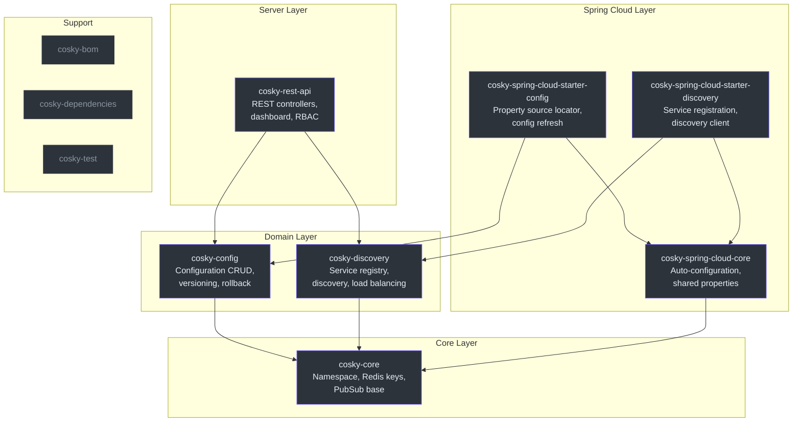
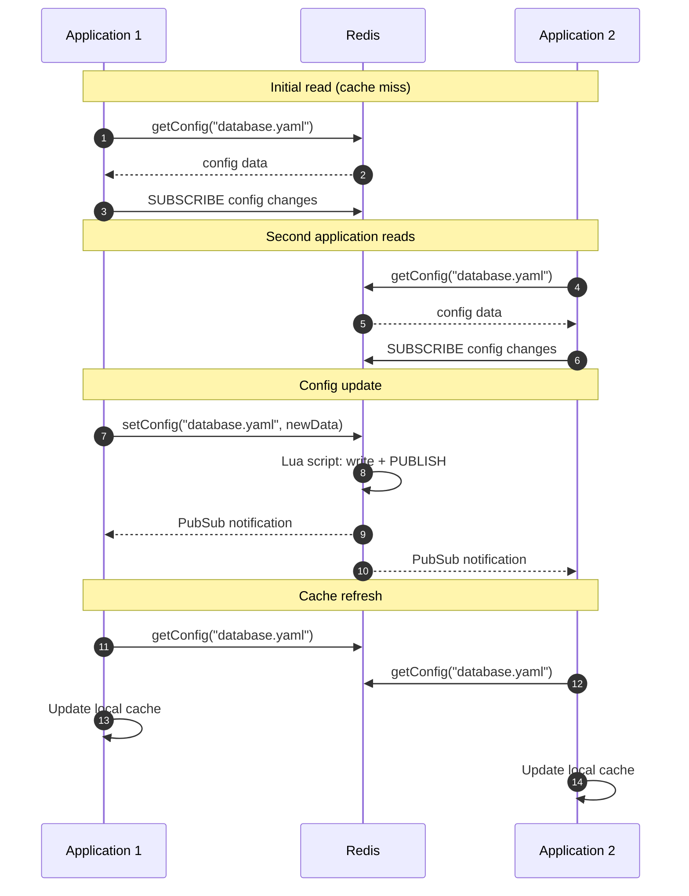
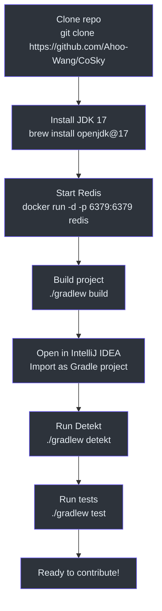

# Contributor Onboarding Guide

Welcome to CoSky. This guide will take you from zero to productive contributor. You are expected to know Kotlin or Java, be comfortable with Spring Boot, and have a basic understanding of Redis. Everything else you will learn here.

## Part I — Foundations

### What is CoSky?

CoSky is a high-performance microservice governance platform that provides **service discovery** and **configuration management**, backed entirely by Redis. Instead of deploying a separate coordination server (like etcd, Consul, or ZooKeeper), CoSky turns your existing Redis infrastructure into a service mesh control plane.

The name comes from **Co** (configuration) + **Sky** (service discovery). The project is open-source under Apache 2.0.

- Repository: [https://github.com/Ahoo-Wang/CoSky](https://github.com/Ahoo-Wang/CoSky)
- Group ID: `me.ahoo.cosky`
- Current version: 5.6.0

### Tech Stack

| Layer | Technology |
|-------|-----------|
| Language | Kotlin (JVM 17 toolchain) |
| Framework | Spring Boot 4.x, Spring Cloud |
| Reactive | Project Reactor (`Mono`/`Flux`) |
| Storage | Redis (via `ReactiveStringRedisTemplate`) |
| Atomicity | Lua scripts for all mutations |
| Build | Gradle (Kotlin DSL) |
| Testing | JUnit 5, MockK, FluentAssert |
| Code Style | Detekt |
| Benchmarks | JMH (Java Microbenchmark Harness) |

### Building the Project

```bash
# Clone the repository
git clone https://github.com/Ahoo-Wang/CoSky.git
cd CoSky

# Build everything (compile + test)
./gradlew build

# Build without tests (faster for development)
./gradlew build -x test

# Check code style
./gradlew detekt

# Run specific module tests
./gradlew :cosky-config:test
./gradlew :cosky-discovery:test

# Run the REST API server locally
./gradlew :cosky-rest-api:bootRun

# Run benchmarks
./gradlew :cosky-config:jmh
./gradlew :cosky-discovery:jmh
```

### Redis Requirement

Integration tests require a running Redis instance. The test base class `AbstractReactiveRedisTest` connects to `localhost:6379` by default. Start Redis before running tests:

```bash
# Docker
docker run -d -p 6379:6379 redis:latest

# Or via Homebrew
brew services start redis
```

## Part II — Architecture and Domain

### Module Structure

CoSky is organized as a multi-module Gradle project. Understanding the dependency graph is essential before making changes.



| Module | Purpose | Key Interfaces |
|--------|---------|----------------|
| `cosky-core` | Namespace management, Redis key utilities, PubSub event base | `NamespaceService`, `EventListenerContainer`, `Namespaced` |
| `cosky-config` | Configuration CRUD, versioning, rollback, consistency caching | `ConfigService`, `ConfigRollback` |
| `cosky-discovery` | Service registry, discovery, load balancing, topology | `ServiceRegistry`, `ServiceDiscovery`, `LoadBalancer` |
| `cosky-spring-cloud-core` | Shared Spring Boot auto-configuration | `CoSkyProperties`, `CoSkyAutoConfiguration` |
| `cosky-spring-cloud-starter-config` | Spring Cloud config loading and refresh | `CoSkyPropertySourceLocator`, `CoSkyConfigRefresher` |
| `cosky-spring-cloud-starter-discovery` | Spring Cloud service registration and discovery | `CoSkyDiscoveryClient`, `CoSkyAutoServiceRegistration` |
| `cosky-rest-api` | REST API server, dashboard, security, RBAC | `ServiceController`, `ConfigController` |
| `cosky-bom` | Bill of Materials for dependency management | — |
| `cosky-test` | Shared test utilities, Lua cleanup scripts | `AbstractReactiveRedisTest` |

**Critical rule**: `cosky-core` has zero dependencies on other CoSky modules. The dependency graph must remain acyclic.

### The Consistency Pattern: Local Cache + PubSub Invalidation

This is the most important architectural concept in CoSky. Read this carefully.

CoSky achieves extreme read performance by combining:

1. **Local in-process cache** — data is stored in `ConcurrentHashMap` inside each application process. Reads hit this cache at nanosecond speed.
2. **Redis PubSub** — when data changes in Redis, a PubSub message notifies all subscribers to invalidate or refresh their local cache.
3. **Lazy subscription** — the cache entry is created on first access and automatically subscribes to PubSub events for that key.



The consistency wrappers are:
- **Config**: `RedisConsistencyConfigService` wraps `RedisConfigService` — cited at [cosky-config/src/main/kotlin/me/ahoo/cosky/config/redis/RedisConsistencyConfigService.kt:33](https://github.com/Ahoo-Wang/CoSky/blob/main/cosky-config/src/main/kotlin/me/ahoo/cosky/config/redis/RedisConsistencyConfigService.kt#L33)
- **Discovery**: `ConsistencyRedisServiceDiscovery` wraps `RedisServiceDiscovery` — cited at [cosky-discovery/src/main/kotlin/me/ahoo/cosky/discovery/redis/ConsistencyRedisServiceDiscovery.kt:43](https://github.com/Ahoo-Wang/CoSky/blob/main/cosky-discovery/src/main/kotlin/me/ahoo/cosky/discovery/redis/ConsistencyRedisServiceDiscovery.kt#L43)

The performance gain is dramatic:

| Operation | Direct Redis | With Consistency Layer |
|-----------|-------------|----------------------|
| `getConfig` | ~241K ops/s | **~257M ops/s** (1000x faster) |
| `getInstances` | ~227K ops/s | **~77M ops/s** (340x faster) |
| `getServices` | ~305K ops/s | **~456M ops/s** (1500x faster) |

### Redis Key Schema

All Redis keys are **namespace-scoped**. The namespace acts as a tenant delimiter and is wrapped in Redis hash tags `{...}` for cluster-mode compatibility.

**Configuration keys** ([ConfigKeyGenerator](https://github.com/Ahoo-Wang/CoSky/blob/main/cosky-config/src/main/kotlin/me/ahoo/cosky/config/ConfigKeyGenerator.kt)):

| Purpose | Key Pattern | Redis Type |
|---------|-------------|------------|
| Config index | `{namespace}:cfg_idx` | SET |
| Current config | `{namespace}:cfg:{configId}` | HASH |
| History index | `{namespace}:cfg_htr_idx:{configId}` | ZSET |
| History version | `{namespace}:cfg_htr:{configId}:{version}` | HASH |

**Discovery keys** ([DiscoveryKeyGenerator](https://github.com/Ahoo-Wang/CoSky/blob/main/cosky-discovery/src/main/kotlin/me/ahoo/cosky/discovery/DiscoveryKeyGenerator.kt)):

| Purpose | Key Pattern | Redis Type |
|---------|-------------|------------|
| Service index | `{namespace}:svc_idx` | SET |
| Service stats | `{namespace}:svc_stat` | HASH |
| Instance index | `{namespace}:svc_itc_idx:{serviceId}` | SET |
| Instance data | `{namespace}:svc_itc:{instanceId}` | HASH |

**Why hash tags?** Redis Cluster routes keys to slots based on the text between `{` and `}`. Wrapping the namespace ensures all keys for a namespace land on the same shard, enabling atomic cross-key operations via Lua scripts. See [cosky-core/src/main/kotlin/me/ahoo/cosky/core/util/RedisKeys.kt:24](https://github.com/Ahoo-Wang/CoSky/blob/main/cosky-core/src/main/kotlin/me/ahoo/cosky/core/util/RedisKeys.kt#L24).

### Lua Scripts for Atomic Operations

All write operations execute as Lua scripts inside Redis. This guarantees atomicity — no client can observe a partially-completed state. There are **no multi-command transactions** in the codebase; everything is a single Lua script call.

Key Lua scripts:

| Script | Module | Purpose |
|--------|--------|---------|
| `config_set.lua` | cosky-config | Atomic set + version + history + publish |
| `config_remove.lua` | cosky-config | Atomic remove + history + publish |
| `config_rollback.lua` | cosky-config | Atomic rollback to target version + publish |
| `registry_register.lua` | cosky-discovery | Atomic register instance + set TTL + publish |
| `registry_deregister.lua` | cosky-discovery | Atomic deregister + delete key + publish |
| `registry_renew.lua` | cosky-discovery | Heart beat renewal with throttled publish |
| `discovery_get_instances.lua` | cosky-discovery | Read instances + lazy expire dead ones |

Each Lua script follows the same pattern:
1. Read current state
2. Check preconditions (e.g., hash comparison to skip no-op writes)
3. Perform mutations
4. `PUBLISH` a notification to the key's channel
5. Return a status code

The throttled publish in `registry_renew.lua` is particularly interesting — it only publishes a `renew` event when the previous TTL publication is about to expire, reducing PubSub traffic by an order of magnitude. See [cosky-discovery/src/main/resources/registry_renew.lua:8](https://github.com/Ahoo-Wang/CoSky/blob/main/cosky-discovery/src/main/resources/registry_renew.lua#L8).

### The Event Model

CoSky uses Redis PubSub to propagate state changes. Events are string-based op codes published to Redis channels that map directly to key names.

**Config events** ([ConfigChangedEvent](https://github.com/Ahoo-Wang/CoSky/blob/main/cosky-config/src/main/kotlin/me/ahoo/cosky/config/ConfigChangedEvent.kt)):

| Event | Trigger | Op Code |
|-------|---------|---------|
| `SET` | Config created or updated | `"set"` |
| `REMOVE` | Config deleted | `"remove"` |
| `ROLLBACK` | Config rolled back to previous version | `"rollback"` |

**Instance events** ([InstanceChangedEvent](https://github.com/Ahoo-Wang/CoSky/blob/main/cosky-discovery/src/main/kotlin/me/ahoo/cosky/discovery/InstanceChangedEvent.kt)):

| Event | Trigger | Op Code |
|-------|---------|---------|
| `REGISTER` | New instance registered | `"register"` |
| `DEREGISTER` | Instance explicitly removed | `"deregister"` |
| `EXPIRED` | Instance TTL expired (lazy cleanup) | `"expired"` |
| `RENEW` | Instance heartbeat renewed TTL | `"renew"` |
| `SET_METADATA` | Instance metadata updated | `"set_metadata"` |

## Part III — Contributing

### Development Environment Setup



<!-- Sources: build.gradle.kts:92, AGENTS.md -->

Prerequisites:
- **JDK 17** — required by the JVM toolchain configuration in `build.gradle.kts`
- **Redis** — required for integration tests
- **IntelliJ IDEA** — recommended (Kotlin support is first-class)

### Running Tests

```bash
# Run all tests across all modules
./gradlew test

# Run tests for a specific module
./gradlew :cosky-core:test
./gradlew :cosky-config:test
./gradlew :cosky-discovery:test

# Run a single test class
./gradlew :cosky-config:test --tests "me.ahoo.cosky.config.redis.RedisConfigServiceTest"

# Run tests with verbose output
./gradlew :cosky-config:test --info
```

All test classes use JUnit 5 and the `me.ahoo.test:fluent-assert-core` library for assertions. When writing tests, always use:

```kotlin
import me.ahoo.test.asserts.assert

// Correct:
actual.assert().isEqualTo(expected)

// Do NOT use AssertJ's assertThat() — it is verbose and not null-safe in Kotlin
```

### Code Style

CoSky uses **Detekt** for static analysis with auto-correct enabled:

```bash
# Check for style violations
./gradlew detekt

# Detekt auto-correct is enabled by default in build.gradle.kts
# It will fix formatting issues automatically during build
```

Key style rules:
- All source files must have an **Apache 2.0 license header**
- Compiler flags: `-Xjsr305=strict`, `-Xjvm-default=all-compatibility`
- All core APIs return `Mono` or `Flux` (Project Reactor)
- All Redis mutations go through Lua scripts — never use multi-command sequences

### PR Process

1. **Fork** the repository (or create a branch if you have push access)
2. **Create a feature branch** from `main`: `git checkout -b feature/my-feature`
3. **Write tests first** — all new features and bug fixes must have tests
4. **Run the full build**: `./gradlew build detekt`
5. **Commit** with a descriptive message
6. **Open a Pull Request** against `main`
7. CI will run integration tests, benchmarks, code coverage, and Detekt checks

### What to Contribute

Good first issues:
- **New load balancer strategies** — implement the `LoadBalancer` interface
- **Dashboard improvements** — the `dashboard/` directory contains a React 19 frontend
- **Documentation** — the `wiki/` directory contains the VitePress documentation site
- **Test coverage** — look for uncovered code paths in the Jacoco reports

Areas requiring careful review (discuss before changing):
- **Lua scripts** — they enforce critical consistency invariants
- **Redis key schema** — changes break backward compatibility
- **Consistency layer wrappers** — they are the performance foundation

### Key Files Reference

The table below lists the most important source files. Bookmark these — you will reference them frequently.

| File | Purpose |
|------|---------|
| [cosky-core/.../CoSky.kt](https://github.com/Ahoo-Wang/CoSky/blob/main/cosky-core/src/main/kotlin/me/ahoo/cosky/core/CoSky.kt) | Brand constants and key separator |
| [cosky-core/.../Namespaced.kt](https://github.com/Ahoo-Wang/CoSky/blob/main/cosky-core/src/main/kotlin/me/ahoo/cosky/core/Namespaced.kt) | Namespace defaults and system namespace |
| [cosky-core/.../RedisKeys.kt](https://github.com/Ahoo-Wang/CoSky/blob/main/cosky-core/src/main/kotlin/me/ahoo/cosky/core/util/RedisKeys.kt) | Hash tag wrapping for Redis Cluster |
| [cosky-config/.../ConfigKeyGenerator.kt](https://github.com/Ahoo-Wang/CoSky/blob/main/cosky-config/src/main/kotlin/me/ahoo/cosky/config/ConfigKeyGenerator.kt) | Config Redis key patterns |
| [cosky-config/.../ConfigService.kt](https://github.com/Ahoo-Wang/CoSky/blob/main/cosky-config/src/main/kotlin/me/ahoo/cosky/config/ConfigService.kt) | Config service interface |
| [cosky-config/.../RedisConfigService.kt](https://github.com/Ahoo-Wang/CoSky/blob/main/cosky-config/src/main/kotlin/me/ahoo/cosky/config/redis/RedisConfigService.kt) | Config Redis implementation |
| [cosky-config/.../RedisConsistencyConfigService.kt](https://github.com/Ahoo-Wang/CoSky/blob/main/cosky-config/src/main/kotlin/me/ahoo/cosky/config/redis/RedisConsistencyConfigService.kt) | Config consistency wrapper |
| [cosky-config/src/main/resources/config_set.lua](https://github.com/Ahoo-Wang/CoSky/blob/main/cosky-config/src/main/resources/config_set.lua) | Atomic config set + version + history |
| [cosky-discovery/.../DiscoveryKeyGenerator.kt](https://github.com/Ahoo-Wang/CoSky/blob/main/cosky-discovery/src/main/kotlin/me/ahoo/cosky/discovery/DiscoveryKeyGenerator.kt) | Discovery Redis key patterns |
| [cosky-discovery/.../ServiceRegistry.kt](https://github.com/Ahoo-Wang/CoSky/blob/main/cosky-discovery/src/main/kotlin/me/ahoo/cosky/discovery/ServiceRegistry.kt) | Registry interface |
| [cosky-discovery/.../ServiceDiscovery.kt](https://github.com/Ahoo-Wang/CoSky/blob/main/cosky-discovery/src/main/kotlin/me/ahoo/cosky/discovery/ServiceDiscovery.kt) | Discovery interface |
| [cosky-discovery/.../ConsistencyRedisServiceDiscovery.kt](https://github.com/Ahoo-Wang/CoSky/blob/main/cosky-discovery/src/main/kotlin/me/ahoo/cosky/discovery/redis/ConsistencyRedisServiceDiscovery.kt) | Discovery consistency wrapper |
| [cosky-discovery/.../RedisServiceRegistry.kt](https://github.com/Ahoo-Wang/CoSky/blob/main/cosky-discovery/src/main/kotlin/me/ahoo/cosky/discovery/redis/RedisServiceRegistry.kt) | Registry Redis implementation |
| [cosky-discovery/src/main/resources/registry_register.lua](https://github.com/Ahoo-Wang/CoSky/blob/main/cosky-discovery/src/main/resources/registry_register.lua) | Atomic instance registration |
| [cosky-discovery/src/main/resources/registry_renew.lua](https://github.com/Ahoo-Wang/CoSky/blob/main/cosky-discovery/src/main/resources/registry_renew.lua) | Heartbeat renewal with throttled PubSub |
| [cosky-rest-api/.../ServiceController.kt](https://github.com/Ahoo-Wang/CoSky/blob/main/cosky-rest-api/src/main/kotlin/me/ahoo/cosky/rest/service/ServiceController.kt) | Service REST endpoints |
| [build.gradle.kts](https://github.com/Ahoo-Wang/CoSky/blob/main/build.gradle.kts) | Root build configuration |
| [settings.gradle.kts](https://github.com/Ahoo-Wang/CoSky/blob/main/settings.gradle.kts) | Module declarations |

### Contributor Workflow Diagram

```mermaid
flowchart LR
    subgraph "Local Development"
        BRANCH["Create branch"] --> CODE["Write code + tests"]
        CODE --> DETEKT_LOCAL["Run detekt"]
        DETEKT_local --> BUILD_LOCAL["Run build"]
        BUILD_LOCAL --> COMMIT["Commit"]
    end

    subgraph "Pull Request"
        COMMIT --> PUSH["Push to GitHub"]
        PUSH --> PR["Open PR"]
    end

    subgraph "CI Pipeline"
        PR --> CI_TEST["Integration tests"]
        CI_TEST --> CI_DETEKT["Detekt check"]
        CI_DETEKT --> CI_COVERAGE["Code coverage"]
        CI_COVERAGE --> CI_BENCH["JMH benchmarks"]
    end

    CI_BENCH --> REVIEW["Code review"]
    REVIEW --> MERGE["Merge to main"]

    style BRANCH fill:#2d333b,stroke:#6d5dfc,color:#e6edf3
    style CODE fill:#2d333b,stroke:#6d5dfc,color:#e6edf3
    style DETEKT_local fill:#2d333b,stroke:#6d5dfc,color:#e6edf3
    style BUILD_LOCAL fill:#2d333b,stroke:#6d5dfc,color:#e6edf3
    style COMMIT fill:#2d333b,stroke:#6d5dfc,color:#e6edf3
    style PUSH fill:#2d333b,stroke:#6d5dfc,color:#e6edf3
    style PR fill:#2d333b,stroke:#6d5dfc,color:#e6edf3
    style CI_TEST fill:#2d333b,stroke:#6d5dfc,color:#e6edf3
    style CI_DETEKT fill:#2d333b,stroke:#6d5dfc,color:#e6edf3
    style CI_COVERAGE fill:#2d333b,stroke:#6d5dfc,color:#e6edf3
    style CI_BENCH fill:#2d333b,stroke:#6d5dfc,color:#e6edf3
    style REVIEW fill:#2d333b,stroke:#6d5dfc,color:#e6edf3
    style MERGE fill:#2d333b,stroke:#6d5dfc,color:#e6edf3
```


