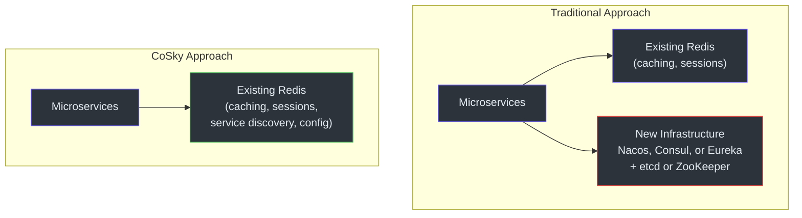

# Executive Onboarding Guide

This document is for VP-level and director-level engineering leaders who need to understand what CoSky is, why the team chose it, how it fits into the technology portfolio, and what the risks are. There is no code in this document.

## What CoSky Does — In One Table

| Capability | What It Means | Business Value |
|-----------|--------------|----------------|
| **Service Discovery** | Microservices find each other dynamically without hardcoded addresses | Enables zero-downtime deployments, auto-scaling, and fault isolation |
| **Service Registration** | New service instances announce themselves automatically | Eliminates manual configuration when scaling up or down |
| **Health Checking** | Unhealthy instances are automatically removed from routing | Prevents traffic from reaching dead or degraded instances |
| **Configuration Management** | Centralized, versioned application settings with real-time updates | Change database passwords or feature flags without redeploying |
| **Config Versioning and Rollback** | Every config change is recorded with full history | Instant rollback of bad configuration changes |
| **Load Balancing** | Weighted, randomized traffic distribution across instances | Control traffic distribution without external load balancers |
| **Namespace Isolation** | Multi-tenant environment with scoped configurations and services | Development, staging, and production environments share one Redis |
| **RBAC and Audit Logging** | Role-based access control with full audit trail | Compliance-ready access management |
| **Service Topology** | Visual map of which services call which other services | Dependency visualization for incident response and architecture reviews |
| **Dashboard** | Web-based management interface for all operations | Self-service for operations teams, reducing engineering bottlenecks |

## Technology Investment Thesis

### The Core Proposition

CoSky leverages your existing Redis infrastructure to provide service discovery and configuration management. This is a fundamentally different investment model from deploying a dedicated service mesh control plane.



### Why This Matters

1. **No new infrastructure to operate.** Redis is already in your stack. Your team already knows how to deploy, monitor, scale, and debug Redis. Adding CoSky does not introduce a new operational domain.

2. **No new failure domain.** Every additional piece of infrastructure is a new potential point of failure. By reusing Redis, CoSky avoids adding one.

3. **Lower total cost of ownership.** No additional servers, no additional monitoring, no additional on-call rotation. The cost is effectively zero if you already run Redis.

4. **Extreme performance.** CoSky reads hit a local in-process cache at nanosecond speed. Writes execute as Lua scripts inside Redis at ~240K ops/s. The consistency layer delivers ~250M reads/s for config and ~77M reads/s for service instances. These numbers make Redis the bottleneck only under extreme write-heavy workloads.

## Cost Model Comparison

| Cost Factor | CoSky | Nacos | Consul | Eureka |
|-------------|-------|-------|--------|--------|
| **Infrastructure** | Existing Redis (shared) | 3+ JVM servers + MySQL | 3+ servers (Raft quorum) | 2+ JVM servers |
| **Operational overhead** | Redis only (existing) | Separate cluster + DB | Separate cluster | Separate cluster |
| **Monitoring** | Redis metrics (existing) | New dashboards | New dashboards | New dashboards |
| **On-call expertise** | Redis (existing knowledge) | Nacos-specific | Consul + Raft | Eureka-specific |
| **Network cost** | Minimal (PubSub) | Moderate (HTTP pull) | Moderate (HTTP/gRPC) | Moderate (HTTP replication) |
| **Training** | Spring Cloud standard | Nacos-specific | Consul-specific | Spring Cloud standard |
| **Deployment complexity** | Low (SDK + optional server) | Medium (cluster + DB) | Medium (cluster setup) | Low (Spring Boot app) |

## Scaling Model

CoSky scales through Redis and namespace multi-tenancy.

### Horizontal Scaling via Red```mermaid
flowchart LR
    subgraph "Application Tier"
        A1["App Instance 1"]
        A2["App Instance 2"]
        A3["App Instance N"]
    end

    subgraph "Redis Tier"
        R1["Redis Primary"]
        R2["Redis Replica 1"]
        R3["Redis Replica 2"]
    end

    subgraph "Management"
        DASH["CoSky Dashboard<br>(optional)"]
    end

    A1 --> R1
    A2 --> R1
    A3 --> R1
    R1 --> R2
    R1 --> R3
    DASH --> R1

    style A1 fill:#2d333b,stroke:#6d5dfc,color:#e6edf3
    style A2 fill:#2d333b,stroke:#6d5dfc,color:#e6edf3
    style A3 fill:#2d333b,stroke:#6d5dfc,color:#e6edf3
    style R1 fill:#2d333b,stroke:#3fb950,color:#e6edf3
    style R2 fill:#2d333b,stroke:#30363d,color:#e6edf3
    style R3 fill:#2d333b,stroke:#30363d,color:#e6edf3
    style DASH fill:#2d333b,stroke:#6d5dfc,color:#e6edf3
```
```

- **Application instances** scale independently — each has its own local cache and subscribes to Redis PubSub.
- **Redis** scales via replication for reads and Redis Cluster for sharding across namespaces.
- **No CoSky-specific server** needs to scale. The REST API dashboard is optional and stateless.

### Namespace Multi-Tenancy

Namespaces provide isolation between environments, teams, or business domains:

| Namespace | Purpose | Isolation Level |
|-----------|---------|----------------|
| `cosky-{default}` | Production services | Full config + service isolation |
| `cosky-{staging}` | Staging environment | Full config + service isolation |
| `cosky-{team-alpha}` | Team Alpha's services | Full config + service isolation |

All namespaces share the same Redis instance. Data is separated by key prefix, not by physical database. Hash tags ensure that cross-key operations within a namespace remain atomic in Redis Cluster.

## Risk Assessment

### Technology Risks

| Risk | Severity | Likelihood | Mitigation |
|------|----------|------------|------------|
| **Redis single point of failure** | High | Low | Redis Sentinel or Cluster provides automatic failover. CoSky caches survive brief outages. |
| **PubSub message loss** | Medium | Low | Cache entries auto-expire after 1 minute. Staleness is self-correcting. |
| **Redis memory pressure** | Medium | Medium | Monitor Redis memory. Config history is bounded. Instance data uses TTL-based expiration. |
| **Lua script latency spikes** | Low | Low | Scripts are simple and fast (<1ms). Monitor Redis slowlog. |
| **Network partition** | Medium | Low | Clients serve from local cache. Eventual consistency after partition heals. |

### Operational Risks

| Risk | Severity | Likelihood | Mitigation |
|------|----------|------------|------------|
| **Redis misconfiguration** | High | Medium | Standard Redis ops practices. Dashboard provides health visibility. |
| **Namespace collision** | Medium | Low | Namespace naming conventions and RBAC prevent cross-team interference. |
| **Config change blast radius** | High | Low | Versioning and rollback. RBAC restricts who can modify configs. Audit log tracks all changes. |
| **Accidental Redis key deletion** | High | Low | Redis ACLs. CoSky uses structured key prefixes. Dashboard provides safe management interface. |

### Organizational Risks

| Risk | Severity | Mitigation |
|------|----------|------------|
| **Redis team becomes a bottleneck** | Medium | CoSky is self-service via SDK and dashboard. Redis team only manages infrastructure. |
| **Team resistance to new tool** | Low | CoSky integrates with Spring Cloud standards. Minimal learning curve for Spring Boot teams. |
| **Vendor lock-in to Redis** | Medium | Redis is the most widely deployed key-value store. Switching away from Redis is unlikely. |
| **Skill gap for troubleshooting** | Low | Standard JVM + Redis debugging. No proprietary tooling required. |

## Comparison with Alternatives

| Dimension | CoSky | Nacos | Consul | Eureka | Apollo |
|-----------|-------|-------|--------|--------|--------|
| **CAP Model** | CP + AP | CP + AP | CP | AP | CP + AP |
| **Infrastructure required** | Redis only | Servers + MySQL | Servers (Raft) | Servers | Servers + MySQL |
| **Spring Cloud integration** | Native | Native | Native | Native | Native |
| **Config versioning** | Yes | Yes | Limited | No | Yes |
| **Service topology** | Yes | No | No | No | No |
| **RBAC** | Yes | Yes | Yes (ACL) | No | Yes |
| **Audit logging** | Yes | Limited | No | No | Limited |
| **Read performance** | ~250M ops/s | ~50K ops/s | ~50K ops/s | ~50K ops/s | ~50K ops/s |
| **Write performance** | ~240K ops/s | ~50K ops/s | ~50K ops/s | ~50K ops/s | ~50K ops/s |
| **Operational complexity** | Very Low | High | Medium | Low | High |
| **Dashboard** | Yes | Yes | Yes | Basic | Yes |
| **Cross-registry sync** | Yes (Mirror) | Yes | Yes (WAN) | No | No |

### When to Choose CoSky

- You already run Redis and want to minimize operational overhead
- Your microservices are built on Spring Cloud
- Read-heavy workloads with infrequent writes (typical for config and service discovery)
- You need namespace isolation for multi-environment support
- Performance is a priority and you can tolerate eventual consistency (~5ms window)

### When to Look Elsewhere

- You need strong consistency guarantees (etcd/Consul)
- You are not running Redis and do not plan to
- You need DNS-based service discovery (Consul/CoreDNS)
- You need a full service mesh with sidecar proxies (Istio/Linkerd)

## Service-Level Archit```mermaid
flowchart TB
    subgraph "Development Team"
        DEV["Developer"]
        DEV --> SDK["CoSky SDK<br>(in application)"]
    end

    subgraph "Runtime"
        SDK --> REDIS["Redis"]
        SDK --> REDIS
        SDK --> REDIS

        subgraph "Spring Cloud Apps"
            APP1["Service A<br>+ CoSky SDK"]
            APP2["Service B<br>+ CoSky SDK"]
            APP3["Service C<br>+ CoSky SDK"]
        end

        APP1 --> REDIS
        APP2 --> REDIS
        APP3 --> REDIS
    end

    subgraph "Operations"
        OPS["Ops Team"]
        OPS --> DASH["CoSky Dashboard<br>(optional REST API)"]
        DASH --> REDIS
    end

    subgraph "Spring Cloud Integration"
        LB["Spring Cloud LoadBalancer"]
        APP2 --> LB
        LB --> APP3
    end

    style DEV fill:#2d333b,stroke:#6d5dfc,color:#e6edf3
    style SDK fill:#2d333b,stroke:#6d5dfc,color:#e6edf3
    style REDIS fill:#2d333b,stroke:#3fb950,color:#e6edf3
    style APP1 fill:#2d333b,stroke:#6d5dfc,color:#e6edf3
    style APP2 fill:#2d333b,stroke:#6d5dfc,color:#e6edf3
    style APP3 fill:#2d333b,stroke:#6d5dfc,color:#e6edf3
    style OPS fill:#2d333b,stroke:#6d5dfc,color:#e6edf3
    style DASH fill:#2d333b,stroke:#6d5dfc,color:#e6edf3
    style LB fill:#2d333b,stroke:#6d5dfc,color:#e6edf3
```edf3
```

## Recommendations

1. **Start with a single namespace.** Deploy CoSky in a staging namespace alongside your existing service discovery. Validate behavior before migrating production.

2. **Monitor Redis memory and latency.** CoSky adds a modest memory footprint (proportional to number of services and configs). Redis slowlog is your best friend for write latency.

3. **Establish naming conventions for namespaces.** Prevent namespace collision across teams and environments early.

4. **Enable RBAC and audit logging from day one.** The dashboard supports role-based access at the namespace level. Use it to prevent accidental cross-environment changes.

5. **Plan for Redis high availability.** CoSky's self-healing cache handles brief outages, but a Redis Cluster or Sentinel deployment is recommended for production.

## License and Community

- **License**: Apache License 2.0 — permissive, commercially friendly
- **Repository**: [https://github.com/Ahoo-Wang/CoSky](https://github.com/Ahoo-Wang/CoSky)
- **CI/CD**: GitHub Actions with integration tests, benchmarks, and code coverage
- **Artifacts**: Published to Maven Central under `me.ahoo.cosky`
- **Docker**: Available as `ahoowang/cosky` on Docker Hub
