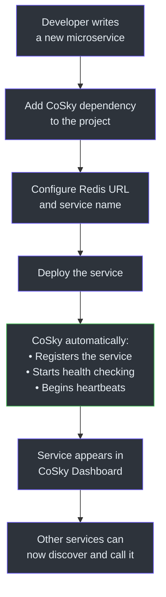
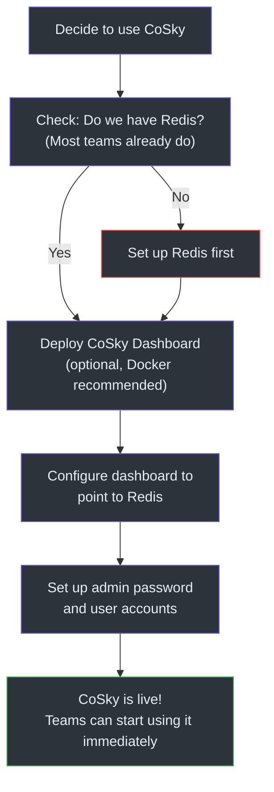
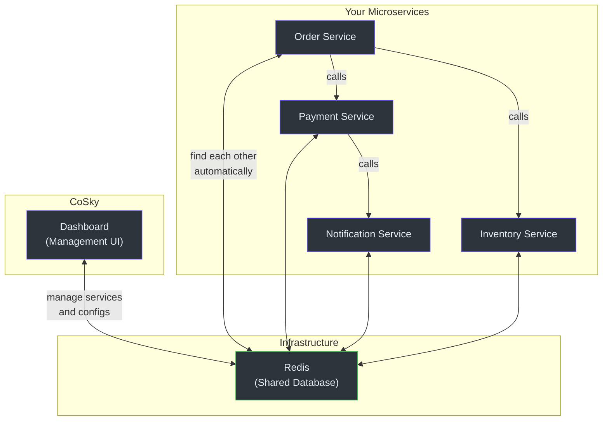

# Product Manager Onboarding Guide

This guide explains CoSky without engineering jargon. If you are a product manager, project manager, or business stakeholder, this is where to start.

## What CoSky Does — In Plain Language

Imagine your company has dozens or hundreds of microservices — small programs that work together to deliver your product. These microservices need two things to function:

1. **A way to find each other** — like a phone book for programs
2. **A way to share settings** — like a shared settings page that updates instantly

CoSky provides both.

### Service Discovery: The Phone Book

When a new instance of a service starts up (say, your payment service scaled up to handle Black Friday traffic), it needs to tell the rest of the system "I am here and ready to receive requests." CoSky handles this automatically.

When another service needs to call the payment service, it asks CoSky "where are the payment services right now?" and CoSky gives it the current list of healthy instances.

If a service instance crashes or becomes unhealthy, CoSky automatically removes it from the list. No manual intervention required.

### Configuration Management: The Settings Page

Every service has settings — database passwords, feature flags, timeout values, API URLs. Without CoSky, changing a setting means redeploying the service. With CoSky, you change the setting in one place and all instances pick it up immediately.

CoSky also keeps a full history of every change, so if someone makes a bad configuration change, you can roll back to any previous version with one click.

## User Journey Maps

### Developer Journey: Registering a Service

What the developer actually does:
1. Add two lines to their build file (Gradle or Maven)
2. Add a small configuration block to their application settings
3. Deploy as normal

Everything else is automatic.

### Operations Journey: Deploying CoSky

Deployment options:
- **Docker** — the fastest option. One command to run the dashboard.
- **Kubernetes** — for teams already using Kubernetes. A standard deployment manifest is provided.
- **Standalone** — download and run as a JAR file.

The dashboard is optional. CoSky works perfectly well as an SDK embedded in your services. The dashboard just provides a convenient management interface.

## Feature Capability Map

| Feature | What the User Sees | How It Works Behind the Scenes |
|---------|-------------------|-------------------------------|
| **Automatic service registration** | Service appears in dashboard after deployment | CoSky SDK registers the service with Redis on startup |
| **Health-based deregistration** | Unhealthy instances disappear from the service list | Instances send regular heartbeats. If heartbeat stops, the instance expires automatically |
| **Service discovery** | Services find each other without configuration | CoSky SDK reads the current instance list from Redis and caches it locally |
| **Load balancing** | Traffic spreads evenly across instances | Built-in weighted random load balancing selects instances proportionally |
| **Configuration management** | Change settings without redeploying | Settings stored in Redis, pushed to all instances instantly via PubSub |
| **Config versioning** | Full history of every change | Every change is recorded with version number, timestamp, and content |
| **One-click rollback** | Revert a bad config change instantly | Any previous version can be restored with a single API call or dashboard click |
| **Namespace isolation** | Separate environments (dev/staging/prod) | Namespaces keep data completely isolated within the same Redis instance |
| **Service topology map** | Visual diagram of service dependencies | CoSky tracks which services call which and renders an interactive graph |
| **Role-based access control** | Different users have different permissions | Admin, read-only, and namespace-scoped roles |
| **Audit logging** | Track who changed what and when | Every write operation is logged with user identity and timestamp |
| **Config import** | Migrate from other systems | Import configurations from Nacos and other sources |
| **Dashboard** | Web interface for all operations | React-based UI for managing services, configs, users, and roles |

## System Overview Diagram

## Known Limitations

| Limitation | Impact | Workaround |
|-----------|--------|-----------|
| **Requires Redis** | You must have a Redis instance available | Most organizations already run Redis. If not, it is straightforward to set up. |
| **Eventual consistency** | Changes take a few milliseconds to propagate everywhere | For the vast majority of use cases, this is imperceptible. |
| **No built-in circuit breaking** | CoSky handles discovery, not fault tolerance | Pair with Spring Cloud Resilience4j or similar for circuit breaking. |
| **No DNS-based discovery** | Discovery works through the SDK, not DNS | Use the Spring Cloud integration. DNS discovery is available through Consul if needed. |
| **PubSub messages can be lost** | If a service is disconnected during a config change, it may serve stale data temporarily | Services automatically recover and fetch fresh data. Maximum staleness is about 1 minute. |
| **No built-in distributed tracing** | CoSky does not trace requests across services | Pair with OpenTelemetry or similar for tracing. CoSky provides service topology for dependency mapping. |

## Frequently Asked Questions

### What happens when Redis goes down?

During a Redis outage:
- **Existing services continue to work** — each service has a local cache of service instances and configurations
- **New registrations fail** — new services cannot register until Redis is back
- **Config changes do not propagate** — but services continue using their last-known configuration
- **When Redis recovers**, all services automatically reconnect and resynchronize

For production, use Redis Sentinel or Redis Cluster for automatic failover. Most Redis deployments already have this.

### How is CoSky different from Nacos?

Nacos and CoSky solve the same problems (service discovery + configuration). The key differences:

| Aspect | CoSky | Nacos |
|--------|-------|-------|
| Infrastructure | Uses your existing Redis | Requires its own servers + MySQL database |
| Deployment | Add a dependency to your project | Deploy and operate a separate cluster |
| Performance | Extremely fast reads (local cache) | Fast, but requires network calls for reads |
| Cost | Near-zero additional cost | Cost of servers, database, and operations |
| Best for | Teams that already have Redis | Teams that want an all-in-one solution |

### How is CoSky different from Eureka?

Eureka is a Netflix OSS project for service discovery only. Key differences:

| Aspect | CoSky | Eureka |
|--------|-------|--------|
| Configuration management | Included | Not included |
| Infrastructure | Uses existing Redis | Requires Eureka servers |
| Consistency | Eventual, fast | Eventual, slower propagation |
| Active development | Yes | Minimal (maintenance mode) |

### Can I migrate from Nacos to CoSky?

Yes. CoSky provides a config import feature in the dashboard that can read from Nacos. The CoSky-Mirror component can also synchronize service instances between Nacos and CoSky in real-time, enabling a gradual migration with zero downtime.

### Is CoSky production-ready?

Yes. CoSky has been running in production environments since 2021. It is published to Maven Central, has CI/CD with integration tests, and is licensed under Apache 2.0.

### Does CoSky work with Kubernetes?

Yes. CoSky works alongside Kubernetes service discovery. You can use Kubernetes-native discovery for Kubernetes-internal services and CoSky for hybrid environments where some services run outside Kubernetes. A Kubernetes deployment manifest is provided for the dashboard.

### How many services and instances can CoSky handle?

CoSky is limited by Redis performance, not by its own architecture. A single Redis instance can handle 100,000+ operations per second. Since most operations are reads (served from local cache at 250M+ ops/s), the practical limit is determined by how frequently services register, deregister, and change configuration — which is typically far below Redis capacity.

### What programming languages does CoSky support?

CoSky is a JVM library written in Kotlin. It works with any JVM language (Java, Kotlin, Scala, etc.) and integrates natively with Spring Boot and Spring Cloud. For non-JVM services, the REST API server provides HTTP endpoints for all operations.

### Service Lifecycle Diagram

```mermaid
sequenceDiagram
    autonumber
    participant Dev as Developer
    participant SVC as Service Instance
    participant CoSky as CoSky (Redis)
    participant Others as Other Services

    rect rgb(22, 27, 34)
        Note over Dev,Others: Registration
        Dev->>SVC: Deploy service
        SVC->>CoSky: "I am here!" (register)
        CoSky-->>Others: "New service available" (notification)
    end

    rect rgb(22, 27, 34)
        Note over Dev,Others: Normal Operation
        loop Every 10 seconds
            SVC->>CoSky: "Still alive!" (heartbeat)
        end
        Others->>CoSky: "Where is this service?" (discover)
        CoSky-->>Others: "Here is the list of instances"
    end

    rect rgb(22, 27, 34)
        Note over Dev,Others: Configuration Change
        Dev->>CoSky: Update config via dashboard
        CoSky-->>SVC: "Config changed!" (notification)
        SVC->>CoSky: Fetch new config
        CoSky-->>SVC: New config data
    end

    rect rgb(22, 27, 34)
        Note over Dev,Others: Deregistration
        Dev->>SVC: Shut down service
        SVC->>CoSky: "I am leaving" (deregister)
        CoSky-->>Others: "Service instance removed" (notification)
    end
```

## Glossary

| Term | Definition |
|------|-----------|
| **Service Discovery** | The process by which services automatically find each other without manual configuration |
| **Service Registration** | A service announcing its presence and location to the system |
| **Service Instance** | One running copy of a service. A service can have many instances running simultaneously |
| **Heartbeat** | A periodic signal sent by a service instance to say "I am still alive" |
| **Namespace** | An isolated environment within CoSky, like separate workspaces for different teams or environments |
| **Configuration** | Settings that control how a service behaves (database URLs, feature flags, timeouts) |
| **PubSub** | A messaging pattern where changes are broadcast to all interested parties in real-time |
| **Load Balancing** | Distributing incoming requests across multiple service instances |
| **RBAC** | Role-Based Access Control — restricting what different users can do based on their assigned role |
| **Topology** | A map showing which services depend on which other services |
| **Rollback** | Reverting a configuration change to a previous version |
| **TTL** | Time To Live — how long a service registration remains valid before it needs to be renewed |
| **Dashboard** | A web-based management interface for viewing and managing services and configurations |
