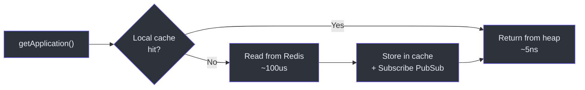
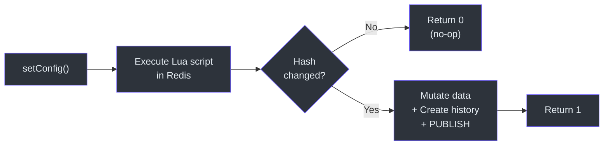
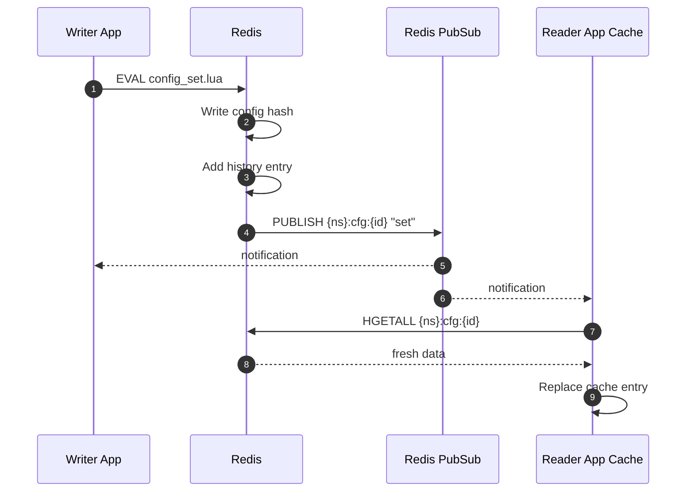
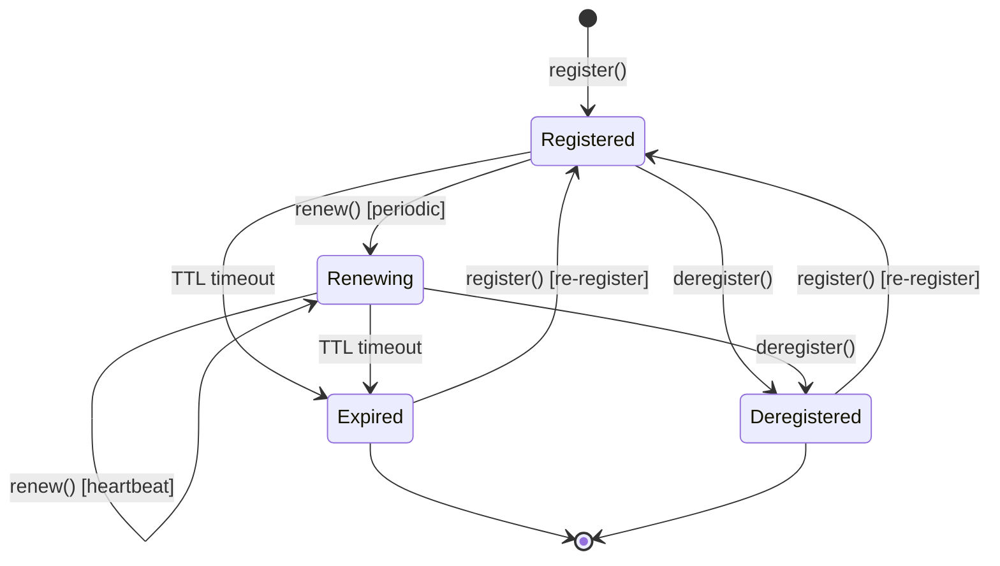

# Staff Engineer Onboarding Guide

This document is written for staff and principal engineers who need to evaluate, extend, or operate CoSky at the architectural level. It is deliberately opinionated. It tells you what the system does, why it does it that way, and where the landmines are.

## The One Core Insight

CoSky turns Redis into a service mesh control plane using three primitives: **Lua scripts** for atomic writes, **PubSub** for change propagation, and **local in-process caching** for read amplification. Everything else follows from that sentence.

The performance model is simple: reads hit a `ConcurrentHashMap` in the JVM heap (nanoseconds), and consistency is maintained by subscribing each cache entry to a Redis PubSub channel that fires on mutation (milliseconds). This gives you ~250M config reads/s and ~456M service list reads/s on a single machine, as measured by JMH.

## Architecture Decision Record: Why Redis

CoSky chose Redis over etcd, Consul, ZooKeeper, or a custom consensus protocol. This was not arbitrary.

| Factor | Redis | etcd / Consul / ZK |
|--------|-------|--------------------|
| Operational footprint | Already deployed in most orgs | New infrastructure to operate |
| Write throughput | ~110K-255K ops/s (single Lua script) | ~10-50K ops/s (Raft consensus) |
| Read throughput (with cache) | ~250M ops/s (local heap) | ~10-50K ops/s (network hop) |
| Consistency model | Eventual (PubSub delay ~1-5ms) | Strong (linearizable via Raft) |
| Operational complexity | Low (single binary, well-understood) | High (Raft quorum, leader election) |
| Client library maturity | Excellent (Spring Data Redis) | Varies |

**The trade-off**: CoSky trades strong consistency for extreme read performance and operational simplicity. If your microservices cannot tolerate eventual consistency with ~5ms staleness, CoSky is not the right tool. For the vast majority of service discovery and configuration use cases, this trade-off is correct.

## The Consistency Model in Depth

CoSky implements a **read-through cache with PubSub invalidation**. This is not cache-aside or write-through. The lifecycle is:

```mermaid
sequenceDiagram
    autonumber
    participant Caller as Calling Code
    participant Cache as ConcurrentHashMap<br>(JVM Heap)
    participant PubSub as Redis PubSub
    participant Redis as Redis Server

    rect rgb(22, 27, 34)
        Note over Caller,Redis: Cold Read (Cache Miss)
        Caller->>Cache: getConfig(ns, id)
        Cache-->>Caller: miss
        Caller->>Redis: HGETALL {ns}:cfg:{id}
        Redis-->>Caller: config data
        Caller->>Cache: store + subscribe to channel
        Caller->>PubSub: SUBSCRIBE {ns}:cfg:{id}
    end

    rect rgb(22, 27, 34)
        Note over Caller,Redis: Hot Read (Cache Hit)
        Caller->>Cache: getConfig(ns, id)
        Cache-->>Caller: cached config (nanoseconds)
    end

    rect rgb(22, 27, 34)
        Note over Caller,Redis: Invalidation (Remote Write)
        PubSub-->>Cache: message: "set"
        Cache->>Redis: HGETALL {ns}:cfg:{id}
        Redis-->>Cache: fresh config data
        Cache->>Cache: replace cached entry
    end
```



### Consistency Pseudocode (Python)

The following pseudocode captures the core pattern shared by both `RedisConsistencyConfigService` and `ConsistencyRedisServiceDiscovery`:

```python
class ConsistencyCache:
    def __init__(self, redis_client):
        self.redis = redis_client
        self.cache = {}  # ConcurrentHashMap equivalent

    def get(self, namespace, key):
        cache_key = (namespace, key)
        if cache_key not in self.cache:
            # Lazy subscription: first access triggers subscribe
            self.redis.subscribe(f"{namespace}:{key}", self._on_change)
            self.cache[cache_key] = self.redis.read(f"{namespace}:{key}")
        return self.cache[cache_key]

    def _on_change(self, channel, message):
        namespace, key = parse_channel(channel)
        cache_key = (namespace, key)
        # Re-fetch from Redis to get latest data
        self.cache[cache_key] = self.redis.read(f"{namespace}:{key}")

    def set(self, namespace, key, value):
        # Lua script: write + PUBLISH atomically
        self.redis.eval(
            "write(key, value); publish(key, 'set')",
            keys=[namespace],
            args=[key, value]
        )
        # Local cache will be updated when PubSub message arrives
```

The critical invariant: **the Lua script always publishes after writing**, and **the subscriber always re-reads from Redis on notification**. There is no "cache update without re-read" — the PubSub message is a signal, not a data carrier.

### Eventual Consistency Window

The staleness window is bounded by:

```
T_stale = T_pubsub_delivery + T_redis_read + T_cache_update
```

In practice: ~1-5ms for PubSub delivery (same data center) + ~0.1ms for Redis read + ~0.001ms for cache update = **~1-5ms total**.

This means two application instances reading the same config key may see different values for up to ~5ms after a write. For service discovery, this is well within acceptable bounds — most service mesh systems operate with 10-30s staleness windows.

## Redis Key Design Rationale

### Namespace Prefixing with Hash Tags

All keys follow the pattern `{namespace}:type:identifier`. The hash tag wrapping (`{...}`) is critical for Redis Cluster.

Redis Cluster shards data across 16384 slots using `CRC16(key) % 16384`. The hash tag mechanism lets you force related keys to the same slot:

```
CRC16("cosky-{default}:cfg_idx") % 16384 = CRC16("cosky-{default}:cfg:database.yaml") % 16384
```

This guarantees that a Lua script operating on `cosky-{default}:cfg_idx` and `cosky-{default}:cfg:database.yaml` executes on a single shard — cross-slot Lua scripts are forbidden in Redis Cluster. The `{default}` portion inside the namespace is the Redis Cluster hash tag (the default namespace constant is `cosky-{default}`, defined in `Namespaced.kt`).

The hash tag logic is implemented in [cosky-core/src/main/kotlin/me/ahoo/cosky/core/util/RedisKeys.kt](https://github.com/Ahoo-Wang/CoSky/blob/main/cosky-core/src/main/kotlin/me/ahoo/cosky/core/util/RedisKeys.kt), and the namespace auto-wrapping happens in [CoSkyProperties.kt](https://github.com/Ahoo-Wang/CoSky/blob/main/cosky-spring-cloud-core/src/main/kotlin/me/ahoo/cosky/spring/cloud/CoSkyProperties.kt).

### Key Type Selection

| Data | Redis Type | Rationale |
|------|-----------|-----------|
| Config data | HASH | Field-level access, HGETALL for full read |
| Config index | SET | SADD/SREM for membership, SMEMBERS for listing |
| Config history | ZSET | Score = version, ZREVRANGE for recent history |
| Instance data | HASH | Field-level access for metadata |
| Instance index | SET | Per-service instance membership |
| Service stats | HASH | Per-service instance count |

## Lua Script Patterns

CoSky uses three recurring patterns in its Lua scripts. Understanding these is essential for modifying or extending the system.

### Pattern 1: Check-Then-Act with Hash Deduplication

The `config_set.lua` script ([source](https://github.com/Ahoo-Wang/CoSky/blob/main/cosky-config/src/main/resources/config_set.lua)) checks if the new data hash matches the current hash before writing:

```lua
local currentHash = redis.call("hget", configKey, hashField);
if (currentHash ~= nil) and (currentHash == hash) then
    return 0;  -- No-op: data unchanged
end
```

This prevents redundant writes, history entries, and PubSub notifications when the same config is saved again.

### Pattern 2: Lazy Expiration

The `discovery_get_instances.lua` script ([source](https://github.com/Ahoo-Wang/CoSky/blob/main/cosky-discovery/src/main/resources/discovery_get_instances.lua)) checks TTL during reads:

```lua
local instanceTtl = redis.call("ttl", instanceKey);
if instanceTtl == -2 then
    redis.call("srem", instanceIdxKey, instanceId);
    redis.call("publish", instanceKey, "expired");
end
```

Dead instances are cleaned up lazily during reads, not by a separate background sweeper. This eliminates the need for a tombstone process.

### Pattern 3: Throttled PubSub

The `registry_renew.lua` script ([source](https://github.com/Ahoo-Wang/CoSky/blob/main/cosky-discovery/src/main/resources/registry_renew.lua)) only publishes a `renew` event when the last publish timestamp is about to expire:

```lua
local pubTolerance = 5;  -- seconds of slack
local shouldPub = (lastRenewPublishTtlAt - nowTime - pubTolerance) < 0;
if shouldPub then
    redis.call("hset", instanceKey, "__last_renew_pub_ttl_at", currentTtlAt);
    redis.call("publish", instanceKey, "renew");
end
```

This reduces PubSub volume by ~10x during steady-state heartbeats, since most renewals do not change the externally observable TTL window.

## Performance Model

### Read Path (Consistency Layer)



### Write Path (Lua Script)



### Cache Invalidation Flow



### Service Instance Lifecycle



## Risk Areas

### PubSub Reliability

Redis PubSub is **fire-and-forget** — if a subscriber is disconnected when a message is published, the message is lost. CoSky does not implement message persistence or replay.

**Mitigation**: The `ConcurrentHashMap` cache entries have a TTL of 1 minute (`CONFIG_CACHE_TTL`). After the TTL expires, the cache entry is evicted and the next read will fetch fresh data from Redis and re-subscribe to PubSub. Maximum staleness from a lost PubSub message is therefore bounded to ~1 minute.

Relevant source: [RedisConsistencyConfigService.kt:40](https://github.com/Ahoo-Wang/CoSky/blob/main/cosky-config/src/main/kotlin/me/ahoo/cosky/config/redis/RedisConsistencyConfigService.kt#L40).

### Redis Failover

If the Redis master fails and a replica promotes, all PubSub subscriptions are dropped. Clients must re-subscribe.

**Current state**: The `doFinally` callback in the consistency wrappers removes the cache entry when the PubSub subscription terminates (see [RedisConsistencyConfigService.kt:57](https://github.com/Ahoo-Wang/CoSky/blob/main/cosky-config/src/main/kotlin/me/ahoo/cosky/config/redis/RedisConsistencyConfigService.kt#L57)). The next read will re-fetch from Redis and re-subscribe. This is a self-healing mechanism, but there is a staleness window equal to the Redis failover time.

**What to watch for**: Redis Sentinel failover typically takes 10-30 seconds. During this window, all CoSky clients operate on stale cached data. For service discovery this is acceptable (instances remain valid). For configuration this means config changes made during failover will not propagate until failover completes and clients re-subscribe.

### Cache Staleness Under Partition

In a network partition where Redis is reachable from the writer but not from some readers, those readers will serve stale data from their local cache. When the PubSub subscription drops, the `doFinally` callback evicts the entry, and subsequent reads will fail (Redis unreachable).

**This is the CP vs AP trade-off**: CoSky favors availability (serve from cache) over consistency during partitions. When the partition heals, clients re-subscribe and converge.

### Lua Script Complexity

The Lua scripts are the most critical and brittle part of the codebase. They run atomically inside Redis, which means:
- They block the Redis event loop during execution
- They cannot call external services
- They must complete quickly (<1ms) or Redis latency spikes

The `discovery_get_instances.lua` script iterates over all instances of a service and checks TTL for each. For services with thousands of instances, this could become a latency concern.

## Architectural Principles

1. **No server-side state** — CoSky is an SDK, not a server. Each application process manages its own cache and subscriptions. The REST API server is optional and stateless.

2. **Lua scripts for all writes** — No multi-command transactions. Every mutation is a single atomic Lua script. This eliminates race conditions between concurrent clients.

3. **Lazy over eager** — Cache entries are created on first access (lazy). Dead instances are cleaned up on read (lazy). PubSub notifications are throttled (lazy-ish).

4. **Self-healing subscriptions** — When a PubSub subscription breaks, the cache entry is evicted. The next read re-fetches and re-subscribes automatically.

5. **Namespace isolation** — Every key is scoped to a namespace. Namespaces map to Redis hash tags, ensuring cross-key atomicity within a namespace in cluster mode.

## Key Source Files for Architecture Review

| File | Why It Matters |
|------|---------------|
| [RedisConsistencyConfigService.kt](https://github.com/Ahoo-Wang/CoSky/blob/main/cosky-config/src/main/kotlin/me/ahoo/cosky/config/redis/RedisConsistencyConfigService.kt) | The config consistency wrapper — the performance-critical path |
| [ConsistencyRedisServiceDiscovery.kt](https://github.com/Ahoo-Wang/CoSky/blob/main/cosky-discovery/src/main/kotlin/me/ahoo/cosky/discovery/redis/ConsistencyRedisServiceDiscovery.kt) | The discovery consistency wrapper — handles instance-level diffing |
| [config_set.lua](https://github.com/Ahoo-Wang/CoSky/blob/main/cosky-config/src/main/resources/config_set.lua) | Atomic config write + history + PubSub |
| [registry_renew.lua](https://github.com/Ahoo-Wang/CoSky/blob/main/cosky-discovery/src/main/resources/registry_renew.lua) | Throttled PubSub during heartbeat |
| [discovery_get_instances.lua](https://github.com/Ahoo-Wang/CoSky/blob/main/cosky-discovery/src/main/resources/discovery_get_instances.lua) | Lazy expiration during instance reads |
| [RedisKeys.kt](https://github.com/Ahoo-Wang/CoSky/blob/main/cosky-core/src/main/kotlin/me/ahoo/cosky/core/util/RedisKeys.kt) | Hash tag wrapping for cluster mode |
| [CoSkyProperties.kt](https://github.com/Ahoo-Wang/CoSky/blob/main/cosky-spring-cloud-core/src/main/kotlin/me/ahoo/cosky/spring/cloud/CoSkyProperties.kt) | Namespace auto-wrapping |
| [RenewInstanceService.kt](https://github.com/Ahoo-Wang/CoSky/blob/main/cosky-discovery/src/main/kotlin/me/ahoo/cosky/discovery/RenewInstanceService.kt) | Scheduled heartbeat for ephemeral instances |
| [RedisServiceRegistry.kt](https://github.com/Ahoo-Wang/CoSky/blob/main/cosky-discovery/src/main/kotlin/me/ahoo/cosky/discovery/redis/RedisServiceRegistry.kt) | Registration with auto-re-register on failed renew |
