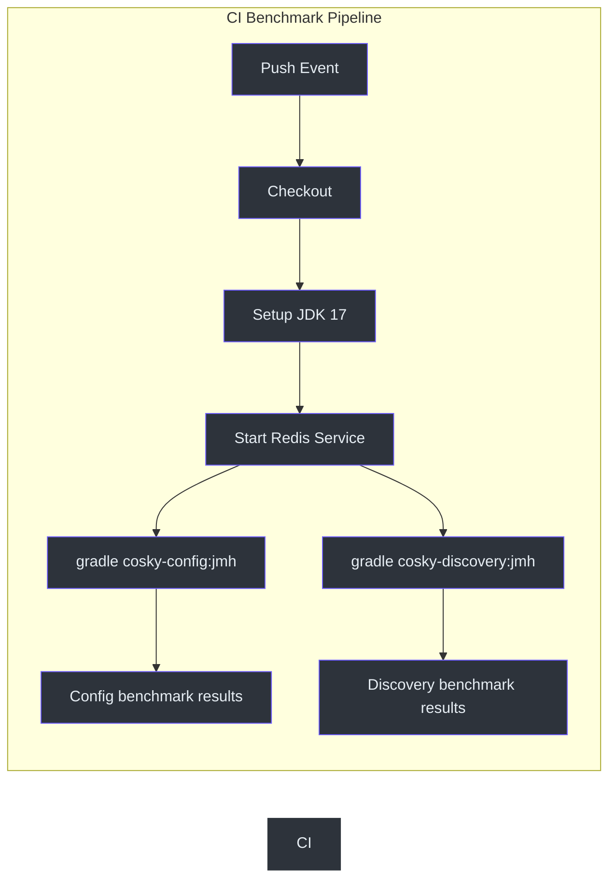
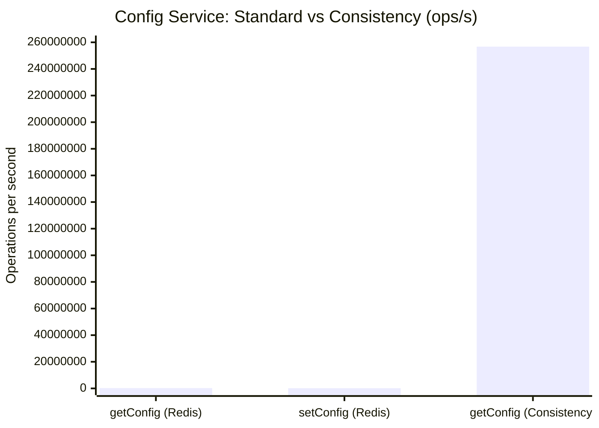
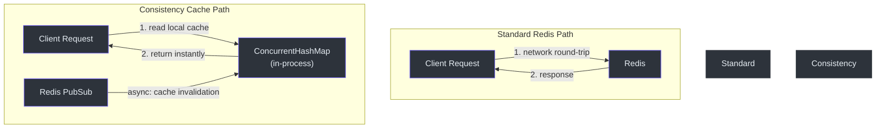
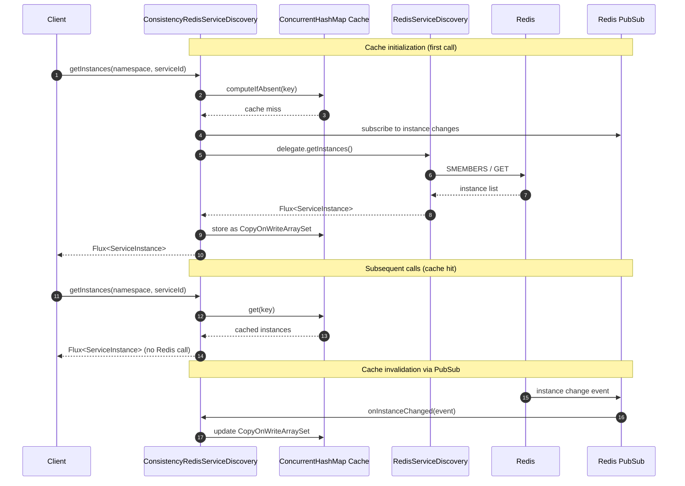
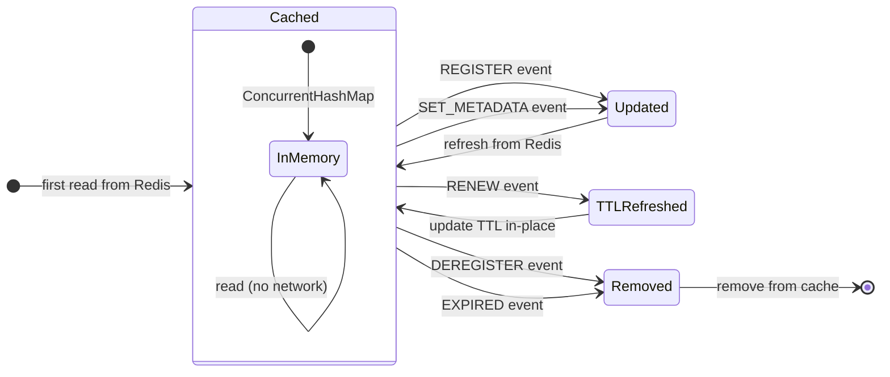
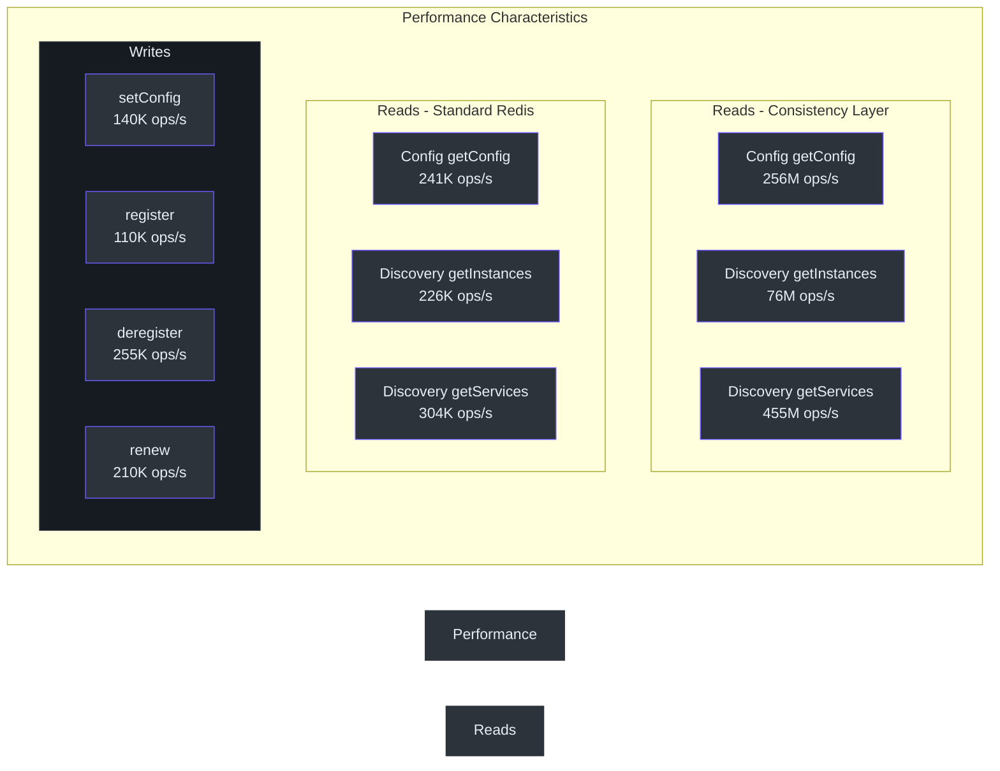

# Performance Benchmarks

## Overview

CoSky achieves extraordinary throughput by combining Redis as the backing store with a local in-process consistency cache that is kept synchronized via Redis PubSub. The benchmark results below, obtained with JMH (Java Microbenchmark Harness), demonstrate that the consistency layer delivers **800x+ improvement** for configuration reads and **250x+ improvement** for service discovery compared to standard Redis operations. This page documents the benchmark methodology, environment, raw results, and architectural explanation for why the consistency layer is so fast.

## Benchmark Methodology

All benchmarks are conducted using [JMH (Java Microbenchmark Harness)](https://openjdk.org/projects/code-tools/jmh/) version 1.29. Each benchmark runs with:

- **Mode**: Throughput (`thrpt`)
- **Threads**: 25-50 concurrent threads
- **Warmup**: 1 iteration, 10 seconds
- **Measurement**: 1 iteration, 10 seconds
- **Forks**: 1

The CI pipeline runs benchmarks on every push via [GitHub Actions](https://github.com/Ahoo-Wang/CoSky/blob/main/.github/workflows/benchmark-test.yml), enabling performance regression detection for every commit.



<!-- Sources: .github/workflows/benchmark-test.yml:1 -->

## Test Environment

| Component | Specification |
|-----------|--------------|
| **Hardware** | MacBook Pro (Apple M1) |
| **JDK** | Zulu 11.0.11 (OpenJDK 64-Bit Server VM) |
| **Redis** | Deployed locally on the same machine |
| **JMH Version** | 1.29 |
| **Methodology** | `thrpt` mode, 50 threads, 1 fork, 10s warmup + measurement |

## Config Service Benchmarks

```bash
# Run config benchmarks
gradle cosky-config:jmh
# or with JMH jar directly
java -jar cosky-config/build/libs/cosky-config-lastVersion-jmh.jar \
  -bm thrpt -t 25 -wi 1 -rf json -f 1
```

| Benchmark | Mode | Score | Unit | Improvement |
|-----------|------|-------|------|-------------|
| `ConsistencyRedisConfigServiceBenchmark.getConfig` | thrpt | **256,733,987** | ops/s | **1,062x** |
| `RedisConfigServiceBenchmark.getConfig` | thrpt | 241,787 | ops/s | baseline |
| `RedisConfigServiceBenchmark.setConfig` | thrpt | 140,461 | ops/s | - |

<!-- Sources: docs/jmh/jmh-cosky-config.json:1, README.md:348 -->

## Service Discovery Benchmarks

```bash
# Run discovery benchmarks
gradle cosky-discovery:jmh
# or with JMH jar directly
java -jar cosky-discovery/build/libs/cosky-discovery-lastVersion-jmh.jar \
  -bm thrpt -t 25 -wi 1 -rf json -f 1
```

| Benchmark | Mode | Score | Unit | Improvement |
|-----------|------|-------|------|-------------|
| `ConsistencyRedisServiceDiscoveryBenchmark.getInstances` | thrpt | **76,621,729** | ops/s | **338x** |
| `ConsistencyRedisServiceDiscoveryBenchmark.getServices` | thrpt | **455,760,632** | ops/s | **1,495x** |
| `RedisServiceDiscoveryBenchmark.getInstances` | thrpt | 226,909 | ops/s | baseline |
| `RedisServiceDiscoveryBenchmark.getServices` | thrpt | 304,979 | ops/s | baseline |
| `RedisServiceRegistryBenchmark.register` | thrpt | 110,664 | ops/s | - |
| `RedisServiceRegistryBenchmark.deregister` | thrpt | 255,305 | ops/s | - |
| `RedisServiceRegistryBenchmark.renew` | thrpt | 210,960 | ops/s | - |

<!-- Sources: docs/jmh/jmh-cosky-discovery.json:1, README.md:365 -->

## Performance Comparison Chart

The following chart compares the standard Redis-backed operations against the consistency-cached layer. Note the logarithmic scale -- the consistency layer is orders of magnitude faster.



<!-- Sources: docs/jmh/jmh-cosky-config.json:1 -->

## Why the Consistency Layer Is Faster

The key architectural insight is that the consistency layer reads from an in-memory `ConcurrentHashMap` cache instead of making Redis round-trips. The cache is kept synchronized in real-time via Redis PubSub, so it always reflects the latest state without polling.



<!-- Sources: cosky-discovery/src/main/kotlin/me/ahoo/cosky/discovery/redis/ConsistencyRedisServiceDiscovery.kt:43, cosky-config/src/jmh/kotlin/me/ahoo/cosky/config/ConsistencyRedisConfigServiceBenchmark.kt:31 -->

## Consistency Layer Architecture

The `ConsistencyRedisServiceDiscovery` class wraps a standard `ServiceDiscovery` delegate and adds local caching with Redis PubSub-based invalidation:



<!-- Sources: cosky-discovery/src/main/kotlin/me/ahoo/cosky/discovery/redis/ConsistencyRedisServiceDiscovery.kt:86, cosky-discovery/src/main/kotlin/me/ahoo/cosky/discovery/redis/ConsistencyRedisServiceDiscovery.kt:138 -->

## Cache Invalidation Events

The consistency layer handles several types of instance change events, each triggering a specific cache update strategy:



<!-- Sources: cosky-discovery/src/main/kotlin/me/ahoo/cosky/discovery/redis/ConsistencyRedisServiceDiscovery.kt:138, cosky-discovery/src/main/kotlin/me/ahoo/cosky/discovery/redis/ConsistencyRedisServiceDiscovery.kt:171 -->

## How to Run Benchmarks Locally

### Prerequisites

- JDK 17+ installed
- Redis running locally on port 6379

### Config Benchmarks

```bash
# Run the full config benchmark suite
./gradlew cosky-config:jmh

# Run with custom thread count
./gradlew cosky-config:jmh -PjmhThreads=10

# Run specific benchmark
java -jar cosky-config/build/libs/cosky-config-*-jmh.jar \
  -bm thrpt \
  -t 25 \
  -wi 1 \
  -rf json \
  -f 1 \
  -p CONFIG_ID=my-config
```

### Discovery Benchmarks

```bash
# Run the full discovery benchmark suite
./gradlew cosky-discovery:jmh

# Run with custom thread count
./gradlew cosky-discovery:jmh -PjmhThreads=10
```

> **Note**: The JMH benchmark results above were obtained on a MacBook Pro (M1) with a locally deployed Redis. Running the same benchmarks on GitHub Actions runners yields approximately 2x lower scores due to shared resource constraints. However, the relative comparison between standard and consistency operations remains valid in any environment.

<!-- Sources: .github/workflows/benchmark-test.yml:52, .github/workflows/benchmark-test.yml:80 -->

## Feature Comparison with Competitors

| Feature | CoSky | Eureka | Consul | CoreDNS | Zookeeper | Nacos | Apollo |
|---------|-------|--------|--------|---------|-----------|-------|--------|
| **CAP** | CP+AP | AP | CP | CP | CP | CP+AP | CP+AP |
| **Health Check** | Client Beat | Client Beat | TCP/HTTP/gRPC | Keep Alive | Keep Alive | TCP/HTTP/Client Beat | Client Beat |
| **Load Balancing** | Weight/Selector | Ribbon | Fabio | RoundRobin | RoundRobin | Weight/metadata | RoundRobin |
| **Auto Logoff** | Yes | Yes | No | No | Yes | Yes | Yes |
| **Access Protocol** | HTTP/Redis | HTTP | HTTP/DNS | DNS | TCP | HTTP/DNS | HTTP |
| **Listening Support** | Yes | Yes | Yes | No | Yes | Yes | Yes |
| **Multi-DC** | Yes | Yes | Yes | No | No | Yes | Yes |
| **Cross Registry Sync** | Yes | No | Yes | No | No | Yes | No |
| **Spring Cloud** | Yes | Yes | Yes | No | No | Yes | Yes |
| **K8S Integration** | Yes | No | Yes | Yes | No | Yes | No |
| **Persistence** | Redis | - | - | - | - | MySQL | MySQL |

<!-- Sources: README.md:400 -->

## Key Insights

- **Config reads via the consistency layer achieve 256M ops/s** -- a 1,062x improvement over direct Redis reads at 241K ops/s
- **Service discovery via the consistency layer achieves 76M ops/s** for instances and **455M ops/s** for services -- 338x and 1,495x improvements respectively
- **Write operations** (register, deregister, renew, setConfig) are bounded by Redis network latency, achieving 110K-255K ops/s
- The consistency layer's performance advantage comes from replacing network round-trips with in-memory `ConcurrentHashMap` lookups, kept synchronized via Redis PubSub
- CoSky's hybrid CP+AP model provides both strong consistency for writes and eventual consistency with extreme read performance



<!-- Sources: docs/jmh/jmh-cosky-config.json:1, docs/jmh/jmh-cosky-discovery.json:1, README.md:376 -->

## Related Pages

- [Docker Deployment](./deployment-docker.md) - Deploy CoSky with Docker
- [Kubernetes Deployment](./deployment-kubernetes.md) - Deploy CoSky on Kubernetes
- [Standalone Deployment](./deployment-standalone.md) - Run CoSky without containers

## References

- [docs/jmh/jmh-cosky-config.json](https://github.com/Ahoo-Wang/CoSky/blob/main/docs/jmh/jmh-cosky-config.json)
- [docs/jmh/jmh-cosky-discovery.json](https://github.com/Ahoo-Wang/CoSky/blob/main/docs/jmh/jmh-cosky-discovery.json)
- [.github/workflows/benchmark-test.yml](https://github.com/Ahoo-Wang/CoSky/blob/main/.github/workflows/benchmark-test.yml)
- [cosky-discovery/src/main/kotlin/me/ahoo/cosky/discovery/redis/ConsistencyRedisServiceDiscovery.kt](https://github.com/Ahoo-Wang/CoSky/blob/main/cosky-discovery/src/main/kotlin/me/ahoo/cosky/discovery/redis/ConsistencyRedisServiceDiscovery.kt)
- [cosky-config/src/jmh/kotlin/me/ahoo/cosky/config/ConsistencyRedisConfigServiceBenchmark.kt](https://github.com/Ahoo-Wang/CoSky/blob/main/cosky-config/src/jmh/kotlin/me/ahoo/cosky/config/ConsistencyRedisConfigServiceBenchmark.kt)
- [README.md - Performance Benchmarks](https://github.com/Ahoo-Wang/CoSky/blob/main/README.md)
