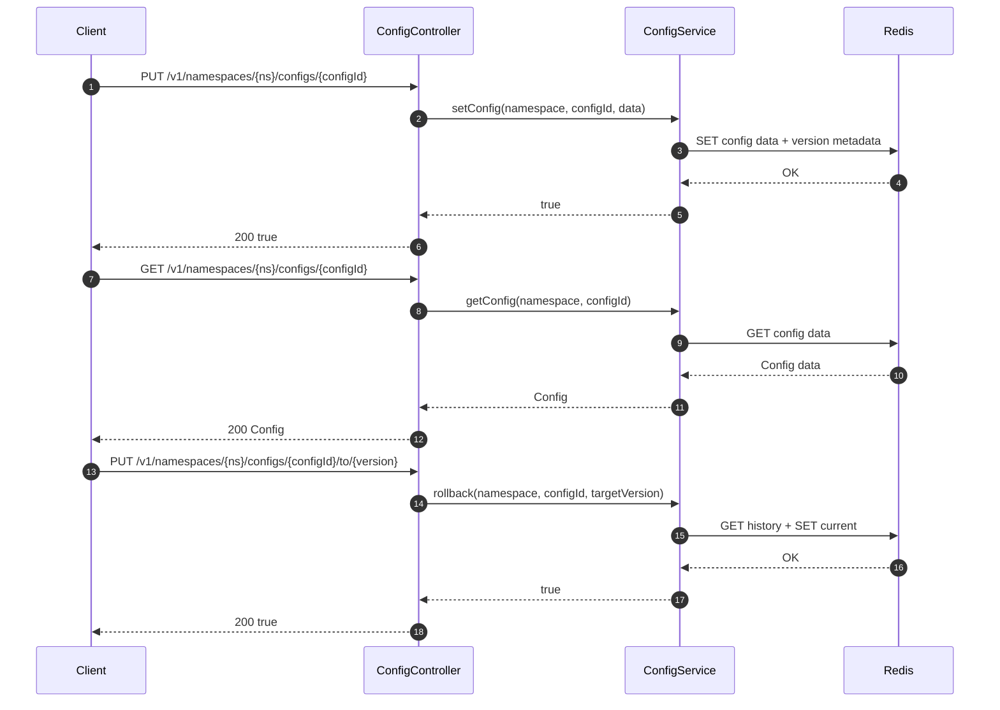
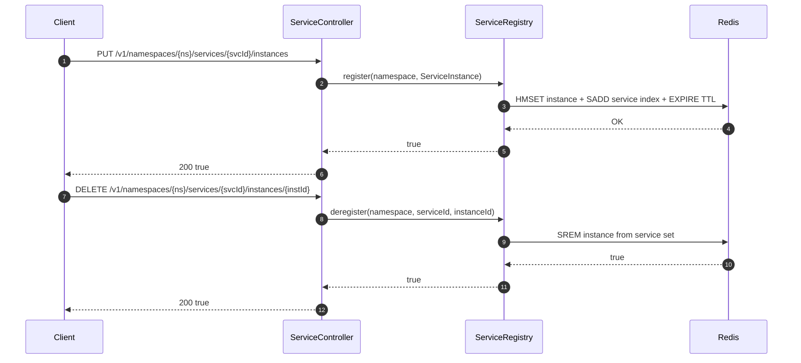
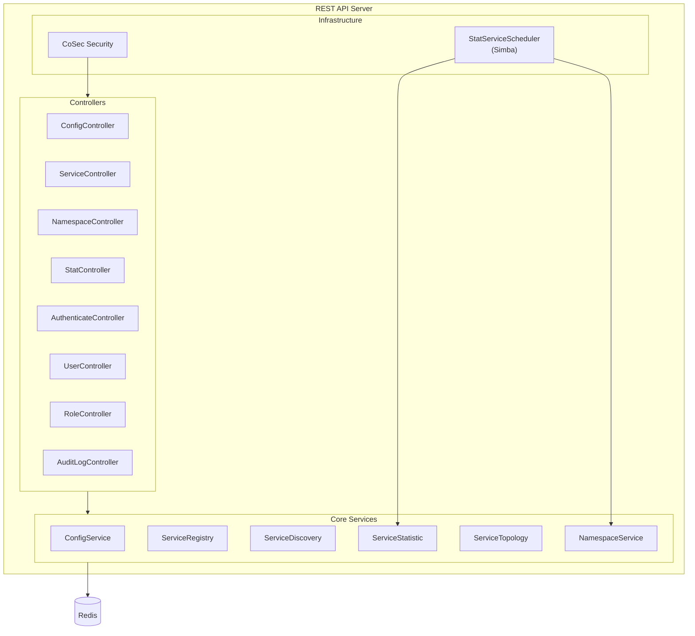

# REST API Server

The CoSky REST API Server is a Spring Boot WebFlux application that exposes the full set of microservice governance capabilities -- configuration management, service discovery and registration, namespace management, statistics, topology, and security -- as reactive HTTP endpoints. It serves as the primary integration surface for the CoSky Dashboard and any external client.

## At a Glance

| Component | Responsibility | Key File | Source |
|-----------|---------------|----------|--------|
| Server entry point | Spring Boot application bootstrap | `RestApiServer.kt` | [cosky-rest-api/.../RestApiServer.kt:23](https://github.com/Ahoo-Wang/CoSky/blob/main/cosky-rest-api/src/main/kotlin/me/ahoo/cosky/rest/RestApiServer.kt#L23) |
| Config API | Configuration CRUD, versioning, import/export | `ConfigController.kt` | [cosky-rest-api/.../ConfigController.kt:54](https://github.com/Ahoo-Wang/CoSky/blob/main/cosky-rest-api/src/main/kotlin/me/ahoo/cosky/rest/config/ConfigController.kt#L54) |
| Service API | Service registry, discovery, load balancing | `ServiceController.kt` | [cosky-rest-api/.../ServiceController.kt:40](https://github.com/Ahoo-Wang/CoSky/blob/main/cosky-rest-api/src/main/kotlin/me/ahoo/cosky/rest/service/ServiceController.kt#L40) |
| Namespace API | Multi-tenant namespace management | `NamespaceController.kt` | [cosky-rest-api/.../NamespaceController.kt:39](https://github.com/Ahoo-Wang/CoSky/blob/main/cosky-rest-api/src/main/kotlin/me/ahoo/cosky/rest/namespace/NamespaceController.kt#L39) |
| Stat API | Service statistics and topology | `StatController.kt` | [cosky-rest-api/.../StatController.kt:37](https://github.com/Ahoo-Wang/CoSky/blob/main/cosky-rest-api/src/main/kotlin/me/ahoo/cosky/rest/stat/StatController.kt#L37) |
| Stat Scheduler | Distributed scheduled statistics aggregation | `StatServiceScheduler.kt` | [cosky-rest-api/.../StatServiceScheduler.kt:33](https://github.com/Ahoo-Wang/CoSky/blob/main/cosky-rest-api/src/main/kotlin/me/ahoo/cosky/rest/stat/StatServiceScheduler.kt#L33) |

## Server Entry Point

`RestApiServer` is a standard `@SpringBootApplication` class. The `main` function delegates to `SpringApplication.run`, which auto-configures the WebFlux server, CoSky discovery, Redis connections, and security components.

```kotlin
@SpringBootApplication
class RestApiServer

fun main(args: Array<String>) {
    SpringApplication.run(RestApiServer::class.java, *args)
}
```

Source: [cosky-rest-api/.../RestApiServer.kt:23-28](https://github.com/Ahoo-Wang/CoSky/blob/main/cosky-rest-api/src/main/kotlin/me/ahoo/cosky/rest/RestApiServer.kt#L23)

## API Endpoints

All endpoints share the `/v1` prefix. The following tables group them by domain.

### Config Endpoints

| Method | Path | Description | Controller Method | Source |
|--------|------|-------------|-------------------|--------|
| GET | `/v1/namespaces/{namespace}/configs` | List all config IDs | `getConfigs` | [ConfigController.kt:65](https://github.com/Ahoo-Wang/CoSky/blob/main/cosky-rest-api/src/main/kotlin/me/ahoo/cosky/rest/config/ConfigController.kt#L65) |
| PUT | `/v1/namespaces/{namespace}/configs/{configId}` | Create or update a config | `setConfig` | [ConfigController.kt:168](https://github.com/Ahoo-Wang/CoSky/blob/main/cosky-rest-api/src/main/kotlin/me/ahoo/cosky/rest/config/ConfigController.kt#L168) |
| DELETE | `/v1/namespaces/{namespace}/configs/{configId}` | Delete a config | `removeConfig` | [ConfigController.kt:177](https://github.com/Ahoo-Wang/CoSky/blob/main/cosky-rest-api/src/main/kotlin/me/ahoo/cosky/rest/config/ConfigController.kt#L177) |
| GET | `/v1/namespaces/{namespace}/configs/{configId}` | Get config content | `getConfig` | [ConfigController.kt:182](https://github.com/Ahoo-Wang/CoSky/blob/main/cosky-rest-api/src/main/kotlin/me/ahoo/cosky/rest/config/ConfigController.kt#L182) |
| PUT | `/v1/namespaces/{namespace}/configs/{configId}/to/{targetVersion}` | Rollback to a target version | `rollback` | [ConfigController.kt:187](https://github.com/Ahoo-Wang/CoSky/blob/main/cosky-rest-api/src/main/kotlin/me/ahoo/cosky/rest/config/ConfigController.kt#L187) |
| GET | `/v1/namespaces/{namespace}/configs/{configId}/versions` | List config version history | `getConfigVersions` | [ConfigController.kt:196](https://github.com/Ahoo-Wang/CoSky/blob/main/cosky-rest-api/src/main/kotlin/me/ahoo/cosky/rest/config/ConfigController.kt#L196) |
| GET | `/v1/namespaces/{namespace}/configs/{configId}/versions/{version}` | Get a specific version's data | `getConfigHistory` | [ConfigController.kt:204](https://github.com/Ahoo-Wang/CoSky/blob/main/cosky-rest-api/src/main/kotlin/me/ahoo/cosky/rest/config/ConfigController.kt#L204) |
| POST | `/v1/namespaces/{namespace}/configs` (multipart) | Import configs from ZIP | `importZip` | [ConfigController.kt:69](https://github.com/Ahoo-Wang/CoSky/blob/main/cosky-rest-api/src/main/kotlin/me/ahoo/cosky/rest/config/ConfigController.kt#L69) |
| GET | `/v1/namespaces/{namespace}/configs/export` | Export all configs as ZIP | `exportZip` | [ConfigController.kt:150](https://github.com/Ahoo-Wang/CoSky/blob/main/cosky-rest-api/src/main/kotlin/me/ahoo/cosky/rest/config/ConfigController.kt#L150) |

### Service Endpoints

| Method | Path | Description | Controller Method | Source |
|--------|------|-------------|-------------------|--------|
| GET | `/v1/namespaces/{namespace}/services` | List all service IDs | `getServices` | [ServiceController.kt:47](https://github.com/Ahoo-Wang/CoSky/blob/main/cosky-rest-api/src/main/kotlin/me/ahoo/cosky/rest/service/ServiceController.kt#L47) |
| PUT | `/v1/namespaces/{namespace}/services/{serviceId}` | Create a service entry | `setService` | [ServiceController.kt:52](https://github.com/Ahoo-Wang/CoSky/blob/main/cosky-rest-api/src/main/kotlin/me/ahoo/cosky/rest/service/ServiceController.kt#L52) |
| DELETE | `/v1/namespaces/{namespace}/services/{serviceId}` | Remove a service | `removeService` | [ServiceController.kt:57](https://github.com/Ahoo-Wang/CoSky/blob/main/cosky-rest-api/src/main/kotlin/me/ahoo/cosky/rest/service/ServiceController.kt#L57) |
| GET | `/v1/namespaces/{namespace}/services/{serviceId}/instances` | List instances of a service | `getInstances` | [ServiceController.kt:62](https://github.com/Ahoo-Wang/CoSky/blob/main/cosky-rest-api/src/main/kotlin/me/ahoo/cosky/rest/service/ServiceController.kt#L62) |
| PUT | `/v1/namespaces/{namespace}/services/{serviceId}/instances` | Register a service instance | `register` | [ServiceController.kt:67](https://github.com/Ahoo-Wang/CoSky/blob/main/cosky-rest-api/src/main/kotlin/me/ahoo/cosky/rest/service/ServiceController.kt#L67) |
| DELETE | `/v1/namespaces/{namespace}/services/{serviceId}/instances/{instanceId}` | Deregister a service instance | `deregister` | [ServiceController.kt:76](https://github.com/Ahoo-Wang/CoSky/blob/main/cosky-rest-api/src/main/kotlin/me/ahoo/cosky/rest/service/ServiceController.kt#L76) |
| PUT | `/v1/namespaces/{namespace}/services/{serviceId}/instances/{instanceId}/metadata` | Set instance metadata | `setMetadata` | [ServiceController.kt:84](https://github.com/Ahoo-Wang/CoSky/blob/main/cosky-rest-api/src/main/kotlin/me/ahoo/cosky/rest/service/ServiceController.kt#L84) |
| GET | `/v1/namespaces/{namespace}/services/stats` | Get service statistics | `getServiceStats` | [ServiceController.kt:95](https://github.com/Ahoo-Wang/CoSky/blob/main/cosky-rest-api/src/main/kotlin/me/ahoo/cosky/rest/service/ServiceController.kt#L95) |
| GET | `/v1/namespaces/{namespace}/services/{serviceId}/lb` | Load-balancer choose instance | `choose` | [ServiceController.kt:100](https://github.com/Ahoo-Wang/CoSky/blob/main/cosky-rest-api/src/main/kotlin/me/ahoo/cosky/rest/service/ServiceController.kt#L100) |

### Namespace Endpoints

| Method | Path | Description | Controller Method | Source |
|--------|------|-------------|-------------------|--------|
| GET | `/v1/namespaces` | List namespaces (role-scoped) | `getNamespaces` | [NamespaceController.kt:41](https://github.com/Ahoo-Wang/CoSky/blob/main/cosky-rest-api/src/main/kotlin/me/ahoo/cosky/rest/namespace/NamespaceController.kt#L41) |
| GET | `/v1/namespaces/current` | Get current context namespace | `current` | [NamespaceController.kt:52](https://github.com/Ahoo-Wang/CoSky/blob/main/cosky-rest-api/src/main/kotlin/me/ahoo/cosky/rest/namespace/NamespaceController.kt#L52) |
| PUT | `/v1/namespaces/current/{namespace}` | Set current context namespace | `setCurrentContextNamespace` | [NamespaceController.kt:57](https://github.com/Ahoo-Wang/CoSky/blob/main/cosky-rest-api/src/main/kotlin/me/ahoo/cosky/rest/namespace/NamespaceController.kt#L57) |
| PUT | `/v1/namespaces/{namespace}` | Create a namespace | `setNamespace` | [NamespaceController.kt:62](https://github.com/Ahoo-Wang/CoSky/blob/main/cosky-rest-api/src/main/kotlin/me/ahoo/cosky/rest/namespace/NamespaceController.kt#L62) |
| DELETE | `/v1/namespaces/{namespace}` | Remove a namespace | `removeNamespace` | [NamespaceController.kt:67](https://github.com/Ahoo-Wang/CoSky/blob/main/cosky-rest-api/src/main/kotlin/me/ahoo/cosky/rest/namespace/NamespaceController.kt#L67) |

### Stat Endpoints

| Method | Path | Description | Controller Method | Source |
|--------|------|-------------|-------------------|--------|
| GET | `/v1/namespaces/{namespace}/stat` | Aggregate namespace statistics | `getStat` | [StatController.kt:44](https://github.com/Ahoo-Wang/CoSky/blob/main/cosky-rest-api/src/main/kotlin/me/ahoo/cosky/rest/stat/StatController.kt#L44) |
| GET | `/v1/namespaces/{namespace}/stat/topology` | Get service dependency topology | `getTopology` | [StatController.kt:74](https://github.com/Ahoo-Wang/CoSky/blob/main/cosky-rest-api/src/main/kotlin/me/ahoo/cosky/rest/stat/StatController.kt#L74) |

### Auth Endpoints

| Method | Path | Description | Controller Method | Source |
|--------|------|-------------|-------------------|--------|
| POST | `/v1/authenticate/{username}/login` | Login with password | `login` | [AuthenticateController.kt:37](https://github.com/Ahoo-Wang/CoSky/blob/main/cosky-rest-api/src/main/kotlin/me/ahoo/cosky/rest/security/authentication/AuthenticateController.kt#L37) |
| POST | `/v1/authenticate/{username}/refresh` | Refresh access token | `refresh` | [AuthenticateController.kt:47](https://github.com/Ahoo-Wang/CoSky/blob/main/cosky-rest-api/src/main/kotlin/me/ahoo/cosky/rest/security/authentication/AuthenticateController.kt#L47) |

### User Endpoints

| Method | Path | Description | Controller Method | Source |
|--------|------|-------------|-------------------|--------|
| GET | `/v1/users` | List all users with roles | `query` | [UserController.kt:42](https://github.com/Ahoo-Wang/CoSky/blob/main/cosky-rest-api/src/main/kotlin/me/ahoo/cosky/rest/security/user/UserController.kt#L42) |
| POST | `/v1/users/{username}` | Add a new user | `addUser` | [UserController.kt:52](https://github.com/Ahoo-Wang/CoSky/blob/main/cosky-rest-api/src/main/kotlin/me/ahoo/cosky/rest/security/user/UserController.kt#L52) |
| DELETE | `/v1/users/{username}` | Remove a user | `removeUser` | [UserController.kt:62](https://github.com/Ahoo-Wang/CoSky/blob/main/cosky-rest-api/src/main/kotlin/me/ahoo/cosky/rest/security/user/UserController.kt#L62) |
| PATCH | `/v1/users/{username}/password` | Change password | `changePwd` | [UserController.kt:47](https://github.com/Ahoo-Wang/CoSky/blob/main/cosky-rest-api/src/main/kotlin/me/ahoo/cosky/rest/security/user/UserController.kt#L47) |
| PATCH | `/v1/users/{username}/role` | Bind roles to user | `bindRole` | [UserController.kt:57](https://github.com/Ahoo-Wang/CoSky/blob/main/cosky-rest-api/src/main/kotlin/me/ahoo/cosky/rest/security/user/UserController.kt#L57) |
| DELETE | `/v1/users/{username}/unlock` | Unlock a locked-out user | `unlock` | [UserController.kt:67](https://github.com/Ahoo-Wang/CoSky/blob/main/cosky-rest-api/src/main/kotlin/me/ahoo/cosky/rest/security/user/UserController.kt#L67) |

### Role Endpoints

| Method | Path | Description | Controller Method | Source |
|--------|------|-------------|-------------------|--------|
| GET | `/v1/roles` | List all roles | `allRole` | [RoleController.kt:38](https://github.com/Ahoo-Wang/CoSky/blob/main/cosky-rest-api/src/main/kotlin/me/ahoo/cosky/rest/security/rbac/RoleController.kt#L38) |
| GET | `/v1/roles/{roleName}/bind` | Get resource-action bindings | `getResourceBind` | [RoleController.kt:43](https://github.com/Ahoo-Wang/CoSky/blob/main/cosky-rest-api/src/main/kotlin/me/ahoo/cosky/rest/security/rbac/RoleController.kt#L43) |
| PUT | `/v1/roles/{roleName}` | Create or update a role | `saveRole` | [RoleController.kt:52](https://github.com/Ahoo-Wang/CoSky/blob/main/cosky-rest-api/src/main/kotlin/me/ahoo/cosky/rest/security/rbac/RoleController.kt#L52) |
| DELETE | `/v1/roles/{roleName}` | Remove a role | `removeRole` | [RoleController.kt:57](https://github.com/Ahoo-Wang/CoSky/blob/main/cosky-rest-api/src/main/kotlin/me/ahoo/cosky/rest/security/rbac/RoleController.kt#L57) |

### Audit Log Endpoints

| Method | Path | Description | Controller Method | Source |
|--------|------|-------------|-------------------|--------|
| GET | `/v1/audit-log` | Query audit logs | `queryLog` | [AuditLogController.kt:32](https://github.com/Ahoo-Wang/CoSky/blob/main/cosky-rest-api/src/main/kotlin/me/ahoo/cosky/rest/security/audit/AuditLogController.kt#L32) |

## Sequence Diagrams

### Config CRUD Operation



<!-- Sources: cosky-rest-api/src/main/kotlin/me/ahoo/cosky/rest/config/ConfigController.kt:54, cosky-rest-api/src/main/kotlin/me/ahoo/cosky/rest/config/ConfigController.kt:168 -->

### Service Registration via REST



<!-- Sources: cosky-rest-api/src/main/kotlin/me/ahoo/cosky/rest/service/ServiceController.kt:67, cosky-rest-api/src/main/kotlin/me/ahoo/cosky/rest/service/ServiceController.kt:76 -->

## Architecture



<!-- Sources: cosky-rest-api/src/main/kotlin/me/ahoo/cosky/rest/RestApiServer.kt:23, cosky-rest-api/src/main/kotlin/me/ahoo/cosky/rest/stat/StatServiceScheduler.kt:33, cosky-rest-api/src/main/kotlin/me/ahoo/cosky/rest/stat/StatController.kt:37 -->

## StatServiceScheduler

The `StatServiceScheduler` is a distributed scheduled job powered by [Simba](https://github.com/Ahoo-Wang/Simba) (a distributed mutex / leader-election library). It extends `AbstractScheduler` and implements Spring's `SmartLifecycle` so that it starts and stops with the application context.

Key behaviors:

- **Mutex-based leader election**: Only one instance in the cluster holds the `"stat"` mutex and performs work.
- **Schedule**: Runs with an initial 1-second delay and then every 10 seconds (`ScheduleConfig.delay(1s, 10s)`).
- **Namespace iteration**: On each tick it iterates all namespaces and calls `ServiceStatistic.statService()` to aggregate service metrics into Redis.
- **Current namespace guard**: Ensures the current context namespace is always present in the namespace list.

Source: [cosky-rest-api/.../StatServiceScheduler.kt:33-84](https://github.com/Ahoo-Wang/CoSky/blob/main/cosky-rest-api/src/main/kotlin/me/ahoo/cosky/rest/stat/StatServiceScheduler.kt#L33)

## Configuration

The REST API server is configured through `application.yaml`. Key settings:

```yaml
cosky:
  security:
    enabled: true                    # Enable/disable security
    audit-log:
      action: write                  # Audit log filter: "write", "read", or "rw"
    enforce-init-super-user: false   # Force re-initialize super user on startup

cosec:
  jwt:
    algorithm: hmac256               # JWT signing algorithm
    secret: ${cosky.security.key}    # JWT secret key
    token-validity:
      access: 15m                    # Access token TTL
      refresh: 3H                    # Refresh token TTL

cosid:
  namespace: ${spring.application.name}
  machine:
    enabled: true
    distributor:
      type: redis
  generator:
    enabled: true

simba:
  redis:
    enabled: true                    # Enable Simba distributed scheduler via Redis
```

Source: [cosky-rest-api/src/main/resources/application.yaml](https://github.com/Ahoo-Wang/CoSky/blob/main/cosky-rest-api/src/main/resources/application.yaml)

## Related Pages

- [Security & RBAC](/guide/security-rbac) -- Authentication, authorization, and role-based access control
- [Dashboard](/guide/dashboard) -- CoSky management UI

## References

- [RestApiServer.kt](https://github.com/Ahoo-Wang/CoSky/blob/main/cosky-rest-api/src/main/kotlin/me/ahoo/cosky/rest/RestApiServer.kt)
- [ConfigController.kt](https://github.com/Ahoo-Wang/CoSky/blob/main/cosky-rest-api/src/main/kotlin/me/ahoo/cosky/rest/config/ConfigController.kt)
- [ServiceController.kt](https://github.com/Ahoo-Wang/CoSky/blob/main/cosky-rest-api/src/main/kotlin/me/ahoo/cosky/rest/service/ServiceController.kt)
- [NamespaceController.kt](https://github.com/Ahoo-Wang/CoSky/blob/main/cosky-rest-api/src/main/kotlin/me/ahoo/cosky/rest/namespace/NamespaceController.kt)
- [StatController.kt](https://github.com/Ahoo-Wang/CoSky/blob/main/cosky-rest-api/src/main/kotlin/me/ahoo/cosky/rest/stat/StatController.kt)
- [StatServiceScheduler.kt](https://github.com/Ahoo-Wang/CoSky/blob/main/cosky-rest-api/src/main/kotlin/me/ahoo/cosky/rest/stat/StatServiceScheduler.kt)
- [RequestPathPrefix.kt](https://github.com/Ahoo-Wang/CoSky/blob/main/cosky-rest-api/src/main/kotlin/me/ahoo/cosky/rest/support/RequestPathPrefix.kt)
- [application.yaml](https://github.com/Ahoo-Wang/CoSky/blob/main/cosky-rest-api/src/main/resources/application.yaml)
