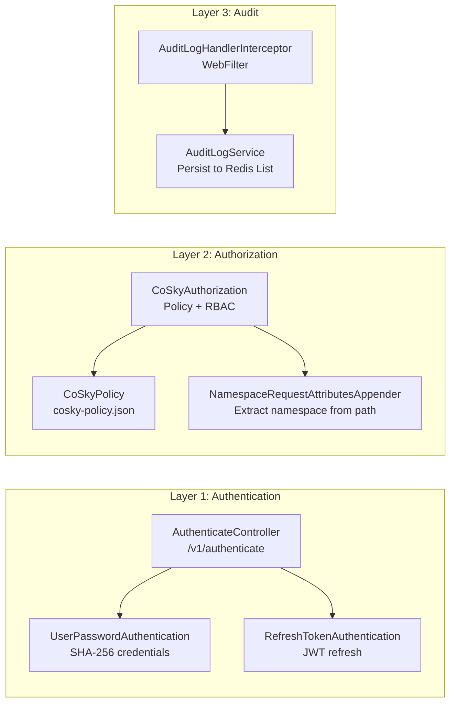
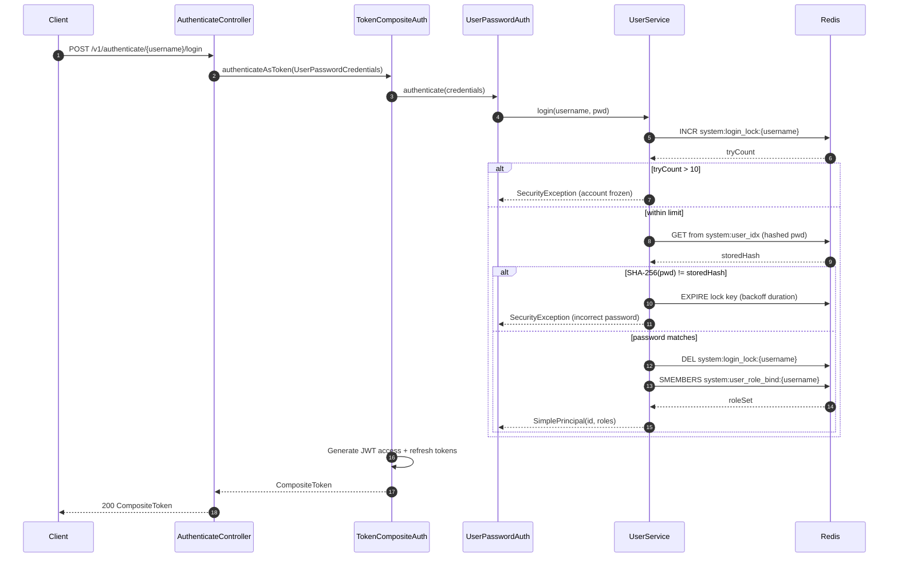
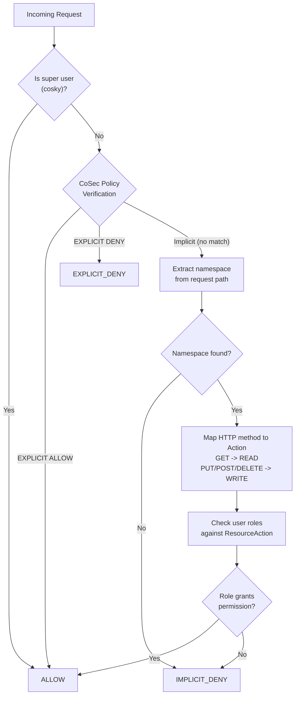
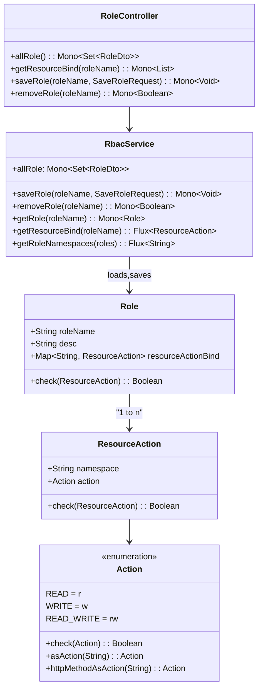

# Security & RBAC

CoSky implements a comprehensive three-layer security model -- **Authentication**, **Authorization**, and **Audit** -- built on the [CoSec](https://github.com/Ahoo-Wang/CoSec) security framework. User credentials are stored in Redis with SHA-256 hashing. Authorization combines a policy engine (CoSec policy JSON) with namespace-scoped RBAC. All operations are audited and persisted to a Redis List for querying.

## At a Glance

| Layer | Component | Responsibility | Key File | Source |
|-------|-----------|---------------|----------|--------|
| Authentication | `UserPasswordAuthentication` | Login via username/password | `UserPasswordAuthentication.kt` | [security/.../UserPasswordAuthentication.kt:11](https://github.com/Ahoo-Wang/CoSky/blob/main/cosky-rest-api/src/main/kotlin/me/ahoo/cosky/rest/security/authentication/UserPasswordAuthentication.kt#L11) |
| Authentication | `RefreshTokenAuthentication` | Refresh JWT token pair | `RefreshTokenAuthentication.kt` | [security/.../RefreshTokenAuthentication.kt:14](https://github.com/Ahoo-Wang/CoSky/blob/main/cosky-rest-api/src/main/kotlin/me/ahoo/cosky/rest/security/authentication/RefreshTokenAuthentication.kt#L14) |
| Authorization | `CoSkyAuthorization` | Two-tier authorization (policy + RBAC) | `CoSkyAuthorization.kt` | [security/.../CoSkyAuthorization.kt:19](https://github.com/Ahoo-Wang/CoSky/blob/main/cosky-rest-api/src/main/kotlin/me/ahoo/cosky/rest/security/authorization/CoSkyAuthorization.kt#L19) |
| RBAC | `RbacService` | Role/Resource CRUD in Redis | `RbacService.kt` | [security/.../RbacService.kt:30](https://github.com/Ahoo-Wang/CoSky/blob/main/cosky-rest-api/src/main/kotlin/me/ahoo/cosky/rest/security/rbac/RbacService.kt#L30) |
| Audit | `AuditLogHandlerInterceptor` | WebFilter for audit logging | `AuditLogHandlerInterceptor.kt` | [security/.../AuditLogHandlerInterceptor.kt:31](https://github.com/Ahoo-Wang/CoSky/blob/main/cosky-rest-api/src/main/kotlin/me/ahoo/cosky/rest/security/audit/AuditLogHandlerInterceptor.kt#L31) |
| User Mgmt | `UserService` | User CRUD, login lockout, role binding | `UserService.kt` | [security/.../UserService.kt:36](https://github.com/Ahoo-Wang/CoSky/blob/main/cosky-rest-api/src/main/kotlin/me/ahoo/cosky/rest/security/user/UserService.kt#L36) |

## Three-Layer Security Architecture



<!-- Sources: cosky-rest-api/src/main/kotlin/me/ahoo/cosky/rest/security/authentication/UserPasswordAuthentication.kt:11, cosky-rest-api/src/main/kotlin/me/ahoo/cosky/rest/security/authentication/RefreshTokenAuthentication.kt:14, cosky-rest-api/src/main/kotlin/me/ahoo/cosky/rest/security/authorization/CoSkyAuthorization.kt:19, cosky-rest-api/src/main/kotlin/me/ahoo/cosky/rest/security/audit/AuditLogHandlerInterceptor.kt:31 -->

## Authentication

CoSky supports two authentication methods:

1. **UserPasswordAuthentication** -- validates username/password against SHA-256 hashed credentials stored in Redis. On success, the `UserService.login()` method returns a `SimplePrincipal` with the user's role bindings.
2. **RefreshTokenAuthentication** -- accepts an access/refresh token pair and validates the refresh token via CoSec's `TokenVerifier`. Returns a refreshed token pair on success.

### AuthenticateController Endpoints

| Method | Path | Description | Source |
|--------|------|-------------|--------|
| POST | `/v1/authenticate/{username}/login` | Login with password | [AuthenticateController.kt:37](https://github.com/Ahoo-Wang/CoSky/blob/main/cosky-rest-api/src/main/kotlin/me/ahoo/cosky/rest/security/authentication/AuthenticateController.kt#L37) |
| POST | `/v1/authenticate/{username}/refresh` | Refresh token pair | [AuthenticateController.kt:47](https://github.com/Ahoo-Wang/CoSky/blob/main/cosky-rest-api/src/main/kotlin/me/ahoo/cosky/rest/security/authentication/AuthenticateController.kt#L47) |

### Login Lockout Mechanism

`UserService.login()` implements progressive account lockout to prevent brute-force attacks:

- **Max failed attempts**: 10 (`MAX_LOGIN_ERROR_TIMES`)
- **Base lockout duration**: 15 minutes (`LOGIN_LOCK_EXPIRE`)
- **Maximum lockout**: 3 days (`MAX_LOGIN_LOCK_EXPIRE`)
- **Exponential backoff**: `lockoutDuration = baseLockout * max(tryCount / maxErrorTimes, 1)`, capped at the maximum.
- **Lock tracking**: A Redis key (`system:login_lock:{username}`) is incremented on each failed attempt and deleted on successful login.
- **Unlock**: Admins can unlock a user via `DELETE /v1/users/{username}/unlock`.

Source: [UserService.kt:135-177](https://github.com/Ahoo-Wang/CoSky/blob/main/cosky-rest-api/src/main/kotlin/me/ahoo/cosky/rest/security/user/UserService.kt#L135)

### Login Flow



<!-- Sources: cosky-rest-api/src/main/kotlin/me/ahoo/cosky/rest/security/authentication/AuthenticateController.kt:37, cosky-rest-api/src/main/kotlin/me/ahoo/cosky/rest/security/authentication/UserPasswordAuthentication.kt:11, cosky-rest-api/src/main/kotlin/me/ahoo/cosky/rest/security/user/UserService.kt:135 -->

## Authorization

CoSky uses a **two-tier authorization model** implemented in `CoSkyAuthorization`:

1. **Tier 1 -- Policy-based**: The CoSec policy engine evaluates the request against `cosky-policy.json`. If the policy explicitly allows the request, it passes immediately. If it explicitly denies, it is rejected.
2. **Tier 2 -- RBAC**: If the policy result is implicit (neither allow nor deny), the system falls through to namespace-scoped RBAC. It extracts the namespace from the request path via `NamespaceRequestAttributesAppender`, then checks if any of the user's roles grant the required action on that namespace.

The super user (`cosky`) bypasses all authorization checks.

Source: [CoSkyAuthorization.kt:24-60](https://github.com/Ahoo-Wang/CoSky/blob/main/cosky-rest-api/src/main/kotlin/me/ahoo/cosky/rest/security/authorization/CoSkyAuthorization.kt#L24)

### Authorization Decision Flow



<!-- Sources: cosky-rest-api/src/main/kotlin/me/ahoo/cosky/rest/security/authorization/CoSkyAuthorization.kt:24, cosky-rest-api/src/main/kotlin/me/ahoo/cosky/rest/security/authorization/NamespaceRequestAttributesAppender.kt:11 -->

### CoSkyPolicy and InitialPolicyLoader

`CoSkyPolicy` loads the security policy from CoSky's own config service. The policy is stored as a config item in the `system` namespace. It subscribes to config change events and refreshes the policy cache automatically when updated.

If no policy exists in the config service, `InitialPolicyLoader` loads the bundled `cosky-policy.json` from the classpath as a fallback.

Sources: [CoSkyPolicy.kt:17](https://github.com/Ahoo-Wang/CoSky/blob/main/cosky-rest-api/src/main/kotlin/me/ahoo/cosky/rest/security/authorization/CoSkyPolicy.kt#L17), [InitialPolicyLoader.kt:7](https://github.com/Ahoo-Wang/CoSky/blob/main/cosky-rest-api/src/main/kotlin/me/ahoo/cosky/rest/security/authorization/InitialPolicyLoader.kt#L7)

## RBAC Model

CoSky implements a namespace-scoped Role-Based Access Control model:

- **Role** -- has a name, description, and a map of namespace-to-`ResourceAction` bindings.
- **ResourceAction** -- pairs a `namespace` with an `Action` enum value.
- **Action** -- one of `READ` (`r`), `WRITE` (`w`), or `READ_WRITE` (`rw`). HTTP methods are mapped: `GET/OPTIONS/TRACE/HEAD` map to `READ`; `POST/PUT/DELETE/PATCH` map to `WRITE`.

The built-in `admin` role has no resource-action bindings and acts as a system-reserved role with the highest level of authority (granted full access by the policy).



<!-- Sources: cosky-rest-api/src/main/kotlin/me/ahoo/cosky/rest/security/rbac/Role.kt:20, cosky-rest-api/src/main/kotlin/me/ahoo/cosky/rest/security/rbac/ResourceAction.kt:22, cosky-rest-api/src/main/kotlin/me/ahoo/cosky/rest/security/rbac/Action.kt:22, cosky-rest-api/src/main/kotlin/me/ahoo/cosky/rest/security/rbac/RbacService.kt:30 -->

### Super User and Admin Role

- **Super user**: The `cosky` user (root) bypasses all authorization. It is initialized by `SecurityCommand` on application startup when `cosky.security.enforce-init-super-user` is `true`. A random 10-character password is generated and printed to stdout.
- **Admin role**: The `admin` role is a system-reserved role granted full access by the policy engine's `admin` statement. It is automatically included in the role list.

Sources: [UserService.kt:38-52](https://github.com/Ahoo-Wang/CoSky/blob/main/cosky-rest-api/src/main/kotlin/me/ahoo/cosky/rest/security/user/UserService.kt#L38), [Role.kt:31-34](https://github.com/Ahoo-Wang/CoSky/blob/main/cosky-rest-api/src/main/kotlin/me/ahoo/cosky/rest/security/rbac/Role.kt#L31), [SecurityCommand.kt:25](https://github.com/Ahoo-Wang/CoSky/blob/main/cosky-rest-api/src/main/kotlin/me/ahoo/cosky/rest/security/SecurityCommand.kt#L25)

## Audit Logging

### AuditLogHandlerInterceptor

`AuditLogHandlerInterceptor` is a reactive `WebFilter` that intercepts all HTTP requests. After the response is written, it creates an `AuditLog` entry containing:

- **operator** -- the username (from security context, or extracted from the login path)
- **ip** -- remote address
- **path** -- request URI
- **action** -- HTTP method name
- **status** -- HTTP response status code
- **msg** -- error message (if any)
- **opTime** -- epoch millis

The filter is configurable via `SecurityProperties.auditLog.action`. By default, only `WRITE` operations are audited. Set to `READ_WRITE` (`rw`) to audit all operations, or `READ` (`r`) for read-only auditing.

Source: [AuditLogHandlerInterceptor.kt:31-76](https://github.com/Ahoo-Wang/CoSky/blob/main/cosky-rest-api/src/main/kotlin/me/ahoo/cosky/rest/security/audit/AuditLogHandlerInterceptor.kt#L31)

### AuditLogService

`AuditLogService` persists audit log entries as JSON strings in a Redis List (`system:audit:log`). New entries are pushed to the head (`leftPush`). Queries support offset/limit pagination via `range`.

Source: [AuditLogService.kt:27-51](https://github.com/Ahoo-Wang/CoSky/blob/main/cosky-rest-api/src/main/kotlin/me/ahoo/cosky/rest/security/audit/AuditLogService.kt#L27)

## User Management

### UserService

`UserService` manages users entirely in Redis:

- **User index**: A Redis Hash (`system:user_idx`) mapping usernames to SHA-256 password hashes.
- **Role bindings**: A Redis Set (`system:user_role_bind:{username}`) storing role names assigned to each user.
- **Password hashing**: Uses Guava's `Hashing.sha256()` with UTF-8 encoding.
- **Login lockout**: See [Login Lockout Mechanism](#login-lockout-mechanism) above.
- **Root initialization**: `initRoot(enforce)` creates or resets the `cosky` super user with a random password.

Source: [UserService.kt:36-212](https://github.com/Ahoo-Wang/CoSky/blob/main/cosky-rest-api/src/main/kotlin/me/ahoo/cosky/rest/security/user/UserService.kt#L36)

### SecurityCommand

`SecurityCommand` is a `CommandLineRunner` that runs on application startup. It calls `UserService.initRoot()` to initialize the super user. This happens automatically if `cosky.security.enforce-init-super-user` is set to `true`.

Source: [SecurityCommand.kt:25-34](https://github.com/Ahoo-Wang/CoSky/blob/main/cosky-rest-api/src/main/kotlin/me/ahoo/cosky/rest/security/SecurityCommand.kt#L25)

### UserController Endpoints

| Method | Path | Description | Source |
|--------|------|-------------|--------|
| GET | `/v1/users` | List all users with role bindings | [UserController.kt:42](https://github.com/Ahoo-Wang/CoSky/blob/main/cosky-rest-api/src/main/kotlin/me/ahoo/cosky/rest/security/user/UserController.kt#L42) |
| POST | `/v1/users/{username}` | Create a new user | [UserController.kt:52](https://github.com/Ahoo-Wang/CoSky/blob/main/cosky-rest-api/src/main/kotlin/me/ahoo/cosky/rest/security/user/UserController.kt#L52) |
| DELETE | `/v1/users/{username}` | Remove a user | [UserController.kt:62](https://github.com/Ahoo-Wang/CoSky/blob/main/cosky-rest-api/src/main/kotlin/me/ahoo/cosky/rest/security/user/UserController.kt#L62) |
| PATCH | `/v1/users/{username}/password` | Change password | [UserController.kt:47](https://github.com/Ahoo-Wang/CoSky/blob/main/cosky-rest-api/src/main/kotlin/me/ahoo/cosky/rest/security/user/UserController.kt#L47) |
| PATCH | `/v1/users/{username}/role` | Bind roles to a user | [UserController.kt:57](https://github.com/Ahoo-Wang/CoSky/blob/main/cosky-rest-api/src/main/kotlin/me/ahoo/cosky/rest/security/user/UserController.kt#L57) |
| DELETE | `/v1/users/{username}/unlock` | Unlock a locked-out user | [UserController.kt:67](https://github.com/Ahoo-Wang/CoSky/blob/main/cosky-rest-api/src/main/kotlin/me/ahoo/cosky/rest/security/user/UserController.kt#L67) |

## Default Security Policy

The bundled `cosky-policy.json` defines the baseline security policy. Its statements are evaluated in order:

```json
{
  "statements": [
    { "name": "options",       "action": { "all": { "method": "OPTIONS" } } },
    { "name": "swaggerUI",     "action": { "path": { "method": "GET", "pattern": ["/swagger-ui/**", ...] } } },
    { "name": "dashboard",     "action": { "path": { "method": "GET", "pattern": ["/", "/index.html", ...] } } },
    { "name": "actuatorHealth","action": ["/actuator/health", "/actuator/health/*"] },
    { "name": "authenticate",  "action": ["/v1/authenticate/{username}/login", "/v1/authenticate/{username}/refresh"] },
    { "name": "namespace",     "action": { "path": { "method": "GET", "pattern": "/v1/namespaces/**" } },
                              "condition": { "authenticated": {} } },
    { "name": "admin",         "action": "*", "condition": { "inRole": { "value": "admin" } } },
    { "name": "root",          "action": "*", "condition": { "eq": { "part": "context.principal.id", "value": "cosky" } } }
  ]
}
```

Key policy rules:

- **Unauthenticated access**: OPTIONS requests, Swagger UI, static dashboard assets, actuator health, and authentication endpoints are allowed without login.
- **Namespace reads**: Any authenticated user can read namespace data (GET `/v1/namespaces/**`).
- **Admin role**: Members of the `admin` role have unrestricted access (`action: "*"`) to all APIs.
- **Root user**: The `cosky` user has unrestricted access regardless of role bindings.

Source: [cosky-rest-api/src/main/resources/cosky-policy.json](https://github.com/Ahoo-Wang/CoSky/blob/main/cosky-rest-api/src/main/resources/cosky-policy.json)

## Related Pages

- [REST API Server](/guide/rest-api) -- API endpoints and server architecture
- [Dashboard](/guide/dashboard) -- CoSky management UI

## References

- [SecurityProperties.kt](https://github.com/Ahoo-Wang/CoSky/blob/main/cosky-rest-api/src/main/kotlin/me/ahoo/cosky/rest/security/SecurityProperties.kt)
- [AuthenticateController.kt](https://github.com/Ahoo-Wang/CoSky/blob/main/cosky-rest-api/src/main/kotlin/me/ahoo/cosky/rest/security/authentication/AuthenticateController.kt)
- [UserPasswordAuthentication.kt](https://github.com/Ahoo-Wang/CoSky/blob/main/cosky-rest-api/src/main/kotlin/me/ahoo/cosky/rest/security/authentication/UserPasswordAuthentication.kt)
- [RefreshTokenAuthentication.kt](https://github.com/Ahoo-Wang/CoSky/blob/main/cosky-rest-api/src/main/kotlin/me/ahoo/cosky/rest/security/authentication/RefreshTokenAuthentication.kt)
- [CoSkyAuthorization.kt](https://github.com/Ahoo-Wang/CoSky/blob/main/cosky-rest-api/src/main/kotlin/me/ahoo/cosky/rest/security/authorization/CoSkyAuthorization.kt)
- [CoSkyPolicy.kt](https://github.com/Ahoo-Wang/CoSky/blob/main/cosky-rest-api/src/main/kotlin/me/ahoo/cosky/rest/security/authorization/CoSkyPolicy.kt)
- [InitialPolicyLoader.kt](https://github.com/Ahoo-Wang/CoSky/blob/main/cosky-rest-api/src/main/kotlin/me/ahoo/cosky/rest/security/authorization/InitialPolicyLoader.kt)
- [NamespaceRequestAttributesAppender.kt](https://github.com/Ahoo-Wang/CoSky/blob/main/cosky-rest-api/src/main/kotlin/me/ahoo/cosky/rest/security/authorization/NamespaceRequestAttributesAppender.kt)
- [RbacService.kt](https://github.com/Ahoo-Wang/CoSky/blob/main/cosky-rest-api/src/main/kotlin/me/ahoo/cosky/rest/security/rbac/RbacService.kt)
- [Role.kt](https://github.com/Ahoo-Wang/CoSky/blob/main/cosky-rest-api/src/main/kotlin/me/ahoo/cosky/rest/security/rbac/Role.kt)
- [Action.kt](https://github.com/Ahoo-Wang/CoSky/blob/main/cosky-rest-api/src/main/kotlin/me/ahoo/cosky/rest/security/rbac/Action.kt)
- [ResourceAction.kt](https://github.com/Ahoo-Wang/CoSky/blob/main/cosky-rest-api/src/main/kotlin/me/ahoo/cosky/rest/security/rbac/ResourceAction.kt)
- [UserService.kt](https://github.com/Ahoo-Wang/CoSky/blob/main/cosky-rest-api/src/main/kotlin/me/ahoo/cosky/rest/security/user/UserService.kt)
- [SecurityCommand.kt](https://github.com/Ahoo-Wang/CoSky/blob/main/cosky-rest-api/src/main/kotlin/me/ahoo/cosky/rest/security/SecurityCommand.kt)
- [AuditLogService.kt](https://github.com/Ahoo-Wang/CoSky/blob/main/cosky-rest-api/src/main/kotlin/me/ahoo/cosky/rest/security/audit/AuditLogService.kt)
- [AuditLogHandlerInterceptor.kt](https://github.com/Ahoo-Wang/CoSky/blob/main/cosky-rest-api/src/main/kotlin/me/ahoo/cosky/rest/security/audit/AuditLogHandlerInterceptor.kt)
- [cosky-policy.json](https://github.com/Ahoo-Wang/CoSky/blob/main/cosky-rest-api/src/main/resources/cosky-policy.json)
