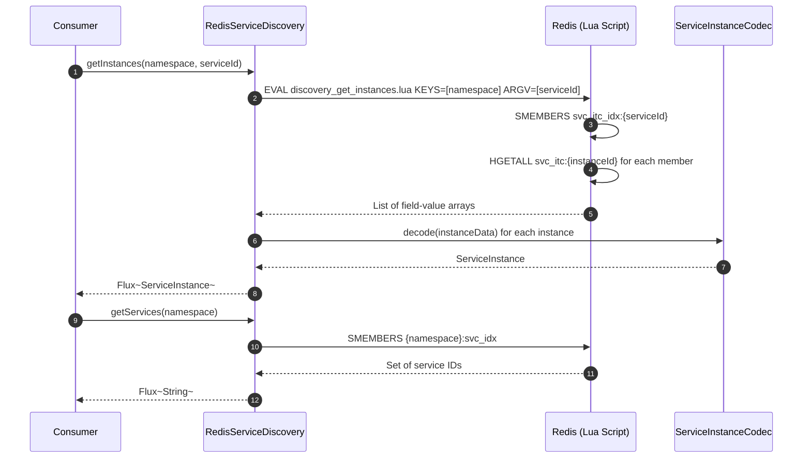
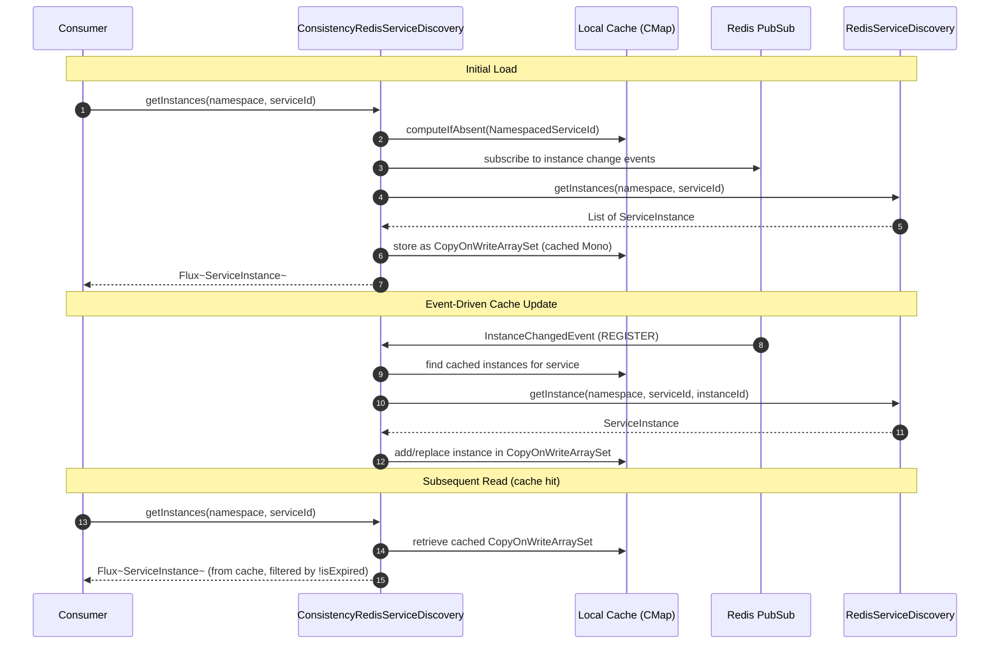
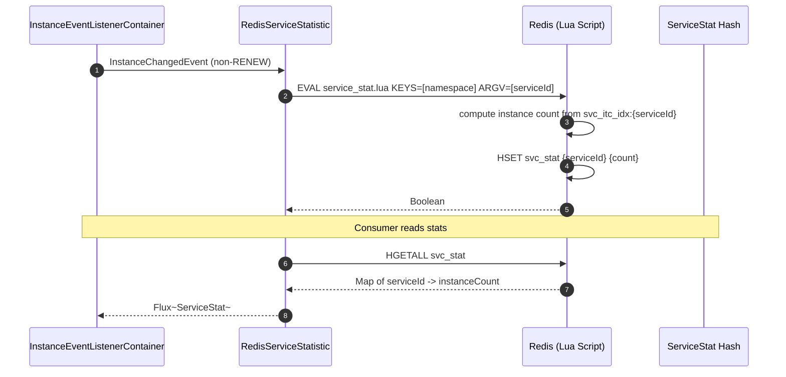
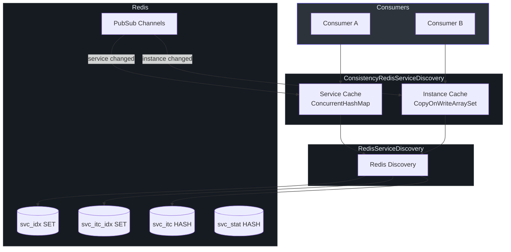

# Service Discovery

CoSky's Service Discovery layer enables consumers to locate available service instances at runtime. It provides both a standard Redis-backed discovery path and a high-performance consistency cache layer that uses Redis PubSub to maintain local state with near-zero latency. The consistency layer achieves 76M+ ops/s for `getInstances` and 455M+ ops/s for `getServices` in benchmark testing.

| Aspect | Detail |
|---|---|
| **Interface** | `ServiceDiscovery` |
| **Standard Implementation** | `RedisServiceDiscovery` |
| **Consistency Layer** | `ConsistencyRedisServiceDiscovery` |
| **Statistics** | `RedisServiceStatistic` |
| **Consistency Mechanism** | Local cache + Redis PubSub event-driven updates |
| **Concurrency Model** | Reactive (`Flux<ServiceInstance>`, `Mono<ServiceInstance>`) |

## ServiceDiscovery Interface

The [`ServiceDiscovery`](https://github.com/Ahoo-Wang/CoSky/blob/main/cosky-discovery/src/main/kotlin/me/ahoo/cosky/discovery/ServiceDiscovery.kt) interface defines four core operations for locating services and instances.

| Method | Return Type | Description | Source |
|---|---|---|---|
| `getServices` | `Flux<String>` | Lists all registered service IDs in a namespace | [ServiceDiscovery.kt:25](https://github.com/Ahoo-Wang/CoSky/blob/main/cosky-discovery/src/main/kotlin/me/ahoo/cosky/discovery/ServiceDiscovery.kt#L25) |
| `getInstances` | `Flux<ServiceInstance>` | Lists all instances for a given service ID | [ServiceDiscovery.kt:26](https://github.com/Ahoo-Wang/CoSky/blob/main/cosky-discovery/src/main/kotlin/me/ahoo/cosky/discovery/ServiceDiscovery.kt#L26) |
| `getInstance` | `Mono<ServiceInstance>` | Retrieves a specific instance by service ID and instance ID | [ServiceDiscovery.kt:27](https://github.com/Ahoo-Wang/CoSky/blob/main/cosky-discovery/src/main/kotlin/me/ahoo/cosky/discovery/ServiceDiscovery.kt#L27) |
| `getInstanceTtl` | `Mono<Long>` | Returns the TTL expiry timestamp for a specific instance | [ServiceDiscovery.kt:33](https://github.com/Ahoo-Wang/CoSky/blob/main/cosky-discovery/src/main/kotlin/me/ahoo/cosky/discovery/ServiceDiscovery.kt#L33) |

## RedisServiceDiscovery

[`RedisServiceDiscovery`](https://github.com/Ahoo-Wang/CoSky/blob/main/cosky-discovery/src/main/kotlin/me/ahoo/cosky/discovery/redis/RedisServiceDiscovery.kt) is the standard implementation that reads instance data directly from Redis on every request:

- `getServices` reads from the `svc_idx` SET using `SMEMBERS` ([RedisServiceDiscovery.kt:89](https://github.com/Ahoo-Wang/CoSky/blob/main/cosky-discovery/src/main/kotlin/me/ahoo/cosky/discovery/redis/RedisServiceDiscovery.kt#L89)).
- `getInstances` executes the `discovery_get_instances.lua` Lua script that reads all instance keys from the `svc_itc_idx:{serviceId}` SET and returns their hash data ([RedisServiceDiscovery.kt:39](https://github.com/Ahoo-Wang/CoSky/blob/main/cosky-discovery/src/main/kotlin/me/ahoo/cosky/discovery/redis/RedisServiceDiscovery.kt#L39)).
- `getInstance` executes `discovery_get_instance.lua` to fetch a single instance's hash fields ([RedisServiceDiscovery.kt:56](https://github.com/Ahoo-Wang/CoSky/blob/main/cosky-discovery/src/main/kotlin/me/ahoo/cosky/discovery/redis/RedisServiceDiscovery.kt#L56)).
- All results are decoded using [`ServiceInstanceCodec.decode`](https://github.com/Ahoo-Wang/CoSky/blob/main/cosky-discovery/src/main/kotlin/me/ahoo/cosky/discovery/ServiceInstanceCodec.kt#L57).

## ConsistencyRedisServiceDiscovery

[`ConsistencyRedisServiceDiscovery`](https://github.com/Ahoo-Wang/CoSky/blob/main/cosky-discovery/src/main/kotlin/me/ahoo/cosky/discovery/redis/ConsistencyRedisServiceDiscovery.kt) wraps any `ServiceDiscovery` delegate and adds a local cache layer that stays consistent through Redis PubSub event notifications. This is the recommended production implementation.

### Architecture

The consistency layer maintains two `ConcurrentHashMap` caches:
- `namespaceMapServices`: caches the service list per namespace, invalidated by service change events ([ConsistencyRedisServiceDiscovery.kt:57](https://github.com/Ahoo-Wang/CoSky/blob/main/cosky-discovery/src/main/kotlin/me/ahoo/cosky/discovery/redis/ConsistencyRedisServiceDiscovery.kt#L57)).
- `serviceMapInstances`: caches instances per `NamespacedServiceId`, updated incrementally by instance change events ([ConsistencyRedisServiceDiscovery.kt:54](https://github.com/Ahoo-Wang/CoSky/blob/main/cosky-discovery/src/main/kotlin/me/ahoo/cosky/discovery/redis/ConsistencyRedisServiceDiscovery.kt#L54)).

### Event-Driven Cache Updates

When an instance change occurs (register, deregister, renew, set_metadata, expired), the [`InstanceChangedEvent`](https://github.com/Ahoo-Wang/CoSky/blob/main/cosky-discovery/src/main/kotlin/me/ahoo/cosky/discovery/InstanceChangedEvent.kt) handler applies the change to the local cache:

| Event | Cache Action |
|---|---|
| `REGISTER` | Fetch full instance from delegate, add to cache set |
| `RENEW` | Fetch TTL from delegate, update `ttlAt` in cached instance |
| `SET_METADATA` | Fetch full instance from delegate, replace in cache set |
| `DEREGISTER` | Remove from cache set |
| `EXPIRED` | Remove from cache set |

This incremental approach avoids full cache rebuilds on every change ([ConsistencyRedisServiceDiscovery.kt:138](https://github.com/Ahoo-Wang/CoSky/blob/main/cosky-discovery/src/main/kotlin/me/ahoo/cosky/discovery/redis/ConsistencyRedisServiceDiscovery.kt#L138)).

### Performance

The consistency layer delivers dramatically higher throughput by serving reads from memory:

| Operation | Standard Redis | Consistency Layer | Improvement |
|---|---|---|---|
| `getInstances` | ~226K ops/s | 76M+ ops/s | ~338x |
| `getServices` | ~304K ops/s | 455M+ ops/s | ~1,495x |
| Latency (p99) | Variable (network-bound) | Sub-microsecond | Deterministic |

## ServiceStatistic

The [`ServiceStatistic`](https://github.com/Ahoo-Wang/CoSky/blob/main/cosky-discovery/src/main/kotlin/me/ahoo/cosky/discovery/ServiceStatistic.kt) interface provides service-level statistics:

| Method | Return Type | Description |
|---|---|---|
| `statService(namespace)` | `Mono<Void>` | Triggers statistics recalculation for all services |
| `statService(namespace, serviceId)` | `Mono<Void>` | Triggers statistics recalculation for a specific service |
| `getServiceStats(namespace)` | `Flux<ServiceStat>` | Returns all service statistics (service ID + instance count) |
| `getInstanceCount(namespace)` | `Mono<Long>` | Returns the total instance count across all services |

[`RedisServiceStatistic`](https://github.com/Ahoo-Wang/CoSky/blob/main/cosky-discovery/src/main/kotlin/me/ahoo/cosky/discovery/redis/RedisServiceStatistic.kt) implements this by executing Lua scripts and listening to instance change events. It filters out `RENEW` events since renewals do not change instance counts ([RedisServiceStatistic.kt:56](https://github.com/Ahoo-Wang/CoSky/blob/main/cosky-discovery/src/main/kotlin/me/ahoo/cosky/discovery/redis/RedisServiceStatistic.kt#L56)).

Each [`ServiceStat`](https://github.com/Ahoo-Wang/CoSky/blob/main/cosky-discovery/src/main/kotlin/me/ahoo/cosky/discovery/ServiceStat.kt) holds:
- `serviceId: String` -- the service identifier
- `instanceCount: Int` -- number of registered instances

## Sequence Diagrams

### Service Lookup Flow (Standard)

<!-- Sources: cosky-discovery/src/main/kotlin/me/ahoo/cosky/discovery/redis/RedisServiceDiscovery.kt:33, cosky-discovery/src/main/kotlin/me/ahoo/cosky/discovery/redis/RedisServiceDiscovery.kt:89, cosky-discovery/src/main/resources/discovery_get_instances.lua -->

### Consistency Cache Update Flow

<!-- Sources: cosky-discovery/src/main/kotlin/me/ahoo/cosky/discovery/redis/ConsistencyRedisServiceDiscovery.kt:86, cosky-discovery/src/main/kotlin/me/ahoo/cosky/discovery/redis/ConsistencyRedisServiceDiscovery.kt:138, cosky-discovery/src/main/kotlin/me/ahoo/cosky/discovery/redis/ConsistencyRedisServiceDiscovery.kt:54 -->

### Statistics Collection Flow

<!-- Sources: cosky-discovery/src/main/kotlin/me/ahoo/cosky/discovery/redis/RedisServiceStatistic.kt:52, cosky-discovery/src/main/kotlin/me/ahoo/cosky/discovery/redis/RedisServiceStatistic.kt:96, cosky-discovery/src/main/resources/service_stat.lua -->

## Architecture Diagram

<!-- Sources: cosky-discovery/src/main/kotlin/me/ahoo/cosky/discovery/redis/ConsistencyRedisServiceDiscovery.kt:43, cosky-discovery/src/main/kotlin/me/ahoo/cosky/discovery/redis/RedisServiceDiscovery.kt:29, cosky-discovery/src/main/kotlin/me/ahoo/cosky/discovery/DiscoveryKeyGenerator.kt:22 -->

## Related Pages

- [Service Registry](./service-registry) -- How instances are registered and kept alive
- [Load Balancers](./load-balancers) -- How discovered instances are selected
- [Service Topology](./service-topology) -- How service dependencies are tracked

## References

- [ServiceDiscovery.kt](https://github.com/Ahoo-Wang/CoSky/blob/main/cosky-discovery/src/main/kotlin/me/ahoo/cosky/discovery/ServiceDiscovery.kt)
- [RedisServiceDiscovery.kt](https://github.com/Ahoo-Wang/CoSky/blob/main/cosky-discovery/src/main/kotlin/me/ahoo/cosky/discovery/redis/RedisServiceDiscovery.kt)
- [ConsistencyRedisServiceDiscovery.kt](https://github.com/Ahoo-Wang/CoSky/blob/main/cosky-discovery/src/main/kotlin/me/ahoo/cosky/discovery/redis/ConsistencyRedisServiceDiscovery.kt)
- [ServiceStatistic.kt](https://github.com/Ahoo-Wang/CoSky/blob/main/cosky-discovery/src/main/kotlin/me/ahoo/cosky/discovery/ServiceStatistic.kt)
- [RedisServiceStatistic.kt](https://github.com/Ahoo-Wang/CoSky/blob/main/cosky-discovery/src/main/kotlin/me/ahoo/cosky/discovery/redis/RedisServiceStatistic.kt)
- [ServiceStat.kt](https://github.com/Ahoo-Wang/CoSky/blob/main/cosky-discovery/src/main/kotlin/me/ahoo/cosky/discovery/ServiceStat.kt)
- [InstanceChangedEvent.kt](https://github.com/Ahoo-Wang/CoSky/blob/main/cosky-discovery/src/main/kotlin/me/ahoo/cosky/discovery/InstanceChangedEvent.kt)
- [ServiceInstanceCodec.kt](https://github.com/Ahoo-Wang/CoSky/blob/main/cosky-discovery/src/main/kotlin/me/ahoo/cosky/discovery/ServiceInstanceCodec.kt)
- [DiscoveryKeyGenerator.kt](https://github.com/Ahoo-Wang/CoSky/blob/main/cosky-discovery/src/main/kotlin/me/ahoo/cosky/discovery/DiscoveryKeyGenerator.kt)
- [discovery_get_instances.lua](https://github.com/Ahoo-Wang/CoSky/blob/main/cosky-discovery/src/main/resources/discovery_get_instances.lua)
- [discovery_get_instance.lua](https://github.com/Ahoo-Wang/CoSky/blob/main/cosky-discovery/src/main/resources/discovery_get_instance.lua)
