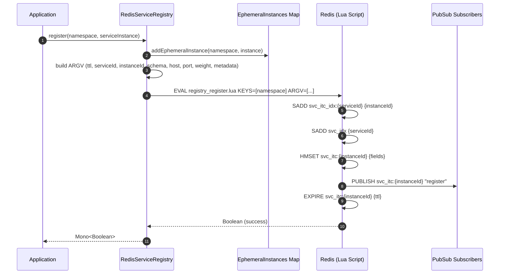
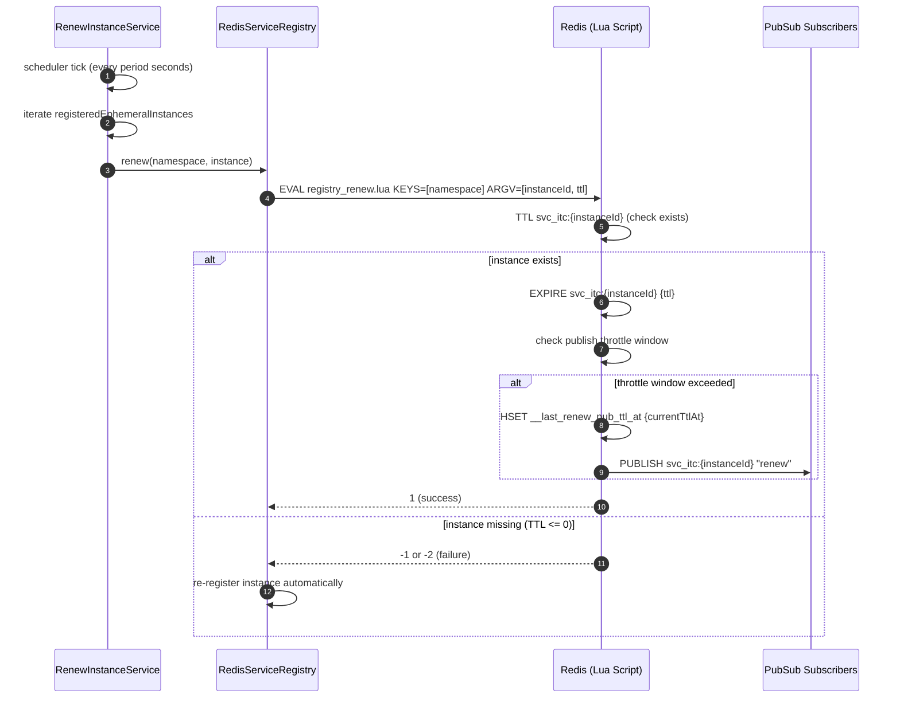
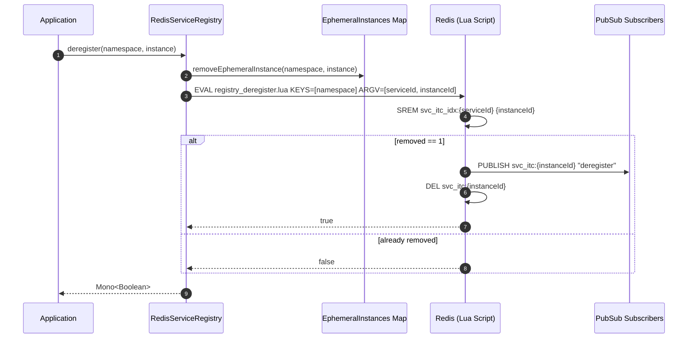
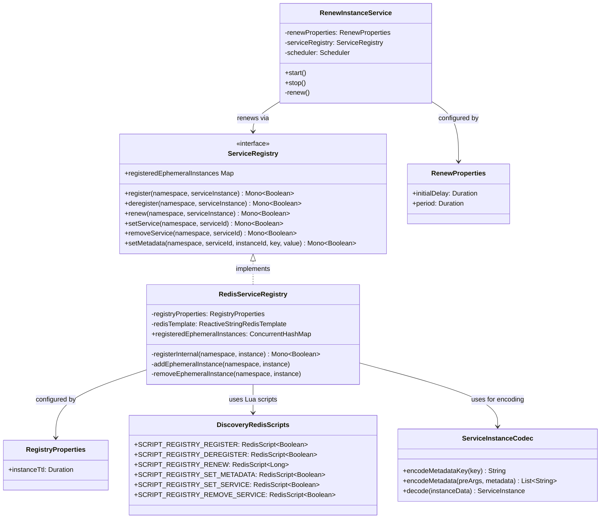

# Service Registry

CoSky's Service Registry manages the lifecycle of service instances within a microservice cluster. Backed by Redis and Lua scripts, it provides atomic, race-condition-free registration, deregistration, heartbeat renewal, and metadata management -- all operating within a multi-tenant namespace model.

| Aspect | Detail |
|---|---|
| **Interface** | `ServiceRegistry` |
| **Redis Implementation** | `RedisServiceRegistry` |
| **Storage Engine** | Redis Hash + Set + Lua scripts |
| **Concurrency Model** | Reactive (`Mono<Boolean>`) |
| **Heartbeat** | `RenewInstanceService` (scheduled keep-alive) |
| **Serialization** | `ServiceInstanceCodec` |

## ServiceRegistry Interface

The [`ServiceRegistry`](https://github.com/Ahoo-Wang/CoSky/blob/main/cosky-discovery/src/main/kotlin/me/ahoo/cosky/discovery/ServiceRegistry.kt) interface defines the contract for all registry operations.

| Method | Return Type | Description | Source |
|---|---|---|---|
| `register` | `Mono<Boolean>` | Registers a service instance with optional TTL | [ServiceRegistry.kt:33](https://github.com/Ahoo-Wang/CoSky/blob/main/cosky-discovery/src/main/kotlin/me/ahoo/cosky/discovery/ServiceRegistry.kt#L33) |
| `deregister` | `Mono<Boolean>` | Removes a service instance from the registry | [ServiceRegistry.kt:43](https://github.com/Ahoo-Wang/CoSky/blob/main/cosky-discovery/src/main/kotlin/me/ahoo/cosky/discovery/ServiceRegistry.kt#L43) |
| `renew` | `Mono<Boolean>` | Renews/extends the TTL of an ephemeral instance | [ServiceRegistry.kt:41](https://github.com/Ahoo-Wang/CoSky/blob/main/cosky-discovery/src/main/kotlin/me/ahoo/cosky/discovery/ServiceRegistry.kt#L41) |
| `setService` | `Mono<Boolean>` | Creates a named service entry in the namespace index | [ServiceRegistry.kt:24](https://github.com/Ahoo-Wang/CoSky/blob/main/cosky-discovery/src/main/kotlin/me/ahoo/cosky/discovery/ServiceRegistry.kt#L24) |
| `removeService` | `Mono<Boolean>` | Removes a named service from the namespace index | [ServiceRegistry.kt:25](https://github.com/Ahoo-Wang/CoSky/blob/main/cosky-discovery/src/main/kotlin/me/ahoo/cosky/discovery/ServiceRegistry.kt#L25) |
| `setMetadata` | `Mono<Boolean>` | Sets metadata key-value pairs on a service instance | [ServiceRegistry.kt:53](https://github.com/Ahoo-Wang/CoSky/blob/main/cosky-discovery/src/main/kotlin/me/ahoo/cosky/discovery/ServiceRegistry.kt#L53) |

## ServiceInstance Data Model

A [`ServiceInstance`](https://github.com/Ahoo-Wang/CoSky/blob/main/cosky-discovery/src/main/kotlin/me/ahoo/cosky/discovery/ServiceInstance.kt) extends the base [`Instance`](https://github.com/Ahoo-Wang/CoSky/blob/main/cosky-discovery/src/main/kotlin/me/ahoo/cosky/discovery/Instance.kt) interface and carries the following fields:

| Field | Type | Default | Description |
|---|---|---|---|
| `instanceId` | `String` | -- | Unique identifier: `{serviceId}@{schema}#{host}#{port}` |
| `serviceId` | `String` | -- | Logical service name |
| `schema` | `String` | -- | Protocol schema (`http`, `https`, etc.) |
| `host` | `String` | -- | Host address |
| `port` | `Int` | -- | Port number |
| `weight` | `Int` | `1` | Load balancer weight |
| `isEphemeral` | `Boolean` | `true` | Ephemeral instances expire; persistent instances do not |
| `ttlAt` | `Long` | `TTL_AT_FOREVER (-1)` | Absolute TTL expiry timestamp (epoch seconds) |
| `metadata` | `Map<String, String>` | `emptyMap()` | Arbitrary key-value metadata attached to the instance |

The `isExpired` property on `ServiceInstance` compares `ttlAt` against the current system time to determine whether an ephemeral instance has expired ([ServiceInstance.kt:34](https://github.com/Ahoo-Wang/CoSky/blob/main/cosky-discovery/src/main/kotlin/me/ahoo/cosky/discovery/ServiceInstance.kt#L34)).

### ServiceInstanceCodec Serialization

[`ServiceInstanceCodec`](https://github.com/Ahoo-Wang/CoSky/blob/main/cosky-discovery/src/main/kotlin/me/ahoo/cosky/discovery/ServiceInstanceCodec.kt) handles encoding and decoding of instance data to/from Redis hash fields. It uses a `_` prefix for metadata keys and reserves `__` for system metadata:

```kotlin
// Encoding: metadata key "version" becomes "_version" in Redis
fun encodeMetadataKey(key: String): String = METADATA_PREFIX + key
```

The `decode` function ([ServiceInstanceCodec.kt:57](https://github.com/Ahoo-Wang/CoSky/blob/main/cosky-discovery/src/main/kotlin/me/ahoo/cosky/discovery/ServiceInstanceCodec.kt#L57)) parses the flat key-value list returned by Redis `HGETALL` into a `ServiceInstance` object.

## Redis Implementation

### RedisServiceRegistry

[`RedisServiceRegistry`](https://github.com/Ahoo-Wang/CoSky/blob/main/cosky-discovery/src/main/kotlin/me/ahoo/cosky/discovery/redis/RedisServiceRegistry.kt) is the Redis-backed implementation of `ServiceRegistry`. It uses Lua scripts for atomic operations and maintains an in-memory map of registered ephemeral instances:

```kotlin
class RedisServiceRegistry(
    private val registryProperties: RegistryProperties,
    private val redisTemplate: ReactiveStringRedisTemplate
) : ServiceRegistry
```

Key design points:
- Ephemeral instances are tracked in a `ConcurrentHashMap<NamespacedInstanceId, ServiceInstance>` for heartbeat renewal ([RedisServiceRegistry.kt:40](https://github.com/Ahoo-Wang/CoSky/blob/main/cosky-discovery/src/main/kotlin/me/ahoo/cosky/discovery/redis/RedisServiceRegistry.kt#L40)).
- The `register` method adds to the ephemeral map before executing the Lua script ([RedisServiceRegistry.kt:98](https://github.com/Ahoo-Wang/CoSky/blob/main/cosky-discovery/src/main/kotlin/me/ahoo/cosky/discovery/redis/RedisServiceRegistry.kt#L98)).
- If a renew fails (instance key missing), it automatically re-registers the instance ([RedisServiceRegistry.kt:178](https://github.com/Ahoo-Wang/CoSky/blob/main/cosky-discovery/src/main/kotlin/me/ahoo/cosky/discovery/redis/RedisServiceRegistry.kt#L178)).

### DiscoveryRedisScripts

[`DiscoveryRedisScripts`](https://github.com/Ahoo-Wang/CoSky/blob/main/cosky-discovery/src/main/kotlin/me/ahoo/cosky/discovery/redis/DiscoveryRedisScripts.kt) loads all registry-related Lua scripts from the classpath:

| Script | Resource File | Purpose |
|---|---|---|
| `SCRIPT_REGISTRY_REGISTER` | `registry_register.lua` | Atomic instance registration |
| `SCRIPT_REGISTRY_DEREGISTER` | `registry_deregister.lua` | Atomic instance removal |
| `SCRIPT_REGISTRY_RENEW` | `registry_renew.lua` | TTL renewal with publish throttling |
| `SCRIPT_REGISTRY_SET_METADATA` | `registry_set_metadata.lua` | Set instance metadata fields |
| `SCRIPT_REGISTRY_SET_SERVICE` | `registry_set_service.lua` | Create service in namespace index |
| `SCRIPT_REGISTRY_REMOVE_SERVICE` | `registry_remove_service.lua` | Remove service from namespace index |

### RegistryProperties

[`RegistryProperties`](https://github.com/Ahoo-Wang/CoSky/blob/main/cosky-discovery/src/main/kotlin/me/ahoo/cosky/discovery/RegistryProperties.kt) configures the default instance TTL:

| Property | Type | Default | Description |
|---|---|---|---|
| `instanceTtl` | `Duration` | `1 minute` | Time-to-live for ephemeral instances |

## RenewInstanceService (Heartbeat)

[`RenewInstanceService`](https://github.com/Ahoo-Wang/CoSky/blob/main/cosky-discovery/src/main/kotlin/me/ahoo/cosky/discovery/RenewInstanceService.kt) provides the keep-alive mechanism for ephemeral instances. It runs on a dedicated scheduler (`CoSky-Renew`) and periodically renews all registered ephemeral instances:

| Property | Default | Description |
|---|---|---|
| `initialDelay` | `1 second` | Delay before first renewal cycle |
| `period` | `10 seconds` | Interval between renewal cycles |

The renewal period must be less than `RegistryProperties.instanceTtl` to prevent premature expiration. The service iterates all `registeredEphemeralInstances` and calls `renew` on each one via the `ServiceRegistry` ([RenewInstanceService.kt:70](https://github.com/Ahoo-Wang/CoSky/blob/main/cosky-discovery/src/main/kotlin/me/ahoo/cosky/discovery/RenewInstanceService.kt#L70)).

## Sequence Diagrams

### Register Flow



<!-- Sources: cosky-discovery/src/main/resources/registry_register.lua, cosky-discovery/src/main/kotlin/me/ahoo/cosky/discovery/redis/RedisServiceRegistry.kt:43, cosky-discovery/src/main/kotlin/me/ahoo/cosky/discovery/redis/DiscoveryRedisScripts.kt:26 -->

### Renew / Heartbeat Flow



<!-- Sources: cosky-discovery/src/main/resources/registry_renew.lua, cosky-discovery/src/main/kotlin/me/ahoo/cosky/discovery/RenewInstanceService.kt:70, cosky-discovery/src/main/kotlin/me/ahoo/cosky/discovery/redis/RedisServiceRegistry.kt:160 -->

### Deregister Flow



<!-- Sources: cosky-discovery/src/main/resources/registry_deregister.lua, cosky-discovery/src/main/kotlin/me/ahoo/cosky/discovery/redis/RedisServiceRegistry.kt:188, cosky-discovery/src/main/kotlin/me/ahoo/cosky/discovery/redis/DiscoveryRedisScripts.kt:29 -->

## Redis Key Structure

The registry uses a structured key pattern for organizing service and instance data within each namespace:

| Redis Key | Type | Purpose | Example |
|---|---|---|---|
| `{namespace}:svc_idx` | SET | Set of all service IDs in the namespace | `production:svc_idx` |
| `{namespace}:svc_stat` | HASH | Service ID to instance count statistics | `production:svc_stat` |
| `{namespace}:svc_itc_idx:{serviceId}` | SET | Set of instance IDs for a given service | `production:svc_itc_idx:order-service` |
| `{namespace}:svc_itc:{instanceId}` | HASH | Instance data (fields: instanceId, serviceId, schema, host, port, weight, ephemeral, ttl_at, metadata) | `production:svc_itc:order-service@http#10.0.1.5#8080` |
| `{namespace}:topology_idx` | HASH | Topology index: consumer name to timestamp | `production:topology_idx` |
| `{namespace}:topology:{consumer}` | HASH | Topology deps: producer name to timestamp | `production:topology:gateway-service` |

The instance ID format is `{serviceId}@{schema}#{host}#{port}` (e.g., `order-service@http#10.0.1.5#8080`), as defined in [`Instance.asInstanceId`](https://github.com/Ahoo-Wang/CoSky/blob/main/cosky-discovery/src/main/kotlin/me/ahoo/cosky/discovery/Instance.kt#L57).

## Class Diagram



<!-- Sources: cosky-discovery/src/main/kotlin/me/ahoo/cosky/discovery/ServiceRegistry.kt:23, cosky-discovery/src/main/kotlin/me/ahoo/cosky/discovery/redis/RedisServiceRegistry.kt:32, cosky-discovery/src/main/kotlin/me/ahoo/cosky/discovery/RegistryProperties.kt:22, cosky-discovery/src/main/kotlin/me/ahoo/cosky/discovery/RenewInstanceService.kt:34, cosky-discovery/src/main/kotlin/me/ahoo/cosky/discovery/RenewProperties.kt:22, cosky-discovery/src/main/kotlin/me/ahoo/cosky/discovery/redis/DiscoveryRedisScripts.kt:24 -->

## Related Pages

- [Service Discovery](./service-discovery) -- How clients discover registered instances
- [Load Balancers](./load-balancers) -- How instances are selected from the registry
- [Service Topology](./service-topology) -- How service dependency graphs are built

## References

- [ServiceRegistry.kt](https://github.com/Ahoo-Wang/CoSky/blob/main/cosky-discovery/src/main/kotlin/me/ahoo/cosky/discovery/ServiceRegistry.kt)
- [ServiceInstance.kt](https://github.com/Ahoo-Wang/CoSky/blob/main/cosky-discovery/src/main/kotlin/me/ahoo/cosky/discovery/ServiceInstance.kt)
- [ServiceInstanceCodec.kt](https://github.com/Ahoo-Wang/CoSky/blob/main/cosky-discovery/src/main/kotlin/me/ahoo/cosky/discovery/ServiceInstanceCodec.kt)
- [Instance.kt](https://github.com/Ahoo-Wang/CoSky/blob/main/cosky-discovery/src/main/kotlin/me/ahoo/cosky/discovery/Instance.kt)
- [RedisServiceRegistry.kt](https://github.com/Ahoo-Wang/CoSky/blob/main/cosky-discovery/src/main/kotlin/me/ahoo/cosky/discovery/redis/RedisServiceRegistry.kt)
- [DiscoveryRedisScripts.kt](https://github.com/Ahoo-Wang/CoSky/blob/main/cosky-discovery/src/main/kotlin/me/ahoo/cosky/discovery/redis/DiscoveryRedisScripts.kt)
- [RegistryProperties.kt](https://github.com/Ahoo-Wang/CoSky/blob/main/cosky-discovery/src/main/kotlin/me/ahoo/cosky/discovery/RegistryProperties.kt)
- [RenewInstanceService.kt](https://github.com/Ahoo-Wang/CoSky/blob/main/cosky-discovery/src/main/kotlin/me/ahoo/cosky/discovery/RenewInstanceService.kt)
- [RenewProperties.kt](https://github.com/Ahoo-Wang/CoSky/blob/main/cosky-discovery/src/main/kotlin/me/ahoo/cosky/discovery/RenewProperties.kt)
- [DiscoveryKeyGenerator.kt](https://github.com/Ahoo-Wang/CoSky/blob/main/cosky-discovery/src/main/kotlin/me/ahoo/cosky/discovery/DiscoveryKeyGenerator.kt)
- [registry_register.lua](https://github.com/Ahoo-Wang/CoSky/blob/main/cosky-discovery/src/main/resources/registry_register.lua)
- [registry_renew.lua](https://github.com/Ahoo-Wang/CoSky/blob/main/cosky-discovery/src/main/resources/registry_renew.lua)
- [registry_deregister.lua](https://github.com/Ahoo-Wang/CoSky/blob/main/cosky-discovery/src/main/resources/registry_deregister.lua)
