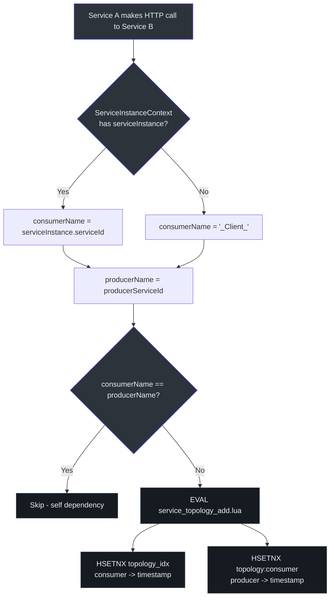
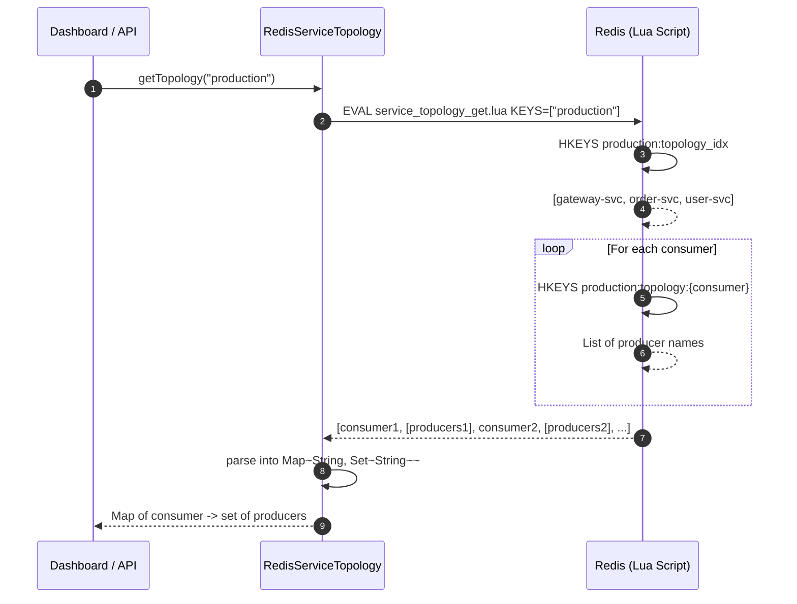
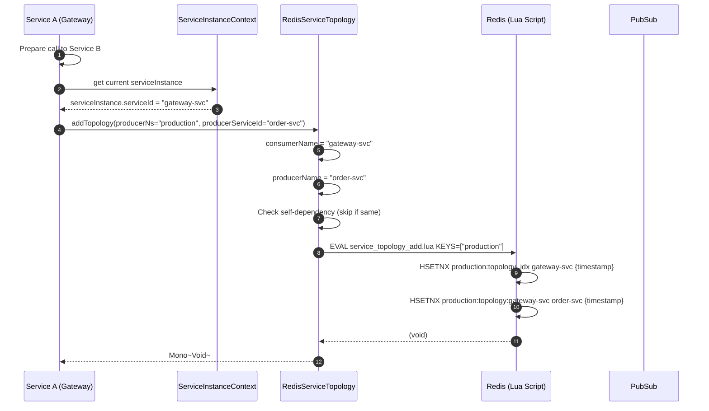
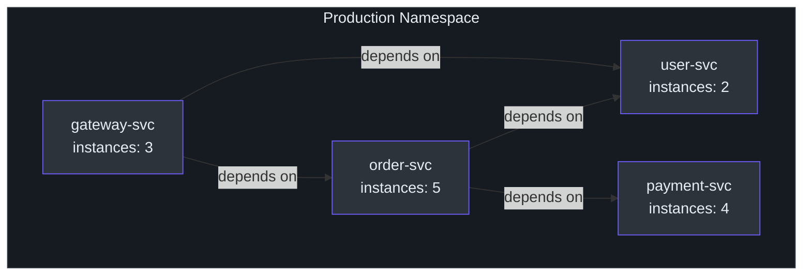
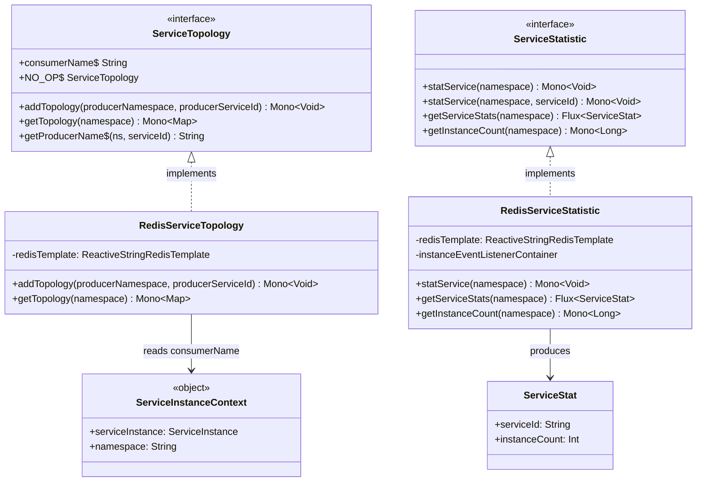

# Service Topology

CoSky's Service Topology module automatically builds a dependency graph of your microservice ecosystem. When one service calls another, the caller's identity (consumer) and the target's identity (producer) are recorded in Redis. This enables you to visualize which services depend on which, track cross-namespace dependencies, and monitor service-level instance statistics -- all without any manual configuration.

| Aspect | Detail |
|---|---|
| **Interface** | `ServiceTopology` |
| **Redis Implementation** | `RedisServiceTopology` |
| **Storage Engine** | Redis Hash (`topology_idx` + `topology:{consumer}`) |
| **Consumer Identity** | From `ServiceInstanceContext.serviceInstance` |
| **Concurrency Model** | Reactive (`Mono<Map<String, Set<String>>>`) |

## ServiceTopology Interface

The [`ServiceTopology`](https://github.com/Ahoo-Wang/CoSky/blob/main/cosky-discovery/src/main/kotlin/me/ahoo/cosky/discovery/ServiceTopology.kt) interface defines two operations:

| Method | Return Type | Description | Source |
|---|---|---|---|
| `addTopology` | `Mono<Void>` | Records that the current service depends on a producer service | [ServiceTopology.kt:23](https://github.com/Ahoo-Wang/CoSky/blob/main/cosky-discovery/src/main/kotlin/me/ahoo/cosky/discovery/ServiceTopology.kt#L23) |
| `getTopology` | `Mono<Map<String, Set<String>>>` | Retrieves the full topology graph for a namespace | [ServiceTopology.kt:24](https://github.com/Ahoo-Wang/CoSky/blob/main/cosky-discovery/src/main/kotlin/me/ahoo/cosky/discovery/ServiceTopology.kt#L24) |

The interface also provides:
- A `NO_OP` singleton that does nothing, used when topology tracking is disabled ([ServiceTopology.kt:27](https://github.com/Ahoo-Wang/CoSky/blob/main/cosky-discovery/src/main/kotlin/me/ahoo/cosky/discovery/ServiceTopology.kt#L27)).
- `consumerName` derived from `ServiceInstanceContext.serviceInstance.serviceId`, falling back to `"_Client_"` if no instance is registered ([ServiceTopology.kt:39](https://github.com/Ahoo-Wang/CoSky/blob/main/cosky-discovery/src/main/kotlin/me/ahoo/cosky/discovery/ServiceTopology.kt#L39)).
- `getProducerName` which prefixes the namespace if the producer is in a different namespace (e.g., `"otherNs.order-service"`) ([ServiceTopology.kt:48](https://github.com/Ahoo-Wang/CoSky/blob/main/cosky-discovery/src/main/kotlin/me/ahoo/cosky/discovery/ServiceTopology.kt#L48)).

## RedisServiceTopology

[`RedisServiceTopology`](https://github.com/Ahoo-Wang/CoSky/blob/main/cosky-discovery/src/main/kotlin/me/ahoo/cosky/discovery/redis/RedisServiceTopology.kt) stores topology data in two Redis hash structures:

### addTopology

The `addTopology` method ([RedisServiceTopology.kt:11](https://github.com/Ahoo-Wang/CoSky/blob/main/cosky-discovery/src/main/kotlin/me/ahoo/cosky/discovery/redis/RedisServiceTopology.kt#L11)) executes `service_topology_add.lua`, which:
1. Records the consumer name in the topology index: `HSETNX {namespace}:topology_idx {consumerName} {timestamp}`
2. Records the producer dependency: `HSETNX {namespace}:topology:{consumerName} {producerName} {timestamp}`

Self-dependencies (consumer == producer) are skipped ([RedisServiceTopology.kt:15](https://github.com/Ahoo-Wang/CoSky/blob/main/cosky-discovery/src/main/kotlin/me/ahoo/cosky/discovery/redis/RedisServiceTopology.kt#L15)).

### getTopology

The `getTopology` method ([RedisServiceTopology.kt:26](https://github.com/Ahoo-Wang/CoSky/blob/main/cosky-discovery/src/main/kotlin/me/ahoo/cosky/discovery/redis/RedisServiceTopology.kt#L26)) executes `service_topology_get.lua`, which:
1. Reads all consumer names from `{namespace}:topology_idx` via `HKEYS`
2. For each consumer, reads their dependency set from `{namespace}:topology:{consumerName}` via `HKEYS`
3. Returns the result as `Map<String, Set<String>>` -- mapping each consumer to its set of producers

## Topology Building Process

<!-- Sources: cosky-discovery/src/main/kotlin/me/ahoo/cosky/discovery/ServiceTopology.kt:39, cosky-discovery/src/main/kotlin/me/ahoo/cosky/discovery/redis/RedisServiceTopology.kt:11, cosky-discovery/src/main/resources/service_topology_add.lua -->

## Sequence Diagram: Topology Query Flow

<!-- Sources: cosky-discovery/src/main/kotlin/me/ahoo/cosky/discovery/redis/RedisServiceTopology.kt:26, cosky-discovery/src/main/resources/service_topology_get.lua -->

## Sequence Diagram: Topology Recording Flow

<!-- Sources: cosky-discovery/src/main/kotlin/me/ahoo/cosky/discovery/redis/RedisServiceTopology.kt:11, cosky-discovery/src/main/kotlin/me/ahoo/cosky/discovery/ServiceTopology.kt:48, cosky-discovery/src/main/kotlin/me/ahoo/cosky/discovery/ServiceInstanceContext.kt:23 -->

## Redis Key Patterns

| Redis Key | Type | Purpose | Lua Script |
|---|---|---|---|
| `{namespace}:topology_idx` | HASH | Maps consumer service names to first-seen timestamps | `service_topology_add.lua` |
| `{namespace}:topology:{consumer}` | HASH | Maps producer service names to first-seen timestamps for a given consumer | `service_topology_add.lua` |

Cross-namespace producer names are formatted as `{producerNamespace}.{producerServiceId}` by [`ServiceTopology.getProducerName`](https://github.com/Ahoo-Wang/CoSky/blob/main/cosky-discovery/src/main/kotlin/me/ahoo/cosky/discovery/ServiceTopology.kt#L48). This allows the topology graph to distinguish between same-name services in different namespaces.

## Service Stat Integration

The [`ServiceStat`](https://github.com/Ahoo-Wang/CoSky/blob/main/cosky-discovery/src/main/kotlin/me/ahoo/cosky/discovery/ServiceStat.kt) data class pairs with the topology view to show per-service instance counts. The `RedisServiceStatistic` maintains a `{namespace}:svc_stat` hash where each entry maps a `serviceId` to its `instanceCount`.

Statistics are automatically recalculated when instance events occur (excluding renewals), driven by the Lua `service_stat.lua` script. This integration allows the dashboard to display both the dependency graph and the health/load of each node in the topology.

<!-- Sources: cosky-discovery/src/main/kotlin/me/ahoo/cosky/discovery/ServiceStat.kt:20, cosky-discovery/src/main/kotlin/me/ahoo/cosky/discovery/redis/RedisServiceTopology.kt:10, cosky-discovery/src/main/kotlin/me/ahoo/cosky/discovery/redis/RedisServiceStatistic.kt:96 -->

## Dashboard Integration

The topology data powers the CoSky dashboard's service topology visualization. The dashboard calls `getTopology(namespace)` to retrieve the full dependency graph and `getServiceStats(namespace)` to display instance counts per service. Together, these produce an interactive graph showing:

- Service nodes with their instance counts
- Directed edges representing call dependencies
- Cross-namespace relationships (shown as `{namespace}.{serviceId}`)

## Class Diagram

<!-- Sources: cosky-discovery/src/main/kotlin/me/ahoo/cosky/discovery/ServiceTopology.kt:22, cosky-discovery/src/main/kotlin/me/ahoo/cosky/discovery/redis/RedisServiceTopology.kt:10, cosky-discovery/src/main/kotlin/me/ahoo/cosky/discovery/ServiceStat.kt:20, cosky-discovery/src/main/kotlin/me/ahoo/cosky/discovery/ServiceStatistic.kt:23, cosky-discovery/src/main/kotlin/me/ahoo/cosky/discovery/redis/RedisServiceStatistic.kt:33, cosky-discovery/src/main/kotlin/me/ahoo/cosky/discovery/ServiceInstanceContext.kt:23 -->

## Related Pages

- [Service Registry](./service-registry) -- How service instances are registered (which feeds topology data)
- [Service Discovery](./service-discovery) -- How instances are discovered by consumers
- [Load Balancers](./load-balancers) -- How instances are selected from discovered services

## References

- [ServiceTopology.kt](https://github.com/Ahoo-Wang/CoSky/blob/main/cosky-discovery/src/main/kotlin/me/ahoo/cosky/discovery/ServiceTopology.kt)
- [RedisServiceTopology.kt](https://github.com/Ahoo-Wang/CoSky/blob/main/cosky-discovery/src/main/kotlin/me/ahoo/cosky/discovery/redis/RedisServiceTopology.kt)
- [ServiceStat.kt](https://github.com/Ahoo-Wang/CoSky/blob/main/cosky-discovery/src/main/kotlin/me/ahoo/cosky/discovery/ServiceStat.kt)
- [ServiceStatistic.kt](https://github.com/Ahoo-Wang/CoSky/blob/main/cosky-discovery/src/main/kotlin/me/ahoo/cosky/discovery/ServiceStatistic.kt)
- [RedisServiceStatistic.kt](https://github.com/Ahoo-Wang/CoSky/blob/main/cosky-discovery/src/main/kotlin/me/ahoo/cosky/discovery/redis/RedisServiceStatistic.kt)
- [ServiceInstanceContext.kt](https://github.com/Ahoo-Wang/CoSky/blob/main/cosky-discovery/src/main/kotlin/me/ahoo/cosky/discovery/ServiceInstanceContext.kt)
- [service_topology_add.lua](https://github.com/Ahoo-Wang/CoSky/blob/main/cosky-discovery/src/main/resources/service_topology_add.lua)
- [service_topology_get.lua](https://github.com/Ahoo-Wang/CoSky/blob/main/cosky-discovery/src/main/resources/service_topology_get.lua)
- [service_stat.lua](https://github.com/Ahoo-Wang/CoSky/blob/main/cosky-discovery/src/main/resources/service_stat.lua)
