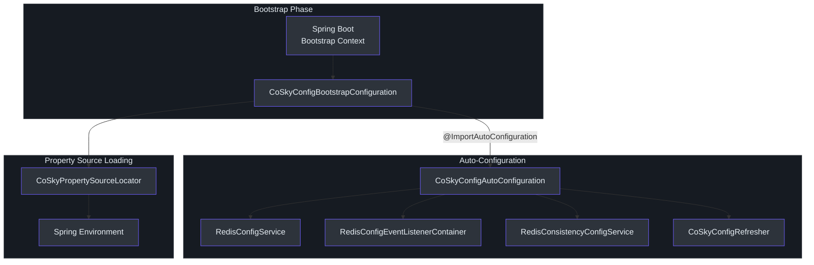
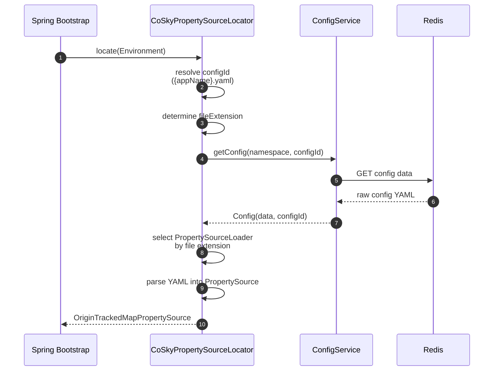
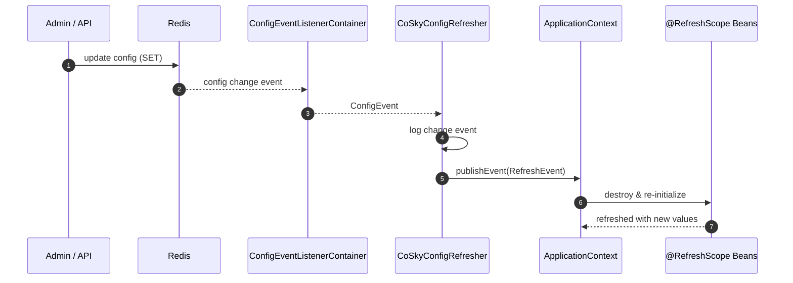
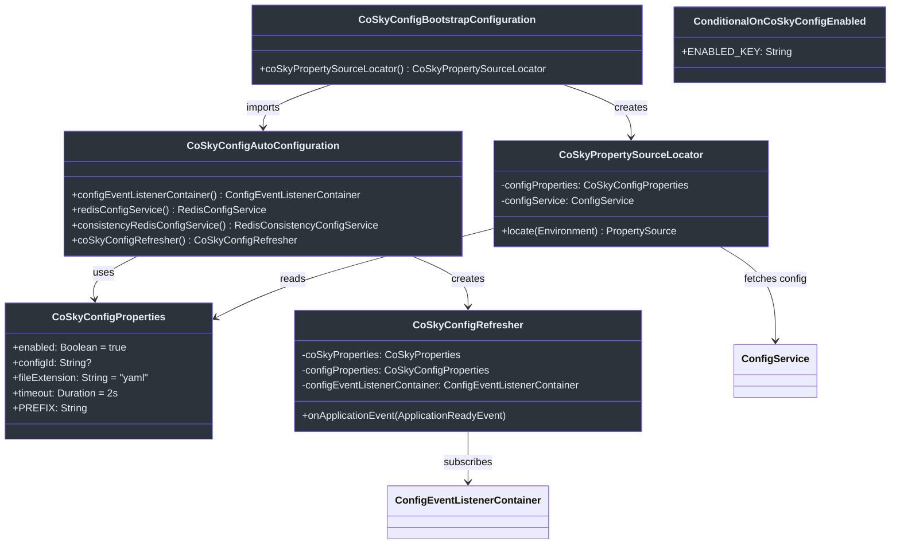

# Spring Cloud Config Starter

CoSky's Spring Cloud Config Starter bridges the gap between CoSky's Redis-backed configuration center and the Spring Cloud Config model. Instead of running a dedicated config server, services fetch their configuration directly from Redis during the Spring Boot bootstrap phase, and any change to the config in Redis is automatically pushed to the application at runtime. This eliminates the need for a separate config-server deployment while keeping the full power of Spring's `@RefreshScope` and `PropertySource` abstractions.

## At a Glance

| Component | Responsibility | Key File | Source |
|---|---|---|---|
| **CoSkyConfigProperties** | Binds `spring.cloud.cosky.config.*` properties | `CoSkyConfigProperties.kt` | [cosky-spring-cloud-starter-config/.../CoSkyConfigProperties.kt:25](https://github.com/Ahoo-Wang/CoSky/blob/main/cosky-spring-cloud-starter-config/src/main/kotlin/me/ahoo/cosky/config/spring/cloud/CoSkyConfigProperties.kt#L25) |
| **CoSkyConfigBootstrapConfiguration** | Bootstrap entry point; creates `PropertySourceLocator` | `CoSkyConfigBootstrapConfiguration.kt` | [cosky-spring-cloud-starter-config/.../CoSkyConfigBootstrapConfiguration.kt:27](https://github.com/Ahoo-Wang/CoSky/blob/main/cosky-spring-cloud-starter-config/src/main/kotlin/me/ahoo/cosky/config/spring/cloud/CoSkyConfigBootstrapConfiguration.kt#L27) |
| **CoSkyConfigAutoConfiguration** | Wires `ConfigService`, event listener, and refresher beans | `CoSkyConfigAutoConfiguration.kt` | [cosky-spring-cloud-starter-config/.../CoSkyConfigAutoConfiguration.kt:43](https://github.com/Ahoo-Wang/CoSky/blob/main/cosky-spring-cloud-starter-config/src/main/kotlin/me/ahoo/cosky/config/spring/cloud/CoSkyConfigAutoConfiguration.kt#L43) |
| **CoSkyPropertySourceLocator** | Loads config from Redis into Spring `Environment` | `CoSkyPropertySourceLocator.kt` | [cosky-spring-cloud-starter-config/.../CoSkyPropertySourceLocator.kt:35](https://github.com/Ahoo-Wang/CoSky/blob/main/cosky-spring-cloud-starter-config/src/main/kotlin/me/ahoo/cosky/config/spring/cloud/CoSkyPropertySourceLocator.kt#L35) |
| **CoSkyConfigRefresher** | Listens for config changes and triggers Spring `RefreshEvent` | `CoSkyConfigRefresher.kt` | [cosky-spring-cloud-starter-config/.../refresh/CoSkyConfigRefresher.kt:33](https://github.com/Ahoo-Wang/CoSky/blob/main/cosky-spring-cloud-starter-config/src/main/kotlin/me/ahoo/cosky/config/spring/cloud/refresh/CoSkyConfigRefresher.kt#L33) |
| **ConditionalOnCoSkyConfigEnabled** | Conditional activation based on `enabled` property | `ConditionalOnCoSkyConfigEnabled.kt` | [cosky-spring-cloud-starter-config/.../ConditionalOnCoSkyConfigEnabled.kt:29](https://github.com/Ahoo-Wang/CoSky/blob/main/cosky-spring-cloud-starter-config/src/main/kotlin/me/ahoo/cosky/config/spring/cloud/ConditionalOnCoSkyConfigEnabled.kt#L29) |

## Configuration Properties

All properties live under the `spring.cloud.cosky.config` prefix, bound by [CoSkyConfigProperties.kt:24](https://github.com/Ahoo-Wang/CoSky/blob/main/cosky-spring-cloud-starter-config/src/main/kotlin/me/ahoo/cosky/config/spring/cloud/CoSkyConfigProperties.kt#L24).

| Property | Default | Description |
|---|---|---|
| `spring.cloud.cosky.config.enabled` | `true` | Enable or disable the CoSky config starter entirely. |
| `spring.cloud.cosky.config.config-id` | `${spring.application.name}.yaml` | The config ID used to look up the config in Redis. Falls back to `{appName}.{fileExtension}` if left blank. |
| `spring.cloud.cosky.config.file-extension` | `yaml` | File extension used to select the correct Spring `PropertySourceLoader` (e.g. `yaml`, `properties`). |
| `spring.cloud.cosky.config.timeout` | `2s` | Timeout for blocking calls to the Redis-backed `ConfigService`. |

## Auto-Configuration Chain

The config starter activates through a two-phase auto-configuration chain. In the **bootstrap phase**, `CoSkyConfigBootstrapConfiguration` is loaded first. It imports `CoSkyConfigAutoConfiguration` which wires the core beans (`ConfigService`, `ConfigEventListenerContainer`, `CoSkyConfigRefresher`). The bootstrap configuration also registers the `CoSkyPropertySourceLocator` bean that Spring Cloud uses to locate external properties.

Every auto-configuration class is guarded by the `@ConditionalOnCoSkyConfigEnabled` annotation ([ConditionalOnCoSkyConfigEnabled.kt:24](https://github.com/Ahoo-Wang/CoSky/blob/main/cosky-spring-cloud-starter-config/src/main/kotlin/me/ahoo/cosky/config/spring/cloud/ConditionalOnCoSkyConfigEnabled.kt#L24)), which checks the `spring.cloud.cosky.config.enabled` property and defaults to `true` when absent.


<!-- Sources: cosky-spring-cloud-starter-config/src/main/kotlin/me/ahoo/cosky/config/spring/cloud/CoSkyConfigBootstrapConfiguration.kt:27, cosky-spring-cloud-starter-config/src/main/kotlin/me/ahoo/cosky/config/spring/cloud/CoSkyConfigAutoConfiguration.kt:43 -->

## Config Loading Flow

The `CoSkyPropertySourceLocator` implements Spring Cloud's `PropertySourceLocator` interface ([CoSkyPropertySourceLocator.kt:38](https://github.com/Ahoo-Wang/CoSky/blob/main/cosky-spring-cloud-starter-config/src/main/kotlin/me/ahoo/cosky/config/spring/cloud/CoSkyPropertySourceLocator.kt#L38)). During the bootstrap phase, Spring calls `locate(Environment)` on every registered locator. The locator:

1. Resolves the **config ID** -- if `configId` is blank, it defaults to `{appName}.{fileExtension}` as computed in [CoSkyConfigAutoConfiguration.kt:48](https://github.com/Ahoo-Wang/CoSky/blob/main/cosky-spring-cloud-starter-config/src/main/kotlin/me/ahoo/cosky/config/spring/cloud/CoSkyConfigAutoConfiguration.kt#L48).
2. Fetches the config data from Redis via `ConfigService.getConfig(namespace, configId)` ([CoSkyPropertySourceLocator.kt:60](https://github.com/Ahoo-Wang/CoSky/blob/main/cosky-spring-cloud-starter-config/src/main/kotlin/me/ahoo/cosky/config/spring/cloud/CoSkyPropertySourceLocator.kt#L60)).
3. Selects the appropriate `PropertySourceLoader` based on the file extension (e.g. `YamlPropertySourceLoader` for `.yaml`).
4. Parses the raw config data into a `PropertySource` and adds it to the Spring `Environment`.


<!-- Sources: cosky-spring-cloud-starter-config/src/main/kotlin/me/ahoo/cosky/config/spring/cloud/CoSkyPropertySourceLocator.kt:50, cosky-spring-cloud-starter-config/src/main/kotlin/me/ahoo/cosky/config/spring/cloud/CoSkyConfigAutoConfiguration.kt:48 -->

## Config Refresh Mechanism

Once the application is running, config changes made in Redis are automatically propagated to the application. The `CoSkyConfigRefresher` ([CoSkyConfigRefresher.kt:33](https://github.com/Ahoo-Wang/CoSky/blob/main/cosky-spring-cloud-starter-config/src/main/kotlin/me/ahoo/cosky/config/spring/cloud/refresh/CoSkyConfigRefresher.kt#L33)) subscribes to the `ConfigEventListenerContainer` after the `ApplicationReadyEvent` fires. When a config change event arrives, it publishes a Spring `RefreshEvent` which triggers the re-initialization of all `@RefreshScope` beans.


<!-- Sources: cosky-spring-cloud-starter-config/src/main/kotlin/me/ahoo/cosky/config/spring/cloud/refresh/CoSkyConfigRefresher.kt:46, cosky-spring-cloud-starter-config/src/main/kotlin/me/ahoo/cosky/config/spring/cloud/CoSkyConfigAutoConfiguration.kt:84 -->

The refresher is wired as a bean in [CoSkyConfigAutoConfiguration.kt:84](https://github.com/Ahoo-Wang/CoSky/blob/main/cosky-spring-cloud-starter-config/src/main/kotlin/me/ahoo/cosky/config/spring/cloud/CoSkyConfigAutoConfiguration.kt#L84). It uses an `AtomicBoolean` guard ([CoSkyConfigRefresher.kt:39](https://github.com/Ahoo-Wang/CoSky/blob/main/cosky-spring-cloud-starter-config/src/main/kotlin/me/ahoo/cosky/config/spring/cloud/refresh/CoSkyConfigRefresher.kt#L39)) to ensure the subscription is only established once, even if multiple `ApplicationReadyEvent` instances are fired.

## Class Diagram


<!-- Sources: cosky-spring-cloud-starter-config/src/main/kotlin/me/ahoo/cosky/config/spring/cloud/CoSkyConfigProperties.kt:25, cosky-spring-cloud-starter-config/src/main/kotlin/me/ahoo/cosky/config/spring/cloud/CoSkyConfigAutoConfiguration.kt:43, cosky-spring-cloud-starter-config/src/main/kotlin/me/ahoo/cosky/config/spring/cloud/CoSkyConfigBootstrapConfiguration.kt:27, cosky-spring-cloud-starter-config/src/main/kotlin/me/ahoo/cosky/config/spring/cloud/CoSkyPropertySourceLocator.kt:35, cosky-spring-cloud-starter-config/src/main/kotlin/me/ahoo/cosky/config/spring/cloud/refresh/CoSkyConfigRefresher.kt:33, cosky-spring-cloud-starter-config/src/main/kotlin/me/ahoo/cosky/config/spring/cloud/ConditionalOnCoSkyConfigEnabled.kt:29 -->

## YAML Configuration Example

```yaml
spring:
  application:
    name: order-service
  cloud:
    cosky:
      namespace: production
      config:
        enabled: true
        config-id: order-service.yaml   # optional; defaults to ${spring.application.name}.yaml
        file-extension: yaml            # yaml or properties
        timeout: 2s
```

With the above configuration, CoSky will:

1. During bootstrap, fetch the `order-service.yaml` config from Redis under the `production` namespace.
2. Parse the YAML and inject it as a property source into the Spring `Environment`.
3. At runtime, listen for changes to `order-service.yaml` and automatically refresh `@RefreshScope` beans.

## Related Pages

- [Spring Cloud Discovery Starter](/guide/spring-cloud-discovery) -- service registration and discovery backed by Redis
- [Configuration Center](/guide/config) -- CoSky's config management APIs and Redis storage model

## References

- [CoSkyConfigAutoConfiguration.kt](https://github.com/Ahoo-Wang/CoSky/blob/main/cosky-spring-cloud-starter-config/src/main/kotlin/me/ahoo/cosky/config/spring/cloud/CoSkyConfigAutoConfiguration.kt)
- [CoSkyConfigBootstrapConfiguration.kt](https://github.com/Ahoo-Wang/CoSky/blob/main/cosky-spring-cloud-starter-config/src/main/kotlin/me/ahoo/cosky/config/spring/cloud/CoSkyConfigBootstrapConfiguration.kt)
- [CoSkyPropertySourceLocator.kt](https://github.com/Ahoo-Wang/CoSky/blob/main/cosky-spring-cloud-starter-config/src/main/kotlin/me/ahoo/cosky/config/spring/cloud/CoSkyPropertySourceLocator.kt)
- [CoSkyConfigProperties.kt](https://github.com/Ahoo-Wang/CoSky/blob/main/cosky-spring-cloud-starter-config/src/main/kotlin/me/ahoo/cosky/config/spring/cloud/CoSkyConfigProperties.kt)
- [CoSkyConfigRefresher.kt](https://github.com/Ahoo-Wang/CoSky/blob/main/cosky-spring-cloud-starter-config/src/main/kotlin/me/ahoo/cosky/config/spring/cloud/refresh/CoSkyConfigRefresher.kt)
- [ConditionalOnCoSkyConfigEnabled.kt](https://github.com/Ahoo-Wang/CoSky/blob/main/cosky-spring-cloud-starter-config/src/main/kotlin/me/ahoo/cosky/config/spring/cloud/ConditionalOnCoSkyConfigEnabled.kt)
