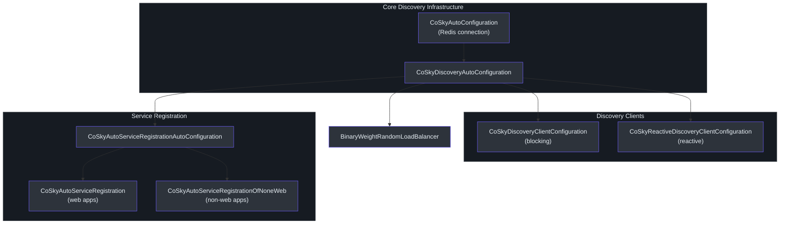
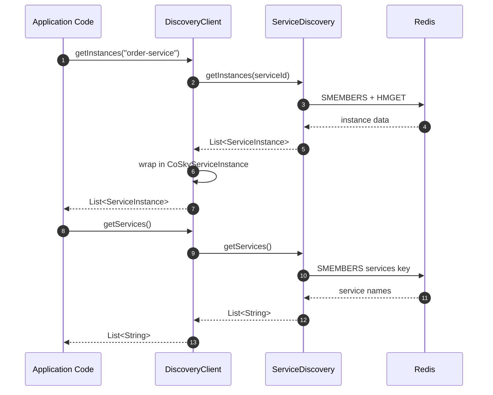
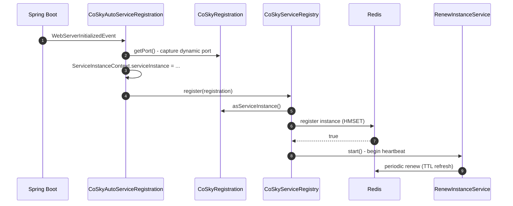
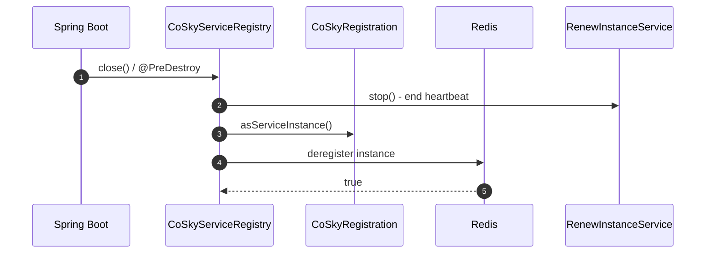

# Spring Cloud Discovery Starter

The CoSky Spring Cloud Discovery Starter provides seamless integration between CoSky's Redis-backed service registry and the Spring Cloud Discovery model. It supplies both blocking (`DiscoveryClient`) and reactive (`ReactiveDiscoveryClient`) implementations, automatic service registration with heartbeat renewal, and a weighted load balancer -- all without running a separate discovery server. Services register themselves into Redis on startup, discover each other through Redis queries, and automatically deregister on shutdown.

## At a Glance

| Component | Responsibility | Key File | Source |
|---|---|---|---|
| **CoSkyDiscoveryAutoConfiguration** | Wires core discovery beans (service discovery, topology, event listeners, load balancer) | `CoSkyDiscoveryAutoConfiguration.kt` | [cosky-spring-cloud-starter-discovery/.../CoSkyDiscoveryAutoConfiguration.kt:47](https://github.com/Ahoo-Wang/CoSky/blob/main/cosky-spring-cloud-starter-discovery/src/main/kotlin/me/ahoo/cosky/discovery/spring/cloud/discovery/CoSkyDiscoveryAutoConfiguration.kt#L47) |
| **CoSkyDiscoveryClient** | Blocking `DiscoveryClient` adapter | `CoSkyDiscoveryClient.kt` | [cosky-spring-cloud-starter-discovery/.../CoSkyDiscoveryClient.kt:24](https://github.com/Ahoo-Wang/CoSky/blob/main/cosky-spring-cloud-starter-discovery/src/main/kotlin/me/ahoo/cosky/discovery/spring/cloud/discovery/CoSkyDiscoveryClient.kt#L24) |
| **CoSkyReactiveDiscoveryClient** | Reactive `ReactiveDiscoveryClient` adapter | `CoSkyReactiveDiscoveryClient.kt` | [cosky-spring-cloud-starter-discovery/.../CoSkyReactiveDiscoveryClient.kt:26](https://github.com/Ahoo-Wang/CoSky/blob/main/cosky-spring-cloud-starter-discovery/src/main/kotlin/me/ahoo/cosky/discovery/spring/cloud/discovery/CoSkyReactiveDiscoveryClient.kt#L26) |
| **CoSkyServiceRegistry** | Registers and deregisters instances via Redis | `CoSkyServiceRegistry.kt` | [cosky-spring-cloud-starter-discovery/.../CoSkyServiceRegistry.kt:25](https://github.com/Ahoo-Wang/CoSky/blob/main/cosky-spring-cloud-starter-discovery/src/main/kotlin/me/ahoo/cosky/discovery/spring/cloud/registry/CoSkyServiceRegistry.kt#L25) |
| **CoSkyRegistration** | Holds service instance metadata for registration | `CoSkyRegistration.kt` | [cosky-spring-cloud-starter-discovery/.../CoSkyRegistration.kt:26](https://github.com/Ahoo-Wang/CoSky/blob/main/cosky-spring-cloud-starter-discovery/src/main/kotlin/me/ahoo/cosky/discovery/spring/cloud/registry/CoSkyRegistration.kt#L26) |
| **CoSkyAutoServiceRegistration** | Web-app auto-registration (port from embedded server) | `CoSkyAutoServiceRegistration.kt` | [cosky-spring-cloud-starter-discovery/.../CoSkyAutoServiceRegistration.kt:25](https://github.com/Ahoo-Wang/CoSky/blob/main/cosky-spring-cloud-starter-discovery/src/main/kotlin/me/ahoo/cosky/discovery/spring/cloud/registry/CoSkyAutoServiceRegistration.kt#L25) |
| **CoSkyAutoServiceRegistrationOfNoneWeb** | Non-web-app auto-registration (uses PID as port) | `CoSkyAutoServiceRegistrationOfNoneWeb.kt` | [cosky-spring-cloud-starter-discovery/.../CoSkyAutoServiceRegistrationOfNoneWeb.kt:31](https://github.com/Ahoo-Wang/CoSky/blob/main/cosky-spring-cloud-starter-discovery/src/main/kotlin/me/ahoo/cosky/discovery/spring/cloud/registry/CoSkyAutoServiceRegistrationOfNoneWeb.kt#L31) |

## Configuration Properties

### Discovery Properties

Bound by [CoSkyDiscoveryProperties.kt:24](https://github.com/Ahoo-Wang/CoSky/blob/main/cosky-spring-cloud-starter-discovery/src/main/kotlin/me/ahoo/cosky/discovery/spring/cloud/discovery/CoSkyDiscoveryProperties.kt#L24) under prefix `spring.cloud.cosky.discovery`.

| Property | Default | Description |
|---|---|---|
| `spring.cloud.cosky.discovery.enabled` | `true` | Enable or disable the CoSky discovery starter. |
| `spring.cloud.cosky.discovery.order` | `0` | Order of the discovery client in the composite chain. |
| `spring.cloud.cosky.discovery.timeout` | `2s` | Timeout for blocking discovery operations. |

### Registry Properties

Bound by [CoSkyRegistryProperties.kt:27](https://github.com/Ahoo-Wang/CoSky/blob/main/cosky-spring-cloud-starter-discovery/src/main/kotlin/me/ahoo/cosky/discovery/spring/cloud/registry/CoSkyRegistryProperties.kt#L27) under prefix `spring.cloud.cosky.discovery.registry`.

| Property | Default | Description |
|---|---|---|
| `spring.cloud.cosky.discovery.registry.service-id` | `${spring.application.name}` | Service name used for registration. Falls back to the application name. |
| `spring.cloud.cosky.discovery.registry.schema` | `http` | Protocol scheme (`http` or `https`). |
| `spring.cloud.cosky.discovery.registry.host` | auto-detected | Host IP address. Auto-detected via `InetUtils` if blank. |
| `spring.cloud.cosky.discovery.registry.port` | `0` | Service port. For web apps, auto-detected from the embedded server. |
| `spring.cloud.cosky.discovery.registry.weight` | `1` | Instance weight for weighted load balancing. |
| `spring.cloud.cosky.discovery.registry.is-ephemeral` | `true` | Whether the instance is ephemeral (requires heartbeat renewal). |
| `spring.cloud.cosky.discovery.registry.ttl` | `60s` | Time-to-live for the instance; must be renewed before expiry. |
| `spring.cloud.cosky.discovery.registry.timeout` | `2s` | Timeout for blocking registry operations. |
| `spring.cloud.cosky.discovery.registry.initial-status` | `UP` | Initial instance status (`UP` or `OUT_OF_SERVICE`). |
| `spring.cloud.service-registry.auto-registration.enabled` | `true` | Enable or disable auto-registration. |

## Auto-Configuration Chain

The discovery starter uses a layered auto-configuration approach. `CoSkyDiscoveryAutoConfiguration` wires the core infrastructure beans (Redis-based service discovery, event listeners, load balancer). Then, depending on the application type, `CoSkyDiscoveryClientConfiguration` or `CoSkyReactiveDiscoveryClientConfiguration` provides the appropriate Spring Cloud discovery client. Finally, `CoSkyAutoServiceRegistrationAutoConfiguration` handles service registration.


<!-- Sources: cosky-spring-cloud-starter-discovery/src/main/kotlin/me/ahoo/cosky/discovery/spring/cloud/discovery/CoSkyDiscoveryAutoConfiguration.kt:47, cosky-spring-cloud-starter-discovery/src/main/kotlin/me/ahoo/cosky/discovery/spring/cloud/discovery/CoSkyDiscoveryClientConfiguration.kt:36, cosky-spring-cloud-starter-discovery/src/main/kotlin/me/ahoo/cosky/discovery/spring/cloud/discovery/CoSkyReactiveDiscoveryClientConfiguration.kt:35, cosky-spring-cloud-starter-discovery/src/main/kotlin/me/ahoo/cosky/discovery/spring/cloud/registry/CoSkyAutoServiceRegistrationAutoConfiguration.kt:43 -->

## Discovery Client

CoSky provides two discovery client implementations that adapt the CoSky `ServiceDiscovery` API to Spring Cloud interfaces.

### Blocking: CoSkyDiscoveryClient

The [CoSkyDiscoveryClient](https://github.com/Ahoo-Wang/CoSky/blob/main/cosky-spring-cloud-starter-discovery/src/main/kotlin/me/ahoo/cosky/discovery/spring/cloud/discovery/CoSkyDiscoveryClient.kt) implements Spring's `DiscoveryClient`. It delegates to the reactive `ServiceDiscovery` and blocks with the configured timeout ([CoSkyDiscoveryClient.kt:33](https://github.com/Ahoo-Wang/CoSky/blob/main/cosky-spring-cloud-starter-discovery/src/main/kotlin/me/ahoo/cosky/discovery/spring/cloud/discovery/CoSkyDiscoveryClient.kt#L33)). Each `ServiceInstance` from CoSky is wrapped in a `CoSkyServiceInstance` adapter.

### Reactive: CoSkyReactiveDiscoveryClient

The [CoSkyReactiveDiscoveryClient](https://github.com/Ahoo-Wang/CoSky/blob/main/cosky-spring-cloud-starter-discovery/src/main/kotlin/me/ahoo/cosky/discovery/spring/cloud/discovery/CoSkyReactiveDiscoveryClient.kt) implements `ReactiveDiscoveryClient` and returns `Flux<ServiceInstance>` directly without blocking ([CoSkyReactiveDiscoveryClient.kt:32](https://github.com/Ahoo-Wang/CoSky/blob/main/cosky-spring-cloud-starter-discovery/src/main/kotlin/me/ahoo/cosky/discovery/spring/cloud/discovery/CoSkyReactiveDiscoveryClient.kt#L32)).

### CoSkyServiceInstance Adapter

[CoSkyServiceInstance](https://github.com/Ahoo-Wang/CoSky/blob/main/cosky-spring-cloud-starter-discovery/src/main/kotlin/me/ahoo/cosky/discovery/spring/cloud/discovery/CoSkyServiceInstance.kt) is a simple data class that wraps CoSky's `ServiceInstance` and adapts it to Spring Cloud's `ServiceInstance` interface, mapping `instanceId`, `serviceId`, `host`, `port`, `isSecure`, `uri`, `metadata`, and `scheme` ([CoSkyServiceInstance.kt:23](https://github.com/Ahoo-Wang/CoSky/blob/main/cosky-spring-cloud-starter-discovery/src/main/kotlin/me/ahoo/cosky/discovery/spring/cloud/discovery/CoSkyServiceInstance.kt#L23)).

### Service Discovery Lookup Flow


<!-- Sources: cosky-spring-cloud-starter-discovery/src/main/kotlin/me/ahoo/cosky/discovery/spring/cloud/discovery/CoSkyDiscoveryClient.kt:32, cosky-spring-cloud-starter-discovery/src/main/kotlin/me/ahoo/cosky/discovery/spring/cloud/discovery/CoSkyReactiveDiscoveryClient.kt:32, cosky-spring-cloud-starter-discovery/src/main/kotlin/me/ahoo/cosky/discovery/spring/cloud/discovery/CoSkyServiceInstance.kt:23 -->

## Service Registration

### CoSkyServiceRegistry

The [CoSkyServiceRegistry](https://github.com/Ahoo-Wang/CoSky/blob/main/cosky-spring-cloud-starter-discovery/src/main/kotlin/me/ahoo/cosky/discovery/spring/cloud/registry/CoSkyServiceRegistry.kt) implements Spring's `ServiceRegistry<CoSkyRegistration>` interface. On `register()`, it delegates to the CoSky `ServiceRegistry` to persist the instance in Redis, then starts the heartbeat `RenewInstanceService` ([CoSkyServiceRegistry.kt:30](https://github.com/Ahoo-Wang/CoSky/blob/main/cosky-spring-cloud-starter-discovery/src/main/kotlin/me/ahoo/cosky/discovery/spring/cloud/registry/CoSkyServiceRegistry.kt#L30)). On `deregister()`, it removes the instance and stops the heartbeat. The `close()` method also stops the renewal service ([CoSkyServiceRegistry.kt:45](https://github.com/Ahoo-Wang/CoSky/blob/main/cosky-spring-cloud-starter-discovery/src/main/kotlin/me/ahoo/cosky/discovery/spring/cloud/registry/CoSkyServiceRegistry.kt#L45)).

### CoSkyRegistration

[CoSkyRegistration](https://github.com/Ahoo-Wang/CoSky/blob/main/cosky-spring-cloud-starter-discovery/src/main/kotlin/me/ahoo/cosky/discovery/spring/cloud/registry/CoSkyRegistration.kt) implements Spring's `Registration` interface. It carries the `serviceId`, `scheme`, `host`, `port`, `weight`, `isEphemeral`, and `metadata` needed for registration ([CoSkyRegistration.kt:26](https://github.com/Ahoo-Wang/CoSky/blob/main/cosky-spring-cloud-starter-discovery/src/main/kotlin/me/ahoo/cosky/discovery/spring/cloud/registry/CoSkyRegistration.kt#L26)). The `asServiceInstance()` method converts it into a CoSky `ServiceInstance` suitable for the registry call.

### Auto-Registration for Web Apps

[CoSkyAutoServiceRegistration](https://github.com/Ahoo-Wang/CoSky/blob/main/cosky-spring-cloud-starter-discovery/src/main/kotlin/me/ahoo/cosky/discovery/spring/cloud/registry/CoSkyAutoServiceRegistration.kt) extends `AbstractAutoServiceRegistration`. When the embedded web server starts, it captures the dynamically assigned port and calls `register()` ([CoSkyAutoServiceRegistration.kt:48](https://github.com/Ahoo-Wang/CoSky/blob/main/cosky-spring-cloud-starter-discovery/src/main/kotlin/me/ahoo/cosky/discovery/spring/cloud/registry/CoSkyAutoServiceRegistration.kt#L48)). It also stores the instance in `ServiceInstanceContext` for downstream use.

### Auto-Registration for Non-Web Apps

[CoSkyAutoServiceRegistrationOfNoneWeb](https://github.com/Ahoo-Wang/CoSky/blob/main/cosky-spring-cloud-starter-discovery/src/main/kotlin/me/ahoo/cosky/discovery/spring/cloud/registry/CoSkyAutoServiceRegistrationOfNoneWeb.kt) handles non-web applications (e.g. gRPC services, CLI tools). It listens for `ApplicationStartedEvent` and, if the application context is not a `WebServerApplicationContext`, registers the service using the **process ID (PID) as the port** ([CoSkyAutoServiceRegistrationOfNoneWeb.kt:51](https://github.com/Ahoo-Wang/CoSky/blob/main/cosky-spring-cloud-starter-discovery/src/main/kotlin/me/ahoo/cosky/discovery/spring/cloud/registry/CoSkyAutoServiceRegistrationOfNoneWeb.kt#L51)). This provides a meaningful identifier even when there is no HTTP port.

### Service Registration Flow


<!-- Sources: cosky-spring-cloud-starter-discovery/src/main/kotlin/me/ahoo/cosky/discovery/spring/cloud/registry/CoSkyAutoServiceRegistration.kt:48, cosky-spring-cloud-starter-discovery/src/main/kotlin/me/ahoo/cosky/discovery/spring/cloud/registry/CoSkyServiceRegistry.kt:30, cosky-spring-cloud-starter-discovery/src/main/kotlin/me/ahoo/cosky/discovery/spring/cloud/registry/CoSkyRegistration.kt:36 -->

### Service Deregistration Flow


<!-- Sources: cosky-spring-cloud-starter-discovery/src/main/kotlin/me/ahoo/cosky/discovery/spring/cloud/registry/CoSkyServiceRegistry.kt:45, cosky-spring-cloud-starter-discovery/src/main/kotlin/me/ahoo/cosky/discovery/spring/cloud/registry/CoSkyServiceRegistry.kt:38 -->

## Consistency Layer

The discovery starter uses `ConsistencyRedisServiceDiscovery` as the primary `ServiceDiscovery` bean ([CoSkyDiscoveryAutoConfiguration.kt:81](https://github.com/Ahoo-Wang/CoSky/blob/main/cosky-spring-cloud-starter-discovery/src/main/kotlin/me/ahoo/cosky/discovery/spring/cloud/discovery/CoSkyDiscoveryAutoConfiguration.kt#L81)). This decorator wraps `RedisServiceDiscovery` with local consistency guarantees by subscribing to:

- **ServiceEventListenerContainer** -- listens for Redis Pub/Sub events when services are added or removed ([CoSkyDiscoveryAutoConfiguration.kt:62](https://github.com/Ahoo-Wang/CoSky/blob/main/cosky-spring-cloud-starter-discovery/src/main/kotlin/me/ahoo/cosky/discovery/spring/cloud/discovery/CoSkyDiscoveryAutoConfiguration.kt#L62)).
- **InstanceEventListenerContainer** -- listens for Redis Pub/Sub events when individual instances change (register, deregister, metadata update) ([CoSkyDiscoveryAutoConfiguration.kt:69](https://github.com/Ahoo-Wang/CoSky/blob/main/cosky-spring-cloud-starter-discovery/src/main/kotlin/me/ahoo/cosky/discovery/spring/cloud/discovery/CoSkyDiscoveryAutoConfiguration.kt#L69)).

This event-driven approach ensures that local service caches are invalidated and refreshed promptly without relying on polling.

## Load Balancer Integration

CoSky provides a custom `BinaryWeightRandomLoadBalancer` ([CoSkyDiscoveryAutoConfiguration.kt:106](https://github.com/Ahoo-Wang/CoSky/blob/main/cosky-spring-cloud-starter-discovery/src/main/kotlin/me/ahoo/cosky/discovery/spring/cloud/discovery/CoSkyDiscoveryAutoConfiguration.kt#L106)) that respects per-instance weights. It uses a binary-search algorithm over a cumulative weight array for O(log n) instance selection. The load balancer extends `AbstractLoadBalancer` and rebuilds its chooser whenever `InstanceEventListenerContainer` reports a change in the instance list.

## Class Diagram

```mermaid
classDiagram
    class CoSkyDiscoveryProperties {
        +enabled: Boolean = true
        +order: Int = 0
        +timeout: Duration = 2s
    }

    class CoSkyRegistryProperties {
        +serviceId: String
        +schema: String = "http"
        +host: String
        +port: Int = 0
        +weight: Int = 1
        +isEphemeral: Boolean = true
        +ttl: Duration = 60s
        +timeout: Duration = 2s
        +initialStatus: String = "UP"
    }

    class CoSkyDiscoveryAutoConfiguration {
        +redisServiceDiscovery() RedisServiceDiscovery
        +redisServiceTopology() RedisServiceTopology
        +consistencyRedisServiceDiscovery()
        +coSkyLoadBalancer()
    }

    class CoSkyDiscoveryClient {
        -serviceDiscovery: ServiceDiscovery
        -coSkyDiscoveryProperties: CoSkyDiscoveryProperties
        +getInstances(serviceId) List~ServiceInstance~
        +getServices() List~String~
    }

    class CoSkyReactiveDiscoveryClient {
        -serviceDiscovery: ServiceDiscovery
        +getInstances(serviceId) Flux~ServiceInstance~
        +getServices() Flux~String~
    }

    class CoSkyServiceInstance {
        +delegate: ServiceInstance
        +getInstanceId() String
        +getServiceId() String
        +getHost() String
        +getPort() Int
    }

    class CoSkyServiceRegistry {
        -serviceRegistry: ServiceRegistry
        -renewInstanceService: RenewInstanceService
        +register(registration)
        +deregister(registration)
        +setStatus(registration, status)
        +close()
    }

    class CoSkyRegistration {
        +serviceId: String
        +scheme: String
        +host: String
        +port: Int
        +weight: Int
        +isEphemeral: Boolean
        +asServiceInstance() ServiceInstance
    }

    class CoSkyAutoServiceRegistration {
        +register()
        +getRegistration() CoSkyRegistration
    }

    class CoSkyAutoServiceRegistrationOfNoneWeb {
        +onApplicationEvent(event)
        +destroy()
    }

    CoSkyDiscoveryAutoConfiguration --> CoSkyDiscoveryProperties : configures
    CoSkyDiscoveryClient --> CoSkyDiscoveryProperties : reads
    CoSkyDiscoveryClient --> CoSkyServiceInstance : wraps
    CoSkyReactiveDiscoveryClient --> CoSkyServiceInstance : wraps
    CoSkyServiceRegistry --> CoSkyRegistration : accepts
    CoSkyAutoServiceRegistration --> CoSkyServiceRegistry : delegates
    CoSkyAutoServiceRegistration --> CoSkyRegistration : provides
    CoSkyAutoServiceRegistrationOfNoneWeb --> CoSkyServiceRegistry : delegates

    style CoSkyDiscoveryProperties fill:#2d333b,stroke:#6d5dfc,color:#e6edf3
    style CoSkyRegistryProperties fill:#2d333b,stroke:#6d5dfc,color:#e6edf3
    style CoSkyDiscoveryAutoConfiguration fill:#2d333b,stroke:#6d5dfc,color:#e6edf3
    style CoSkyDiscoveryClient fill:#2d333b,stroke:#6d5dfc,color:#e6edf3
    style CoSkyReactiveDiscoveryClient fill:#2d333b,stroke:#6d5dfc,color:#e6edf3
    style CoSkyServiceInstance fill:#2d333b,stroke:#6d5dfc,color:#e6edf3
    style CoSkyServiceRegistry fill:#2d333b,stroke:#6d5dfc,color:#e6edf3
    style CoSkyRegistration fill:#2d333b,stroke:#6d5dfc,color:#e6edf3
    style CoSkyAutoServiceRegistration fill:#2d333b,stroke:#6d5dfc,color:#e6edf3
    style CoSkyAutoServiceRegistrationOfNoneWeb fill:#2d333b,stroke:#6d5dfc,color:#e6edf3
```


<!-- Sources: cosky-spring-cloud-starter-discovery/src/main/kotlin/me/ahoo/cosky/discovery/spring/cloud/discovery/CoSkyDiscoveryProperties.kt:24, cosky-spring-cloud-starter-discovery/src/main/kotlin/me/ahoo/cosky/discovery/spring/cloud/registry/CoSkyRegistryProperties.kt:27, cosky-spring-cloud-starter-discovery/src/main/kotlin/me/ahoo/cosky/discovery/spring/cloud/discovery/CoSkyDiscoveryAutoConfiguration.kt:47, cosky-spring-cloud-starter-discovery/src/main/kotlin/me/ahoo/cosky/discovery/spring/cloud/discovery/CoSkyDiscoveryClient.kt:24, cosky-spring-cloud-starter-discovery/src/main/kotlin/me/ahoo/cosky/discovery/spring/cloud/discovery/CoSkyServiceInstance.kt:23, cosky-spring-cloud-starter-discovery/src/main/kotlin/me/ahoo/cosky/discovery/spring/cloud/registry/CoSkyServiceRegistry.kt:25, cosky-spring-cloud-starter-discovery/src/main/kotlin/me/ahoo/cosky/discovery/spring/cloud/registry/CoSkyRegistration.kt:26, cosky-spring-cloud-starter-discovery/src/main/kotlin/me/ahoo/cosky/discovery/spring/cloud/registry/CoSkyAutoServiceRegistration.kt:25, cosky-spring-cloud-starter-discovery/src/main/kotlin/me/ahoo/cosky/discovery/spring/cloud/registry/CoSkyAutoServiceRegistrationOfNoneWeb.kt:31 -->

## Full YAML Configuration Example

```yaml
spring:
  application:
    name: order-service
  cloud:
    cosky:
      namespace: production
      discovery:
        enabled: true
        order: 0
        timeout: 2s
        registry:
          service-id: order-service        # defaults to spring.application.name
          schema: http
          host: ""                          # auto-detected via InetUtils
          port: 0                           # auto-detected for web apps
          weight: 1
          is-ephemeral: true
          ttl: 60s
          timeout: 2s
          initial-status: UP
          metadata:
            version: "2.0.0"
            region: "us-east-1"
    service-registry:
      auto-registration:
        enabled: true
```

With this configuration, the `order-service` will:

1. Register itself into Redis under the `production` namespace on startup.
2. Start a heartbeat renewal to keep the instance alive (TTL = 60s).
3. Be discoverable by other services through the blocking or reactive discovery client.
4. Support weighted load balancing with weight = 1.

## Related Pages

- [Spring Cloud Config Starter](/guide/spring-cloud-config) -- Redis-backed configuration management with live refresh
- [Service Discovery](/guide/discovery) -- CoSky's core service discovery API and Redis data model
- [Service Registry](/guide/registry) -- CoSky's service registration and heartbeat mechanism

## References

- [CoSkyDiscoveryAutoConfiguration.kt](https://github.com/Ahoo-Wang/CoSky/blob/main/cosky-spring-cloud-starter-discovery/src/main/kotlin/me/ahoo/cosky/discovery/spring/cloud/discovery/CoSkyDiscoveryAutoConfiguration.kt)
- [CoSkyDiscoveryClient.kt](https://github.com/Ahoo-Wang/CoSky/blob/main/cosky-spring-cloud-starter-discovery/src/main/kotlin/me/ahoo/cosky/discovery/spring/cloud/discovery/CoSkyDiscoveryClient.kt)
- [CoSkyReactiveDiscoveryClient.kt](https://github.com/Ahoo-Wang/CoSky/blob/main/cosky-spring-cloud-starter-discovery/src/main/kotlin/me/ahoo/cosky/discovery/spring/cloud/discovery/CoSkyReactiveDiscoveryClient.kt)
- [CoSkyServiceInstance.kt](https://github.com/Ahoo-Wang/CoSky/blob/main/cosky-spring-cloud-starter-discovery/src/main/kotlin/me/ahoo/cosky/discovery/spring/cloud/discovery/CoSkyServiceInstance.kt)
- [CoSkyServiceRegistry.kt](https://github.com/Ahoo-Wang/CoSky/blob/main/cosky-spring-cloud-starter-discovery/src/main/kotlin/me/ahoo/cosky/discovery/spring/cloud/registry/CoSkyServiceRegistry.kt)
- [CoSkyRegistration.kt](https://github.com/Ahoo-Wang/CoSky/blob/main/cosky-spring-cloud-starter-discovery/src/main/kotlin/me/ahoo/cosky/discovery/spring/cloud/registry/CoSkyRegistration.kt)
- [CoSkyAutoServiceRegistration.kt](https://github.com/Ahoo-Wang/CoSky/blob/main/cosky-spring-cloud-starter-discovery/src/main/kotlin/me/ahoo/cosky/discovery/spring/cloud/registry/CoSkyAutoServiceRegistration.kt)
- [CoSkyAutoServiceRegistrationOfNoneWeb.kt](https://github.com/Ahoo-Wang/CoSky/blob/main/cosky-spring-cloud-starter-discovery/src/main/kotlin/me/ahoo/cosky/discovery/spring/cloud/registry/CoSkyAutoServiceRegistrationOfNoneWeb.kt)
- [CoSkyAutoServiceRegistrationAutoConfiguration.kt](https://github.com/Ahoo-Wang/CoSky/blob/main/cosky-spring-cloud-starter-discovery/src/main/kotlin/me/ahoo/cosky/discovery/spring/cloud/registry/CoSkyAutoServiceRegistrationAutoConfiguration.kt)
- [CoSkyRegistryProperties.kt](https://github.com/Ahoo-Wang/CoSky/blob/main/cosky-spring-cloud-starter-discovery/src/main/kotlin/me/ahoo/cosky/discovery/spring/cloud/registry/CoSkyRegistryProperties.kt)
- [CoSkyDiscoveryProperties.kt](https://github.com/Ahoo-Wang/CoSky/blob/main/cosky-spring-cloud-starter-discovery/src/main/kotlin/me/ahoo/cosky/discovery/spring/cloud/discovery/CoSkyDiscoveryProperties.kt)
