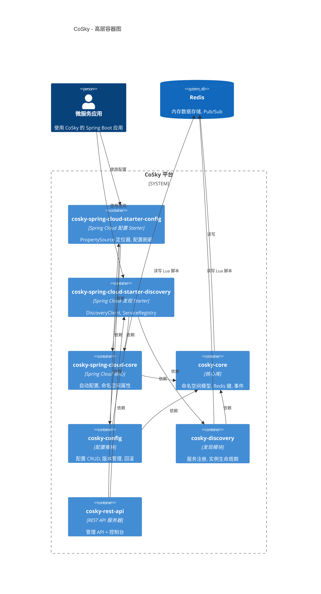
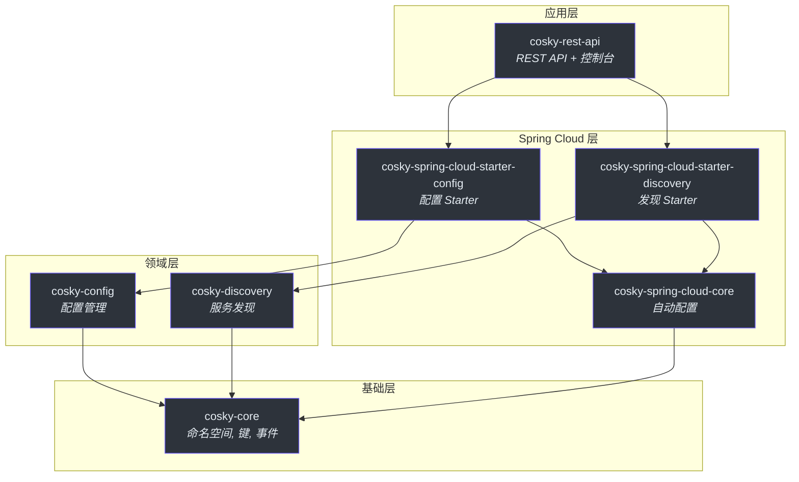
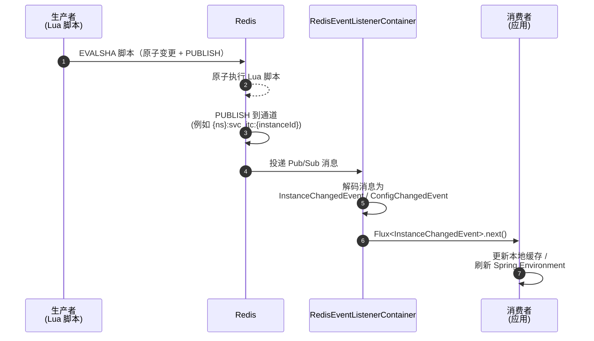
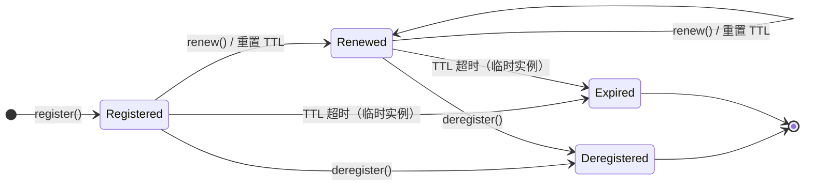

# 架构概览

CoSky 是一个高性能的微服务治理平台，提供基于 Redis 的服务发现和配置管理。CoSky 不需要像 ZooKeeper 或 Consul 这样的独立基础设施组件，而是利用 Redis——大多数微服务部署已经依赖的技术——作为唯一的数据源。这种设计消除了运维复杂性，同时通过 Redis 的内存数据结构提供亚毫秒级的读取性能，通过 Lua 脚本原子性保证写入操作，以及通过 Pub/Sub 实现实时变更传播。

架构遵循受整洁架构原则启发的分层、模块驱动设计。核心领域抽象位于 `cosky-core` 中，领域特定逻辑分为 `cosky-config` 和 `cosky-discovery`，Spring Cloud 集成由专用 Starter 模块提供。这种分离确保团队可以仅采用所需的能力（仅配置、仅发现或两者兼用），而不会引入不必要的传递依赖。

## 概览

| 模块 | 职责 | 关键文件 | 源码 |
|--------|---------------|----------|--------|
| `cosky-core` | 命名空间模型、Redis 键工具、事件监听器抽象、品牌常量 | `CoSky.kt`, `Namespaced.kt`, `NamespacedContext.kt`, `RedisKeys.kt`, `EventListenerContainer.kt` | [cosky-core/src/main/kotlin/me/ahoo/cosky/core](https://github.com/Ahoo-Wang/CoSky/tree/main/cosky-core/src/main/kotlin/me/ahoo/cosky/core) |
| `cosky-config` | 配置 CRUD、版本管理、回滚、变更事件 | `ConfigService.kt`, `ConfigKeyGenerator.kt`, `ConfigChangedEvent.kt` | [cosky-config/src/main/kotlin/me/ahoo/cosky/config](https://github.com/Ahoo-Wang/CoSky/tree/main/cosky-config/src/main/kotlin/me/ahoo/cosky/config) |
| `cosky-discovery` | 服务注册、发现、实例生命周期、拓扑 | `ServiceRegistry.kt`, `ServiceDiscovery.kt`, `DiscoveryKeyGenerator.kt` | [cosky-discovery/src/main/kotlin/me/ahoo/cosky/discovery](https://github.com/Ahoo-Wang/CoSky/tree/main/cosky-discovery/src/main/kotlin/me/ahoo/cosky/discovery) |
| `cosky-spring-cloud-core` | Spring Boot 自动配置、命名空间属性、Redis 模板装配 | `CoSkyAutoConfiguration.kt`, `CoSkyProperties.kt` | [cosky-spring-cloud-core/src/main/kotlin/me/ahoo/cosky/spring/cloud](https://github.com/Ahoo-Wang/CoSky/tree/main/cosky-spring-cloud-core/src/main/kotlin/me/ahoo/cosky/spring/cloud) |
| `cosky-spring-cloud-starter-config` | Spring Cloud Config `PropertySourceLocator` 集成、配置刷新 | `CoSkyPropertySourceLocator.kt`, `CoSkyConfigRefresher.kt` | [cosky-spring-cloud-starter-config](https://github.com/Ahoo-Wang/CoSky/tree/main/cosky-spring-cloud-starter-config) |
| `cosky-spring-cloud-starter-discovery` | Spring Cloud `DiscoveryClient` 和 `ServiceRegistry` 集成 | `CoSkyDiscoveryClient.kt`, `CoSkyServiceRegistry.kt` | [cosky-spring-cloud-starter-discovery](https://github.com/Ahoo-Wang/CoSky/tree/main/cosky-spring-cloud-starter-discovery) |
| `cosky-rest-api` | RESTful 管理 API 和控制台服务器 | `RestApiServer.kt`, `ConfigController.kt`, `ServiceController.kt` | [cosky-rest-api](https://github.com/Ahoo-Wang/CoSky/tree/main/cosky-rest-api) |

## 高层 C4 容器图

下图展示了 Spring Boot 应用如何通过 Starter 模块与 CoSky 集成，而这些 Starter 模块依赖于以 Redis 为后端的核心库。

<!-- Sources: settings.gradle.kts:14-28, build.gradle.kts:28-43 -->

## 模块依赖图

Gradle 模块结构形成一个有向无环图。`cosky-core` 是基础；所有其他模块都直接或传递地依赖它。

<!-- Sources: cosky-config/build.gradle.kts:1, cosky-discovery/build.gradle.kts:1, cosky-spring-cloud-core/build.gradle.kts:1, cosky-spring-cloud-starter-config/build.gradle.kts:1, cosky-spring-cloud-starter-discovery/build.gradle.kts:1, cosky-rest-api/build.gradle.kts:1 -->

## Redis 键设计

CoSky 中的所有数据都使用一致的键命名策略存储在 Redis 中。键由命名空间前缀、领域特定段和资源标识符组成，以 `:` 字符分隔（定义为 `CoSky.KEY_SEPARATOR`）。[`RedisKeys`](https://github.com/Ahoo-Wang/CoSky/blob/main/cosky-core/src/main/kotlin/me/ahoo/cosky/core/util/RedisKeys.kt) 工具处理 Redis 集群 hashtag 包装，确保同一命名空间内的键路由到同一槽位。

| 领域 | 键模式 | Redis 类型 | 用途 | 源码 |
|--------|------------|------------|---------|--------|
| 命名空间索引 | `{cosky-system}:ns_idx` | SET | 存储所有已注册的命名空间 | [RedisNamespaceService.kt:28](https://github.com/Ahoo-Wang/CoSky/blob/main/cosky-core/src/main/kotlin/me/ahoo/cosky/core/redis/RedisNamespaceService.kt#L28) |
| 服务索引 | `{namespace}:svc_idx` | SET | 存储命名空间中的所有服务 ID | [DiscoveryKeyGenerator.kt:32](https://github.com/Ahoo-Wang/CoSky/blob/main/cosky-discovery/src/main/kotlin/me/ahoo/cosky/discovery/DiscoveryKeyGenerator.kt#L32) |
| 实例索引 | `{namespace}:svc_itc_idx:{serviceId}` | SET | 存储服务的实例 ID | [DiscoveryKeyGenerator.kt:55](https://github.com/Ahoo-Wang/CoSky/blob/main/cosky-discovery/src/main/kotlin/me/ahoo/cosky/discovery/DiscoveryKeyGenerator.kt#L55) |
| 实例数据 | `{namespace}:svc_itc:{instanceId}` | STRING（带 TTL） | 编码的实例详情，临时实例会过期 | [DiscoveryKeyGenerator.kt:63](https://github.com/Ahoo-Wang/CoSky/blob/main/cosky-discovery/src/main/kotlin/me/ahoo/cosky/discovery/DiscoveryKeyGenerator.kt#L63) |
| 服务统计 | `{namespace}:svc_stat` | HASH | 每个服务的实例计数统计 | [DiscoveryKeyGenerator.kt:41](https://github.com/Ahoo-Wang/CoSky/blob/main/cosky-discovery/src/main/kotlin/me/ahoo/cosky/discovery/DiscoveryKeyGenerator.kt#L41) |
| 配置索引 | `{namespace}:cfg_idx` | SET | 存储命名空间中的所有配置 ID | [ConfigKeyGenerator.kt:36](https://github.com/Ahoo-Wang/CoSky/blob/main/cosky-config/src/main/kotlin/me/ahoo/cosky/config/ConfigKeyGenerator.kt#L36) |
| 配置数据 | `{namespace}:cfg:{configId}` | HASH | 当前配置数据（数据、哈希、版本、更新时间） | [ConfigKeyGenerator.kt:60](https://github.com/Ahoo-Wang/CoSky/blob/main/cosky-config/src/main/kotlin/me/ahoo/cosky/config/ConfigKeyGenerator.kt#L60) |
| 配置历史索引 | `{namespace}:cfg_htr_idx:{configId}` | ZSET | 版本历史键的有序列表 | [ConfigKeyGenerator.kt:44](https://github.com/Ahoo-Wang/CoSky/blob/main/cosky-config/src/main/kotlin/me/ahoo/cosky/config/ConfigKeyGenerator.kt#L44) |
| 配置历史 | `{namespace}:cfg_htr:{configId}:{version}` | HASH | 每个版本的历史配置快照 | [ConfigKeyGenerator.kt:52](https://github.com/Ahoo-Wang/CoSky/blob/main/cosky-config/src/main/kotlin/me/ahoo/cosky/config/ConfigKeyGenerator.kt#L52) |

## 事件驱动架构

CoSky 使用 Redis Pub/Sub 进行实时变更通知。当变更操作发生（服务注册/注销、配置设置/删除）时，执行原子操作的 Lua 脚本也会向相应通道 `PUBLISH` 消息。消费者通过 `EventListenerContainer` 实现订阅，这些实现封装了 Spring 的 `ReactiveRedisMessageListenerContainer`。

<!-- Sources: cosky-core/src/main/kotlin/me/ahoo/cosky/core/redis/RedisEventListenerContainer.kt:10-41, cosky-discovery/src/main/kotlin/me/ahoo/cosky/discovery/redis/RedisInstanceEventListenerContainer.kt:17-51, cosky-config/src/main/kotlin/me/ahoo/cosky/config/redis/RedisConfigEventListenerContainer.kt:14-30 -->

## 技术栈

| 技术 | 版本 | 用途 | 源码 |
|-----------|---------|---------|--------|
| Kotlin | 1.9+ (JVM 17 工具链) | 主要编程语言 | [build.gradle.kts:92-93](https://github.com/Ahoo-Wang/CoSky/blob/main/build.gradle.kts#L92-L93) |
| Spring Boot | 3.x | 应用框架 | [cosky-spring-cloud-core/build.gradle.kts](https://github.com/Ahoo-Wang/CoSky/blob/main/cosky-spring-cloud-core/build.gradle.kts) |
| Spring Cloud | 2024.x | 云原生抽象（DiscoveryClient、PropertySourceLocator） | [cosky-spring-cloud-core/build.gradle.kts](https://github.com/Ahoo-Wang/CoSky/blob/main/cosky-spring-cloud-core/build.gradle.kts) |
| Spring Data Redis | 最新 | 响应式 Redis 操作（ReactiveStringRedisTemplate） | [cosky-core/build.gradle.kts](https://github.com/Ahoo-Wang/CoSky/blob/main/cosky-core/build.gradle.kts) |
| Lettuce | 最新 | Redis 客户端驱动（异步、响应式） | [cosky-core/build.gradle.kts](https://github.com/Ahoo-Wang/CoSky/blob/main/cosky-core/build.gradle.kts) |
| Project Reactor | 最新 | 响应式编程模型（Flux、Mono） | [cosky-core/build.gradle.kts](https://github.com/Ahoo-Wang/CoSky/blob/main/cosky-core/build.gradle.kts) |
| Lua (Redis 脚本) | N/A | 原子多步操作 | [DiscoveryRedisScripts.kt](https://github.com/Ahoo-Wang/CoSky/blob/main/cosky-discovery/src/main/kotlin/me/ahoo/cosky/discovery/redis/DiscoveryRedisScripts.kt) |
| Gradle (Kotlin DSL) | 8.x | 构建系统 | [settings.gradle.kts](https://github.com/Ahoo-Wang/CoSky/blob/main/settings.gradle.kts) |

## 设计原则

### CP + AP 灵活性

CoSky 同时支持**临时**（AP，最终一致性）和**持久**（CP，强一致性）服务实例。临时实例使用基于 Redis TTL 的过期机制——如果注册客户端未能续约，实例会自动过期。持久实例没有 TTL（`TTL_AT_FOREVER = -1`），必须显式注销。这体现了 Nacos 的设计理念，同时使用 Redis 作为后端存储。

<!-- Sources: cosky-discovery/src/main/kotlin/me/ahoo/cosky/discovery/ServiceInstance.kt:29-39, cosky-discovery/src/main/kotlin/me/ahoo/cosky/discovery/redis/RedisServiceRegistry.kt:92-100, cosky-discovery/src/main/kotlin/me/ahoo/cosky/discovery/RenewInstanceService.kt:34-97 -->

### Lua 脚本保证原子性

关键写入操作（注册、注销、配置设置、配置回滚）作为 Lua 脚本在 Redis 服务器上执行。这保证了原子性——例如，注册脚本原子地将实例添加到服务索引、存储实例数据、发布变更事件并更新统计信息，全部在单个 Redis 命令中完成。在发现和配置模块中共有 **13 个 Lua 脚本**。

```mermaid
flowchart LR
    subgraph Discovery Lua Scripts["发现 Lua 脚本"]
        A[registry_register.lua]
        B[registry_deregister.lua]
        C[registry_renew.lua]
        D[registry_set_service.lua]
        E[registry_remove_service.lua]
        F[registry_set_metadata.lua]
        G[discovery_get_instances.lua]
        H[discovery_get_instance.lua]
        I[discovery_get_instance_ttl.lua]
        J[instance_count_stat.lua]
        K[service_stat.lua]
        L[service_topology_add.lua]
        M[service_topology_get.lua]
    end

    subgraph Config Lua Scripts["配置 Lua 脚本"]
        N[config_set.lua]
        O[config_remove.lua]
        P[config_rollback.lua]
    end

    style A fill:#2d333b,stroke:#6d5dfc,color:#e6edf3
    style B fill:#2d333b,stroke:#6d5dfc,color:#e6edf3
    style C fill:#2d333b,stroke:#6d5dfc,color:#e6edf3
    style D fill:#2d333b,stroke:#6d5dfc,color:#e6edf3
    style E fill:#2d333b,stroke:#6d5dfc,color:#e6edf3
    style F fill:#2d333b,stroke:#6d5dfc,color:#e6edf3
    style G fill:#2d333b,stroke:#6d5dfc,color:#e6edf3
    style H fill:#2d333b,stroke:#6d5dfc,color:#e6edf3
    style I fill:#2d333b,stroke:#6d5dfc,color:#e6edf3
    style J fill:#2d333b,stroke:#6d5dfc,color:#e6edf3
    style K fill:#2d333b,stroke:#6d5dfc,color:#e6edf3
    style L fill:#2d333b,stroke:#6d5dfc,color:#e6edf3
    style M fill:#2d333b,stroke:#6d5dfc,color:#e6edf3
    style N fill:#2d333b,stroke:#6d5dfc,color:#e6edf3
    style O fill:#2d333b,stroke:#6d5dfc,color:#e6edf3
    style P fill:#2d333b,stroke:#6d5dfc,color:#e6edf3
```

<!-- Sources: cosky-discovery/src/main/kotlin/me/ahoo/cosky/discovery/redis/DiscoveryRedisScripts.kt:24-71, cosky-config/src/main/kotlin/me/ahoo/cosky/config/redis/ConfigRedisScripts.kt:24-33 -->

### 本地缓存提升性能

`ConsistencyRedisServiceDiscovery` 装饰器维护一个内存中的 `ConcurrentHashMap` 来存储服务实例，通过 Pub/Sub 事件订阅保持最新状态。这意味着一旦首次 `getInstances()` 调用从 Redis 获取数据，后续调用将从本地缓存提供服务，直到变更事件到达。这种模式为负载均衡器等读取密集型工作负载提供亚微秒级延迟，同时通过事件驱动失效保持一致性。

## 交叉引用

- [核心模块深入解析](./core.md) -- 命名空间模型、键生成和事件系统的详细讲解。
- [配置模块](./config.md) -- 配置 CRUD、版本管理、回滚和 Spring Cloud PropertySource 集成。
- [服务发现模块](./discovery.md) -- 服务注册、实例生命周期、负载均衡和拓扑。
- [REST API](./rest-api.md) -- 管理 API 端点和控制台。

## 参考

- [CoSky.kt -- 品牌常量（COSKY, KEY_SEPARATOR）](https://github.com/Ahoo-Wang/CoSky/blob/main/cosky-core/src/main/kotlin/me/ahoo/cosky/core/CoSky.kt)
- [Namespaced.kt -- 默认和系统命名空间常量](https://github.com/Ahoo-Wang/CoSky/blob/main/cosky-core/src/main/kotlin/me/ahoo/cosky/core/Namespaced.kt)
- [NamespacedContext.kt -- 线程作用域的命名空间上下文](https://github.com/Ahoo-Wang/CoSky/blob/main/cosky-core/src/main/kotlin/me/ahoo/cosky/core/NamespacedContext.kt)
- [NamespaceService.kt -- 命名空间 CRUD 接口](https://github.com/Ahoo-Wang/CoSky/blob/main/cosky-core/src/main/kotlin/me/ahoo/cosky/core/NamespaceService.kt)
- [RedisNamespaceService.kt -- 基于 Redis SET 的命名空间存储](https://github.com/Ahoo-Wang/CoSky/blob/main/cosky-core/src/main/kotlin/me/ahoo/cosky/core/redis/RedisNamespaceService.kt)
- [RedisKeys.kt -- 集群 hashtag 工具](https://github.com/Ahoo-Wang/CoSky/blob/main/cosky-core/src/main/kotlin/me/ahoo/cosky/core/util/RedisKeys.kt)
- [EventListenerContainer.kt -- 响应式事件订阅接口](https://github.com/Ahoo-Wang/CoSky/blob/main/cosky-core/src/main/kotlin/me/ahoo/cosky/core/EventListenerContainer.kt)
- [RedisEventListenerContainer.kt -- Redis Pub/Sub 实现](https://github.com/Ahoo-Wang/CoSky/blob/main/cosky-core/src/main/kotlin/me/ahoo/cosky/core/redis/RedisEventListenerContainer.kt)
- [settings.gradle.kts -- 模块声明](https://github.com/Ahoo-Wang/CoSky/blob/main/settings.gradle.kts)
- [build.gradle.kts -- 根构建配置](https://github.com/Ahoo-Wang/CoSky/blob/main/build.gradle.kts)
