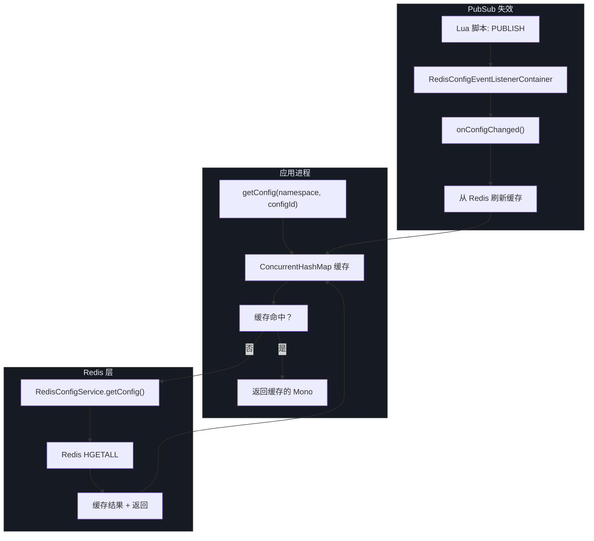
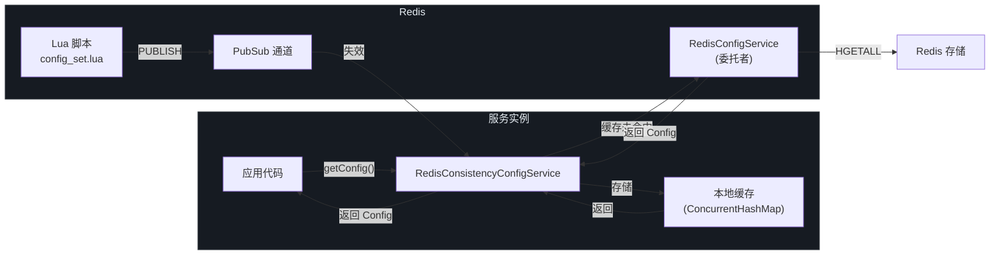
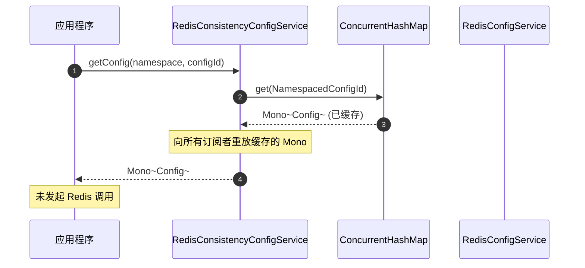
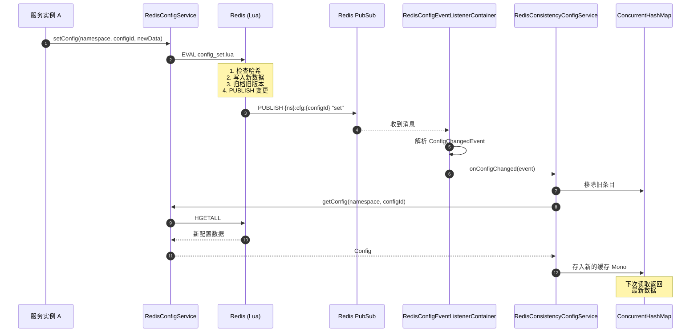
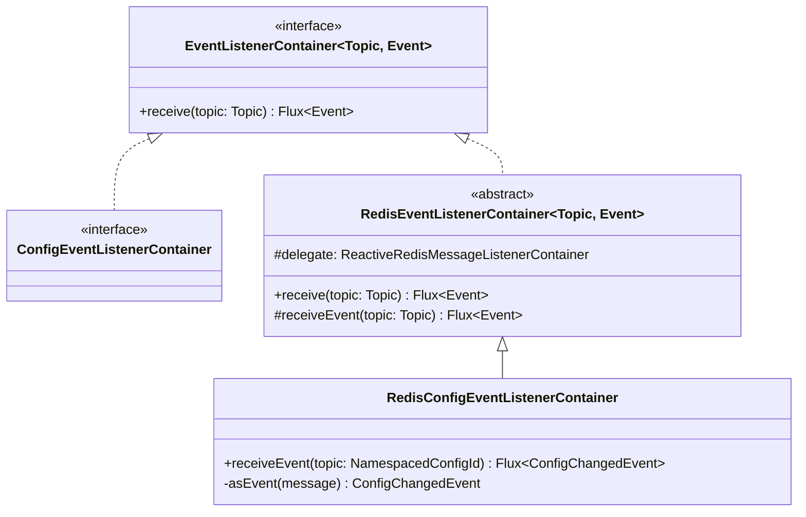
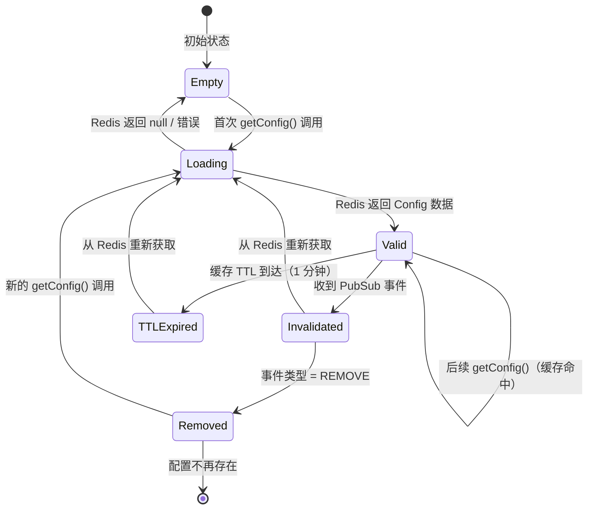
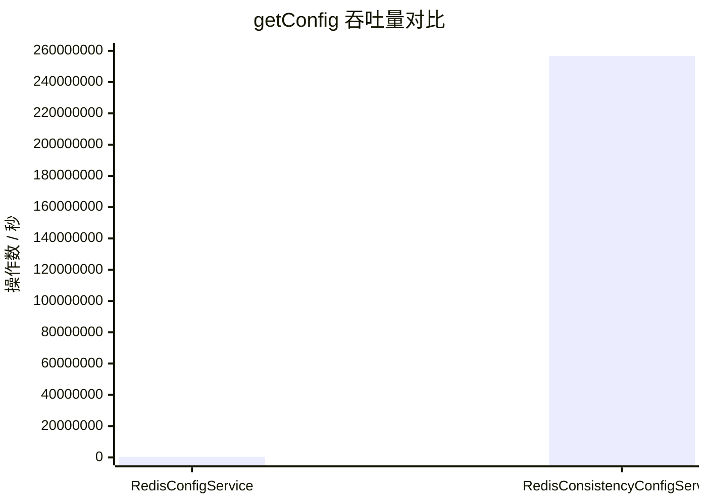

# 一致性层

每次调用 `getConfig` 访问 Redis 都涉及网络 I/O、序列化和往返延迟。在数千个服务实例轮询配置的大规模场景下，这成为关键瓶颈——原始 `RedisConfigService` 的读操作吞吐量约为 241,787 ops/s。CoSky 的一致性层通过结合本地进程内缓存（`ConcurrentHashMap`）和基于 Redis PubSub 的失效机制来解决这个问题。当配置发生变更时，写入新值的 Lua 脚本同时在配置的 Redis 键通道上发布通知。所有订阅该通道的应用实例收到失效事件并刷新本地缓存。结果：`getConfig` 的吞吐量跃升至 **256,733,987 ops/s**——约 1000 倍的提升——同时在毫秒级内保持最终一致性。

## 概览

| 组件 | 职责 | 关键文件 | 源码 |
|---|---|---|---|
| **RedisConsistencyConfigService** | ConfigService 的装饰器，添加基于 PubSub 失效的本地缓存 | `RedisConsistencyConfigService.kt` | [RedisConsistencyConfigService.kt:33](https://github.com/Ahoo-Wang/CoSky/blob/main/cosky-config/src/main/kotlin/me/ahoo/cosky/config/redis/RedisConsistencyConfigService.kt#L33) |
| **ConfigEventListenerContainer** | 订阅配置变更事件的接口 | `ConfigEventListenerContainer.kt` | [ConfigEventListenerContainer.kt:22](https://github.com/Ahoo-Wang/CoSky/blob/main/cosky-config/src/main/kotlin/me/ahoo/cosky/config/ConfigEventListenerContainer.kt#L22) |
| **RedisConfigEventListenerContainer** | 监听配置键通道的 Redis PubSub 实现 | `RedisConfigEventListenerContainer.kt` | [RedisConfigEventListenerContainer.kt:14](https://github.com/Ahoo-Wang/CoSky/blob/main/cosky-config/src/main/kotlin/me/ahoo/cosky/config/redis/RedisConfigEventListenerContainer.kt#L14) |
| **RedisConfigService** | 标准 Redis 配置服务（被委托者） | `RedisConfigService.kt` | [RedisConfigService.kt:41](https://github.com/Ahoo-Wang/CoSky/blob/main/cosky-config/src/main/kotlin/me/ahoo/cosky/config/redis/RedisConfigService.kt#L41) |
| **ConfigChangedEvent** | 表示配置变更及操作类型的事件模型 | `ConfigChangedEvent.kt` | [ConfigChangedEvent.kt:20](https://github.com/Ahoo-Wang/CoSky/blob/main/cosky-config/src/main/kotlin/me/ahoo/cosky/config/ConfigChangedEvent.kt#L20) |

## 性能问题

在典型的微服务部署中，配置的读取频率远高于写入频率。100 个服务实例组成的集群，每个实例在启动时读取配置并定期刷新，每秒产生数千次读取请求。当每次 `getConfig` 调用都通过网络访问 Redis 时，吞吐量受到以下因素限制：

- 网络往返延迟（即使在本地主机上）
- Redis 命令处理开销
- 响应式管道调度和上下文切换

`RedisConfigService.getConfig` 的 JMH 基准测试结果证实了这一限制：

```
RedisConfigServiceBenchmark.getConfig   thrpt   241,787.679   ops/s
```

对于单个 Redis 支持的服务来说，这已经很优秀，但这意味着每次配置读取都要竞争同一个 Redis 连接池。

Source: [jmh-cosky-config.json](https://github.com/Ahoo-Wang/CoSky/blob/main/docs/jmh/jmh-cosky-config.json)

## 解决方案：RedisConsistencyConfigService

`RedisConsistencyConfigService` 是一个装饰器，包装任意 `ConfigService` 实现（默认为 `RedisConfigService`），并添加两层缓存策略：

1. **本地缓存** -- `ConcurrentHashMap<NamespacedConfigId, Mono<Config>>` 将最近获取的配置存储为缓存的 `Mono`。对同一 configId 的后续 `getConfig` 调用直接返回缓存值，无需访问 Redis。

2. **PubSub 失效** -- 当任何写操作（`setConfig`、`removeConfig`、`rollback`）修改配置时，底层 Lua 脚本在配置键对应的 Redis 通道上发布消息。`RedisConfigEventListenerContainer` 订阅这些通道并在一致性服务中触发缓存失效。



<!-- Sources: RedisConsistencyConfigService.kt:33, RedisConfigEventListenerContainer.kt:14, RedisConfigService.kt:41 -->

## 架构

一致性层位于应用代码和原始 Redis 操作之间，拦截读取操作并订阅变更通知。



<!-- Sources: RedisConsistencyConfigService.kt:33, RedisConfigService.kt:41, config_set.lua:1 -->

## 缓存命中流程

当配置已被先前加载时，一致性服务直接返回缓存的 `Mono<Config>`，无需访问 Redis。



<!-- Sources: RedisConsistencyConfigService.kt:46, RedisConsistencyConfigService.kt:50 -->

关键细节在于缓存存储了一个已被 Reactor `.cache()` 的 `Mono<Config>`。这意味着初始订阅会触发 Redis 调用，但所有后续订阅者将获得相同的结果，而不会重新执行响应式管道。当 `computeIfAbsent` 插入新条目时，它还会订阅该 configId 的 PubSub 通道以监听后续变更。

## 缓存失效流程

当任何进程修改配置时，Lua 脚本在 Redis PubSub 通道上发布变更事件。监听该通道的每个实例收到失效通知并刷新缓存。



<!-- Sources: RedisConsistencyConfigService.kt:68, RedisConfigEventListenerContainer.kt:18, config_set.lua:1 -->

## 事件监听器容器

`ConfigEventListenerContainer` 接口抽象了对配置变更事件的订阅。其 Redis 实现 `RedisConfigEventListenerContainer` 封装了一个 `ReactiveRedisMessageListenerContainer`，使用配置的 Redis 键作为通道名订阅 Redis PubSub 通道。



<!-- Sources: ConfigEventListenerContainer.kt:22, RedisConfigEventListenerContainer.kt:14 -->

通道命名约定使用与配置哈希本身相同的键模式：`{namespace}:cfg:{configId}`。这意味着 PubSub 通道天然具有命名空间隔离和配置级别粒度，每个服务实例只订阅它实际使用的配置。

Source: [RedisConfigEventListenerContainer.kt:18](https://github.com/Ahoo-Wang/CoSky/blob/main/cosky-config/src/main/kotlin/me/ahoo/cosky/config/redis/RedisConfigEventListenerContainer.kt#L18)

## 缓存状态机

每个配置条目的本地缓存随着请求和失效事件的发生，经历一组明确定义的状态。



<!-- Sources: RedisConsistencyConfigService.kt:40, RedisConsistencyConfigService.kt:46 -->

`CONFIG_CACHE_TTL` 设置为 `Duration.ofMinutes(1)`。当缓存条目因 PubSub 失效事件而刷新时，新的 `Mono` 使用 `.cache(CONFIG_CACHE_TTL)` 创建，确保即使没有后续失效事件，过期数据最终也会被驱逐。

Source: [RedisConsistencyConfigService.kt:40](https://github.com/Ahoo-Wang/CoSky/blob/main/cosky-config/src/main/kotlin/me/ahoo/cosky/config/redis/RedisConsistencyConfigService.kt#L40)

## 性能基准测试

JMH 基准测试（在 MacBook Pro M1 上使用本地 Redis，50 个线程运行）展示了标准和带一致性支持的配置服务之间的显著性能差异。

| 操作 | 实现方式 | 吞吐量 (ops/s) | 提升 | 来源 |
|---|---|---|---|---|
| `getConfig` | `RedisConfigService` | 241,787 | 基线 | [jmh-cosky-config.json](https://github.com/Ahoo-Wang/CoSky/blob/main/docs/jmh/jmh-cosky-config.json) |
| `getConfig` | `RedisConsistencyConfigService` | 256,733,987 | ~1062 倍 | [jmh-cosky-config.json](https://github.com/Ahoo-Wang/CoSky/blob/main/docs/jmh/jmh-cosky-config.json) |
| `setConfig` | `RedisConfigService` | 140,461 | N/A（写操作） | [jmh-cosky-config.json](https://github.com/Ahoo-Wang/CoSky/blob/main/docs/jmh/jmh-cosky-config.json) |



<!-- Sources: jmh-cosky-config.json:1 -->

一致性服务达到 **256,733,987 ops/s**，因为首次读取后，所有后续的 `getConfig` 调用都从进程内 `ConcurrentHashMap` 解析，无需任何网络 I/O。唯一的 Redis 流量是初始加载和 PubSub 失效消息（由于配置变更相对于读取来说很少发生，这些消息频率很低）。

Source: [jmh-cosky-config.json](https://github.com/Ahoo-Wang/CoSky/blob/main/docs/jmh/jmh-cosky-config.json)

## 权衡

一致性层引入了一些需要理解的重要权衡：

### 最终一致性

当配置更新时，存在一个短暂的窗口（在本地网络上通常为亚毫秒级，跨数据中心略长），在此期间某些实例可能提供过期数据。传播路径为：

```
Lua 脚本 PUBLISH -> Redis PubSub 通道 -> 订阅者回调 -> 缓存刷新
```

对于大多数微服务配置场景（功能开关、连接池大小、超时值），这种亚秒级的最终一致性是可以接受的。但对于要求严格线性化读取的配置，则不适合。

### 内存开销

每个缓存配置条目在 JVM 堆中占用 `ConcurrentHashMap` 条目和缓存 `Mono<Config>` 的内存。对于有数百个配置的服务来说，这可以忽略不计。对于有数万个配置的服务，需要监控堆内存使用情况。

### PubSub 可靠性

Redis PubSub 是一种即发即忘协议——如果实例暂时断开连接（网络抖动、GC 暂停），它将错过失效消息。CoSky 通过 `CONFIG_CACHE_TTL`（1 分钟）来缓解这个问题：即使错过了失效事件，缓存条目也会在 60 秒内过期并从 Redis 重新获取。

### 委托模式

`RedisConsistencyConfigService` 使用 Kotlin 的 `by delegate` 语法将所有非 `getConfig` 方法直接转发到底层的 `RedisConfigService`。这意味着写操作（`setConfig`、`removeConfig`、`rollback`）始终访问 Redis 并触发 PubSub 事件。一致性优化仅适用于读操作。

Source: [RedisConsistencyConfigService.kt:37](https://github.com/Ahoo-Wang/CoSky/blob/main/cosky-config/src/main/kotlin/me/ahoo/cosky/config/redis/RedisConsistencyConfigService.kt#L37)

## 相关页面

- [配置管理](./config-service) -- 核心配置 CRUD 操作、数据模型和 Redis 实现
- [服务发现](./service-discovery) -- 采用类似一致性优化模式的服务注册
- [REST API](./rest-api) -- 配置管理的 HTTP 端点

## 参考文献

- [RedisConsistencyConfigService.kt](https://github.com/Ahoo-Wang/CoSky/blob/main/cosky-config/src/main/kotlin/me/ahoo/cosky/config/redis/RedisConsistencyConfigService.kt) -- 一致性层实现
- [RedisConfigService.kt](https://github.com/Ahoo-Wang/CoSky/blob/main/cosky-config/src/main/kotlin/me/ahoo/cosky/config/redis/RedisConfigService.kt) -- 标准 Redis 配置服务（委托者）
- [ConfigEventListenerContainer.kt](https://github.com/Ahoo-Wang/CoSky/blob/main/cosky-config/src/main/kotlin/me/ahoo/cosky/config/ConfigEventListenerContainer.kt) -- 事件监听器容器接口
- [RedisConfigEventListenerContainer.kt](https://github.com/Ahoo-Wang/CoSky/blob/main/cosky-config/src/main/kotlin/me/ahoo/cosky/config/redis/RedisConfigEventListenerContainer.kt) -- Redis PubSub 事件监听器实现
- [ConfigChangedEvent.kt](https://github.com/Ahoo-Wang/CoSky/blob/main/cosky-config/src/main/kotlin/me/ahoo/cosky/config/ConfigChangedEvent.kt) -- 包含 SET/REMOVE/ROLLBACK 操作的变更事件模型
- [NamespacedConfigId.kt](https://github.com/Ahoo-Wang/CoSky/blob/main/cosky-config/src/main/kotlin/me/ahoo/cosky/config/NamespacedConfigId.kt) -- 用作缓存键的命名空间标识符
- [jmh-cosky-config.json](https://github.com/Ahoo-Wang/CoSky/blob/main/docs/jmh/jmh-cosky-config.json) -- JMH 基准测试原始结果
- [config_set.lua](https://github.com/Ahoo-Wang/CoSky/blob/main/cosky-config/src/main/resources/config_set.lua) -- 发布变更事件的 Lua 脚本
