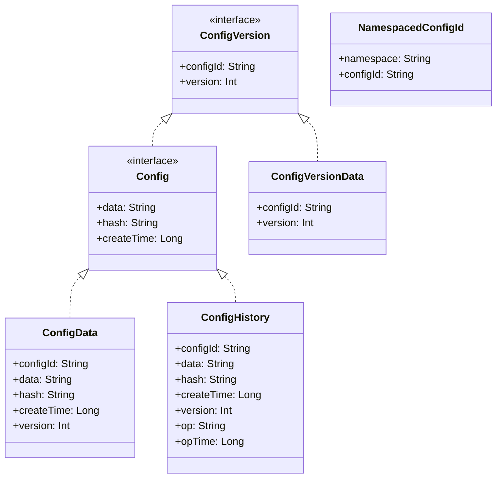
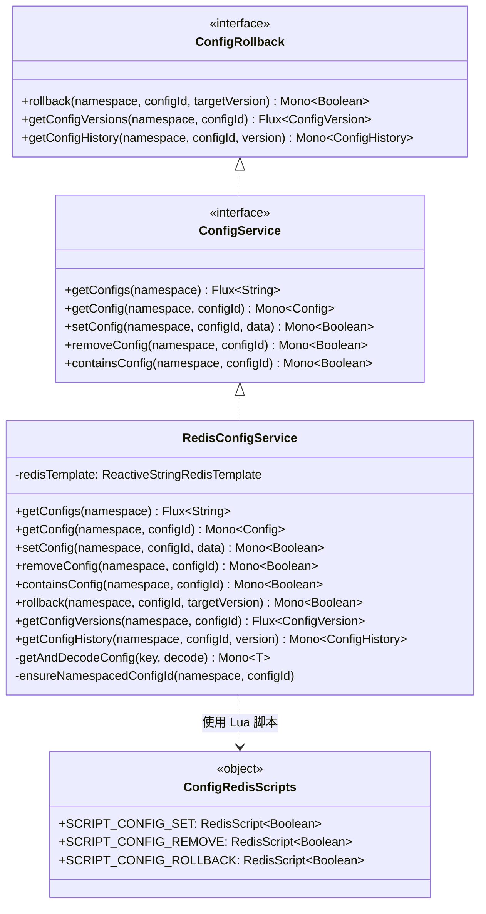
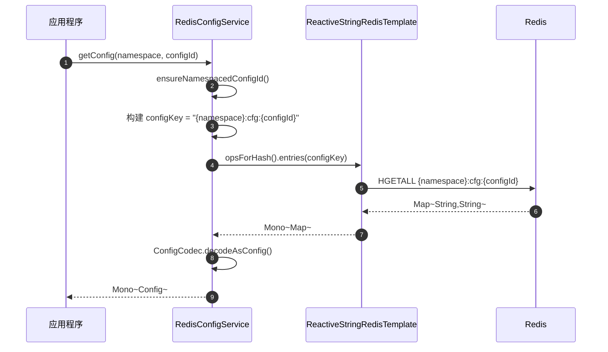
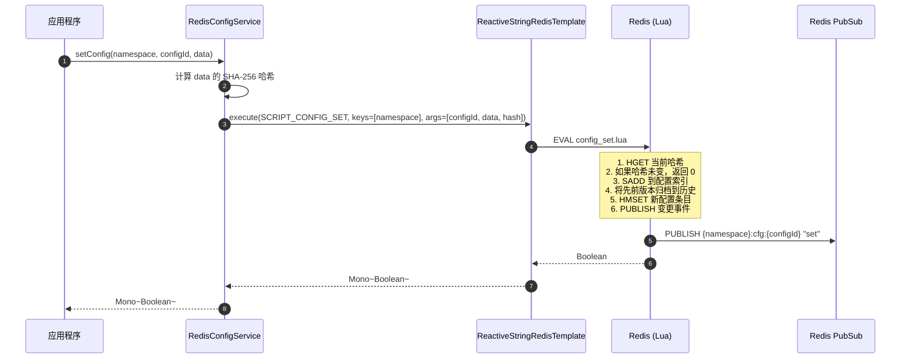
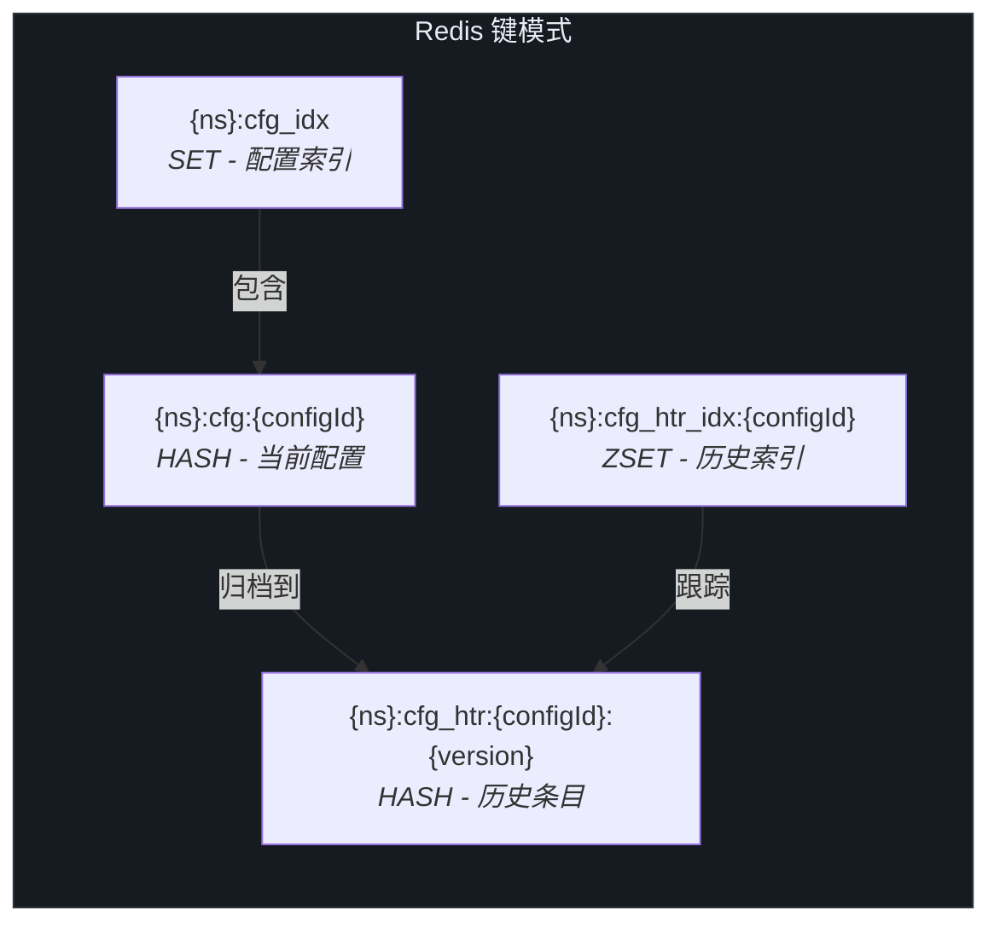
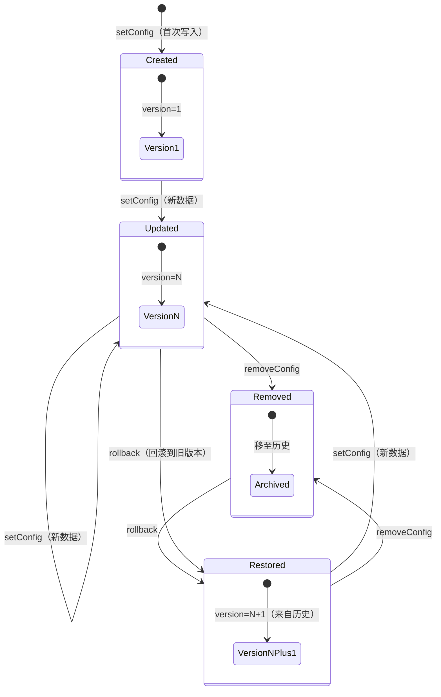
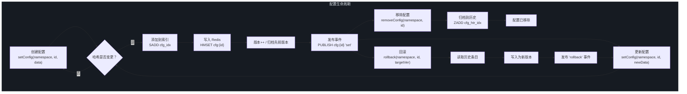

# 配置管理

CoSky 的配置管理子系统提供了一种集中化、版本化且可审计的方式来存储和分发基于 Redis 的微服务配置数据。在分布式微服务环境中，数十甚至数百个服务需要对共享配置（连接字符串、功能开关、特性标志和运维参数）进行一致且实时的访问。CoSky 利用 Redis 的原生哈希结构和 Lua 脚本，提供原子性、高吞吐量的配置操作，支持自动版本历史和回滚功能，无需在已有 Redis 实例之外额外部署任何基础设施。

## 概览

| 组件 | 职责 | 关键文件 | 源码 |
|---|---|---|---|
| **ConfigService** | 配置操作的核心 CRUD 接口 | `ConfigService.kt` | [ConfigService.kt:24](https://github.com/Ahoo-Wang/CoSky/blob/main/cosky-config/src/main/kotlin/me/ahoo/cosky/config/ConfigService.kt#L24) |
| **Config / ConfigData** | 保存配置负载、哈希、版本和时间戳的数据模型 | `Config.kt` | [Config.kt:20](https://github.com/Ahoo-Wang/CoSky/blob/main/cosky-config/src/main/kotlin/me/ahoo/cosky/config/Config.kt#L20) |
| **ConfigCodec** | Redis 哈希映射与领域对象之间的序列化/反序列化 | `ConfigCodec.kt` | [ConfigCodec.kt:20](https://github.com/Ahoo-Wang/CoSky/blob/main/cosky-config/src/main/kotlin/me/ahoo/cosky/config/ConfigCodec.kt#L20) |
| **ConfigHistory** | 包含操作类型和操作时间戳的扩展配置模型 | `ConfigHistory.kt` | [ConfigHistory.kt:20](https://github.com/Ahoo-Wang/CoSky/blob/main/cosky-config/src/main/kotlin/me/ahoo/cosky/config/ConfigHistory.kt#L20) |
| **ConfigVersion** | 将 configId 与其版本号配对的轻量级接口 | `ConfigVersion.kt` | [ConfigVersion.kt:20](https://github.com/Ahoo-Wang/CoSky/blob/main/cosky-config/src/main/kotlin/me/ahoo/cosky/config/ConfigVersion.kt#L20) |
| **ConfigRollback** | 回滚到先前配置版本的接口 | `ConfigRollback.kt` | [ConfigRollback.kt:24](https://github.com/Ahoo-Wang/CoSky/blob/main/cosky-config/src/main/kotlin/me/ahoo/cosky/config/ConfigRollback.kt#L24) |
| **ConfigKeyGenerator** | 生成配置索引、历史和条目的 Redis 键模式 | `ConfigKeyGenerator.kt` | [ConfigKeyGenerator.kt:22](https://github.com/Ahoo-Wang/CoSky/blob/main/cosky-config/src/main/kotlin/me/ahoo/cosky/config/ConfigKeyGenerator.kt#L22) |
| **RedisConfigService** | 基于 Lua 脚本的 Redis 实现 ConfigService | `RedisConfigService.kt` | [RedisConfigService.kt:41](https://github.com/Ahoo-Wang/CoSky/blob/main/cosky-config/src/main/kotlin/me/ahoo/cosky/config/redis/RedisConfigService.kt#L41) |
| **ConfigRedisScripts** | 加载并缓存用于原子配置操作的 Lua 脚本 | `ConfigRedisScripts.kt` | [ConfigRedisScripts.kt:24](https://github.com/Ahoo-Wang/CoSky/blob/main/cosky-config/src/main/kotlin/me/ahoo/cosky/config/redis/ConfigRedisScripts.kt#L24) |
| **ConfigChangedEvent** | 通过 Redis PubSub 在配置变更时发出的事件 | `ConfigChangedEvent.kt` | [ConfigChangedEvent.kt:20](https://github.com/Ahoo-Wang/CoSky/blob/main/cosky-config/src/main/kotlin/me/ahoo/cosky/config/ConfigChangedEvent.kt#L20) |

## ConfigService 接口

`ConfigService` 接口定义了配置 CRUD 操作的完整契约。它继承 `ConfigRollback` 以获得版本历史和回滚能力。所有方法返回 Project Reactor 类型（`Mono` / `Flux`），支持非阻塞的响应式执行。

| 方法 | 返回类型 | 描述 | 源码 |
|---|---|---|---|
| `getConfigs(namespace)` | `Flux<String>` | 通过读取配置索引集合列出命名空间中的所有配置 ID | [ConfigService.kt:25](https://github.com/Ahoo-Wang/CoSky/blob/main/cosky-config/src/main/kotlin/me/ahoo/cosky/config/ConfigService.kt#L25) |
| `getConfig(namespace, configId)` | `Mono<Config>` | 获取单个配置条目，包含其数据、哈希、版本和时间戳 | [ConfigService.kt:26](https://github.com/Ahoo-Wang/CoSky/blob/main/cosky-config/src/main/kotlin/me/ahoo/cosky/config/ConfigService.kt#L26) |
| `setConfig(namespace, configId, data)` | `Mono<Boolean>` | 创建或更新配置；原子性地存储数据、递增版本、将先前版本归档为历史，并发布变更事件 | [ConfigService.kt:27](https://github.com/Ahoo-Wang/CoSky/blob/main/cosky-config/src/main/kotlin/me/ahoo/cosky/config/ConfigService.kt#L27) |
| `removeConfig(namespace, configId)` | `Mono<Boolean>` | 移除配置并将其归档到历史；发布移除事件 | [ConfigService.kt:28](https://github.com/Ahoo-Wang/CoSky/blob/main/cosky-config/src/main/kotlin/me/ahoo/cosky/config/ConfigService.kt#L28) |
| `containsConfig(namespace, configId)` | `Mono<Boolean>` | 通过 Redis `EXISTS` 检查配置条目是否存在 | [ConfigService.kt:29](https://github.com/Ahoo-Wang/CoSky/blob/main/cosky-config/src/main/kotlin/me/ahoo/cosky/config/ConfigService.kt#L29) |

此外，继承的 `ConfigRollback` 接口增加了：

| 方法 | 返回类型 | 描述 | 源码 |
|---|---|---|---|
| `rollback(namespace, configId, targetVersion)` | `Mono<Boolean>` | 将配置恢复到先前版本；归档当前版本并发布回滚事件 | [ConfigRollback.kt:30](https://github.com/Ahoo-Wang/CoSky/blob/main/cosky-config/src/main/kotlin/me/ahoo/cosky/config/ConfigRollback.kt#L30) |
| `getConfigVersions(namespace, configId)` | `Flux<ConfigVersion>` | 按时间倒序列出版本历史（最多 10 条） | [ConfigRollback.kt:32](https://github.com/Ahoo-Wang/CoSky/blob/main/cosky-config/src/main/kotlin/me/ahoo/cosky/config/ConfigRollback.kt#L32) |
| `getConfigHistory(namespace, configId, version)` | `Mono<ConfigHistory>` | 获取特定版本的已归档配置 | [ConfigRollback.kt:34](https://github.com/Ahoo-Wang/CoSky/blob/main/cosky-config/src/main/kotlin/me/ahoo/cosky/config/ConfigRollback.kt#L34) |

## 数据模型

配置数据模型建立在清晰的接口层次结构上，将版本管理与完整配置数据分离。



<!-- Sources: Config.kt:20, ConfigVersion.kt:20, ConfigHistory.kt:20, NamespacedConfigId.kt:22 -->

### Config

`Config` 接口继承 `ConfigVersion`，增加了负载（`data`）、内容哈希（`hash`）和创建时间戳。`ConfigData` 数据类是用于当前配置条目的具体实现。

- **configId** -- 命名空间内配置的唯一标识符
- **data** -- 原始配置负载（通常为 YAML、JSON 或 properties 文本）
- **hash** -- 数据的 SHA-256 哈希，用于变更检测和去重
- **version** -- 单调递增的版本号
- **createTime** -- 版本创建时的 Unix 时间戳

Source: [Config.kt:20](https://github.com/Ahoo-Wang/CoSky/blob/main/cosky-config/src/main/kotlin/me/ahoo/cosky/config/Config.kt#L20)

### ConfigHistory

`ConfigHistory` 在 `Config` 基础上增加了两个字段，用于记录已归档版本的审计信息：

- **op** -- 导致此版本被归档的操作：`set`、`remove` 或 `rollback`
- **opTime** -- 归档操作发生时的 Unix 时间戳

Source: [ConfigHistory.kt:20](https://github.com/Ahoo-Wang/CoSky/blob/main/cosky-config/src/main/kotlin/me/ahoo/cosky/config/ConfigHistory.kt#L20)

### ConfigCodec

`ConfigCodec` 是一个单例对象，提供 Kotlin 扩展函数，用于将 Redis 哈希映射（`Map<String, String>`）解码为领域对象：

- `decodeAsConfig()` -- 将哈希映射转换为 `ConfigData` 实例
- `decodeAsHistory()` -- 将哈希映射转换为 `ConfigHistory` 实例（包含 `op` 和 `opTime` 字段）

Source: [ConfigCodec.kt:20](https://github.com/Ahoo-Wang/CoSky/blob/main/cosky-config/src/main/kotlin/me/ahoo/cosky/config/ConfigCodec.kt#L20)

## Redis 实现

`RedisConfigService` 使用 Redis 哈希结构和原子 Lua 脚本实现所有 `ConfigService` 和 `ConfigRollback` 操作。这确保了多步操作（版本递增 + 历史归档 + 事件发布）作为单个原子单元执行。



<!-- Sources: RedisConfigService.kt:41, ConfigRedisScripts.kt:24, ConfigService.kt:24, ConfigRollback.kt:24 -->

### ConfigRedisScripts

`ConfigRedisScripts` 对象在启动时从类路径预加载三个 Lua 脚本。每个脚本对应一个写操作，由 Redis 原子性地执行：

| 脚本 | 资源文件 | 用途 |
|---|---|---|
| `SCRIPT_CONFIG_SET` | `config_set.lua` | 原子性地设置配置数据、递增版本、将先前版本归档到历史，并通过 Redis PubSub 发布 `set` 变更事件 |
| `SCRIPT_CONFIG_REMOVE` | `config_remove.lua` | 原子性地从索引中移除配置、归档到历史，并发布 `remove` 变更事件 |
| `SCRIPT_CONFIG_ROLLBACK` | `config_rollback.lua` | 原子性地从历史中恢复配置到目标版本、创建新版本条目，并发布 `rollback` 变更事件 |

Source: [ConfigRedisScripts.kt:24](https://github.com/Ahoo-Wang/CoSky/blob/main/cosky-config/src/main/kotlin/me/ahoo/cosky/config/redis/ConfigRedisScripts.kt#L24)

### getConfig 流程

当应用读取配置时，请求通过响应式管道检索 Redis 哈希并解码。



<!-- Sources: RedisConfigService.kt:61, RedisConfigService.kt:136, ConfigCodec.kt:30 -->

### setConfig 流程

写入配置是由 Lua 脚本执行的原子操作，在单次 Redis 调用中处理版本管理、历史归档、变更检测和事件发布。



<!-- Sources: RedisConfigService.kt:75, config_set.lua:1 -->

## Redis 键结构

`ConfigKeyGenerator` 对象按照一致的命名空间模式生成所有 Redis 键。这确保了跨命名空间的键隔离，并提供了人类可读的键名。



<!-- Sources: ConfigKeyGenerator.kt:22 -->

| 键模式 | Redis 类型 | 用途 |
|---|---|---|
| `{namespace}:cfg_idx` | SET | 命名空间中所有当前配置键的索引 |
| `{namespace}:cfg:{configId}` | HASH | 当前配置条目，包含字段：`configId`、`data`、`hash`、`version`、`createTime` |
| `{namespace}:cfg_htr_idx:{configId}` | ZSET | 配置历史条目的有序集合，以版本号作为分数（最多 10 条） |
| `{namespace}:cfg_htr:{configId}:{version}` | HASH | 已归档的配置快照，包含额外的 `op` 和 `opTime` 字段 |

Source: [ConfigKeyGenerator.kt:22](https://github.com/Ahoo-Wang/CoSky/blob/main/cosky-config/src/main/kotlin/me/ahoo/cosky/config/ConfigKeyGenerator.kt#L22)

## API 使用示例

与 Spring Cloud 集成时，CoSky 作为 `PropertySource` 从 Redis 加载配置。以下是典型的 `bootstrap.yaml` 配置：

```yaml
spring:
  application:
    name: ${service.name:cosky}
  data:
    redis:
      url: redis://localhost:6379
  cloud:
    cosky:
      namespace: ${cosky.namespace:cosky-production}
      config:
        config-id: ${spring.application.name}.yaml
```

| 配置属性 | 描述 | 示例 |
|---|---|---|
| `spring.data.redis.url` | Redis 连接 URL | `redis://localhost:6379` |
| `spring.cloud.cosky.namespace` | 用于配置隔离的命名空间 | `cosky-production` |
| `spring.cloud.cosky.config.config-id` | 要加载的 configId（通常为 `{app}.yaml`） | `order-service.yaml` |

Source: [README.md:89](https://github.com/Ahoo-Wang/CoSky/blob/main/README.md#L89)

## 回滚机制

CoSky 为每个配置条目维护最多 10 个历史版本（由 `ConfigRollback.HISTORY_SIZE` 定义）。每次配置被设置或移除时，先前的版本通过 Lua 脚本原子性地归档到历史条目。回滚操作通过读取已归档数据并创建新版本号来恢复目标版本。



<!-- Sources: ConfigRollback.kt:24, config_rollback.lua:1, config_set.lua:1 -->

`config_rollback.lua` 脚本原子性地执行以下步骤：

1. 读取目标版本的历史条目
2. 比较哈希以避免无效回滚
3. 将当前版本归档到历史
4. 以递增的版本号将历史数据写入为新版本
5. 通过 Redis PubSub 发布 `rollback` 事件

Source: [config_rollback.lua:1](https://github.com/Ahoo-Wang/CoSky/blob/main/cosky-config/src/main/resources/config_rollback.lua#L1)

## 配置生命周期

下图展示了配置条目从创建到版本更新、回滚和移除的完整生命周期。



<!-- Sources: config_set.lua:1, config_remove.lua:1, config_rollback.lua:1, RedisConfigService.kt:41 -->

## 相关页面

- [一致性层](./config-consistency.md) -- 了解 CoSky 如何通过本地缓存和 Redis PubSub 失效机制实现 1000 倍性能提升
- [服务发现](./discovery-service.md) -- 采用类似架构模式的服务注册与发现
- [REST API](./rest-api.md) -- 配置管理的 HTTP 端点

## 参考文献

- [ConfigService.kt](https://github.com/Ahoo-Wang/CoSky/blob/main/cosky-config/src/main/kotlin/me/ahoo/cosky/config/ConfigService.kt) -- 核心配置服务接口
- [Config.kt](https://github.com/Ahoo-Wang/CoSky/blob/main/cosky-config/src/main/kotlin/me/ahoo/cosky/config/Config.kt) -- 配置数据模型
- [ConfigCodec.kt](https://github.com/Ahoo-Wang/CoSky/blob/main/cosky-config/src/main/kotlin/me/ahoo/cosky/config/ConfigCodec.kt) -- 序列化编解码器
- [ConfigHistory.kt](https://github.com/Ahoo-Wang/CoSky/blob/main/cosky-config/src/main/kotlin/me/ahoo/cosky/config/ConfigHistory.kt) -- 历史配置模型
- [ConfigVersion.kt](https://github.com/Ahoo-Wang/CoSky/blob/main/cosky-config/src/main/kotlin/me/ahoo/cosky/config/ConfigVersion.kt) -- 版本模型
- [ConfigRollback.kt](https://github.com/Ahoo-Wang/CoSky/blob/main/cosky-config/src/main/kotlin/me/ahoo/cosky/config/ConfigRollback.kt) -- 回滚接口
- [ConfigKeyGenerator.kt](https://github.com/Ahoo-Wang/CoSky/blob/main/cosky-config/src/main/kotlin/me/ahoo/cosky/config/ConfigKeyGenerator.kt) -- Redis 键生成
- [ConfigChangedEvent.kt](https://github.com/Ahoo-Wang/CoSky/blob/main/cosky-config/src/main/kotlin/me/ahoo/cosky/config/ConfigChangedEvent.kt) -- 变更事件模型
- [NamespacedConfigId.kt](https://github.com/Ahoo-Wang/CoSky/blob/main/cosky-config/src/main/kotlin/me/ahoo/cosky/config/NamespacedConfigId.kt) -- 带命名空间的标识符
- [ConfigEventListenerContainer.kt](https://github.com/Ahoo-Wang/CoSky/blob/main/cosky-config/src/main/kotlin/me/ahoo/cosky/config/ConfigEventListenerContainer.kt) -- 事件监听器接口
- [RedisConfigService.kt](https://github.com/Ahoo-Wang/CoSky/blob/main/cosky-config/src/main/kotlin/me/ahoo/cosky/config/redis/RedisConfigService.kt) -- Redis 实现
- [ConfigRedisScripts.kt](https://github.com/Ahoo-Wang/CoSky/blob/main/cosky-config/src/main/kotlin/me/ahoo/cosky/config/redis/ConfigRedisScripts.kt) -- Lua 脚本加载器
- [RedisConfigEventListenerContainer.kt](https://github.com/Ahoo-Wang/CoSky/blob/main/cosky-config/src/main/kotlin/me/ahoo/cosky/config/redis/RedisConfigEventListenerContainer.kt) -- Redis PubSub 事件监听器
- [config_set.lua](https://github.com/Ahoo-Wang/CoSky/blob/main/cosky-config/src/main/resources/config_set.lua) -- 设置配置的 Lua 脚本
- [config_remove.lua](https://github.com/Ahoo-Wang/CoSky/blob/main/cosky-config/src/main/resources/config_remove.lua) -- 移除配置的 Lua 脚本
- [config_rollback.lua](https://github.com/Ahoo-Wang/CoSky/blob/main/cosky-config/src/main/resources/config_rollback.lua) -- 回滚配置的 Lua 脚本
