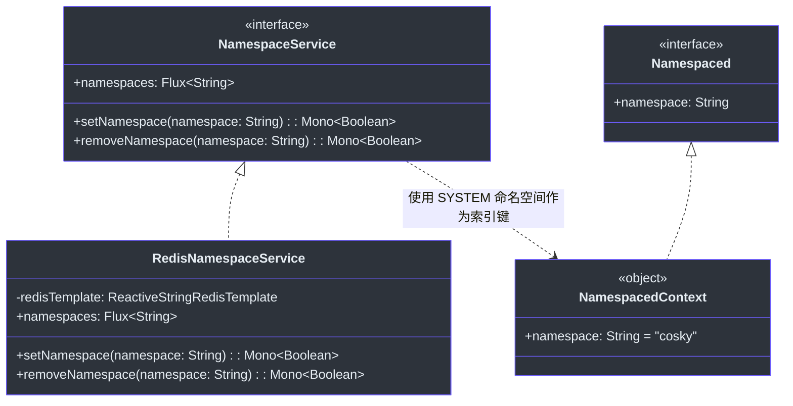
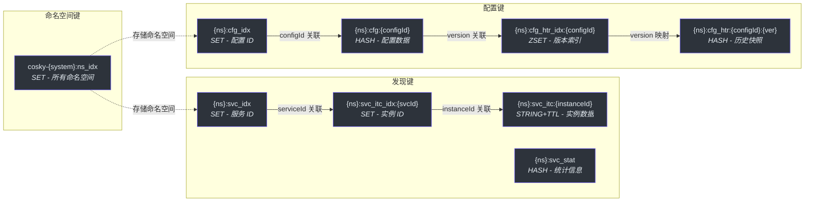
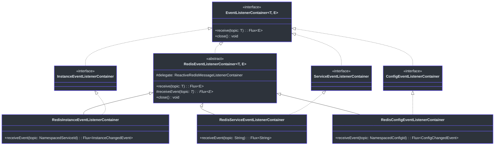
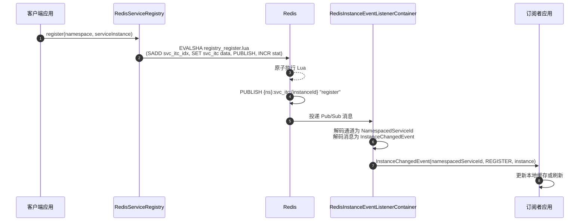
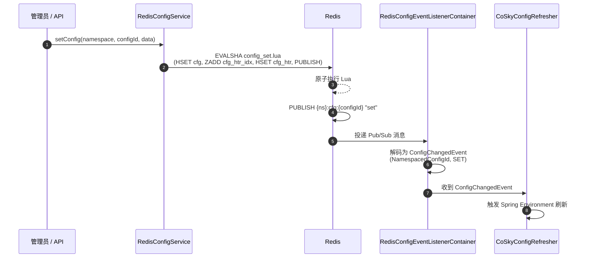
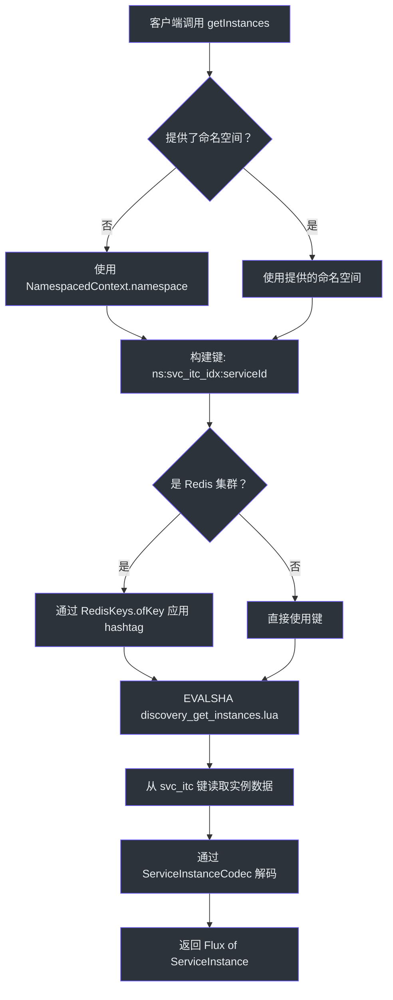

# 核心模块

`cosky-core` 模块是整个 CoSky 平台的基础。所有其他模块——配置、发现、Spring Cloud Starter 和 REST API——都直接或传递地依赖它。核心模块提供三个基本抽象：用于多租户资源隔离的**命名空间模型**、用于一致键命名和集群兼容的 **Redis 键生成**框架，以及用于响应式 Pub/Sub 消费的**事件监听器容器**接口。该模块对服务发现或配置语义一无所知；它纯粹在基础设施层面运行。

## 概览

| 组件 | 类型 | 职责 | 关键文件 |
|-----------|------|---------------|----------|
| `CoSky` | Object | 品牌常量：`COSKY = "cosky"`、`KEY_SEPARATOR = ":"`、`VERSION` | [CoSky.kt](https://github.com/Ahoo-Wang/CoSky/blob/main/cosky-core/src/main/kotlin/me/ahoo/cosky/core/CoSky.kt) |
| `Namespaced` | Interface | 在命名空间内操作的组件契约 | [Namespaced.kt](https://github.com/Ahoo-Wang/CoSky/blob/main/cosky-core/src/main/kotlin/me/ahoo/cosky/core/Namespaced.kt) |
| `NamespacedContext` | Object | 易失性全局命名空间持有者（默认：`"cosky"`） | [NamespacedContext.kt](https://github.com/Ahoo-Wang/CoSky/blob/main/cosky-core/src/main/kotlin/me/ahoo/cosky/core/NamespacedContext.kt) |
| `NamespaceService` | Interface | 命名空间的 CRUD 操作（响应式 Flux/Mono） | [NamespaceService.kt](https://github.com/Ahoo-Wang/CoSky/blob/main/cosky-core/src/main/kotlin/me/ahoo/cosky/core/NamespaceService.kt) |
| `RedisNamespaceService` | Class | 基于 Redis SET 的 `NamespaceService` 实现 | [RedisNamespaceService.kt](https://github.com/Ahoo-Wang/CoSky/blob/main/cosky-core/src/main/kotlin/me/ahoo/cosky/core/redis/RedisNamespaceService.kt) |
| `RedisKeys` | Object | Hashtag 包装和 Redis 集群键工具 | [RedisKeys.kt](https://github.com/Ahoo-Wang/CoSky/blob/main/cosky-core/src/main/kotlin/me/ahoo/cosky/core/util/RedisKeys.kt) |
| `EventListenerContainer` | Interface | 响应式事件订阅契约（`receive(topic): Flux<E>`） | [EventListenerContainer.kt](https://github.com/Ahoo-Wang/CoSky/blob/main/cosky-core/src/main/kotlin/me/ahoo/cosky/core/EventListenerContainer.kt) |
| `RedisEventListenerContainer` | Abstract Class | 带错误处理和日志的 Redis Pub/Sub 基础实现 | [RedisEventListenerContainer.kt](https://github.com/Ahoo-Wang/CoSky/blob/main/cosky-core/src/main/kotlin/me/ahoo/cosky/core/redis/RedisEventListenerContainer.kt) |

## 命名空间模型

CoSky 中的每个资源——服务实例、配置、统计信息——都作用于一个**命名空间**。这在单个 Redis 实例中提供了逻辑多租户。命名空间模型由三个协作组件组成。

### `Namespaced` 接口

[`Namespaced`](https://github.com/Ahoo-Wang/CoSky/blob/main/cosky-core/src/main/kotlin/me/ahoo/cosky/core/Namespaced.kt) 接口声明了一个属性：

```kotlin
interface Namespaced {
    val namespace: String
        get() = DEFAULT

    companion object {
        const val DEFAULT: String = "${CoSky.COSKY}-{default}"   // "cosky-{default}"
        const val SYSTEM: String = "${CoSky.COSKY}-{system}"     // "cosky-{system}"
    }
}
```

`DEFAULT` 命名空间是常规用途的默认命名空间。`SYSTEM` 命名空间（`cosky-{system}`）保留给平台内部数据，如命名空间索引本身。实现者可以覆盖默认值以提供自定义命名空间解析。

### `NamespacedContext` -- 全局命名空间状态

[`NamespacedContext`](https://github.com/Ahoo-Wang/CoSky/blob/main/cosky-core/src/main/kotlin/me/ahoo/cosky/core/NamespacedContext.kt) 是一个单例对象，持有当前进程范围的命名空间：

```kotlin
object NamespacedContext : Namespaced {
    @Volatile
    override var namespace: String = CoSky.COSKY
}
```

`@Volatile` 注解确保跨线程的可见性。Spring Cloud 自动配置在启动时从 `spring.cloud.cosky.namespace` 设置此值，在 `CoSkyAutoConfiguration` 中：

```kotlin
init {
    NamespacedContext.namespace = coSkyProperties.namespace
}
```

这种设计允许代码库中的服务方法将 `NamespacedContext.namespace` 作为默认参数使用，因此调用者很少需要显式传递命名空间。例如，[`ConfigService.getConfig()`](https://github.com/Ahoo-Wang/CoSky/blob/main/cosky-config/src/main/kotlin/me/ahoo/cosky/config/ConfigService.kt#L26) 默认使用 `NamespacedContext.namespace`。

### `NamespaceService` -- 命名空间 CRUD

[`NamespaceService`](https://github.com/Ahoo-Wang/CoSky/blob/main/cosky-core/src/main/kotlin/me/ahoo/cosky/core/NamespaceService.kt) 接口提供管理命名空间的响应式操作：



<!-- Sources: cosky-core/src/main/kotlin/me/ahoo/cosky/core/NamespaceService.kt:23-27, cosky-core/src/main/kotlin/me/ahoo/cosky/core/redis/RedisNamespaceService.kt:26-59, cosky-core/src/main/kotlin/me/ahoo/cosky/core/NamespacedContext.kt:20-23, cosky-core/src/main/kotlin/me/ahoo/cosky/core/Namespaced.kt:20-33 -->

`RedisNamespaceService` 将所有命名空间名称存储在键为 `cosky-{system}:ns_idx` 的 Redis SET 中：

```kotlin
companion object {
    const val NAMESPACE_IDX_KEY = "${Namespaced.SYSTEM}:ns_idx"
}
```

- `setNamespace(namespace)` -- `SADD` 将命名空间添加到 SET，如果是新添加的则返回 `true`
- `removeNamespace(namespace)` -- `SREM` 从 SET 中移除命名空间，如果存在则返回 `true`
- `namespaces` -- `SMEMBERS` 列出所有已注册的命名空间

## 键生成

CoSky 中所有 Redis 键遵循一致的模式：`{namespace}:{domain_segment}:{identifier}`。冒号（`:`）分隔符定义在 [`CoSky.KEY_SEPARATOR`](https://github.com/Ahoo-Wang/CoSky/blob/main/cosky-core/src/main/kotlin/me/ahoo/cosky/core/CoSky.kt#L22)。

### `RedisKeys` 工具

[`RedisKeys`](https://github.com/Ahoo-Wang/CoSky/blob/main/cosky-core/src/main/kotlin/me/ahoo/cosky/core/util/RedisKeys.kt) 对象提供集群感知的键包装。在 Redis 集群中，共享相同 hashtag `{...}` 的键保证落在同一个哈希槽上，从而支持多键 Lua 脚本：

```kotlin
object RedisKeys {
    fun ofKey(isCluster: Boolean, key: String): String {
        return if (!isCluster) key else hashTag(key)
    }

    fun hasWrap(key: String): Boolean { /* 检查 { } */ }
    fun wrap(key: String): String = "{$key}"
    fun unwrap(key: String): String { /* 去除 { } */ }
    fun hashTag(key: String): String { /* 如果尚未包装则包装 */ }
}
```

### 键模式参考

下表展示了所有领域中键的结构方式。每个模块都有自己的键生成器（`DiscoveryKeyGenerator`、`ConfigKeyGenerator`），使用相同的 `{namespace}:` 前缀约定：



<!-- Sources: cosky-core/src/main/kotlin/me/ahoo/cosky/core/redis/RedisNamespaceService.kt:28, cosky-discovery/src/main/kotlin/me/ahoo/cosky/discovery/DiscoveryKeyGenerator.kt:22-90, cosky-config/src/main/kotlin/me/ahoo/cosky/config/ConfigKeyGenerator.kt:22-82 -->

| 模式 | 段 | 生成方法 | 示例 |
|---------|---------|-----------------|---------|
| `{cosky-system}:ns_idx` | 命名空间索引 | 在 `RedisNamespaceService` 中硬编码 | `cosky-{system}:ns_idx` |
| `{ns}:svc_idx` | 服务索引 | `DiscoveryKeyGenerator.getServiceIdxKey()` | `cosky-{default}:svc_idx` |
| `{ns}:svc_itc_idx:{serviceId}` | 实例索引 | `DiscoveryKeyGenerator.getInstanceIdxKey()` | `cosky-{default}:svc_itc_idx:order-service` |
| `{ns}:svc_itc:{instanceId}` | 实例数据 | `DiscoveryKeyGenerator.getInstanceKey()` | `cosky-{default}:svc_itc:order-service@http#10.0.0.1#8080` |
| `{ns}:svc_stat` | 服务统计 | `DiscoveryKeyGenerator.getServiceStatKey()` | `cosky-{default}:svc_stat` |
| `{ns}:cfg_idx` | 配置索引 | `ConfigKeyGenerator.getConfigIdxKey()` | `cosky-{default}:cfg_idx` |
| `{ns}:cfg:{configId}` | 配置数据 | `ConfigKeyGenerator.getConfigKey()` | `cosky-{default}:cfg:application.yaml` |
| `{ns}:cfg_htr_idx:{configId}` | 历史索引 | `ConfigKeyGenerator.getConfigHistoryIdxKey()` | `cosky-{default}:cfg_htr_idx:application.yaml` |
| `{ns}:cfg_htr:{configId}:{version}` | 历史数据 | `ConfigKeyGenerator.getConfigHistoryKey()` | `cosky-{default}:cfg_htr:application.yaml:3` |

## 事件系统

CoSky 使用基于 Redis Pub/Sub 的事件驱动架构来实时传播变更。事件系统由两层定义：`cosky-core` 中的通用接口和 `cosky-discovery`、`cosky-config` 中的领域特定实现。

### `EventListenerContainer` 接口

[`EventListenerContainer<T, E>`](https://github.com/Ahoo-Wang/CoSky/blob/main/cosky-core/src/main/kotlin/me/ahoo/cosky/core/EventListenerContainer.kt) 接口是一个最小的响应式契约：

```kotlin
interface EventListenerContainer<T, E : Any> : AutoCloseable {
    fun receive(topic: T): Flux<E>
}
```

- `T` 是主题类型（例如，命名空间级事件用 `String`，实例级事件用 `NamespacedServiceId`，配置事件用 `NamespacedConfigId`）
- `E` 是事件类型（例如，服务变更通知用 `String`，实例变更用 `InstanceChangedEvent`，配置变更用 `ConfigChangedEvent`）
- 继承 `AutoCloseable` 用于生命周期管理

### `RedisEventListenerContainer` 基类

[`RedisEventListenerContainer`](https://github.com/Ahoo-Wang/CoSky/blob/main/cosky-core/src/main/kotlin/me/ahoo/cosky/core/redis/RedisEventListenerContainer.kt) 抽象类封装了 Spring 的 `ReactiveRedisMessageListenerContainer`，并提供错误处理（特别是针对 `CancellationException`）和生命周期管理：



<!-- Sources: cosky-core/src/main/kotlin/me/ahoo/cosky/core/EventListenerContainer.kt:5-7, cosky-core/src/main/kotlin/me/ahoo/cosky/core/redis/RedisEventListenerContainer.kt:10-41, cosky-discovery/src/main/kotlin/me/ahoo/cosky/discovery/InstanceEventListenerContainer.kt:5, cosky-discovery/src/main/kotlin/me/ahoo/cosky/discovery/ServiceEventListenerContainer.kt:5, cosky-config/src/main/kotlin/me/ahoo/cosky/config/ConfigEventListenerContainer.kt:22 -->

### 事件流 -- 服务实例注册

以下序列图追踪了服务实例注册时以及外部订阅者观察变更时的完整事件流：



<!-- Sources: cosky-discovery/src/main/kotlin/me/ahoo/cosky/discovery/redis/RedisServiceRegistry.kt:43-64, cosky-discovery/src/main/kotlin/me/ahoo/cosky/discovery/redis/RedisInstanceEventListenerContainer.kt:23-51, cosky-discovery/src/main/kotlin/me/ahoo/cosky/discovery/InstanceChangedEvent.kt:20-47 -->

### 事件流 -- 配置变更传播

配置变更遵循类似的 Pub/Sub 模式。当配置被设置或回滚时，Lua 脚本发布到配置键通道，`RedisConfigEventListenerContainer` 将消息解码为 `ConfigChangedEvent`：



<!-- Sources: cosky-config/src/main/kotlin/me/ahoo/cosky/config/redis/RedisConfigService.kt:75-86, cosky-config/src/main/kotlin/me/ahoo/cosky/config/redis/RedisConfigEventListenerContainer.kt:14-30, cosky-config/src/main/kotlin/me/ahoo/cosky/config/ConfigChangedEvent.kt:20-36 -->

### 事件类型

| 模块 | 事件类 | 主题类型 | 可能的事件 |
|--------|------------|------------|-----------------|
| 发现 | `InstanceChangedEvent` | `NamespacedServiceId` | `REGISTER`, `DEREGISTER`, `EXPIRED`, `RENEW`, `SET_METADATA` |
| 发现 | `String`（命名空间名称） | `String` | 服务索引变更（服务添加/移除） |
| 配置 | `ConfigChangedEvent` | `NamespacedConfigId` | `SET`, `ROLLBACK`, `REMOVE` |

## 命名空间作用域操作流程

CoSky 中的每个操作都流经命名空间模型。下图说明了典型的服务发现请求如何在命名空间作用域内解析键：



<!-- Sources: cosky-core/src/main/kotlin/me/ahoo/cosky/core/NamespacedContext.kt:20-23, cosky-core/src/main/kotlin/me/ahoo/cosky/core/util/RedisKeys.kt:24-31, cosky-discovery/src/main/kotlin/me/ahoo/cosky/discovery/redis/RedisServiceDiscovery.kt:33-54, cosky-discovery/src/main/kotlin/me/ahoo/cosky/discovery/redis/DiscoveryRedisScripts.kt:47-49 -->

## 交叉引用

- [架构概览](./architecture) -- 高层模块结构和设计原则。
- [配置模块](./config-service) -- `cosky-config` 如何基于核心的命名空间和事件抽象构建。
- [服务发现模块](./service-discovery) -- `cosky-discovery` 如何基于核心的命名空间和事件抽象构建。

## 参考

- [CoSky.kt -- 品牌常量](https://github.com/Ahoo-Wang/CoSky/blob/main/cosky-core/src/main/kotlin/me/ahoo/cosky/core/CoSky.kt)
- [Namespaced.kt -- 命名空间契约和常量](https://github.com/Ahoo-Wang/CoSky/blob/main/cosky-core/src/main/kotlin/me/ahoo/cosky/core/Namespaced.kt)
- [NamespacedContext.kt -- 全局命名空间状态](https://github.com/Ahoo-Wang/CoSky/blob/main/cosky-core/src/main/kotlin/me/ahoo/cosky/core/NamespacedContext.kt)
- [NamespaceService.kt -- 命名空间 CRUD 接口](https://github.com/Ahoo-Wang/CoSky/blob/main/cosky-core/src/main/kotlin/me/ahoo/cosky/core/NamespaceService.kt)
- [RedisNamespaceService.kt -- 基于 Redis SET 的命名空间存储](https://github.com/Ahoo-Wang/CoSky/blob/main/cosky-core/src/main/kotlin/me/ahoo/cosky/core/redis/RedisNamespaceService.kt)
- [RedisKeys.kt -- 集群 hashtag 和键工具](https://github.com/Ahoo-Wang/CoSky/blob/main/cosky-core/src/main/kotlin/me/ahoo/cosky/core/util/RedisKeys.kt)
- [EventListenerContainer.kt -- 响应式事件订阅接口](https://github.com/Ahoo-Wang/CoSky/blob/main/cosky-core/src/main/kotlin/me/ahoo/cosky/core/EventListenerContainer.kt)
- [RedisEventListenerContainer.kt -- Redis Pub/Sub 基类](https://github.com/Ahoo-Wang/CoSky/blob/main/cosky-core/src/main/kotlin/me/ahoo/cosky/core/redis/RedisEventListenerContainer.kt)
- [DiscoveryKeyGenerator.kt -- 服务发现键模式](https://github.com/Ahoo-Wang/CoSky/blob/main/cosky-discovery/src/main/kotlin/me/ahoo/cosky/discovery/DiscoveryKeyGenerator.kt)
- [ConfigKeyGenerator.kt -- 配置键模式](https://github.com/Ahoo-Wang/CoSky/blob/main/cosky-config/src/main/kotlin/me/ahoo/cosky/config/ConfigKeyGenerator.kt)
- [InstanceChangedEvent.kt -- 发现事件类型](https://github.com/Ahoo-Wang/CoSky/blob/main/cosky-discovery/src/main/kotlin/me/ahoo/cosky/discovery/InstanceChangedEvent.kt)
- [ConfigChangedEvent.kt -- 配置事件类型](https://github.com/Ahoo-Wang/CoSky/blob/main/cosky-config/src/main/kotlin/me/ahoo/cosky/config/ConfigChangedEvent.kt)
