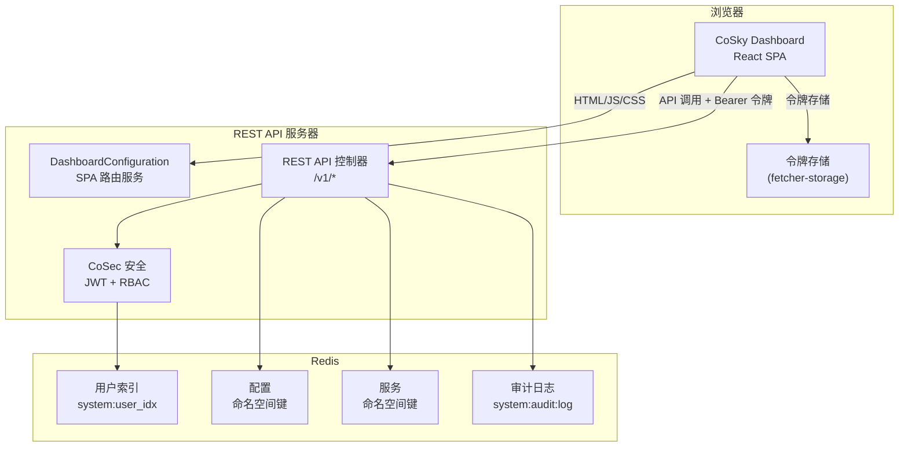
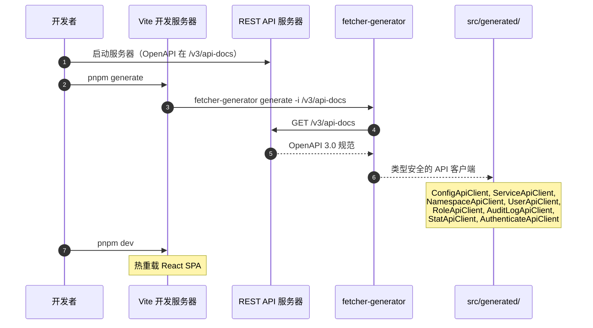
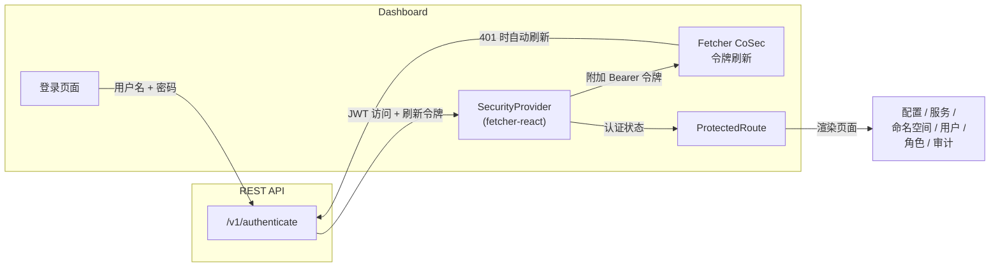

# Dashboard

CoSky Dashboard 是一个基于 React 19、TypeScript 和 Ant Design 6 构建的现代化单页应用。它为所有 CoSky 功能提供了可视化管理界面：服务监控、配置管理、服务拓扑可视化、RBAC 管理、用户管理和审计日志查看。Dashboard 由 REST API 服务器直接作为静态资源提供服务，并通过 CoSky REST API 与后端通信。

## 一览

| 方面 | 详情 | 关键文件 | 源码 |
|--------|--------|----------|--------|
| 前端应用 | React 19 SPA + Ant Design 6 | `dashboard/package.json` | [dashboard/package.json](https://github.com/Ahoo-Wang/CoSky/blob/main/dashboard/package.json) |
| SPA 路由服务 | 为所有 Dashboard 路由提供 `index.html` | `DashboardConfiguration.kt` | [cosky-rest-api/.../DashboardConfiguration.kt:30](https://github.com/Ahoo-Wang/CoSky/blob/main/cosky-rest-api/src/main/kotlin/me/ahoo/cosky/rest/dashboard/DashboardConfiguration.kt#L30) |
| API 客户端 | 从 OpenAPI 规范自动生成 | `dashboard/src/generated/` | [dashboard/package.json:12](https://github.com/Ahoo-Wang/CoSky/blob/main/dashboard/package.json#L12) |

## 技术栈

| 技术 | 版本 | 用途 |
|-----------|---------|---------|
| React | 19.2.6 | UI 框架 |
| TypeScript | ~6.0.3 | 类型安全开发 |
| Vite | 8.0.16 | 构建工具和开发服务器 |
| Ant Design | 6.3.7 | UI 组件库 |
| React Router DOM | 7.15.1 | 客户端路由 |
| @xyflow/react | 12.10.2 | 服务拓扑可视化 |
| Monaco Editor | 0.55.1 | 配置文本编辑器 |
| @ahoo-wang/fetcher | 3.16.10 | 带 CoSec 认证的 HTTP 客户端 |
| @ahoo-wang/fetcher-react | 3.16.10 | 用于 API 调用的 React Hooks |
| @ahoo-wang/fetcher-cosec | 3.16.10 | CoSec 令牌刷新集成 |
| @ahoo-wang/fetcher-viewer | 3.16.10 | 数据表格和筛选组件 |
| @ahoo-wang/fetcher-generator | 3.16.10 | OpenAPI 代码生成 |

源码: [dashboard/package.json](https://github.com/Ahoo-Wang/CoSky/blob/main/dashboard/package.json)

## DashboardConfiguration

`DashboardConfiguration` 是一个 Spring `@Controller`，为所有前端路由提供 SPA 的 `index.html`。当用户导航到任何 Dashboard 路径时，服务器返回相同的 `index.html` 文件，React Router 处理客户端路由。

映射的路由：`/`、`/home`、`/config`、`/service`、`/namespace`、`/user`、`/role`、`/audit-log`、`/login`。

此外，遗留的 `/dashboard/**` 路径会重定向（301 永久重定向）到 `/home` 以保持向后兼容。

源码: [cosky-rest-api/.../DashboardConfiguration.kt:30-78](https://github.com/Ahoo-Wang/CoSky/blob/main/cosky-rest-api/src/main/kotlin/me/ahoo/cosky/rest/dashboard/DashboardConfiguration.kt#L30)

## 功能展示

### 服务监控

服务 Dashboard 提供了所选命名空间内所有注册服务的概览，包括实例数量和健康状态。

### 配置管理

配置管理页面支持对配置进行 CRUD 操作、版本历史浏览、回滚以及通过 ZIP 文件批量导入/导出。Monaco Editor 为配置内容提供语法高亮。

### 服务拓扑

拓扑视图使用 @xyflow/react 渲染交互式的服务依赖图，展示命名空间内服务之间的依赖关系。

### RBAC 管理

角色管理页面允许管理员创建角色并为每个角色分配命名空间范围的权限（READ、WRITE 或 READ_WRITE）。

### 用户管理

用户管理支持创建用户、分配角色、修改密码和解锁被锁定的账户。

### 审计日志

审计日志页面显示所有审计操作的分页列表，包含操作者、IP、路径、操作、状态和时间戳列。

### 登录

登录页面通过 CoSky REST API 认证用户，并将 JWT 令牌对存储在浏览器存储中用于后续请求。

## 架构

<!-- Sources: dashboard/package.json:1, cosky-rest-api/src/main/kotlin/me/ahoo/cosky/rest/dashboard/DashboardConfiguration.kt:30 -->

### 数据流：API 客户端生成

<!-- Sources: dashboard/package.json:12, dashboard/package.json:13 -->

### Dashboard 中的认证流程

<!-- Sources: dashboard/package.json:14, dashboard/package.json:15 -->

## 相关页面

- [REST API Server](/guide/rest-api) -- Dashboard 消费的 API 端点
- [安全与 RBAC](/guide/security-rbac) -- 认证和授权详情

## 参考

- [dashboard/package.json](https://github.com/Ahoo-Wang/CoSky/blob/main/dashboard/package.json)
- [DashboardConfiguration.kt](https://github.com/Ahoo-Wang/CoSky/blob/main/cosky-rest-api/src/main/kotlin/me/ahoo/cosky/rest/dashboard/DashboardConfiguration.kt)
- [dashboard/CLAUDE.md](https://github.com/Ahoo-Wang/CoSky/blob/main/dashboard/CLAUDE.md)
