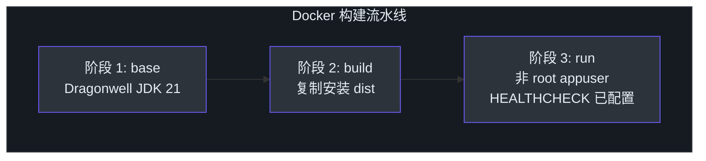
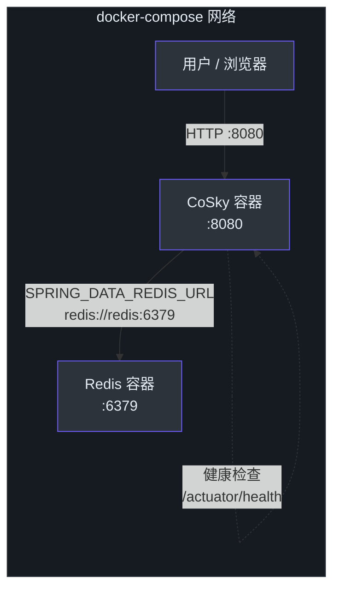
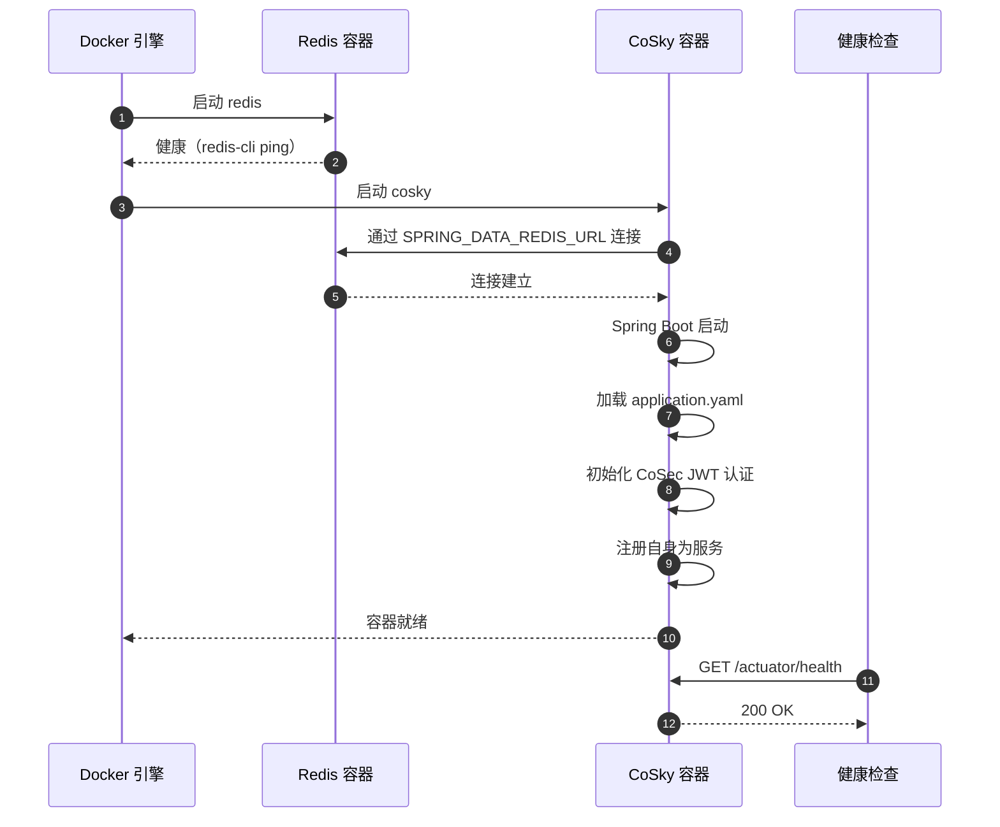
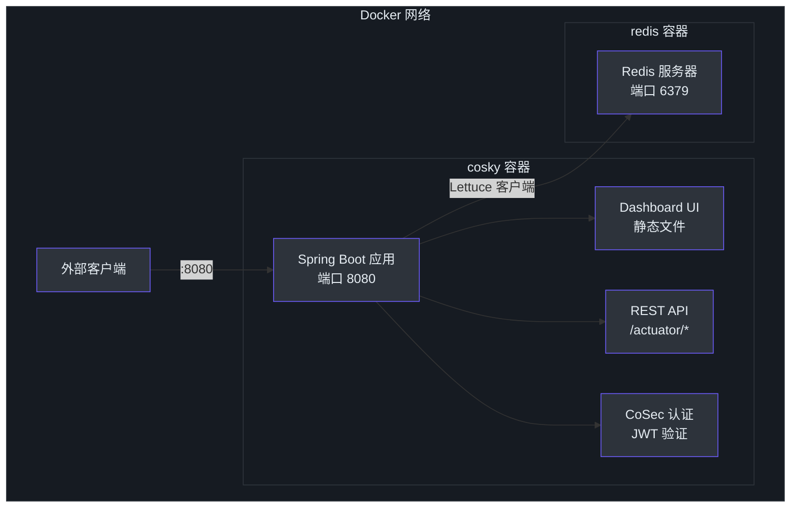

# Docker 部署

## 概述

Docker 提供了在生产环境中运行 CoSky 的最快路径。官方多架构镜像（`ahoowang/cosky`）同时支持 `linux/amd64` 和 `linux/arm64` 平台，并在每次发布时推送到 Docker Hub、GitHub Container Registry (GHCR) 和阿里云容器镜像服务。该镜像将 CoSky REST API 服务器、内置 Dashboard UI 和所有必需的运行时依赖打包到单个容器中，只需连接一个 Redis 实例即可运行。

## 快速开始

拉取最新镜像并通过单个命令启动 CoSky：

```bash
# 拉取最新镜像
docker pull ahoowang/cosky:latest

# 运行 CoSky
docker run --name cosky -d -p 8080:8080 \
  -e SPRING_DATA_REDIS_URL=redis://your-redis-host:6379 \
  ahoowang/cosky:latest
```

容器运行后，打开 [http://localhost:8080](http://localhost:8080) 访问 CoSky Dashboard。首次启动时，超级用户密码会打印到控制台日志中：

```bash
docker logs cosky
```

查找类似以下的行：

```
---------------- ****** CoSky -  init super user:[cosky] password:[xxxxxxxx] ****** ----------------
```

## 容器架构

Docker 镜像基于 Dragonwell JDK 21 的多阶段 Dockerfile 构建。构建阶段安装 Gradle 发行版，运行阶段以非 root 用户（`appuser`）运行，并配置了内置健康检查。



<!-- Sources: cosky-rest-api/Dockerfile:1, .github/workflows/docker-deploy.yml:113 -->

## 部署拓扑

典型的 Docker Compose 部署由 CoSky 容器和 Redis 容器组成，通过内部 Docker 网络连接。



<!-- Sources: cosky-rest-api/Dockerfile:1, README.md:134, cosky-rest-api/src/main/resources/application.yaml:1 -->

## 环境变量

| 变量 | 默认值 | 描述 |
|----------|---------|-------------|
| `SPRING_DATA_REDIS_URL` | *(必填)* | Redis 连接 URL（例如 `redis://localhost:6379`） |
| `SPRING_DATA_REDIS_HOST` | `localhost` | Redis 主机（URL 的替代方案） |
| `SPRING_DATA_REDIS_PASSWORD` | *(无)* | Redis 密码 |
| `SERVER_PORT` | `8080` | REST API 和 Dashboard 的 HTTP 端口 |
| `COSKY_SECURITY_ENABLED` | `true` | 启用 CoSec JWT 认证 |
| `COSKY_SUPER_INIT` | `false` | 强制重新初始化超级用户密码 |
| `COSKY_SECURITY_KEY` | 内置密钥 | CoSec 令牌的 JWT 签名密钥 |
| `COSKY_NAMESPACE` | `cosky-{system}` | 默认命名空间 |
| `COSKY_AUTO_REGISTRY` | `true` | 自动注册 CoSky 自身为服务 |
| `LANG` | *(无)* | 设置区域（例如 `C.utf8`） |
| `TZ` | *(无)* | 时区（例如 `Asia/Shanghai`） |

> 在 Redis Cluster 集群模式下运行时，请使用 `SPRING_DATA_REDIS_CLUSTER_NODES` 替代 `SPRING_DATA_REDIS_URL`，并设置 `SPRING_DATA_REDIS_CLUSTER_MAX_REDIRECTS=3`。

## Docker Compose 示例

以下 `docker-compose.yml` 启动 CoSky 和 Redis：

```yaml
version: "3.8"

services:
  redis:
    image: redis:7-alpine
    ports:
      - "6379:6379"
    volumes:
      - redis-data:/data
    healthcheck:
      test: ["CMD", "redis-cli", "ping"]
      interval: 10s
      timeout: 5s
      retries: 5

  cosky:
    image: ahoowang/cosky:latest
    ports:
      - "8080:8080"
    environment:
      SPRING_DATA_REDIS_URL: redis://redis:6379
      COSKY_SECURITY_ENABLED: "true"
      TZ: Asia/Shanghai
    depends_on:
      redis:
        condition: service_healthy
    healthcheck:
      test: ["CMD", "curl", "-f", "http://localhost:8080/actuator/health"]
      interval: 30s
      timeout: 3s
      retries: 3

volumes:
  redis-data:
```

## 启动序列

以下图示说明了容器启动和健康检查流程：



<!-- Sources: cosky-rest-api/Dockerfile:26, cosky-rest-api/src/main/resources/application.yaml:1, .github/workflows/docker-deploy.yml:1 -->

## 卷挂载

| 挂载路径 | 用途 | 必需 |
|-----------|---------|----------|
| `/etc/localtime` | 同步容器时区与主机 | 推荐 |

CoSky 容器挂载主机的 `/etc/localtime` 以确保日志时间戳和审计记录与主机时区一致。这在 Kubernetes 清单和上面的 Docker Compose 示例中均有配置。

## 健康检查配置

Docker 镜像包含内置的 `HEALTHCHECK` 指令，用于 ping Spring Boot Actuator 健康端点：

```dockerfile
HEALTHCHECK --interval=30s --timeout=3s --retries=3 \
  CMD curl -f http://localhost:8080/actuator/health || exit 1
```

对于 Kubernetes 部署，可使用以下探针路径：

| 探针 | 路径 | 用途 |
|-------|------|---------|
| 启动探针 | `/actuator/health` | 验证应用程序已完全启动 |
| 就绪探针 | `/actuator/health/readiness` | 表示 Pod 可以接受流量 |
| 存活探针 | `/actuator/health/liveness` | 确认应用程序仍在运行 |

## 网络

CoSky 默认暴露端口 `8080`。在 Docker Compose 设置中，CoSky 和 Redis 容器共享内部网络，Redis 可通过其服务名（`redis://redis:6379`）访问。除非需要直接访问进行调试，否则无需将 Redis 端口暴露到主机。



<!-- Sources: cosky-rest-api/Dockerfile:26, cosky-rest-api/src/main/resources/application.yaml:14, README.md:134 -->

## CI/CD 流水线

[Docker 镜像部署工作流](https://github.com/Ahoo-Wang/CoSky/blob/main/.github/workflows/docker-deploy.yml)在每次推送和标签时构建并推送镜像。流水线使用 pnpm 构建 Dashboard UI，创建 Gradle 发行版，然后使用 Docker Buildx 为 `linux/amd64` 和 `linux/arm64` 生成多架构镜像。

镜像发布到三个镜像仓库：

| 镜像仓库 | 镜像 |
|----------|-------|
| Docker Hub | `ahoowang/cosky` |
| GitHub Container Registry | `ghcr.io/ahoo-wang/cosky` |
| 阿里云容器镜像服务 | `registry.cn-shanghai.aliyuncs.com/ahoo/cosky` |

## 功能对比

| 功能 | CoSky | Eureka | Consul | Nacos | Apollo |
|---------|-------|--------|--------|-------|--------|
| CAP | CP+AP | AP | CP | CP+AP | CP+AP |
| 健康检查 | 客户端心跳 | 客户端心跳 | TCP/HTTP/gRPC | TCP/HTTP/客户端心跳 | 客户端心跳 |
| 访问协议 | HTTP/Redis | HTTP | HTTP/DNS | HTTP/DNS | HTTP |
| K8S 集成 | 是 | 否 | 是 | 是 | 否 |
| 持久化 | Redis | - | - | MySQL | MySQL |
| 跨注册中心同步 | 是 | 否 | 是 | 是 | 否 |

## 相关页面

- [Kubernetes 部署](./deployment-kubernetes.md) - 在 K8s 集群中部署 CoSky
- [独立部署](./deployment-standalone.md) - 不使用容器运行 CoSky
- [性能基准测试](./performance.md) - JMH 基准测试结果

## 参考

- [cosky-rest-api/Dockerfile](https://github.com/Ahoo-Wang/CoSky/blob/main/cosky-rest-api/Dockerfile)
- [cosky-rest-api/src/main/resources/application.yaml](https://github.com/Ahoo-Wang/CoSky/blob/main/cosky-rest-api/src/main/resources/application.yaml)
- [cosky-rest-api/src/main/resources/bootstrap.yaml](https://github.com/Ahoo-Wang/CoSky/blob/main/cosky-rest-api/src/main/resources/bootstrap.yaml)
- [cosky-rest-api/src/dist/config/application.yaml](https://github.com/Ahoo-Wang/CoSky/blob/main/cosky-rest-api/src/dist/config/application.yaml)
- [.github/workflows/docker-deploy.yml](https://github.com/Ahoo-Wang/CoSky/blob/main/.github/workflows/docker-deploy.yml)
- [README.md - Docker 部署](https://github.com/Ahoo-Wang/CoSky/blob/main/README.md)
