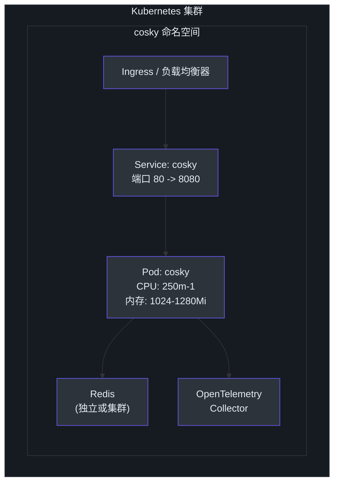
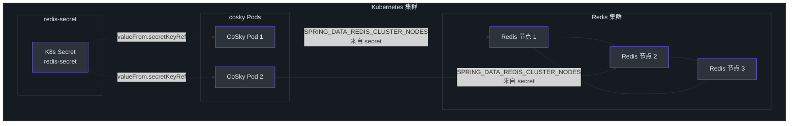
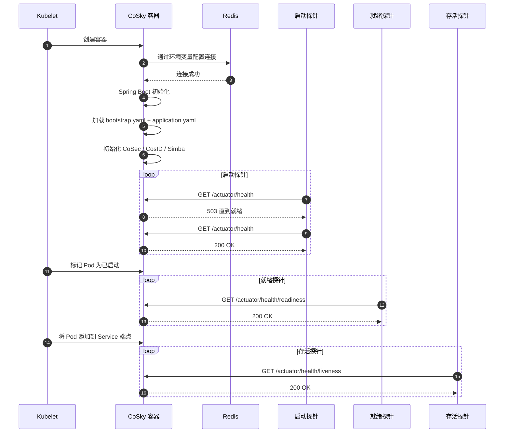
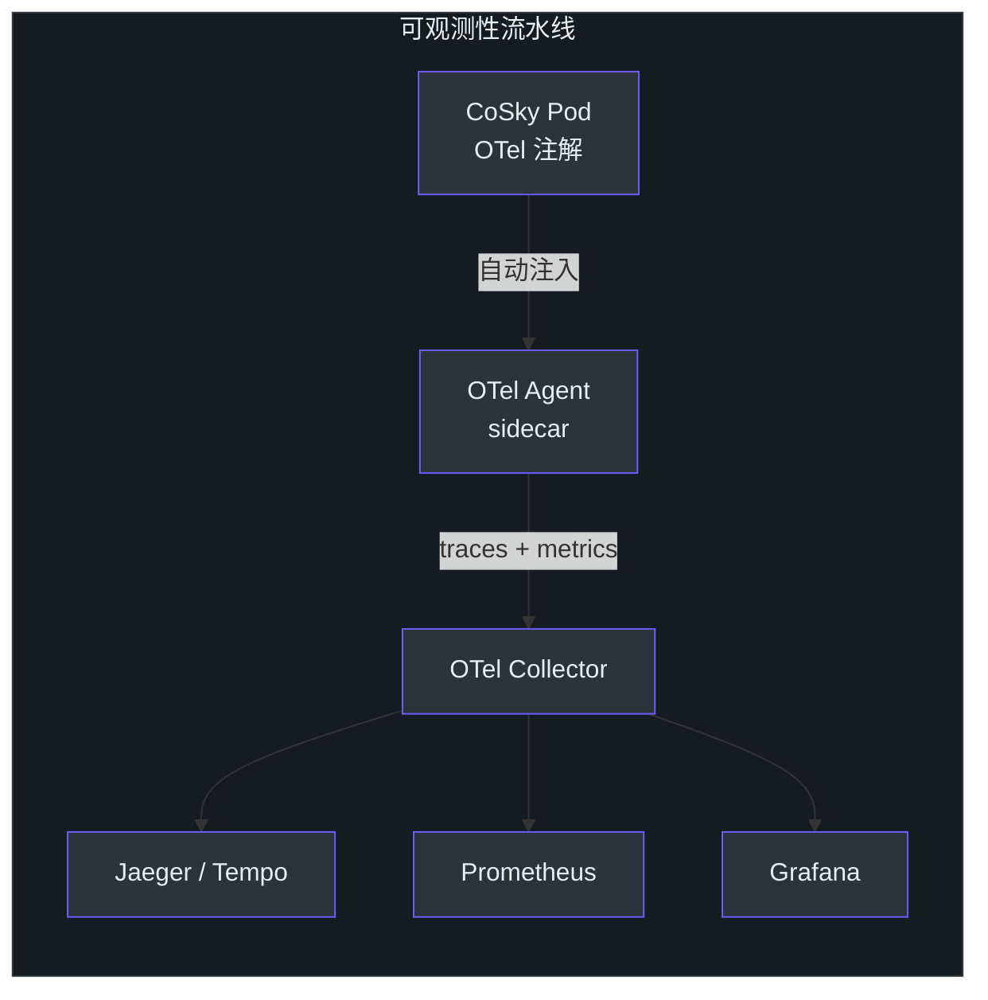

# Kubernetes 部署

## 概述

Kubernetes 是 CoSky 生产环境的推荐部署平台。项目提供了可即用的清单文件，支持单副本和集群化 Redis 两种部署方式，以及用于稳定网络访问的 Kubernetes Service 和用于自动可观测性插桩的 OpenTelemetry 注解。CoSky 轻量级的资源占用（250m CPU / 1024Mi 内存请求）使其非常适合共享集群环境。

## 部署清单（单节点 Redis）

基础部署清单创建一个连接到独立 Redis 实例的单 CoSky 副本：

```yaml
apiVersion: apps/v1
kind: Deployment
metadata:
  name: cosky
  labels:
    app: cosky
spec:
  replicas: 1
  selector:
    matchLabels:
      app: cosky
  template:
    metadata:
      labels:
        app: cosky
      annotations:
        instrumentation.opentelemetry.io/inject-java: "true"
    spec:
      containers:
        - name: cosky
          image: registry.cn-shanghai.aliyuncs.com/ahoo/cosky:5.3.5
          ports:
            - name: http
              containerPort: 8080
              protocol: TCP
          env:
            - name: SPRING_DATA_REDIS_HOST
              value: redis-uri:6379
            - name: SPRING_DATA_REDIS_PASSWORD
              value: redis-pwd
            - name: TZ
              value: Asia/Shanghai
          startupProbe:
            httpGet:
              port: http
              path: /actuator/health
          readinessProbe:
            httpGet:
              port: http
              path: /actuator/health/readiness
          livenessProbe:
            httpGet:
              port: http
              path: /actuator/health/liveness
          resources:
            limits:
              cpu: "1"
              memory: 1280Mi
            requests:
              cpu: 250m
              memory: 1024Mi
          volumeMounts:
            - mountPath: /etc/localtime
              name: volume-localtime
      volumes:
        - hostPath:
            path: /etc/localtime
            type: ""
          name: volume-localtime
```

<!-- Sources: k8s/deployment/cosky.yml:1, cosky-rest-api/src/main/resources/application.yaml:1 -->

## 集群化 Redis 部署

对于使用 Redis Cluster 的生产环境，请使用集群清单，该清单从 Kubernetes Secret 读取连接详情：

```yaml
apiVersion: apps/v1
kind: Deployment
metadata:
  name: cosky
  labels:
    app: cosky
spec:
  replicas: 1
  selector:
    matchLabels:
      app: cosky
  template:
    metadata:
      labels:
        app: cosky
      annotations:
        instrumentation.opentelemetry.io/inject-java: "true"
    spec:
      containers:
        - name: cosky
          image: registry.cn-shanghai.aliyuncs.com/ahoo/cosky:5.3.5
          env:
            - name: SPRING_DATA_REDIS_CLUSTER_NODES
              valueFrom:
                secretKeyRef:
                  name: redis-secret
                  key: nodes
            - name: SPRING_DATA_REDIS_PASSWORD
              valueFrom:
                secretKeyRef:
                  name: redis-secret
                  key: password
            - name: SPRING_DATA_REDIS_CLUSTER_MAX_REDIRECTS
              value: "3"
            - name: SPRING_DATA_REDIS_LETTUCE_CLUSTER_REFRESH_ADAPTIVE
              value: "true"
            - name: SPRING_DATA_REDIS_LETTUCE_CLUSTER_REFRESH_PERIOD
              value: 30s
            - name: TZ
              value: Asia/Shanghai
          # ... 与上面相同的探针、资源和卷配置
```

<!-- Sources: k8s/deployment/cosky-cluster.yml:1 -->

## Kubernetes Service

Service 在端口 80 上暴露 CoSky，转发到容器端口 8080：

```yaml
apiVersion: v1
kind: Service
metadata:
  name: cosky
  labels:
    app: cosky
spec:
  selector:
    app: cosky
  ports:
    - name: rest
      port: 80
      protocol: TCP
      targetPort: 8080
```

<!-- Sources: k8s/deployment/cosky-service.yaml:1 -->

## 架构概览

以下图示展示了单副本部署的 Kubernetes 部署拓扑：



<!-- Sources: k8s/deployment/cosky.yml:1, k8s/deployment/cosky-service.yaml:1 -->

## 集群化 Redis 拓扑

使用 Redis Cluster 时，CoSky 通过 Lettuce 客户端连接，支持自适应拓扑刷新。



<!-- Sources: k8s/deployment/cosky-cluster.yml:1, k8s/deployment/cosky-service.yaml:1 -->

## Pod 启动序列



<!-- Sources: k8s/deployment/cosky.yml:28, cosky-rest-api/src/main/resources/application.yaml:1, cosky-rest-api/src/main/resources/bootstrap.yaml:1 -->

## 资源配置

| 资源 | 请求 | 限制 | 说明 |
|----------|----------|--------|-------|
| CPU | 250m | 1 核 | 适合中等流量 |
| 内存 | 1024Mi | 1280Mi | 包含 JVM 堆 + 堆外内存 |
| 启动探针 | `/actuator/health` | - | 允许最长 `failureThreshold * periodSeconds` 的冷启动时间 |
| 就绪探针 | `/actuator/health/readiness` | - | 控制流量路由 |
| 存活探针 | `/actuator/health/liveness` | - | 重启不健康的 Pod |

## 环境变量

### 独立 Redis

| 变量 | 来源 | 描述 |
|----------|--------|-------------|
| `SPRING_DATA_REDIS_HOST` | 直接值 | Redis 主机和端口（例如 `redis-uri:6379`） |
| `SPRING_DATA_REDIS_PASSWORD` | 直接值或 Secret | Redis 认证密码 |
| `TZ` | 直接值 | 容器时区 |
| `LANG` | 直接值 | 区域设置 |

### 集群化 Redis

| 变量 | 来源 | 描述 |
|----------|--------|-------------|
| `SPRING_DATA_REDIS_CLUSTER_NODES` | Secret (`redis-secret.nodes`) | 逗号分隔的集群节点地址 |
| `SPRING_DATA_REDIS_PASSWORD` | Secret (`redis-secret.password`) | 集群认证密码 |
| `SPRING_DATA_REDIS_CLUSTER_MAX_REDIRECTS` | 直接值 (`3`) | 最大集群重定向跳数 |
| `SPRING_DATA_REDIS_LETTUCE_CLUSTER_REFRESH_ADAPTIVE` | 直接值 (`true`) | 启用自适应拓扑刷新 |
| `SPRING_DATA_REDIS_LETTUCE_CLUSTER_REFRESH_PERIOD` | 直接值 (`30s`) | 拓扑刷新间隔 |
| `TZ` | 直接值 | 容器时区 |

## 健康探针

CoSky 暴露三个 Spring Boot Actuator 健康端点供 Kubernetes 探针使用：

| 探针类型 | 端点 | 配置 |
|-----------|----------|---------------|
| **启动探针** | `GET /actuator/health` | 默认 `failureThreshold` 和 `periodSeconds` |
| **就绪探针** | `GET /actuator/health/readiness` | 默认设置 |
| **存活探针** | `GET /actuator/health/liveness` | 默认设置 |

启动探针防止 Kubernetes 在 Spring Boot 完成初始化之前终止 Pod。启动探针成功后，就绪探针和存活探针接管。

## OpenTelemetry 集成

部署清单包含注解 `instrumentation.opentelemetry.io/inject-java: "true"`，这启用了 OpenTelemetry Operator sidecar 的自动 Java 插桩。这无需代码修改即可提供分布式追踪、指标和日志关联。

## 卷挂载

| 卷 | 挂载路径 | 类型 | 用途 |
|--------|-----------|------|---------|
| `volume-localtime` | `/etc/localtime` | `hostPath` | 同步容器时钟与主机 |

## 应用清单

```bash
# 创建 Redis Secret（集群模式）
kubectl create secret generic redis-secret \
  --from-literal=nodes="redis-node-1:6379,redis-node-2:6379,redis-node-3:6379" \
  --from-literal=password="your-redis-password"

# 部署 CoSky
kubectl apply -f k8s/deployment/cosky.yml

# 或使用集群 Redis 部署
kubectl apply -f k8s/deployment/cosky-cluster.yml

# 创建 Service
kubectl apply -f k8s/deployment/cosky-service.yaml

# 验证部署
kubectl get pods -l app=cosky
kubectl get svc cosky
```

## 可观测性架构



<!-- Sources: k8s/deployment/cosky.yml:17, .github/workflows/docker-deploy.yml:1 -->

## 相关页面

- [Docker 部署](./deployment-docker.md) - Docker 和 Docker Compose 部署
- [独立部署](./deployment-standalone.md) - 不使用容器运行 CoSky
- [性能基准测试](./performance.md) - JMH 基准测试结果

## 参考

- [k8s/deployment/cosky.yml](https://github.com/Ahoo-Wang/CoSky/blob/main/k8s/deployment/cosky.yml)
- [k8s/deployment/cosky-cluster.yml](https://github.com/Ahoo-Wang/CoSky/blob/main/k8s/deployment/cosky-cluster.yml)
- [k8s/deployment/cosky-service.yaml](https://github.com/Ahoo-Wang/CoSky/blob/main/k8s/deployment/cosky-service.yaml)
- [cosky-rest-api/src/main/resources/application.yaml](https://github.com/Ahoo-Wang/CoSky/blob/main/cosky-rest-api/src/main/resources/application.yaml)
- [cosky-rest-api/src/main/resources/bootstrap.yaml](https://github.com/Ahoo-Wang/CoSky/blob/main/cosky-rest-api/src/main/resources/bootstrap.yaml)
- [.github/workflows/docker-deploy.yml](https://github.com/Ahoo-Wang/CoSky/blob/main/.github/workflows/docker-deploy.yml)
- [README.md - Kubernetes 部署](https://github.com/Ahoo-Wang/CoSky/blob/main/README.md)
