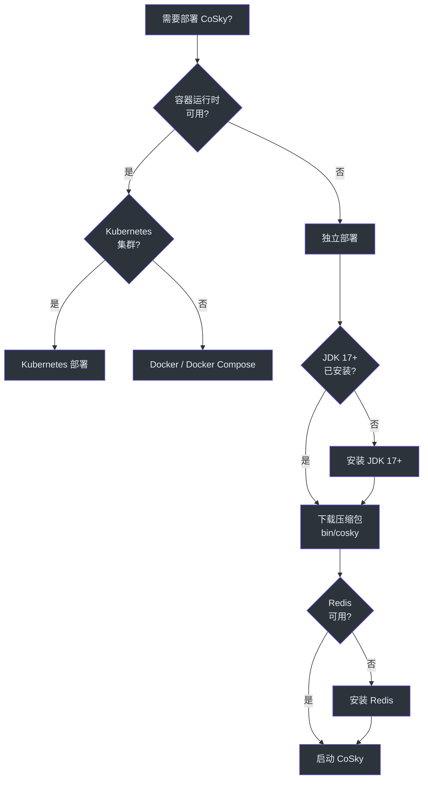
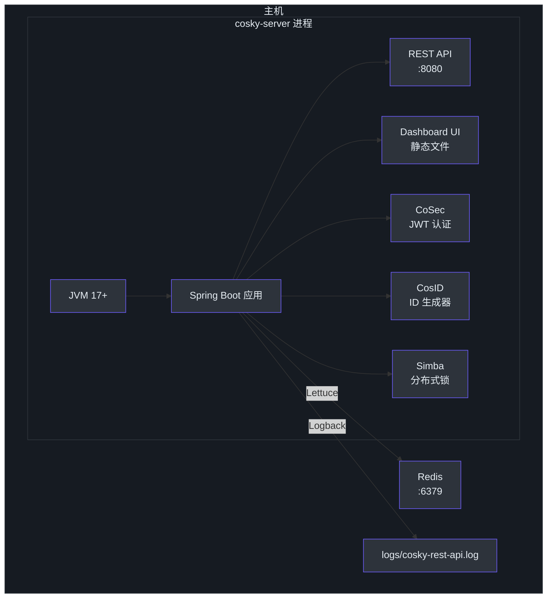
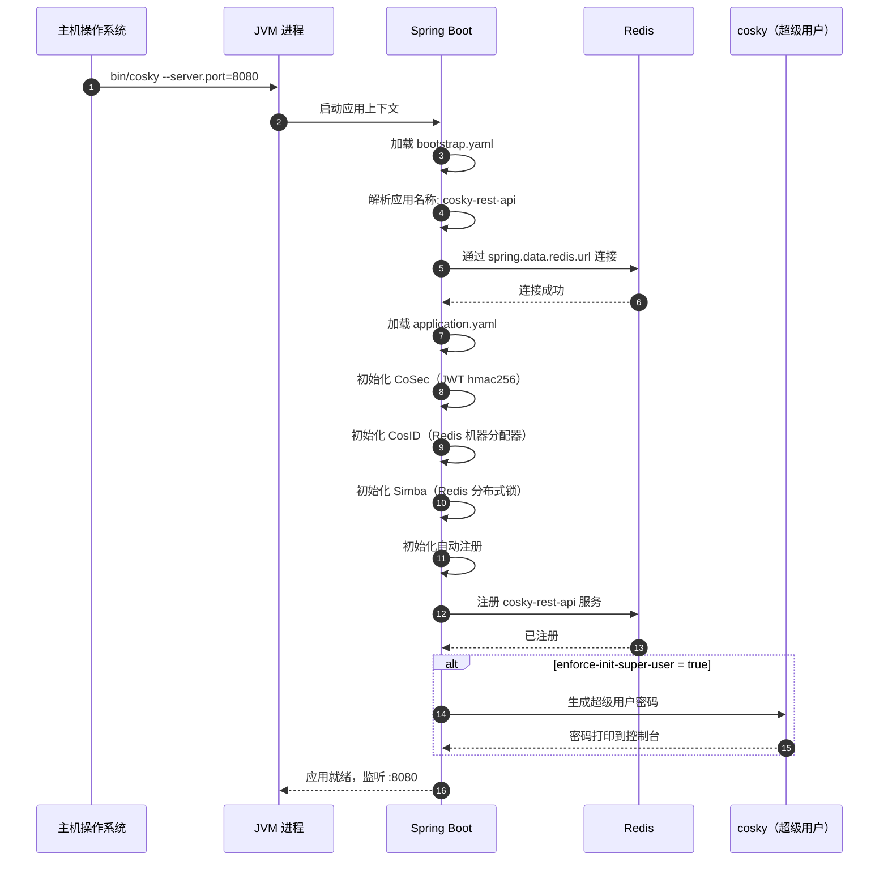
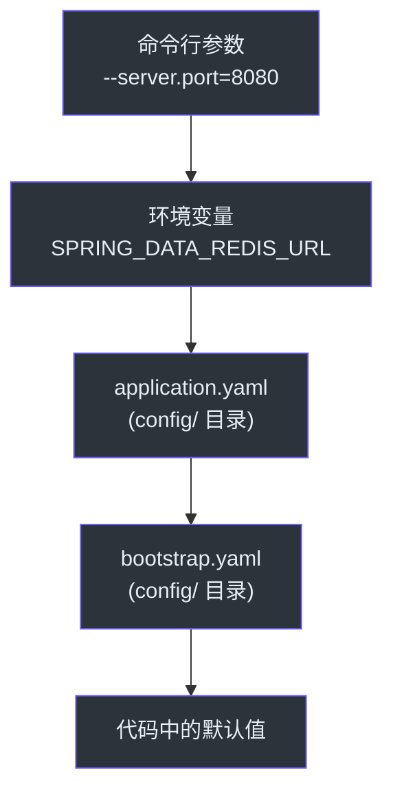
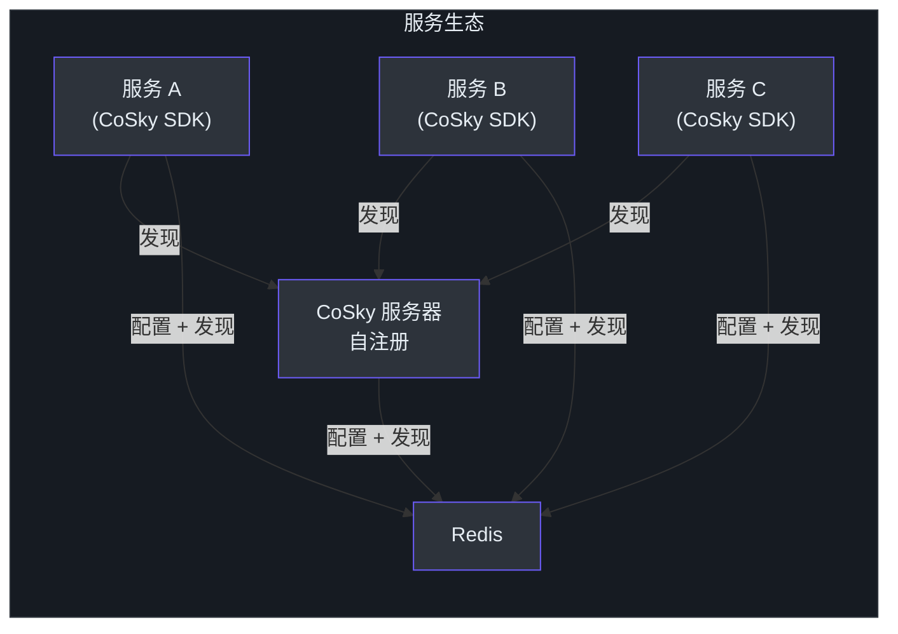

# 独立部署

## 概述

独立部署选项允许您直接在主机上运行 CoSky，无需 Docker 或 Kubernetes。这种方式非常适合开发环境、小规模部署或没有容器运行时的环境。独立发行版将 CoSky 打包为一个包含启动脚本、配置文件和内置 Dashboard UI 的自包含应用程序。

## 下载并解压

下载最新版本的压缩包并解压：

```bash
# 下载最新版本
wget https://github.com/Ahoo-Wang/cosky/releases/latest/download/cosky-server.tar

# 解压
tar -xvf cosky-server.tar

# 进入目录
cd cosky-server
```

解压后的目录结构包含：

```
cosky-server/
  bin/
    cosky              # 启动脚本 (Unix)
  config/
    application.yaml   # 应用程序配置
    bootstrap.yaml     # 引导配置
  dashboard/
    dist/              # Dashboard UI 静态文件
  lib/
    *.jar              # 运行时依赖
```

## 运行命令

使用必需的 Redis 连接参数启动 CoSky：

```bash
bin/cosky --server.port=8080 --spring.data.redis.url=redis://localhost:6379
```

所有 Spring Boot 属性都可以使用 `--property=value` 格式作为命令行参数传入。也可以将它们设置为环境变量或直接编辑配置文件。

## 部署决策树

以下流程图帮助您选择正确的部署方式：



<!-- Sources: README.md:117, cosky-rest-api/Dockerfile:1 -->

## 配置文件

### application.yaml

主应用程序配置控制 REST API 服务器、安全、ID 生成和分布式锁：

```yaml
server:
  compression:
    enabled: true
spring:
  cloud:
    cosky:
      discovery:
        registry:
          weight: 8
  web:
    resources:
      static-locations: file:./dashboard/dist/
cosky:
  security:
    enabled: true
    audit-log:
      action: write
    enforce-init-super-user: ${cosky.super.init:false}
cosec:
  jwt:
    algorithm: hmac256
    secret: ${cosky.security.key:FyN0Igd80Gas3stTavArGKOYnS9uLWGA$}
    token-validity:
      access: 15m
      refresh: 3H
cosid:
  namespace: ${spring.application.name}
  machine:
    enabled: true
    distributor:
      type: redis
  generator:
    enabled: true
simba:
  redis:
    enabled: true
logging:
  file:
    name: logs/${spring.application.name}.log
```

<!-- Sources: cosky-rest-api/src/main/resources/application.yaml:1, cosky-rest-api/src/dist/config/application.yaml:1 -->

### bootstrap.yaml

引导配置定义了服务标识、命名空间和自动注册行为：

```yaml
spring:
  application:
    name: ${service.name:cosky-rest-api}
  cloud:
    cosky:
      namespace: ${cosky.namespace:cosky-{system}}
      config:
        config-id: ${spring.application.name}.yaml
    service-registry:
      auto-registration:
        enabled: ${cosky.auto-registry:true}
```

<!-- Sources: cosky-rest-api/src/main/resources/bootstrap.yaml:1, cosky-rest-api/src/dist/config/bootstrap.yaml:1 -->

## 独立架构



<!-- Sources: cosky-rest-api/src/main/resources/application.yaml:1, cosky-rest-api/src/main/resources/bootstrap.yaml:1 -->

## 组件初始化序列



<!-- Sources: cosky-rest-api/src/main/resources/application.yaml:1, cosky-rest-api/src/main/resources/bootstrap.yaml:1, README.md:239 -->

## 配置优先级

Spring Boot 属性按以下顺序解析（优先级从高到低）：



<!-- Sources: cosky-rest-api/src/main/resources/application.yaml:1, cosky-rest-api/src/dist/config/application.yaml:1 -->

## JVM 选项

以下 JVM 选项为发布默认值（定义于 `cosky-rest-api/build.gradle.kts`）：

| 选项 | 发布默认值 | 描述 |
|--------|------------------|-------------|
| `-Xms` | `512M` | 初始堆大小 |
| `-Xmx` | `512M` | 最大堆大小 |
| `-XX:MaxMetaspaceSize` | `128M` | 最大元空间大小 |
| `-XX:MaxDirectMemorySize` | `256M` | 最大直接内存 |
| `-Xss` | `1m` | 线程栈大小 |
| `-XX:+UseZGC` | - | 使用 ZGC 垃圾收集器（低延迟） |
| `-XX:+HeapDumpOnOutOfMemoryError` | - | 在 OOM 时生成堆转储 |
| `-XX:HeapDumpPath` | `data` | 堆转储目录 |

要通过启动脚本传递 JVM 选项，请设置 `JAVA_OPTS` 环境变量：

```bash
export JAVA_OPTS="-Xms512M -Xmx512M -XX:+UseZGC"
bin/cosky --server.port=8080 --spring.data.redis.url=redis://localhost:6379
```

## 服务发现与自注册

当 `cosky.auto-registry` 启用时（默认），CoSky 将自身注册为一个服务实例。`cosky-rest-api` 服务会出现在 Dashboard 中，默认权重为 `8`。这允许其他使用 CoSky SDK 的微服务通过标准的服务发现机制发现 REST API。



<!-- Sources: cosky-rest-api/src/main/resources/bootstrap.yaml:8, cosky-rest-api/src/main/resources/application.yaml:8 -->

## 日志

日志默认写入 `logs/cosky-rest-api.log`。日志路径在 `application.yaml` 中配置：

```yaml
logging:
  file:
    name: logs/${spring.application.name}.log
```

要更改日志位置，请覆盖 `logging.file.name` 属性：

```bash
bin/cosky --logging.file.name=/var/log/cosky/cosky.log
```

## 相关页面

- [Docker 部署](./deployment-docker.md) - 基于容器的部署
- [Kubernetes 部署](./deployment-kubernetes.md) - 在 K8s 集群中部署
- [性能基准测试](./performance.md) - JMH 基准测试结果

## 参考

- [README.md - 独立部署](https://github.com/Ahoo-Wang/CoSky/blob/main/README.md)
- [cosky-rest-api/src/main/resources/application.yaml](https://github.com/Ahoo-Wang/CoSky/blob/main/cosky-rest-api/src/main/resources/application.yaml)
- [cosky-rest-api/src/main/resources/bootstrap.yaml](https://github.com/Ahoo-Wang/CoSky/blob/main/cosky-rest-api/src/main/resources/bootstrap.yaml)
- [cosky-rest-api/src/dist/config/application.yaml](https://github.com/Ahoo-Wang/CoSky/blob/main/cosky-rest-api/src/dist/config/application.yaml)
- [cosky-rest-api/src/dist/config/bootstrap.yaml](https://github.com/Ahoo-Wang/CoSky/blob/main/cosky-rest-api/src/dist/config/bootstrap.yaml)
- [cosky-rest-api/Dockerfile](https://github.com/Ahoo-Wang/CoSky/blob/main/cosky-rest-api/Dockerfile)
