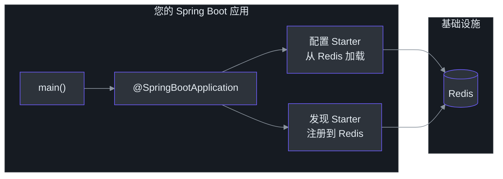
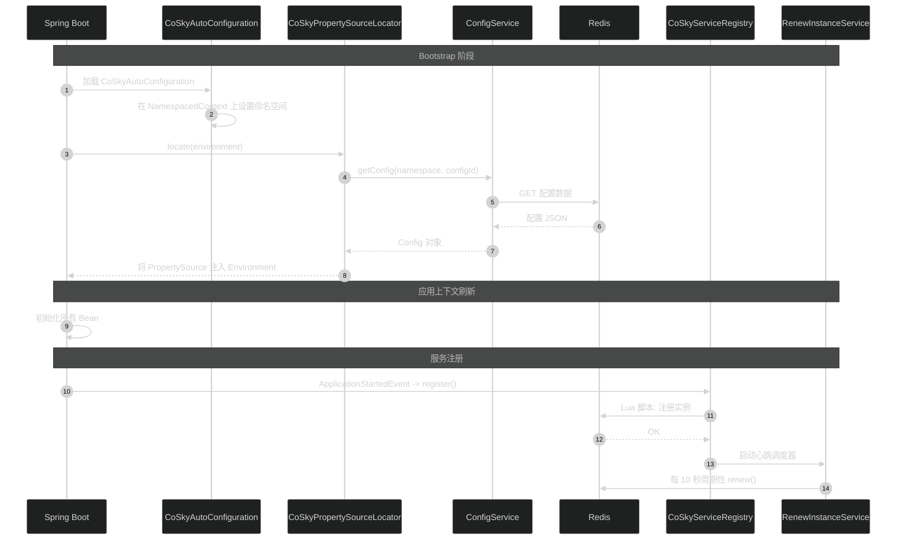
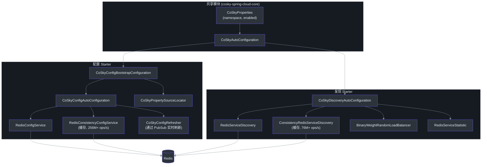

# 快速入门

本指南将引导您为 Spring Cloud 应用添加 CoSky 服务发现和配置管理功能。完成后，您的应用将注册到基于 Redis 的服务发现系统，从 CoSky 加载配置，并为生产流量做好准备。

## 概览

您将构建一个 Spring Boot 微服务，它能够：

- 通过 CoSky 配置 Starter 从 Redis 加载配置
- 启动时自动注册为服务实例
- 通过周期性心跳续约注册
- 通过 CoSky 发现客户端发现其他服务



<!-- Sources: ProviderServer.kt:24, CoSkyAutoConfiguration.kt:32 -->

## 前置条件

| 要求 | 版本 | 用途 | 备注 |
|-------------|---------|---------|-------|
| **Java** | 17+ | JVM 运行时 | CoSky 使用 JVM 17 工具链（[build.gradle.kts:93](https://github.com/Ahoo-Wang/CoSky/blob/main/build.gradle.kts#L93)） |
| **Redis** | 5.0+ | 服务和配置的后端存储 | 支持单机或集群模式 |
| **Gradle** 或 **Maven** | 任意 | 构建工具 | Gradle 示例使用 Kotlin DSL |
| **Spring Boot** | 3.x | 应用框架 | 兼容 Spring Cloud |

## 快速开始

### 第 1 步：添加依赖

#### Gradle（Kotlin DSL）

```kotlin
val coskyVersion = "5.6.0"

dependencies {
    implementation("me.ahoo.cosky:spring-cloud-starter-cosky-config:${coskyVersion}")
    implementation("me.ahoo.cosky:spring-cloud-starter-cosky-discovery:${coskyVersion}")
    implementation("org.springframework.cloud:spring-cloud-starter-loadbalancer:3.0.3")
}
```

#### Maven

```xml
<properties>
    <cosky.version>5.6.0</cosky.version>
</properties>
<dependencies>
    <dependency>
        <groupId>me.ahoo.cosky</groupId>
        <artifactId>spring-cloud-starter-cosky-config</artifactId>
        <version>${cosky.version}</version>
    </dependency>
    <dependency>
        <groupId>me.ahoo.cosky</groupId>
        <artifactId>spring-cloud-starter-cosky-discovery</artifactId>
        <version>${cosky.version}</version>
    </dependency>
    <dependency>
        <groupId>org.springframework.cloud</groupId>
        <artifactId>spring-cloud-starter-loadbalancer</artifactId>
        <version>3.0.3</version>
    </dependency>
</dependencies>
```

当前版本定义于 [gradle.properties:14](https://github.com/Ahoo-Wang/CoSky/blob/main/gradle.properties#L14)。

### 第 2 步：配置 Bootstrap

创建 `src/main/resources/bootstrap.yaml`：

```yaml
spring:
  application:
    name: ${service.name:my-service}
  data:
    redis:
      url: redis://localhost:6379
  cloud:
    cosky:
      namespace: ${cosky.namespace:cosky-{default}}
      config:
        config-id: ${spring.application.name}.yaml
    service-registry:
      auto-registration:
        enabled: ${cosky.auto-registry:true}
logging:
  file:
    name: logs/${spring.application.name}.log
```

| 属性 | 默认值 | 说明 |
|----------|---------|-------------|
| `spring.data.redis.url` | _（必填）_ | Redis 连接 URL |
| `spring.cloud.cosky.namespace` | `cosky-{default}` | 服务/配置隔离的命名空间（[CoSkyProperties.kt:30](https://github.com/Ahoo-Wang/CoSky/blob/main/cosky-spring-cloud-core/src/main/kotlin/me/ahoo/cosky/spring/cloud/CoSkyProperties.kt#L30)） |
| `spring.cloud.cosky.config.config-id` | `${spring.application.name}.yaml` | 要加载的配置文件 ID（[CoSkyConfigAutoConfiguration.kt:48](https://github.com/Ahoo-Wang/CoSky/blob/main/cosky-spring-cloud-starter-config/src/main/kotlin/me/ahoo/cosky/config/spring/cloud/CoSkyConfigAutoConfiguration.kt#L48)） |
| `spring.cloud.service-registry.auto-registration.enabled` | `true` | 启动时自动注册服务 |
| `spring.cloud.cosky.config.file-extension` | `yaml` | 配置查找的默认文件扩展名（[CoSkyConfigProperties.kt:27](https://github.com/Ahoo-Wang/CoSky/blob/main/cosky-spring-cloud-starter-config/src/main/kotlin/me/ahoo/cosky/config/spring/cloud/CoSkyConfigProperties.kt#L27)） |

源码：[examples/cosky-service-provider/src/main/resources/bootstrap.yaml](https://github.com/Ahoo-Wang/CoSky/blob/main/examples/cosky-service-provider/src/main/resources/bootstrap.yaml)

### 第 3 步：创建主类

```kotlin
package com.example.myservice

import org.springframework.boot.autoconfigure.SpringBootApplication
import org.springframework.boot.runApplication

@SpringBootApplication
class MyServiceApplication

fun main(args: Array<String>) {
    runApplication<MyServiceApplication>(*args)
}
```

就是这样。CoSky 的自动配置会处理其余一切。当应用启动时：

1. **CoSkyAutoConfiguration** 从您的配置属性设置命名空间上下文（[CoSkyAutoConfiguration.kt:33](https://github.com/Ahoo-Wang/CoSky/blob/main/cosky-spring-cloud-core/src/main/kotlin/me/ahoo/cosky/spring/cloud/CoSkyAutoConfiguration.kt#L33)）
2. **CoSkyConfigBootstrapConfiguration** 从 Redis 加载您的配置到 Spring Environment（[CoSkyConfigBootstrapConfiguration.kt:28](https://github.com/Ahoo-Wang/CoSky/blob/main/cosky-spring-cloud-starter-config/src/main/kotlin/me/ahoo/cosky/config/spring/cloud/CoSkyConfigBootstrapConfiguration.kt#L28)）
3. **CoSkyDiscoveryAutoConfiguration** 自动注册您的服务实例（[CoSkyDiscoveryAutoConfiguration.kt:42](https://github.com/Ahoo-Wang/CoSky/blob/main/cosky-spring-cloud-starter-discovery/src/main/kotlin/me/ahoo/cosky/discovery/spring/cloud/discovery/CoSkyDiscoveryAutoConfiguration.kt#L42)）

## 启动流程



<!-- Sources: CoSkyAutoConfiguration.kt:32, CoSkyPropertySourceLocator.kt:50, CoSkyServiceRegistry.kt:30, RenewProperties.kt:28 -->

## Starter 架构



<!-- Sources: CoSkyConfigAutoConfiguration.kt:43, CoSkyConfigBootstrapConfiguration.kt:28, CoSkyDiscoveryAutoConfiguration.kt:47, CoSkyAutoConfiguration.kt:32 -->

## 验证是否工作

1. 本地启动 Redis：

   ```bash
   docker run -d -p 6379:6379 redis:7
   ```

2. 运行您的 Spring Boot 应用：

   ```bash
   ./gradlew bootRun
   ```

3. 在 Redis 中检查已注册的服务：

   ```bash
   redis-cli SMEMBERS "cosky-{default}:svc_idx"
   ```

4. 您应该能在输出中看到您的服务名称，确认注册成功。

## 下一步

| 主题 | 说明 | 链接 |
|-------|-------------|------|
| 安装详情 | Maven、Gradle、Docker、K8s 配置 | [安装](./installation) |
| 架构深入 | 模块结构、Redis 键设计、事件系统 | [架构](./architecture) |
| 配置管理 | 配置 CRUD、版本管理、回滚、导入/导出 | [配置服务](./config-service) |
| 服务发现 | 注册、心跳、发现、负载均衡 | [服务注册](./service-registry) |
| REST API 服务器 | HTTP 端点、控制台、RBAC | [REST API](./rest-api) |

## 参考

- [gradle.properties](https://github.com/Ahoo-Wang/CoSky/blob/main/gradle.properties) -- 当前版本（`5.6.0`）
- [CoSkyProperties.kt](https://github.com/Ahoo-Wang/CoSky/blob/main/cosky-spring-cloud-core/src/main/kotlin/me/ahoo/cosky/spring/cloud/CoSkyProperties.kt) -- 核心配置属性
- [CoSkyConfigProperties.kt](https://github.com/Ahoo-Wang/CoSky/blob/main/cosky-spring-cloud-starter-config/src/main/kotlin/me/ahoo/cosky/config/spring/cloud/CoSkyConfigProperties.kt) -- 配置 Starter 属性
- [CoSkyDiscoveryProperties.kt](https://github.com/Ahoo-Wang/CoSky/blob/main/cosky-spring-cloud-starter-discovery/src/main/kotlin/me/ahoo/cosky/discovery/spring/cloud/discovery/CoSkyDiscoveryProperties.kt) -- 发现 Starter 属性
- [示例提供者](https://github.com/Ahoo-Wang/CoSky/blob/main/examples/cosky-service-provider/src/main/kotlin/me/ahoo/cosky/examples/service/provider/ProviderServer.kt) -- 完整的可运行示例
- [示例消费者](https://github.com/Ahoo-Wang/CoSky/blob/main/examples/cosky-service-consumer/src/main/kotlin/me/ahoo/cosky/examples/service/consumer/ConsumerServer.kt) -- 基于 Feign 的服务消费者
