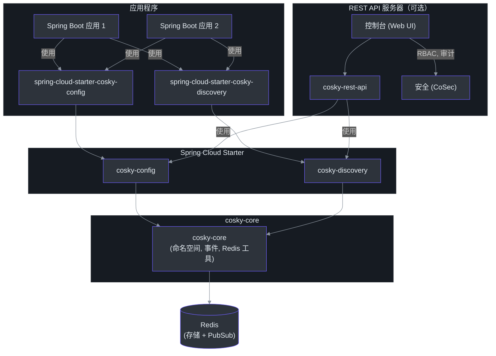
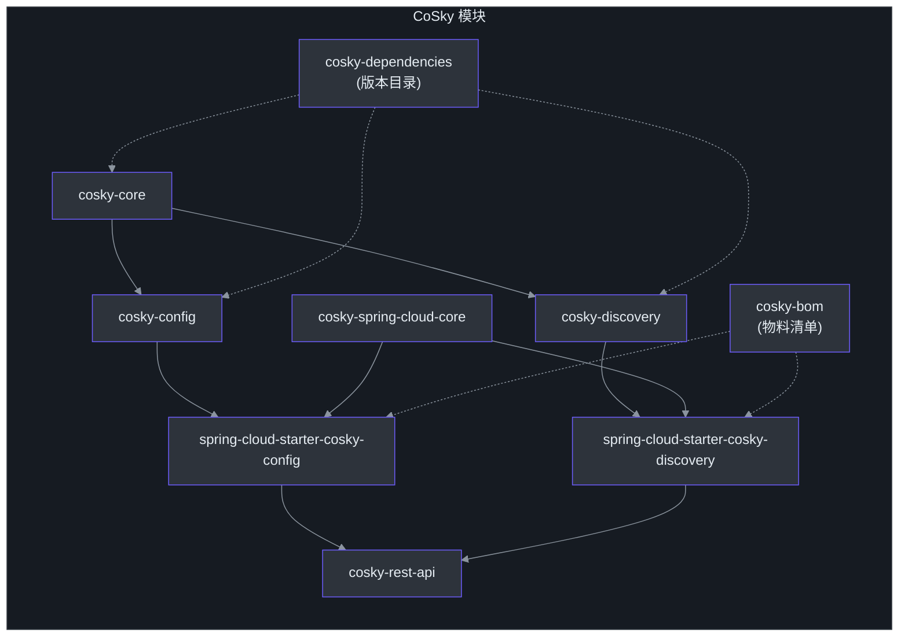
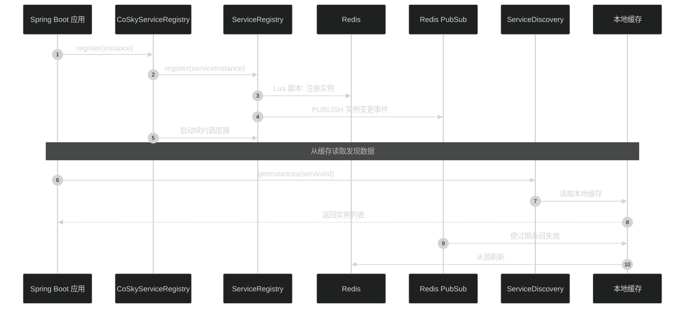
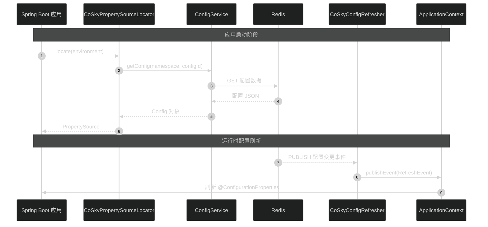
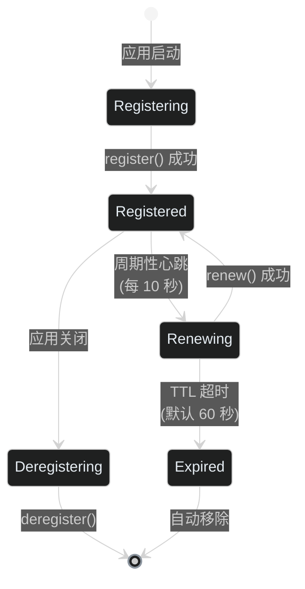

# CoSky 指南

**CoSky** 是一个轻量级、低成本的服务注册、服务发现和配置服务 SDK。通过利用现有基础设施中的 Redis（您很可能已经部署了它），CoSky 消除了额外的运维成本和部署负担。凭借 Redis 的高性能，CoSky 提供了卓越的 TPS 和 QPS（100,000+/s）。通过结合本地进程缓存策略和 Redis PubSub，CoSky 实现了实时缓存刷新，具有出色的 QPS 性能（70,000,000+/s），并保持进程缓存与 Redis 之间的实时一致性。

## 核心特性

| 特性 | 说明 | 源码 |
|---------|-------------|--------|
| **服务发现** | 通过客户端心跳自动续约，注册、发现和管理服务实例。支持加权负载均衡和服务拓扑。 | [ServiceRegistry.kt:24](https://github.com/Ahoo-Wang/CoSky/blob/main/cosky-discovery/src/main/kotlin/me/ahoo/cosky/discovery/ServiceRegistry.kt#L24), [ServiceDiscovery.kt:24](https://github.com/Ahoo-Wang/CoSky/blob/main/cosky-discovery/src/main/kotlin/me/ahoo/cosky/discovery/ServiceDiscovery.kt#L24) |
| **配置管理** | 支持版本历史（最近 10 个版本）、回滚和文件导入/导出的动态配置。变更通过 Redis PubSub 即时传播。 | [ConfigService.kt:24](https://github.com/Ahoo-Wang/CoSky/blob/main/cosky-config/src/main/kotlin/me/ahoo/cosky/config/ConfigService.kt#L24), [ConfigRollback.kt:24](https://github.com/Ahoo-Wang/CoSky/blob/main/cosky-config/src/main/kotlin/me/ahoo/cosky/config/ConfigRollback.kt#L24) |
| **一致性缓存** | 通过 Redis PubSub 保持同步的本地进程缓存，相比直接读取 Redis 实现 250 倍至 800 倍的性能提升。 | [RedisConsistencyConfigService](https://github.com/Ahoo-Wang/CoSky/blob/main/cosky-config/src/main/kotlin/me/ahoo/cosky/config/redis/RedisConsistencyConfigService.kt), [ConsistencyRedisServiceDiscovery](https://github.com/Ahoo-Wang/CoSky/blob/main/cosky-discovery/src/main/kotlin/me/ahoo/cosky/discovery/redis/ConsistencyRedisServiceDiscovery.kt) |
| **Spring Cloud 集成** | 配置和发现的即用型 Starter。通过 Spring Boot `@AutoConfiguration` 自动配置。 | [CoSkyConfigAutoConfiguration.kt:43](https://github.com/Ahoo-Wang/CoSky/blob/main/cosky-spring-cloud-starter-config/src/main/kotlin/me/ahoo/cosky/config/spring/cloud/CoSkyConfigAutoConfiguration.kt#L43), [CoSkyDiscoveryAutoConfiguration.kt:47](https://github.com/Ahoo-Wang/CoSky/blob/main/cosky-spring-cloud-starter-discovery/src/main/kotlin/me/ahoo/cosky/discovery/spring/cloud/discovery/CoSkyDiscoveryAutoConfiguration.kt#L47) |
| **加权负载均衡** | 与服务发现集成的二进制权重随机负载均衡器，用于高效的实例选择。 | [CoSkyDiscoveryAutoConfiguration.kt:105](https://github.com/Ahoo-Wang/CoSky/blob/main/cosky-spring-cloud-starter-discovery/src/main/kotlin/me/ahoo/cosky/discovery/spring/cloud/discovery/CoSkyDiscoveryAutoConfiguration.kt#L105) |
| **命名空间隔离** | 支持多租户命名空间，通过 Redis hashtag 包装实现集群模式兼容。 | [CoSkyProperties.kt:32](https://github.com/Ahoo-Wang/CoSky/blob/main/cosky-spring-cloud-core/src/main/kotlin/me/ahoo/cosky/spring/cloud/CoSkyProperties.kt#L32), [NamespaceService.kt:23](https://github.com/Ahoo-Wang/CoSky/blob/main/cosky-core/src/main/kotlin/me/ahoo/cosky/core/NamespaceService.kt#L23) |
| **REST API 与控制台** | 基于 Web 的管理 UI，支持 RBAC、审计日志和服务拓扑可视化。 | [RestApiServer.kt:24](https://github.com/Ahoo-Wang/CoSky/blob/main/cosky-rest-api/src/main/kotlin/me/ahoo/cosky/rest/RestApiServer.kt#L24) |
| **实时事件** | 配置和实例变更事件通过 Redis PubSub 监听器即时传播。 | [ConfigChangedEvent.kt:20](https://github.com/Ahoo-Wang/CoSky/blob/main/cosky-config/src/main/kotlin/me/ahoo/cosky/config/ConfigChangedEvent.kt#L20), [EventListenerContainer.kt:5](https://github.com/Ahoo-Wang/CoSky/blob/main/cosky-core/src/main/kotlin/me/ahoo/cosky/core/EventListenerContainer.kt#L5) |

## 架构概览

<!-- Sources: settings.gradle.kts:14-27, build.gradle.kts:32-43, RestApiServer.kt:24 -->

### 模块依赖图

<!-- Sources: settings.gradle.kts:14-27, build.gradle.kts:32-43 -->

### 数据流：服务发现

<!-- Sources: CoSkyServiceRegistry.kt:30, ServiceRegistry.kt:33, ServiceDiscovery.kt:26, CoSkyDiscoveryAutoConfiguration.kt:82 -->

### 数据流：配置

<!-- Sources: CoSkyPropertySourceLocator.kt:35, ConfigService.kt:27, CoSkyConfigRefresher.kt:33 -->

### 实例生命周期

<!-- Sources: RegistryProperties.kt:23, RenewProperties.kt:22, ServiceInstance.kt:33, CoSkyServiceRegistry.kt:30 -->

## 文档导航

| 页面 | 说明 |
|------|-------------|
| [快速入门](./getting-started) | 快速入门指南：5 分钟内搭建使用 CoSky 的 Spring Boot 应用 |
| [安装](./installation) | 所有安装方式：Maven、Gradle、Docker、Kubernetes |
| [架构](./architecture) | 详细架构、模块结构、Redis 键设计和事件系统 |
| [配置服务](./config-service) | 配置 CRUD、版本管理、回滚、导入/导出 |
| [配置一致性](./config-consistency) | 本地缓存 + PubSub 失效层 |
| [服务注册](./service-registry) | 实例注册、心跳、注销 |
| [Spring Cloud 配置](./spring-cloud-config) | PropertySourceLocator、`@RefreshScope`、自动配置 |
| [REST API 服务器](./rest-api) | 所有操作的 HTTP 端点、控制台、安全 |

## 相关页面

- [CoSky 首页](../index.md) -- 项目概览
- [CoSky GitHub 仓库](https://github.com/Ahoo-Wang/CoSky) -- 源代码、问题和发布版本
- [示例](https://github.com/Ahoo-Wang/CoSky/tree/main/examples) -- 服务提供者和消费者示例，集成 Feign RPC
- [REST API 文档](https://ahoo-cosky.apifox.cn/) -- 交互式 API 文档（Apifox）
