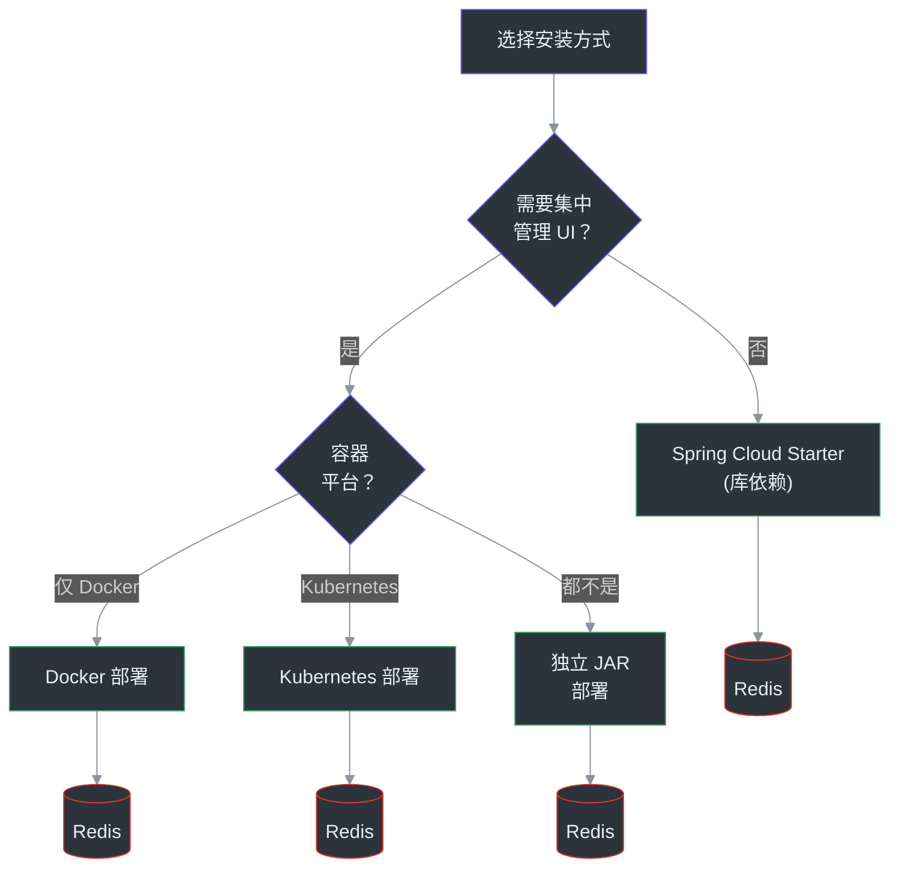
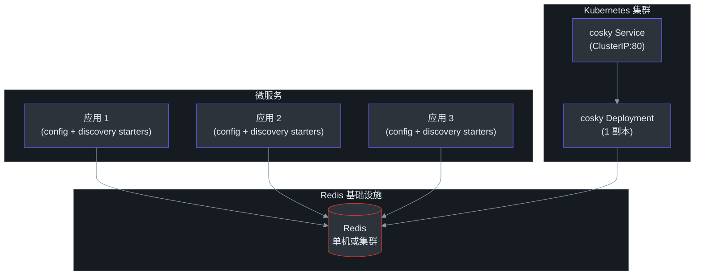
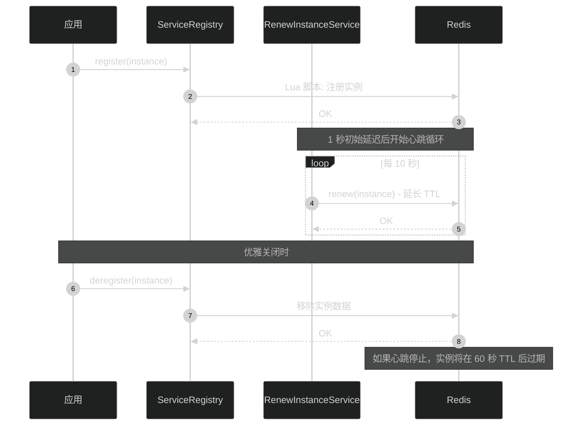

# 安装

CoSky 可以通过两种方式使用：作为集成到 Spring Cloud 应用中的**库依赖**，或者作为带有 Web 控制台的**独立 REST API 服务器**进行集中管理。本页介绍所有安装方式。

## 安装方式对比

| 方式 | 优点 | 缺点 | 适用场景 |
|--------|------|------|----------|
| **Spring Cloud Starter** | 无需额外基础设施；直接集成到应用中 | 没有管理 UI；每个应用独立连接 Redis | 自注册、自配置的微服务 |
| **独立 JAR** | 完整控制台；RBAC；审计日志 | 需要专用 JVM 进程 | 需要管理控制台但不用容器的团队 |
| **Docker** | 可移植；可复现；易于扩展 | 需要 Docker 运行时 | 容器化环境、开发/测试环境 |
| **Kubernetes** | 云原生；健康探针；自动重启 | 需要 K8s 集群 | 生产环境云原生部署 |



<!-- Sources: README.md:111-201, k8s/deployment/cosky.yml -->

## 作为库依赖使用

将 CoSky Starter 添加到您的 Spring Cloud 应用中。这些包发布在 Maven Central 的 `me.ahoo.cosky` 组下。

### Gradle（Kotlin DSL）

```kotlin
val coskyVersion = "5.6.0"

dependencies {
    implementation("me.ahoo.cosky:spring-cloud-starter-cosky-config:${coskyVersion}")
    implementation("me.ahoo.cosky:spring-cloud-starter-cosky-discovery:${coskyVersion}")
    implementation("org.springframework.cloud:spring-cloud-starter-loadbalancer:3.0.3")
}
```

### Maven

```xml
<?xml version="1.0" encoding="UTF-8"?>
<project xmlns="http://maven.apache.org/POM/4.0.0"
         xmlns:xsi="http://www.w3.org/2001/XMLSchema-instance"
         xsi:schemaLocation="http://maven.apache.org/POM/4.0.0 http://maven.apache.org/xsd/maven-4.0.0.xsd">
    <modelVersion>4.0.0</modelVersion>
    <artifactId>demo</artifactId>
    <properties>
        <cosky.version>5.6.0</cosky.version>
    </properties>

    <dependencies>
        <dependency>
            <groupId>me.ahoo.cosky</groupId>
            <artifactId>spring-cloud-starter-cosky-config</artifactId>
            <version>${cosky.version}</version>
        </dependency>
        <dependency>
            <groupId>me.ahoo.cosky</groupId>
            <artifactId>spring-cloud-starter-cosky-discovery</artifactId>
            <version>${cosky.version}</version>
        </dependency>
        <dependency>
            <groupId>org.springframework.cloud</groupId>
            <artifactId>spring-cloud-starter-loadbalancer</artifactId>
            <version>3.0.3</version>
        </dependency>
    </dependencies>
</project>
```

源码：[gradle.properties:14](https://github.com/Ahoo-Wang/CoSky/blob/main/gradle.properties#L14), [README.md:46-87](https://github.com/Ahoo-Wang/CoSky/blob/main/README.md#L46-L87)

### 可用构件

| 构件 | 用途 | 模块 |
|----------|---------|--------|
| `spring-cloud-starter-cosky-config` | Spring Cloud 配置加载和实时刷新 | [cosky-spring-cloud-starter-config](https://github.com/Ahoo-Wang/CoSky/blob/main/cosky-spring-cloud-starter-config) |
| `spring-cloud-starter-cosky-discovery` | Spring Cloud 服务注册和发现 | [cosky-spring-cloud-starter-discovery](https://github.com/Ahoo-Wang/CoSky/blob/main/cosky-spring-cloud-starter-discovery) |
| `cosky-bom` | 用于依赖版本管理的物料清单 | [cosky-bom](https://github.com/Ahoo-Wang/CoSky/blob/main/cosky-bom) |

## REST API 服务器安装

REST API 服务器提供管理控制台、REST 端点、安全（RBAC）和审计日志。它是可选的——仅使用库 Starter 您的服务也能完美运行。

### 方式 1：独立 JAR

下载最新版本并直接运行：

```bash
# 下载 cosky-server
wget https://github.com/Ahoo-Wang/cosky/releases/latest/download/cosky-server.tar

# 解压
tar -xvf cosky-server.tar
cd cosky-server

# 使用 Redis 连接运行
bin/cosky --server.port=8080 --spring.data.redis.url=redis://localhost:6379
```

首次启动时，CoSky 会初始化超级用户并将生成的密码打印到控制台：

```log
---------------- ****** CoSky -  init super user:[cosky] password:[6TrmOux4Oj] ****** ----------------
```

要重新初始化密码，请在配置中设置 `enforce-init-super-user: true`。

源码：[README.md:119-127](https://github.com/Ahoo-Wang/CoSky/blob/main/README.md#L119-L127)

### 方式 2：Docker

使用 Docker 快速部署：

```bash
# 拉取镜像
docker pull ahoowang/cosky:latest

# 作为容器运行
docker run --name cosky -d -p 8080:8080 \
  -e SPRING_DATA_REDIS_URL=redis://your-redis-host:6379 \
  ahoowang/cosky:latest
```

#### Docker Compose

用于本地开发与 Redis 配合：

```yaml
version: "3.8"
services:
  redis:
    image: redis:7
    ports:
      - "6379:6379"
  cosky:
    image: ahoowang/cosky:latest
    ports:
      - "8080:8080"
    environment:
      - SPRING_DATA_REDIS_URL=redis://redis:6379
    depends_on:
      - redis
```

源码：[README.md:132-137](https://github.com/Ahoo-Wang/CoSky/blob/main/README.md#L132-L137)

### 方式 3：Kubernetes

在您的 Kubernetes 集群中部署 CoSky。项目提供了单机 Redis 和 Redis 集群两种配置的部署清单。

#### 单机 Redis

```yaml
apiVersion: apps/v1
kind: Deployment
metadata:
  name: cosky
  labels:
    app: cosky
spec:
  replicas: 1
  selector:
    matchLabels:
      app: cosky
  template:
    metadata:
      labels:
        app: cosky
    spec:
      containers:
        - name: cosky
          image: ahoowang/cosky:latest
          ports:
            - containerPort: 8080
              protocol: TCP
          env:
            - name: SPRING_DATA_REDIS_HOST
              value: redis-uri:6379
            - name: SPRING_DATA_REDIS_PASSWORD
              value: redis-pwd
            - name: TZ
              value: Asia/Shanghai
          startupProbe:
            httpGet:
              port: http
              path: /actuator/health
          readinessProbe:
            httpGet:
              port: http
              path: /actuator/health/readiness
          livenessProbe:
            httpGet:
              port: http
              path: /actuator/health/liveness
          resources:
            requests:
              cpu: 250m
              memory: 1024Mi
            limits:
              cpu: "1"
              memory: 1280Mi
          volumeMounts:
            - name: volume-localtime
              mountPath: /etc/localtime
      volumes:
        - name: volume-localtime
          hostPath:
            path: /etc/localtime
```

源码：[k8s/deployment/cosky.yml](https://github.com/Ahoo-Wang/CoSky/blob/main/k8s/deployment/cosky.yml)

#### Redis 集群

对于使用 Redis 集群的生产环境，通过 Secret 引用节点和密码配置：

```yaml
apiVersion: apps/v1
kind: Deployment
metadata:
  name: cosky
  labels:
    app: cosky
spec:
  replicas: 1
  selector:
    matchLabels:
      app: cosky
  template:
    metadata:
      labels:
        app: cosky
    spec:
      containers:
        - name: cosky
          image: ahoowang/cosky:latest
          env:
            - name: SPRING_DATA_REDIS_CLUSTER_NODES
              valueFrom:
                secretKeyRef:
                  name: redis-secret
                  key: nodes
            - name: SPRING_DATA_REDIS_PASSWORD
              valueFrom:
                secretKeyRef:
                  name: redis-secret
                  key: password
            - name: SPRING_DATA_REDIS_CLUSTER_MAX_REDIRECTS
              value: "3"
            - name: SPRING_DATA_REDIS_LETTUCE_CLUSTER_REFRESH_ADAPTIVE
              value: "true"
            - name: SPRING_DATA_REDIS_LETTUCE_CLUSTER_REFRESH_PERIOD
              value: 30s
```

源码：[k8s/deployment/cosky-cluster.yml](https://github.com/Ahoo-Wang/CoSky/blob/main/k8s/deployment/cosky-cluster.yml)

#### Kubernetes Service

```yaml
apiVersion: v1
kind: Service
metadata:
  name: cosky
  labels:
    app: cosky
spec:
  selector:
    app: cosky
  ports:
    - name: rest
      port: 80
      protocol: TCP
      targetPort: 8080
```

源码：[k8s/deployment/cosky-service.yaml](https://github.com/Ahoo-Wang/CoSky/blob/main/k8s/deployment/cosky-service.yaml)

## 部署架构



<!-- Sources: k8s/deployment/cosky.yml, k8s/deployment/cosky-cluster.yml, k8s/deployment/cosky-service.yaml -->

## 配置参考

CoSky 的关键配置属性：

| 属性 | 默认值 | 说明 | 源码 |
|----------|---------|-------------|--------|
| `spring.data.redis.url` | _（必填）_ | Redis 连接 URL（单机） | [bootstrap.yaml](https://github.com/Ahoo-Wang/CoSky/blob/main/cosky-rest-api/src/dist/config/bootstrap.yaml) |
| `spring.data.redis.cluster.nodes` | _（集群必填）_ | Redis 集群节点地址 | [cosky-cluster.yml:23](https://github.com/Ahoo-Wang/CoSky/blob/main/k8s/deployment/cosky-cluster.yml#L23) |
| `spring.data.redis.password` | — | Redis 密码 | [cosky.yml:23](https://github.com/Ahoo-Wang/CoSky/blob/main/k8s/deployment/cosky.yml#L23) |
| `spring.cloud.cosky.namespace` | `cosky-{default}` | 服务和配置的隔离命名空间 | [CoSkyProperties.kt:30](https://github.com/Ahoo-Wang/CoSky/blob/main/cosky-spring-cloud-core/src/main/kotlin/me/ahoo/cosky/spring/cloud/CoSkyProperties.kt#L30) |
| `spring.cloud.cosky.config.enabled` | `true` | 启用从 Redis 加载配置 | [CoSkyConfigProperties.kt:26](https://github.com/Ahoo-Wang/CoSky/blob/main/cosky-spring-cloud-starter-config/src/main/kotlin/me/ahoo/cosky/config/spring/cloud/CoSkyConfigProperties.kt#L26) |
| `spring.cloud.cosky.config.config-id` | `${spring.application.name}.yaml` | 要加载的配置文件 ID | [CoSkyConfigAutoConfiguration.kt:48](https://github.com/Ahoo-Wang/CoSky/blob/main/cosky-spring-cloud-starter-config/src/main/kotlin/me/ahoo/cosky/config/spring/cloud/CoSkyConfigAutoConfiguration.kt#L48) |
| `spring.cloud.cosky.config.file-extension` | `yaml` | 默认文件扩展名 | [CoSkyConfigProperties.kt:27](https://github.com/Ahoo-Wang/CoSky/blob/main/cosky-spring-cloud-starter-config/src/main/kotlin/me/ahoo/cosky/config/spring/cloud/CoSkyConfigProperties.kt#L27) |
| `spring.cloud.cosky.config.timeout` | `2s` | 配置加载超时时间 | [CoSkyConfigProperties.kt:28](https://github.com/Ahoo-Wang/CoSky/blob/main/cosky-spring-cloud-starter-config/src/main/kotlin/me/ahoo/cosky/config/spring/cloud/CoSkyConfigProperties.kt#L28) |
| `spring.cloud.cosky.discovery.enabled` | `true` | 启用服务发现 | [CoSkyDiscoveryProperties.kt:26](https://github.com/Ahoo-Wang/CoSky/blob/main/cosky-spring-cloud-starter-discovery/src/main/kotlin/me/ahoo/cosky/discovery/spring/cloud/discovery/CoSkyDiscoveryProperties.kt#L26) |
| `spring.cloud.cosky.discovery.timeout` | `2s` | 发现操作超时时间 | [CoSkyDiscoveryProperties.kt:28](https://github.com/Ahoo-Wang/CoSky/blob/main/cosky-spring-cloud-starter-discovery/src/main/kotlin/me/ahoo/cosky/discovery/spring/cloud/discovery/CoSkyDiscoveryProperties.kt#L28) |
| `spring.cloud.service-registry.auto-registration.enabled` | `true` | 启动时自动注册服务 | [bootstrap.yaml:9](https://github.com/Ahoo-Wang/CoSky/blob/main/cosky-rest-api/src/dist/config/bootstrap.yaml#L9) |
| `cosky.security.enabled` | `true` | 启用 REST API 服务器的安全功能 | [application.yaml:16](https://github.com/Ahoo-Wang/CoSky/blob/main/cosky-rest-api/src/dist/config/application.yaml#L16) |
| `cosky.security.enforce-init-super-user` | `false` | 重新初始化超级用户密码 | [application.yaml:19](https://github.com/Ahoo-Wang/CoSky/blob/main/cosky-rest-api/src/dist/config/application.yaml#L19) |

## 实例生命周期属性

使用发现 Starter 时，服务实例具有可配置的 TTL 和心跳设置：

| 属性 | 默认值 | 说明 | 源码 |
|----------|---------|-------------|--------|
| 实例 TTL | `60s` | 实例在被视为过期前的存活时间 | [RegistryProperties.kt:26](https://github.com/Ahoo-Wang/CoSky/blob/main/cosky-discovery/src/main/kotlin/me/ahoo/cosky/discovery/RegistryProperties.kt#L26) |
| 续约周期 | `10s` | 实例发送心跳以续约 TTL 的频率 | [RenewProperties.kt:28](https://github.com/Ahoo-Wang/CoSky/blob/main/cosky-discovery/src/main/kotlin/me/ahoo/cosky/discovery/RenewProperties.kt#L28) |
| 续约初始延迟 | `1s` | 注册后首次心跳前的延迟时间 | [RenewProperties.kt:25](https://github.com/Ahoo-Wang/CoSky/blob/main/cosky-discovery/src/main/kotlin/me/ahoo/cosky/discovery/RenewProperties.kt#L25) |



<!-- Sources: RegistryProperties.kt:26, RenewProperties.kt:22-28, ServiceInstance.kt:33, CoSkyServiceRegistry.kt:30 -->

## REST API 服务器 Bootstrap 配置

REST API 服务器使用以下 bootstrap 配置：

```yaml
spring:
  application:
    name: ${service.name:cosky-rest-api}
  cloud:
    cosky:
      namespace: ${cosky.namespace:cosky-{system}}
      config:
        config-id: ${spring.application.name}.yaml
    service-registry:
      auto-registration:
        enabled: ${cosky.auto-registry:true}
```

源码：[cosky-rest-api/src/dist/config/bootstrap.yaml](https://github.com/Ahoo-Wang/CoSky/blob/main/cosky-rest-api/src/dist/config/bootstrap.yaml)

## 访问控制台

REST API 服务器运行后，通过以下地址访问基于 Web 的管理界面：

> **http://localhost:8080**

控制台提供：
- 实时服务监控和管理
- 带有版本控制和回滚的配置管理
- 命名空间隔离和管理
- 基于角色的访问控制（RBAC）
- 合规审计日志
- 服务拓扑可视化
- 导入/导出功能（包括 Nacos 迁移）

源码：[README.md:206-219](https://github.com/Ahoo-Wang/CoSky/blob/main/README.md#L206-L219)

## 参考

- [build.gradle.kts](https://github.com/Ahoo-Wang/CoSky/blob/main/build.gradle.kts) -- 根构建配置，使用 JVM 17 工具链
- [gradle.properties](https://github.com/Ahoo-Wang/CoSky/blob/main/gradle.properties) -- 项目版本（`5.6.0`）
- [settings.gradle.kts](https://github.com/Ahoo-Wang/CoSky/blob/main/settings.gradle.kts) -- 所有模块定义
- [k8s/deployment/cosky.yml](https://github.com/Ahoo-Wang/CoSky/blob/main/k8s/deployment/cosky.yml) -- Kubernetes 部署（单机 Redis）
- [k8s/deployment/cosky-cluster.yml](https://github.com/Ahoo-Wang/CoSky/blob/main/k8s/deployment/cosky-cluster.yml) -- Kubernetes 部署（Redis 集群）
- [k8s/deployment/cosky-service.yaml](https://github.com/Ahoo-Wang/CoSky/blob/main/k8s/deployment/cosky-service.yaml) -- Kubernetes Service 清单
- [cosky-rest-api/src/dist/config/bootstrap.yaml](https://github.com/Ahoo-Wang/CoSky/blob/main/cosky-rest-api/src/dist/config/bootstrap.yaml) -- REST API 服务器 bootstrap 配置
- [cosky-rest-api/src/dist/config/application.yaml](https://github.com/Ahoo-Wang/CoSky/blob/main/cosky-rest-api/src/dist/config/application.yaml) -- REST API 服务器应用配置
