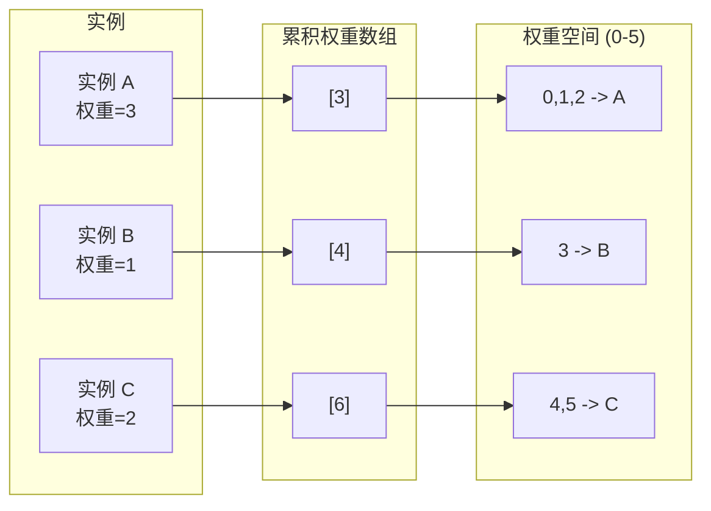
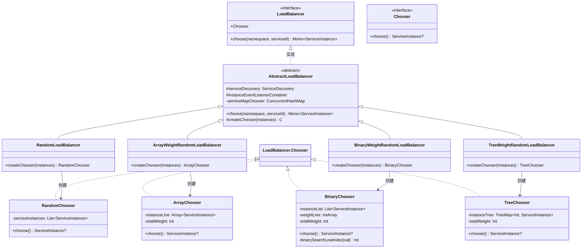
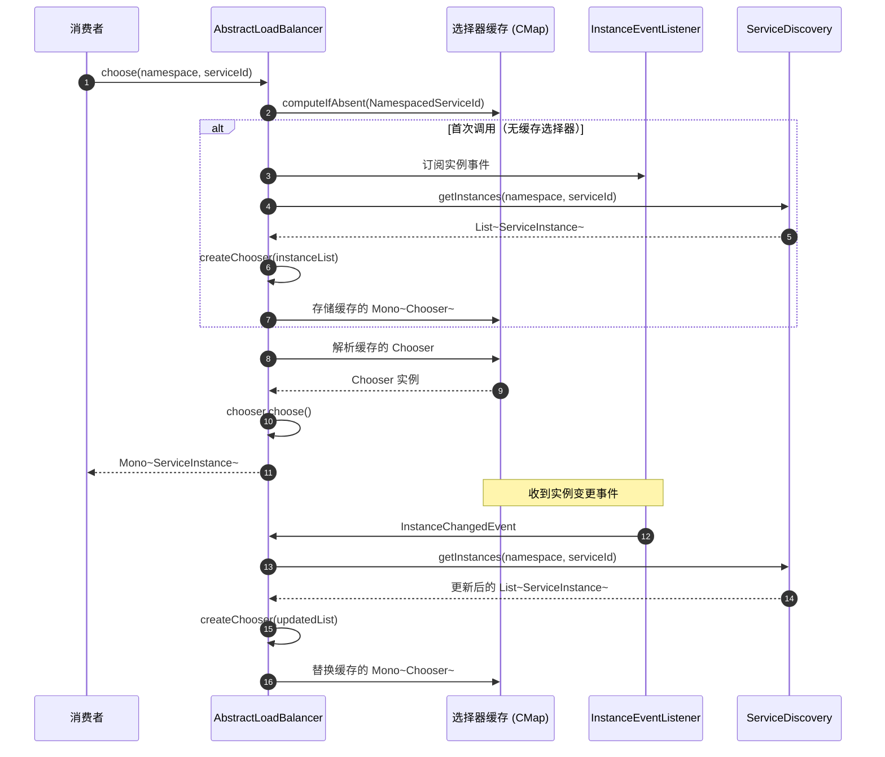

# 负载均衡

CoSky 提供了一个可插拔的负载均衡框架，用于在服务的可用实例之间分配流量。共有四种实现，从简单的随机选择到 O(log n) 选择时间的加权随机算法。所有实现都是事件驱动的：当实例数据通过 PubSub 变更时，选择器会自动重建，不会阻塞请求。

| 方面 | 详情 |
|---|---|
| **接口** | `LoadBalancer` |
| **基类** | `AbstractLoadBalancer` |
| **实现** | Random、ArrayWeightRandom、BinaryWeightRandom、TreeWeightRandom |
| **事件驱动更新** | 通过 PubSub 监听 `InstanceChangedEvent` |
| **并发模型** | 响应式（`Mono<ServiceInstance>`） |
| **线程安全** | `ConcurrentHashMap` + 缓存的 `Mono` 选择器 |

## LoadBalancer 接口

[`LoadBalancer`](https://github.com/Ahoo-Wang/CoSky/blob/main/cosky-discovery/src/main/kotlin/me/ahoo/cosky/discovery/loadbalancer/LoadBalancer.kt) 接口定义了单个操作和内部 `Chooser` 函数式接口：

```kotlin
interface LoadBalancer {
    fun choose(namespace: String, serviceId: String): Mono<ServiceInstance>

    fun interface Chooser {
        fun choose(): ServiceInstance?
    }
}
```

`choose` 方法返回 `Mono<ServiceInstance>`，因为首次调用时可能需要从发现服务获取实例。同一服务的后续调用命中缓存的选择器。

## AbstractLoadBalancer

[`AbstractLoadBalancer`](https://github.com/Ahoo-Wang/CoSky/blob/main/cosky-discovery/src/main/kotlin/me/ahoo/cosky/discovery/loadbalancer/AbstractLoadBalancer.kt) 是所有四种实现的共享基类。它管理一个 `ConcurrentHashMap<NamespacedServiceId, Mono<C>>`，将每个服务映射到缓存的选择器：

1. **首次访问时**（`computeIfAbsent`），它订阅实例变更事件并从 `ServiceDiscovery` 获取实例 ([AbstractLoadBalancer.kt:34](https://github.com/Ahoo-Wang/CoSky/blob/main/cosky-discovery/src/main/kotlin/me/ahoo/cosky/discovery/loadbalancer/AbstractLoadBalancer.kt#L34))。
2. **实例变更时**，选择器 `Mono` 被替换为基于更新后的实例列表构建的新选择器 ([AbstractLoadBalancer.kt:40](https://github.com/Ahoo-Wang/CoSky/blob/main/cosky-discovery/src/main/kotlin/me/ahoo/cosky/discovery/loadbalancer/AbstractLoadBalancer.kt#L40))。
3. **调用 `choose` 时**，解析缓存的 `Mono<C>` 并在选择器实例上调用 `choose()`。

子类实现 `createChooser(serviceInstances: List<ServiceInstance>): C` 来定义其选择算法。

## 实现对比

| 实现 | 算法 | 时间复杂度 | 空间复杂度 | 适用场景 |
|---|---|---|---|---|
| `RandomLoadBalancer` | 均匀随机 | O(1) | O(n) | 等权重实例 |
| `ArrayWeightRandomLoadBalancer` | 基于数组的加权随机 | O(n) 构建，O(1) 选择 | O(总权重) | 实例数较少且权重不同 |
| `BinaryWeightRandomLoadBalancer` | 累积权重 + 二分查找 | O(n) 构建，O(log n) 选择 | O(n) | 实例数较多且权重不同 |
| `TreeWeightRandomLoadBalancer` | TreeMap 尾部映射查找 | O(n) 构建，O(log n) 选择 | O(n) | 实例数较多，红黑树变体 |

### RandomLoadBalancer

[`RandomLoadBalancer`](https://github.com/Ahoo-Wang/CoSky/blob/main/cosky-discovery/src/main/kotlin/me/ahoo/cosky/discovery/loadbalancer/RandomLoadBalancer.kt) 使用 `ThreadLocalRandom` 从列表中均匀随机选择实例。它完全忽略 `weight` 字段：

```kotlin
val randomIdx = ThreadLocalRandom.current().nextInt(serviceInstances.size)
return serviceInstances[randomIdx]
```

### ArrayWeightRandomLoadBalancer

[`ArrayWeightRandomLoadBalancer`](https://github.com/Ahoo-Wang/CoSky/blob/main/cosky-discovery/src/main/kotlin/me/ahoo/cosky/discovery/loadbalancer/ArrayWeightRandomLoadBalancer.kt) 将每个实例扩展为数组中的连续范围，范围长度等于实例的权重。选择操作为 O(1)，但数组大小等于所有权重之和：

```
实例: [A(w=3), B(w=1), C(w=2)]
数组:  [A, A, A, B, C, C]
Random(0..5) -> 数组索引
```

### BinaryWeightRandomLoadBalancer

[`BinaryWeightRandomLoadBalancer`](https://github.com/Ahoo-Wang/CoSky/blob/main/cosky-discovery/src/main/kotlin/me/ahoo/cosky/discovery/loadbalancer/BinaryWeightRandomLoadBalancer.kt) 构建累积权重数组并使用二分查找实现 O(log n) 选择：

```
实例: [A(w=3), B(w=1), C(w=2)]
累积:  [3, 4, 6]
Random(1..6) -> 二分查找，找到第一个累积值 >= 随机值的索引
```

`binarySearchLowIndex` 中的关键算法 ([BinaryWeightRandomLoadBalancer.kt:86](https://github.com/Ahoo-Wang/CoSky/blob/main/cosky-discovery/src/main/kotlin/me/ahoo/cosky/discovery/loadbalancer/BinaryWeightRandomLoadBalancer.kt#L86))：

```
function binarySearchLowIndex(randomValue):
    idx = Arrays.binarySearch(weightLine, randomValue)
    if idx < 0:
        idx = -idx - 1  // 插入点给出正确的桶
    return idx
```

### TreeWeightRandomLoadBalancer

[`TreeWeightRandomLoadBalancer`](https://github.com/Ahoo-Wang/CoSky/blob/main/cosky-discovery/src/main/kotlin/me/ahoo/cosky/discovery/loadbalancer/TreeWeightRandomLoadBalancer.kt) 使用 `TreeMap<Integer, ServiceInstance>`，其中键为累积权重。选择操作使用 `tailMap(randomVal, false).firstEntry()`：

```
实例: [A(w=3), B(w=1), C(w=2)]
TreeMap: {3=A, 4=B, 6=C}
Random(0..5) -> tailMap(random, false).firstEntry()
```

## 权重分布图



<!-- Sources: cosky-discovery/src/main/kotlin/me/ahoo/cosky/discovery/loadbalancer/BinaryWeightRandomLoadBalancer.kt:41, cosky-discovery/src/main/kotlin/me/ahoo/cosky/discovery/loadbalancer/TreeWeightRandomLoadBalancer.kt:41 -->

## 类图



<!-- Sources: cosky-discovery/src/main/kotlin/me/ahoo/cosky/discovery/loadbalancer/LoadBalancer.kt:23, cosky-discovery/src/main/kotlin/me/ahoo/cosky/discovery/loadbalancer/AbstractLoadBalancer.kt:27, cosky-discovery/src/main/kotlin/me/ahoo/cosky/discovery/loadbalancer/RandomLoadBalancer.kt:26, cosky-discovery/src/main/kotlin/me/ahoo/cosky/discovery/loadbalancer/ArrayWeightRandomLoadBalancer.kt:27, cosky-discovery/src/main/kotlin/me/ahoo/cosky/discovery/loadbalancer/BinaryWeightRandomLoadBalancer.kt:28, cosky-discovery/src/main/kotlin/me/ahoo/cosky/discovery/loadbalancer/TreeWeightRandomLoadBalancer.kt:28 -->

## 时序图：选择实例流程



<!-- Sources: cosky-discovery/src/main/kotlin/me/ahoo/cosky/discovery/loadbalancer/AbstractLoadBalancer.kt:34, cosky-discovery/src/main/kotlin/me/ahoo/cosky/discovery/loadbalancer/AbstractLoadBalancer.kt:55 -->

## 性能特征

| 指标 | Random | ArrayWeight | BinaryWeight | TreeWeight |
|---|---|---|---|---|
| **选择时间** | O(1) | O(1) | O(log n) | O(log n) |
| **构建时间** | O(1) | O(W) | O(n) | O(n log n) |
| **空间** | O(n) | O(W) | O(n) | O(n) |
| **权重粒度** | 无 | 完全 | 完全 | 完全 |
| **大 n（1000+）** | 优秀 | W 较大时较差 | 优秀 | 优秀 |
| **内存效率** | 高 | W 较大时低 | 高 | 高 |

其中 **n** = 实例数量，**W** = 所有权重之和。

## 配置

实例权重通过 `ServiceInstance` 数据模型设置。默认情况下，所有实例的权重为 `1` ([ServiceInstance.kt:25](https://github.com/Ahoo-Wang/CoSky/blob/main/cosky-discovery/src/main/kotlin/me/ahoo/cosky/discovery/ServiceInstance.kt#L25))。注册实例时可以通过元数据配置权重：

```kotlin
val instance = Instance.asInstance(
    serviceId = "order-service",
    schema = "http",
    host = "10.0.1.5",
    port = 8080
).asServiceInstance(
    weight = 5,  // 权重为 1 的实例的 5 倍流量
    metadata = mapOf("version" to "v2")
)

serviceRegistry.register(instance = instance).block()
```

权重存储在 Redis 哈希的 `weight` 字段中，由 `ServiceInstanceCodec` 解码 ([ServiceInstanceCodec.kt:32](https://github.com/Ahoo-Wang/CoSky/blob/main/cosky-discovery/src/main/kotlin/me/ahoo/cosky/discovery/ServiceInstanceCodec.kt#L32))。

## 相关页面

- [服务注册](./service-registry) -- 实例如何注册及设置权重元数据
- [服务发现](./service-discovery) -- 如何发现实例以进行负载均衡
- [服务拓扑](./service-topology) -- 如何可视化服务依赖关系

## 参考文献

- [LoadBalancer.kt](https://github.com/Ahoo-Wang/CoSky/blob/main/cosky-discovery/src/main/kotlin/me/ahoo/cosky/discovery/loadbalancer/LoadBalancer.kt)
- [AbstractLoadBalancer.kt](https://github.com/Ahoo-Wang/CoSky/blob/main/cosky-discovery/src/main/kotlin/me/ahoo/cosky/discovery/loadbalancer/AbstractLoadBalancer.kt)
- [RandomLoadBalancer.kt](https://github.com/Ahoo-Wang/CoSky/blob/main/cosky-discovery/src/main/kotlin/me/ahoo/cosky/discovery/loadbalancer/RandomLoadBalancer.kt)
- [ArrayWeightRandomLoadBalancer.kt](https://github.com/Ahoo-Wang/CoSky/blob/main/cosky-discovery/src/main/kotlin/me/ahoo/cosky/discovery/loadbalancer/ArrayWeightRandomLoadBalancer.kt)
- [BinaryWeightRandomLoadBalancer.kt](https://github.com/Ahoo-Wang/CoSky/blob/main/cosky-discovery/src/main/kotlin/me/ahoo/cosky/discovery/loadbalancer/BinaryWeightRandomLoadBalancer.kt)
- [TreeWeightRandomLoadBalancer.kt](https://github.com/Ahoo-Wang/CoSky/blob/main/cosky-discovery/src/main/kotlin/me/ahoo/cosky/discovery/loadbalancer/TreeWeightRandomLoadBalancer.kt)
- [ServiceInstance.kt](https://github.com/Ahoo-Wang/CoSky/blob/main/cosky-discovery/src/main/kotlin/me/ahoo/cosky/discovery/ServiceInstance.kt)
- [ServiceInstanceCodec.kt](https://github.com/Ahoo-Wang/CoSky/blob/main/cosky-discovery/src/main/kotlin/me/ahoo/cosky/discovery/ServiceInstanceCodec.kt)
- [InstanceChangedEvent.kt](https://github.com/Ahoo-Wang/CoSky/blob/main/cosky-discovery/src/main/kotlin/me/ahoo/cosky/discovery/InstanceChangedEvent.kt)
