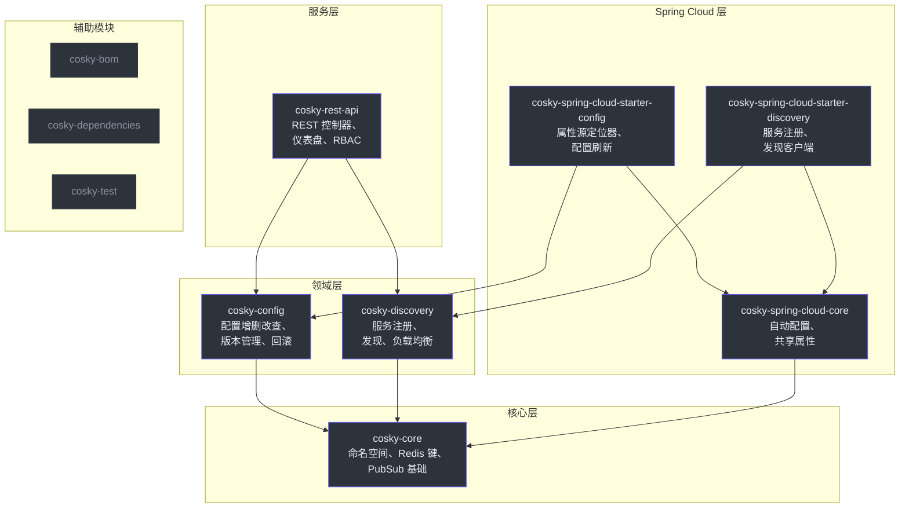
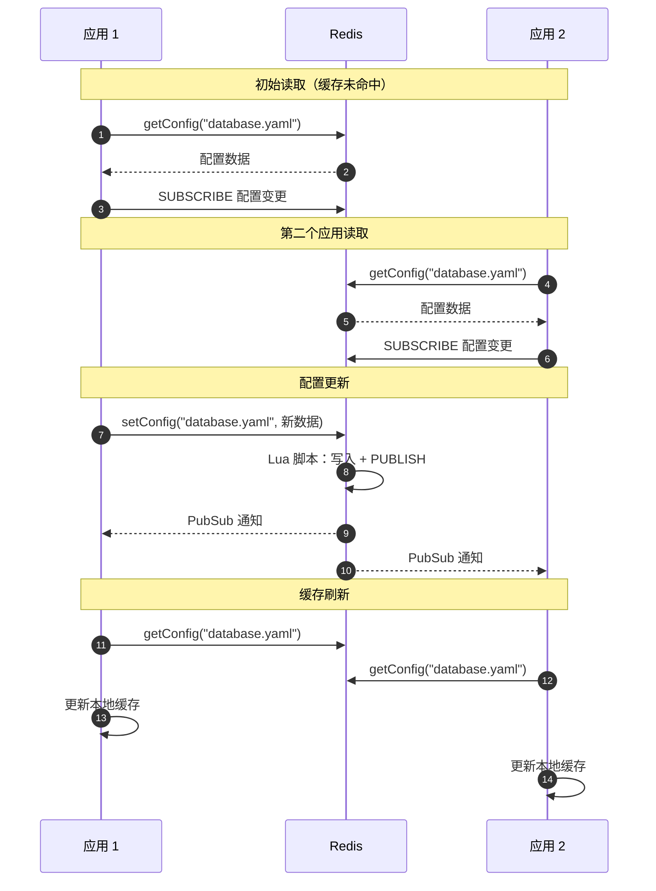
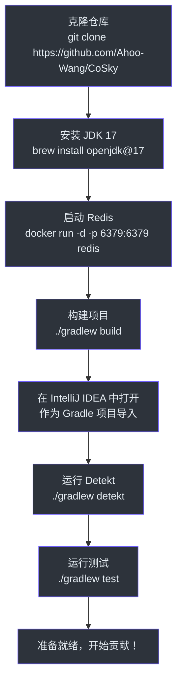

# 贡献者入门指南

欢迎来到 CoSky。本指南将带你从零开始成为一名高效的贡献者。我们假设你已经了解 Kotlin 或 Java，熟悉 Spring Boot，并对 Redis 有基本认识。其余内容将在本指南中学习。

## 第一部分 — 基础知识

### CoSky 是什么？

CoSky 是一个高性能的微服务治理平台，提供**服务发现**和**配置管理**功能，完全基于 Redis 构建。与部署独立的协调服务器（如 etcd、Consul 或 ZooKeeper）不同，CoSky 将你现有的 Redis 基础设施转化为服务网格控制平面。

项目名称来源于 **Co**（Configuration，配置）+ **Sky**（Service Discovery，服务发现）。项目采用 Apache 2.0 开源协议。

- 仓库地址：[https://github.com/Ahoo-Wang/CoSky](https://github.com/Ahoo-Wang/CoSky)
- Group ID：`me.ahoo.cosky`
- 当前版本：5.6.0

### 技术栈

| 层级 | 技术 |
|------|------|
| 语言 | Kotlin（JVM 17 工具链） |
| 框架 | Spring Boot 4.x、Spring Cloud |
| 响应式 | Project Reactor（`Mono`/`Flux`） |
| 存储 | Redis（通过 `ReactiveStringRedisTemplate`） |
| 原子性 | 所有变更操作通过 Lua 脚本实现 |
| 构建 | Gradle（Kotlin DSL） |
| 测试 | JUnit 5、MockK、FluentAssert |
| 代码风格 | Detekt |
| 基准测试 | JMH（Java Microbenchmark Harness） |

### 构建项目

```bash
# 克隆仓库
git clone https://github.com/Ahoo-Wang/CoSky.git
cd CoSky

# 构建全部（编译 + 测试）
./gradlew build

# 跳过测试构建（开发时更快）
./gradlew build -x test

# 检查代码风格
./gradlew detekt

# 运行指定模块的测试
./gradlew :cosky-config:test
./gradlew :cosky-discovery:test

# 本地运行 REST API 服务器
./gradlew :cosky-rest-api:bootRun

# 运行基准测试
./gradlew :cosky-config:jmh
./gradlew :cosky-discovery:jmh
```

### Redis 要求

集成测试需要运行中的 Redis 实例。测试基类 `AbstractReactiveRedisTest` 默认连接 `localhost:6379`。请在运行测试前启动 Redis：

```bash
# Docker 方式
docker run -d -p 6379:6379 redis:latest

# 或通过 Homebrew
brew services start redis
```

## 第二部分 — 架构与领域

### 模块结构

CoSky 采用多模块 Gradle 项目组织。在进行修改之前，理解依赖关系图至关重要。



| 模块 | 用途 | 核心接口 |
|------|------|----------|
| `cosky-core` | 命名空间管理、Redis 键工具、PubSub 事件基础 | `NamespaceService`、`EventListenerContainer`、`Namespaced` |
| `cosky-config` | 配置增删改查、版本管理、回滚、一致性缓存 | `ConfigService`、`ConfigRollback` |
| `cosky-discovery` | 服务注册、发现、负载均衡、拓扑关系 | `ServiceRegistry`、`ServiceDiscovery`、`LoadBalancer` |
| `cosky-spring-cloud-core` | 共享 Spring Boot 自动配置 | `CoSkyProperties`、`CoSkyAutoConfiguration` |
| `cosky-spring-cloud-starter-config` | Spring Cloud 配置加载与刷新 | `CoSkyPropertySourceLocator`、`CoSkyConfigRefresher` |
| `cosky-spring-cloud-starter-discovery` | Spring Cloud 服务注册与发现 | `CoSkyDiscoveryClient`、`CoSkyAutoServiceRegistration` |
| `cosky-rest-api` | REST API 服务器、仪表盘、安全、RBAC | `ServiceController`、`ConfigController` |
| `cosky-bom` | 依赖管理的物料清单 | — |
| `cosky-test` | 共享测试工具、Lua 清理脚本 | `AbstractReactiveRedisTest` |

**关键规则**：`cosky-core` 不依赖任何其他 CoSky 模块。依赖图必须保持无环。

### 一致性模式：本地缓存 + PubSub 失效

这是 CoSky 中最重要的架构概念。请仔细阅读。

CoSky 通过以下组合实现极高的读取性能：

1. **本地进程内缓存** — 数据存储在每个应用进程内的 `ConcurrentHashMap` 中。读取以纳秒级速度命中此缓存。
2. **Redis PubSub** — 当 Redis 中的数据发生变化时，PubSub 消息通知所有订阅者使其失效或刷新本地缓存。
3. **懒订阅** — 缓存条目在首次访问时创建，并自动订阅该键的 PubSub 事件。



一致性包装器包括：
- **配置**：`RedisConsistencyConfigService` 包装 `RedisConfigService` — 参见 [cosky-config/src/main/kotlin/me/ahoo/cosky/config/redis/RedisConsistencyConfigService.kt:33](https://github.com/Ahoo-Wang/CoSky/blob/main/cosky-config/src/main/kotlin/me/ahoo/cosky/config/redis/RedisConsistencyConfigService.kt#L33)
- **发现**：`ConsistencyRedisServiceDiscovery` 包装 `RedisServiceDiscovery` — 参见 [cosky-discovery/src/main/kotlin/me/ahoo/cosky/discovery/redis/ConsistencyRedisServiceDiscovery.kt:43](https://github.com/Ahoo-Wang/CoSky/blob/main/cosky-discovery/src/main/kotlin/me/ahoo/cosky/discovery/redis/ConsistencyRedisServiceDiscovery.kt#L43)

性能提升非常显著：

| 操作 | 直接访问 Redis | 使用一致性层 |
|------|--------------|-------------|
| `getConfig` | ~241K ops/s | **~257M ops/s**（快 1000 倍） |
| `getInstances` | ~227K ops/s | **~77M ops/s**（快 340 倍） |
| `getServices` | ~305K ops/s | **~456M ops/s**（快 1500 倍） |

### Redis 键模式

所有 Redis 键都是**命名空间作用域**的。命名空间作为租户分隔符，使用 Redis 哈希标签 `{...}` 包裹以兼容集群模式。

**配置键**（[ConfigKeyGenerator](https://github.com/Ahoo-Wang/CoSky/blob/main/cosky-config/src/main/kotlin/me/ahoo/cosky/config/ConfigKeyGenerator.kt)）：

| 用途 | 键模式 | Redis 类型 |
|------|--------|-----------|
| 配置索引 | `{namespace}:cfg_idx` | SET |
| 当前配置 | `{namespace}:cfg:{configId}` | HASH |
| 历史索引 | `{namespace}:cfg_htr_idx:{configId}` | ZSET |
| 历史版本 | `{namespace}:cfg_htr:{configId}:{version}` | HASH |

**服务发现键**（[DiscoveryKeyGenerator](https://github.com/Ahoo-Wang/CoSky/blob/main/cosky-discovery/src/main/kotlin/me/ahoo/cosky/discovery/DiscoveryKeyGenerator.kt)）：

| 用途 | 键模式 | Redis 类型 |
|------|--------|-----------|
| 服务索引 | `{namespace}:svc_idx` | SET |
| 服务统计 | `{namespace}:svc_stat` | HASH |
| 实例索引 | `{namespace}:svc_itc_idx:{serviceId}` | SET |
| 实例数据 | `{namespace}:svc_itc:{instanceId}` | HASH |

**为什么使用哈希标签？** Redis Cluster 根据 `{` 和 `}` 之间的文本将键路由到槽位。包裹命名空间可确保同一命名空间的所有键落在同一分片上，从而通过 Lua 脚本实现跨键的原子操作。参见 [cosky-core/src/main/kotlin/me/ahoo/cosky/core/util/RedisKeys.kt:24](https://github.com/Ahoo-Wang/CoSky/blob/main/cosky-core/src/main/kotlin/me/ahoo/cosky/core/util/RedisKeys.kt#L24)。

### Lua 脚本实现原子操作

所有写操作都以 Lua 脚本的形式在 Redis 内部执行。这保证了原子性 — 没有客户端能观察到部分完成的状态。代码库中**没有多命令事务**；一切都是单次 Lua 脚本调用。

关键 Lua 脚本：

| 脚本 | 模块 | 用途 |
|------|------|------|
| `config_set.lua` | cosky-config | 原子写入 + 版本管理 + 历史 + 发布 |
| `config_remove.lua` | cosky-config | 原子删除 + 历史 + 发布 |
| `config_rollback.lua` | cosky-config | 原子回滚到目标版本 + 发布 |
| `registry_register.lua` | cosky-discovery | 原子注册实例 + 设置 TTL + 发布 |
| `registry_deregister.lua` | cosky-discovery | 原子注销 + 删除键 + 发布 |
| `registry_renew.lua` | cosky-discovery | 带节流发布的心跳续约 |
| `discovery_get_instances.lua` | cosky-discovery | 读取实例 + 懒过期清理无效实例 |

每个 Lua 脚本遵循相同的模式：
1. 读取当前状态
2. 检查前置条件（例如哈希比较以跳过无变更写入）
3. 执行变更操作
4. 向该键对应的频道 `PUBLISH` 通知
5. 返回状态码

`registry_renew.lua` 中的节流发布机制尤其值得注意 — 它仅在上次 TTL 发布即将过期时才发布 `renew` 事件，将 PubSub 流量减少了一个数量级。参见 [cosky-discovery/src/main/resources/registry_renew.lua:8](https://github.com/Ahoo-Wang/CoSky/blob/main/cosky-discovery/src/main/resources/registry_renew.lua#L8)。

### 事件模型

CoSky 使用 Redis PubSub 传播状态变更。事件是基于字符串的操作码，发布到与键名直接对应的 Redis 频道。

**配置事件**（[ConfigChangedEvent](https://github.com/Ahoo-Wang/CoSky/blob/main/cosky-config/src/main/kotlin/me/ahoo/cosky/config/ConfigChangedEvent.kt)）：

| 事件 | 触发条件 | 操作码 |
|------|---------|--------|
| `SET` | 配置被创建或更新 | `"set"` |
| `REMOVE` | 配置被删除 | `"remove"` |
| `ROLLBACK` | 配置回滚到先前版本 | `"rollback"` |

**实例事件**（[InstanceChangedEvent](https://github.com/Ahoo-Wang/CoSky/blob/main/cosky-discovery/src/main/kotlin/me/ahoo/cosky/discovery/InstanceChangedEvent.kt)）：

| 事件 | 触发条件 | 操作码 |
|------|---------|--------|
| `REGISTER` | 新实例注册 | `"register"` |
| `DEREGISTER` | 实例被显式移除 | `"deregister"` |
| `EXPIRED` | 实例 TTL 过期（懒清理） | `"expired"` |
| `RENEW` | 实例心跳续约 TTL | `"renew"` |
| `SET_METADATA` | 实例元数据更新 | `"set_metadata"` |

## 第三部分 — 参与贡献

### 开发环境搭建



<!-- Sources: build.gradle.kts:92, AGENTS.md -->

前置条件：
- **JDK 17** — `build.gradle.kts` 中的 JVM 工具链配置要求
- **Redis** — 集成测试必需
- **IntelliJ IDEA** — 推荐（Kotlin 支持一流）

### 运行测试

```bash
# 运行所有模块的全部测试
./gradlew test

# 运行指定模块的测试
./gradlew :cosky-core:test
./gradlew :cosky-config:test
./gradlew :cosky-discovery:test

# 运行单个测试类
./gradlew :cosky-config:test --tests "me.ahoo.cosky.config.redis.RedisConfigServiceTest"

# 运行测试并显示详细输出
./gradlew :cosky-config:test --info
```

所有测试类使用 JUnit 5 和 `me.ahoo.test:fluent-assert-core` 库进行断言。编写测试时，请始终使用：

```kotlin
import me.ahoo.test.asserts.assert

// 正确用法：
actual.assert().isEqualTo(expected)

// 不要使用 AssertJ 的 assertThat() — 它在 Kotlin 中冗长且不是空安全的
```

### 代码风格

CoSky 使用 **Detekt** 进行静态分析，并启用了自动纠正：

```bash
# 检查代码风格违规
./gradlew detekt

# Detekt 自动纠正默认在 build.gradle.kts 中启用
# 它会在构建期间自动修复格式问题
```

主要代码风格规则：
- 所有源文件必须包含 **Apache 2.0 许可证头部**
- 编译器标志：`-Xjsr305=strict`、`-Xjvm-default=all-compatibility`
- 所有核心 API 返回 `Mono` 或 `Flux`（Project Reactor）
- 所有 Redis 变更操作通过 Lua 脚本执行 — 禁止使用多命令序列

### PR 流程

1. **Fork** 仓库（如果你有推送权限，也可以创建分支）
2. 从 `main` **创建特性分支**：`git checkout -b feature/my-feature`
3. **先编写测试** — 所有新功能和 Bug 修复必须有测试
4. **运行完整构建**：`./gradlew build detekt`
5. 使用描述性消息**提交**
6. 向 `main` **发起 Pull Request**
7. CI 将运行集成测试、基准测试、代码覆盖率和 Detekt 检查

### 可以贡献的方向

适合新贡献者的任务：
- **新的负载均衡策略** — 实现 `LoadBalancer` 接口
- **仪表盘改进** — `dashboard/` 目录包含 React 19 前端
- **文档** — `wiki/` 目录包含 VitePress 文档站点
- **测试覆盖率** — 在 Jacoco 报告中查找未覆盖的代码路径

需要谨慎审查的领域（修改前请先讨论）：
- **Lua 脚本** — 它们保证关键的一致性不变量
- **Redis 键模式** — 变更会破坏向后兼容性
- **一致性层包装器** — 它们是性能基础

### 关键文件参考

下表列出了最重要的源文件。请收藏这些文件 — 你会频繁参考它们。

| 文件 | 用途 |
|------|------|
| [cosky-core/.../CoSky.kt](https://github.com/Ahoo-Wang/CoSky/blob/main/cosky-core/src/main/kotlin/me/ahoo/cosky/core/CoSky.kt) | 品牌常量和键分隔符 |
| [cosky-core/.../Namespaced.kt](https://github.com/Ahoo-Wang/CoSky/blob/main/cosky-core/src/main/kotlin/me/ahoo/cosky/core/Namespaced.kt) | 命名空间默认值和系统命名空间 |
| [cosky-core/.../RedisKeys.kt](https://github.com/Ahoo-Wang/CoSky/blob/main/cosky-core/src/main/kotlin/me/ahoo/cosky/core/util/RedisKeys.kt) | Redis Cluster 的哈希标签包裹 |
| [cosky-config/.../ConfigKeyGenerator.kt](https://github.com/Ahoo-Wang/CoSky/blob/main/cosky-config/src/main/kotlin/me/ahoo/cosky/config/ConfigKeyGenerator.kt) | 配置 Redis 键模式 |
| [cosky-config/.../ConfigService.kt](https://github.com/Ahoo-Wang/CoSky/blob/main/cosky-config/src/main/kotlin/me/ahoo/cosky/config/ConfigService.kt) | 配置服务接口 |
| [cosky-config/.../RedisConfigService.kt](https://github.com/Ahoo-Wang/CoSky/blob/main/cosky-config/src/main/kotlin/me/ahoo/cosky/config/redis/RedisConfigService.kt) | 配置 Redis 实现 |
| [cosky-config/.../RedisConsistencyConfigService.kt](https://github.com/Ahoo-Wang/CoSky/blob/main/cosky-config/src/main/kotlin/me/ahoo/cosky/config/redis/RedisConsistencyConfigService.kt) | 配置一致性包装器 |
| [cosky-config/src/main/resources/config_set.lua](https://github.com/Ahoo-Wang/CoSky/blob/main/cosky-config/src/main/resources/config_set.lua) | 原子配置写入 + 版本管理 + 历史 |
| [cosky-discovery/.../DiscoveryKeyGenerator.kt](https://github.com/Ahoo-Wang/CoSky/blob/main/cosky-discovery/src/main/kotlin/me/ahoo/cosky/discovery/DiscoveryKeyGenerator.kt) | 服务发现 Redis 键模式 |
| [cosky-discovery/.../ServiceRegistry.kt](https://github.com/Ahoo-Wang/CoSky/blob/main/cosky-discovery/src/main/kotlin/me/ahoo/cosky/discovery/ServiceRegistry.kt) | 注册接口 |
| [cosky-discovery/.../ServiceDiscovery.kt](https://github.com/Ahoo-Wang/CoSky/blob/main/cosky-discovery/src/main/kotlin/me/ahoo/cosky/discovery/ServiceDiscovery.kt) | 发现接口 |
| [cosky-discovery/.../ConsistencyRedisServiceDiscovery.kt](https://github.com/Ahoo-Wang/CoSky/blob/main/cosky-discovery/src/main/kotlin/me/ahoo/cosky/discovery/redis/ConsistencyRedisServiceDiscovery.kt) | 发现一致性包装器 |
| [cosky-discovery/.../RedisServiceRegistry.kt](https://github.com/Ahoo-Wang/CoSky/blob/main/cosky-discovery/src/main/kotlin/me/ahoo/cosky/discovery/redis/RedisServiceRegistry.kt) | 注册 Redis 实现 |
| [cosky-discovery/src/main/resources/registry_register.lua](https://github.com/Ahoo-Wang/CoSky/blob/main/cosky-discovery/src/main/resources/registry_register.lua) | 原子实例注册 |
| [cosky-discovery/src/main/resources/registry_renew.lua](https://github.com/Ahoo-Wang/CoSky/blob/main/cosky-discovery/src/main/resources/registry_renew.lua) | 带节流 PubSub 的心跳续约 |
| [cosky-rest-api/.../ServiceController.kt](https://github.com/Ahoo-Wang/CoSky/blob/main/cosky-rest-api/src/main/kotlin/me/ahoo/cosky/rest/service/ServiceController.kt) | 服务 REST 端点 |
| [build.gradle.kts](https://github.com/Ahoo-Wang/CoSky/blob/main/build.gradle.kts) | 根构建配置 |
| [settings.gradle.kts](https://github.com/Ahoo-Wang/CoSky/blob/main/settings.gradle.kts) | 模块声明 |

### 贡献者工作流程图

```mermaid
flowchart LR
    subgraph "本地开发"
        BRANCH["创建分支"] --> CODE["编写代码和测试"]
        CODE --> DETEKT_LOCAL["运行 detekt"]
        DETEKT_local --> BUILD_LOCAL["运行构建"]
        BUILD_LOCAL --> COMMIT["提交"]
    end

    subgraph "Pull Request"
        COMMIT --> PUSH["推送到 GitHub"]
        PUSH --> PR["发起 PR"]
    end

    subgraph "CI 流水线"
        PR --> CI_TEST["集成测试"]
        CI_TEST --> CI_DETEKT["Detekt 检查"]
        CI_DETEKT --> CI_COVERAGE["代码覆盖率"]
        CI_COVERAGE --> CI_BENCH["JMH 基准测试"]
    end

    CI_BENCH --> REVIEW["代码审查"]
    REVIEW --> MERGE["合并到 main"]

    style BRANCH fill:#2d333b,stroke:#6d5dfc,color:#e6edf3
    style CODE fill:#2d333b,stroke:#6d5dfc,color:#e6edf3
    style DETEKT_local fill:#2d333b,stroke:#6d5dfc,color:#e6edf3
    style BUILD_LOCAL fill:#2d333b,stroke:#6d5dfc,color:#e6edf3
    style COMMIT fill:#2d333b,stroke:#6d5dfc,color:#e6edf3
    style PUSH fill:#2d333b,stroke:#6d5dfc,color:#e6edf3
    style PR fill:#2d333b,stroke:#6d5dfc,color:#e6edf3
    style CI_TEST fill:#2d333b,stroke:#6d5dfc,color:#e6edf3
    style CI_DETEKT fill:#2d333b,stroke:#6d5dfc,color:#e6edf3
    style CI_COVERAGE fill:#2d333b,stroke:#6d5dfc,color:#e6edf3
    style CI_BENCH fill:#2d333b,stroke:#6d5dfc,color:#e6edf3
    style REVIEW fill:#2d333b,stroke:#6d5dfc,color:#e6edf3
    style MERGE fill:#2d333b,stroke:#6d5dfc,color:#e6edf3
```


