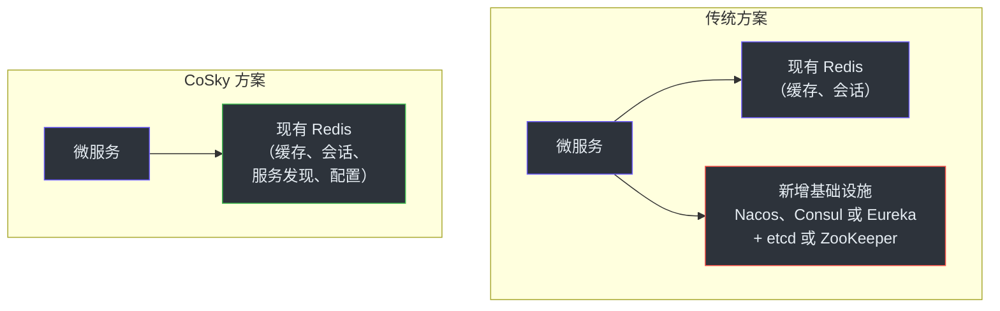
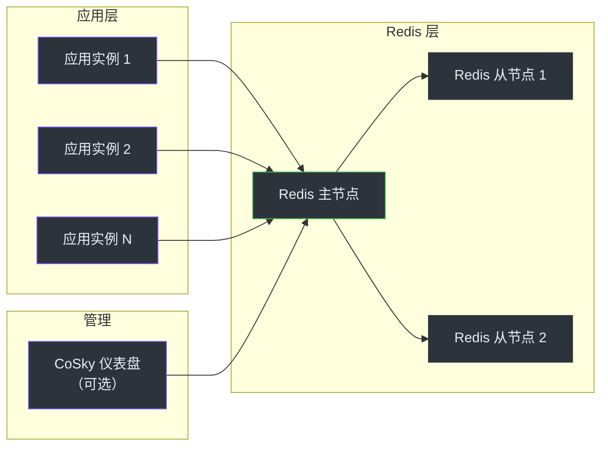
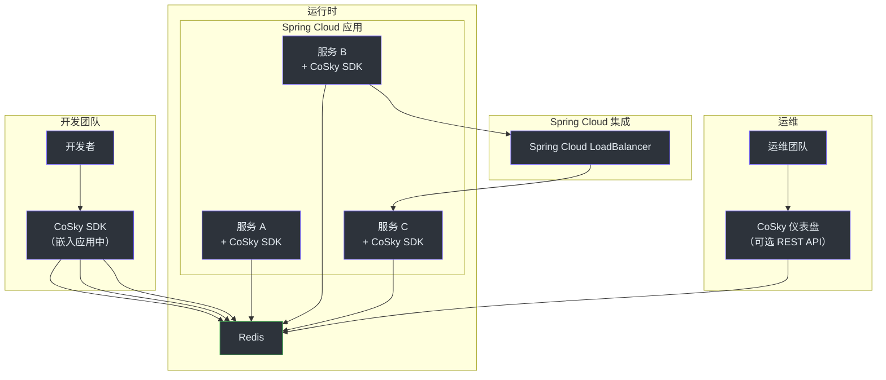

# 高管入职指南

本文档面向副总裁级别和总监级别的工程负责人，帮助你了解 CoSky 是什么、团队为什么选择它、它如何融入技术组合，以及存在哪些风险。本文档不包含任何代码。

## CoSky 功能概览一览表

| 能力 | 含义 | 业务价值 |
|------|------|----------|
| **服务发现** | 微服务无需硬编码地址即可动态发现彼此 | 支持零停机部署、自动扩缩容和故障隔离 |
| **服务注册** | 新服务实例自动宣告上线 | 消除扩缩容时的手动配置 |
| **健康检查** | 不健康实例自动从路由中移除 | 防止流量被发送到已停止或降级的实例 |
| **配置管理** | 集中化、版本化的应用配置，支持实时更新 | 无需重新部署即可更改数据库密码或功能开关 |
| **配置版本管理与回滚** | 每次配置变更均有完整历史记录 | 可即时回滚错误的配置变更 |
| **负载均衡** | 基于权重的随机流量分配 | 无需外部负载均衡器即可控制流量分配 |
| **命名空间隔离** | 支持作用域内配置和服务隔离的多租户环境 | 开发、预发布和生产环境可共享同一 Redis |
| **RBAC 与审计日志** | 基于角色的访问控制，附带完整审计追踪 | 满足合规要求的访问管理 |
| **服务拓扑** | 可视化展示服务间的调用关系 | 为故障响应和架构评审提供依赖关系可视化 |
| **仪表盘** | 基于网页的管理界面，覆盖所有运维操作 | 运维团队可自助操作，减少工程瓶颈 |

## 技术投资分析

### 核心主张

CoSky 利用你现有的 Redis 基础设施来提供服务发现和配置管理。这与部署专用服务网格控制平面的投资模式有着根本区别。

### 为什么这很重要

1. **无需运维新基础设施。** Redis 已经在你的技术栈中。你的团队已经知道如何部署、监控、扩展和调试 Redis。引入 CoSky 不会增加新的运维领域。

2. **不引入新的故障域。** 每增加一个基础设施组件都会增加一个潜在的故障点。通过复用 Redis，CoSky 避免了引入新的故障域。

3. **更低的总体拥有成本。** 无需额外的服务器、监控或值班轮换。如果你已经在运行 Redis，那么增量成本几乎为零。

4. **极致性能。** CoSky 的读取操作命中进程内本地缓存，速度达到纳秒级。写入操作以 Lua 脚本形式在 Redis 内部执行，约 24 万次/秒。一致性层可提供约 2.5 亿次/秒的配置读取和约 7700 万次/秒的服务实例读取。这些数据表明，只有在极端写密集的工作负载下，Redis 才会成为瓶颈。

## 成本模型对比

| 成本因素 | CoSky | Nacos | Consul | Eureka |
|----------|-------|-------|--------|--------|
| **基础设施** | 现有 Redis（共享） | 3 台以上 JVM 服务器 + MySQL | 3 台以上服务器（Raft 仲裁） | 2 台以上 JVM 服务器 |
| **运维开销** | 仅 Redis（已有） | 独立集群 + 数据库 | 独立集群 | 独立集群 |
| **监控** | Redis 指标（已有） | 新建仪表盘 | 新建仪表盘 | 新建仪表盘 |
| **值班所需专业知识** | Redis（已有知识） | Nacos 专用 | Consul + Raft | Eureka 专用 |
| **网络成本** | 极低（PubSub） | 中等（HTTP 轮询） | 中等（HTTP/gRPC） | 中等（HTTP 复制） |
| **培训** | Spring Cloud 标准 | Nacos 专用 | Consul 专用 | Spring Cloud 标准 |
| **部署复杂度** | 低（SDK + 可选服务器） | 中等（集群 + 数据库） | 中等（集群搭建） | 低（Spring Boot 应用） |

## 扩展模型

CoSky 通过 Redis 和命名空间多租户来实现扩展。

### 基于 Redis 的水平扩展

- **应用实例**独立扩展——每个实例都有自己的本地缓存，并订阅 Redis PubSub。
- **Redis** 通过副本实现读取扩展，通过 Redis Cluster 实现跨命名空间分片。
- **无需扩展 CoSky 专用的服务器。** REST API 仪表盘是可选的且无状态的。

### 命名空间多租户

命名空间在环境、团队或业务领域之间提供隔离：

| 命名空间 | 用途 | 隔离级别 |
|----------|------|----------|
| `cosky-{default}` | 生产环境服务 | 完整的配置和服务隔离 |
| `cosky-{staging}` | 预发布环境 | 完整的配置和服务隔离 |
| `cosky-{team-alpha}` | Alpha 团队的服务 | 完整的配置和服务隔离 |

所有命名空间共享同一个 Redis 实例。数据通过键前缀进行隔离，而非物理数据库。Hash tags 确保在 Redis Cluster 中，同一命名空间内的跨键操作保持原子性。

## 风险评估

### 技术风险

| 风险 | 严重程度 | 发生概率 | 缓解措施 |
|------|----------|----------|----------|
| **Redis 单点故障** | 高 | 低 | Redis Sentinel 或 Cluster 提供自动故障转移。CoSky 缓存可在短暂中断中存活。 |
| **PubSub 消息丢失** | 中 | 低 | 缓存条目在 1 分钟后自动过期。数据陈旧问题会自我修复。 |
| **Redis 内存压力** | 中 | 中 | 监控 Redis 内存。配置历史有上限。实例数据使用基于 TTL 的过期机制。 |
| **Lua 脚本延迟抖动** | 低 | 低 | 脚本简单快速（<1ms）。监控 Redis 慢查询日志。 |
| **网络分区** | 中 | 低 | 客户端从本地缓存提供服务。分区恢复后达到最终一致性。 |

### 运维风险

| 风险 | 严重程度 | 发生概率 | 缓解措施 |
|------|----------|----------|----------|
| **Redis 配置错误** | 高 | 中 | 遵循标准 Redis 运维实践。仪表盘提供健康状态可视化。 |
| **命名空间冲突** | 中 | 低 | 命名空间命名规范和 RBAC 防止跨团队干扰。 |
| **配置变更影响范围** | 高 | 低 | 版本管理与回滚机制。RBAC 限制可修改配置的人员。审计日志追踪所有变更。 |
| **误删 Redis 键** | 高 | 低 | Redis ACL 保护。CoSky 使用结构化的键前缀。仪表盘提供安全的管理界面。 |

### 组织风险

| 风险 | 严重程度 | 缓解措施 |
|------|----------|----------|
| **Redis 团队成为瓶颈** | 中 | CoSky 通过 SDK 和仪表盘实现自助服务。Redis 团队仅管理基础设施。 |
| **团队对新工具的抵触** | 低 | CoSky 集成 Spring Cloud 标准。Spring Boot 团队的学习曲线极短。 |
| **Redis 供应商锁定** | 中 | Redis 是部署最广泛的键值存储。放弃 Redis 的可能性极低。 |
| **故障排查的技能差距** | 低 | 标准 JVM + Redis 调试。无需专有工具。 |

## 与替代方案对比

| 维度 | CoSky | Nacos | Consul | Eureka | Apollo |
|------|-------|-------|--------|--------|--------|
| **CAP 模型** | CP + AP | CP + AP | CP | AP | CP + AP |
| **所需基础设施** | 仅 Redis | 服务器 + MySQL | 服务器（Raft） | 服务器 | 服务器 + MySQL |
| **Spring Cloud 集成** | 原生 | 原生 | 原生 | 原生 | 原生 |
| **配置版本管理** | 支持 | 支持 | 有限 | 不支持 | 支持 |
| **服务拓扑** | 支持 | 不支持 | 不支持 | 不支持 | 不支持 |
| **RBAC** | 支持 | 支持 | 支持（ACL） | 不支持 | 支持 |
| **审计日志** | 支持 | 有限 | 不支持 | 不支持 | 有限 |
| **读取性能** | ~250M ops/s | ~50K ops/s | ~50K ops/s | ~50K ops/s | ~50K ops/s |
| **写入性能** | ~240K ops/s | ~50K ops/s | ~50K ops/s | ~50K ops/s | ~50K ops/s |
| **运维复杂度** | 极低 | 高 | 中 | 低 | 高 |
| **仪表盘** | 支持 | 支持 | 支持 | 基础 | 支持 |
| **跨注册中心同步** | 支持（Mirror） | 支持 | 支持（WAN） | 不支持 | 不支持 |

### 何时选择 CoSky

- 你已经在运行 Redis，并希望最小化运维开销
- 你的微服务基于 Spring Cloud 构建
- 读多写少的工作负载（配置和服务发现的典型场景）
- 你需要命名空间隔离以支持多环境
- 性能是优先事项，且你可以接受最终一致性（约 5ms 窗口）

### 何时应考虑其他方案

- 你需要强一致性保证（etcd/Consul）
- 你没有运行 Redis，也不计划使用
- 你需要基于 DNS 的服务发现（Consul/CoreDNS）
- 你需要带有 Sidecar 代理的完整服务网格（Istio/Linkerd）

## 服务层级架构

## 建议

1. **从单一命名空间开始。** 在预发布命名空间中部署 CoSky，与你现有的服务发现并行运行。在迁移生产环境之前验证行为。

2. **监控 Redis 内存和延迟。** CoSky 增加的内存占用很小（与服务和配置数量成正比）。Redis 慢查询日志是监控写入延迟的最佳工具。

3. **建立命名空间命名规范。** 尽早在团队和环境之间防止命名空间冲突。

4. **从第一天起就启用 RBAC 和审计日志。** 仪表盘支持命名空间级别的角色访问控制。用它来防止跨环境的意外变更。

5. **规划 Redis 高可用方案。** CoSky 的自愈缓存可以应对短暂的中断，但生产环境建议使用 Redis Cluster 或 Sentinel 部署。

## 许可证与社区

- **许可证**：Apache License 2.0 —— 宽松许可，商业友好
- **代码仓库**：[https://github.com/Ahoo-Wang/CoSky](https://github.com/Ahoo-Wang/CoSky)
- **CI/CD**：GitHub Actions，包含集成测试、基准测试和代码覆盖率
- **制品**：以 `me.ahoo.cosky` 为 GroupId 发布至 Maven Central
- **Docker**：在 Docker Hub 上以 `ahoowang/cosky` 提供
