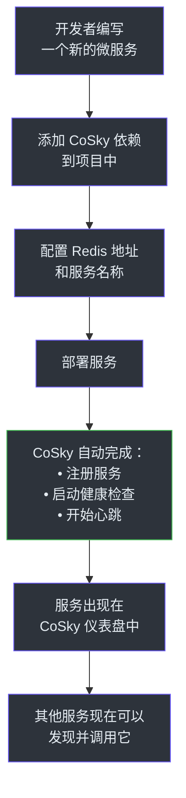
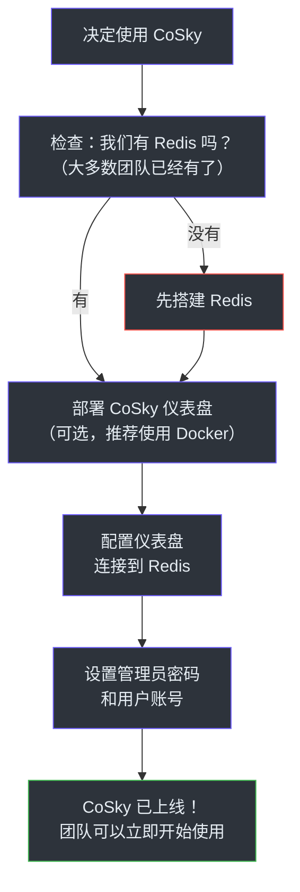
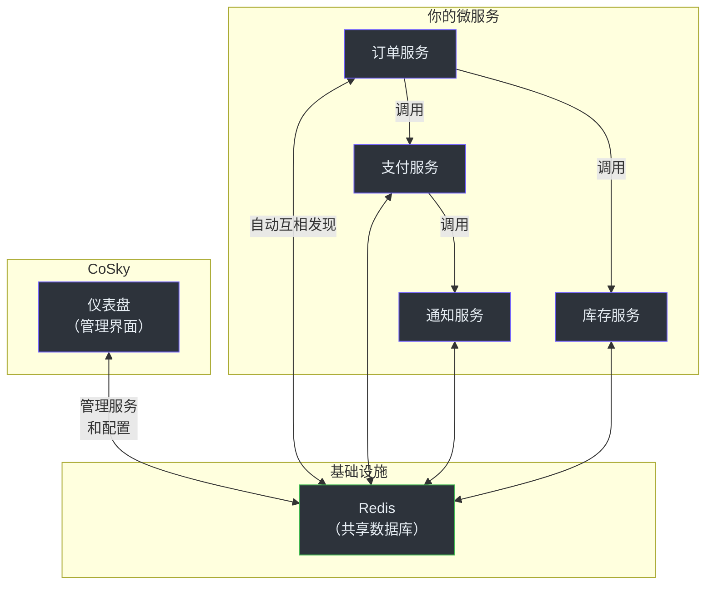

# 产品经理入职指南

本指南以通俗易懂的方式介绍 CoSky，不使用工程术语。如果你是产品经理、项目经理或业务相关方，请从这里开始。

## CoSky 是做什么的——通俗易懂的解释

想象一下你的公司有几十个甚至上百个微服务——它们是协同工作来交付产品的小程序。这些微服务需要两样东西才能正常运行：

1. **一种互相发现的方式**——就像程序的电话簿
2. **一种共享设置的方式**——就像一个即时更新的共享设置页面

CoSky 同时提供了这两样。

### 服务发现：电话簿

当一个服务的新实例启动时（比如你的支付服务为了应对黑色星期五的流量而扩容），它需要告诉系统的其他部分"我在这里，准备好接收请求了"。CoSky 会自动处理这些。

当另一个服务需要调用支付服务时，它会问 CoSky"支付服务现在在哪里？"，CoSky 会返回当前健康实例的列表。

如果某个服务实例崩溃或变得不健康，CoSky 会自动将其从列表中移除。无需人工干预。

### 配置管理：设置页面

每个服务都有配置——数据库密码、功能开关、超时值、API 地址等。没有 CoSky 的话，更改配置意味着需要重新部署服务。有了 CoSky，你只需在一个地方修改配置，所有实例就会立即获取到最新值。

CoSky 还会保留每次变更的完整历史记录，所以如果有人做了一个糟糕的配置变更，你可以一键回滚到任意之前的版本。

## 用户旅程图

### 开发者旅程：注册一个服务

开发者实际需要做的事情：
1. 在构建文件中添加两行依赖（Gradle 或 Maven）
2. 在应用配置中添加一小段配置
3. 像往常一样部署

其他一切都是自动的。

### 运维旅程：部署 CoSky

部署选项：
- **Docker** —— 最快的方式。一条命令即可运行仪表盘。
- **Kubernetes** —— 适合已经在使用 Kubernetes 的团队。提供了标准的部署清单。
- **独立运行** —— 下载并作为 JAR 文件运行。

仪表盘是可选的。CoSky 作为 SDK 嵌入你的服务中即可完美运行。仪表盘只是提供了一个便捷的管理界面。

## 功能一览表

| 功能 | 用户看到的效果 | 背后的工作原理 |
|------|---------------|---------------|
| **自动服务注册** | 部署后服务自动出现在仪表盘中 | CoSky SDK 在启动时将服务注册到 Redis |
| **基于健康的注销** | 不健康的实例自动从服务列表中消失 | 实例定期发送心跳。心跳停止后实例自动过期 |
| **服务发现** | 服务之间无需配置即可互相发现 | CoSky SDK 从 Redis 读取当前实例列表并在本地缓存 |
| **负载均衡** | 流量在实例之间均匀分布 | 内置加权随机负载均衡，按比例选择实例 |
| **配置管理** | 无需重新部署即可更改配置 | 配置存储在 Redis 中，通过 PubSub 即时推送到所有实例 |
| **配置版本管理** | 每次变更都有完整历史记录 | 每次变更都记录了版本号、时间戳和内容 |
| **一键回滚** | 即时撤销错误的配置变更 | 任意历史版本都可以通过一次 API 调用或仪表盘点击恢复 |
| **命名空间隔离** | 分离的环境（开发/预发布/生产） | 命名空间在同一个 Redis 实例内保持数据完全隔离 |
| **服务拓扑图** | 服务依赖关系的可视化图表 | CoSky 追踪服务间的调用关系并渲染交互式图谱 |
| **基于角色的访问控制** | 不同用户拥有不同权限 | 管理员、只读和命名空间级别的角色 |
| **审计日志** | 追踪谁在什么时候改了什么 | 每次写操作都记录了用户身份和时间戳 |
| **配置导入** | 从其他系统迁移 | 从 Nacos 等来源导入配置 |
| **仪表盘** | 用于所有操作的网页界面 | 基于 React 构建的 UI，用于管理服务、配置、用户和角色 |

## 系统总览图

## 已知限制

| 限制 | 影响 | 应对方案 |
|------|------|----------|
| **需要 Redis** | 必须有一个可用的 Redis 实例 | 大多数组织已经在运行 Redis。如果没有，搭建也很简单。 |
| **最终一致性** | 变更传播到所有节点需要几毫秒 | 对于绝大多数使用场景来说，这几乎不可感知。 |
| **无内置熔断** | CoSky 负责服务发现，不处理容错 | 配合 Spring Cloud Resilience4j 或类似方案实现熔断。 |
| **不支持基于 DNS 的发现** | 服务发现通过 SDK 实现，而非 DNS | 使用 Spring Cloud 集成。如果需要 DNS 发现，可通过 Consul 实现。 |
| **PubSub 消息可能丢失** | 如果服务在配置变更期间断开连接，可能暂时使用过期数据 | 服务会自动恢复并获取最新数据。最大过期时间约 1 分钟。 |
| **无内置分布式追踪** | CoSky 不追踪跨服务的请求 | 配合 OpenTelemetry 或类似方案实现追踪。CoSky 提供服务拓扑用于依赖关系映射。 |

## 常见问题

### Redis 宕机会怎样？

在 Redis 宕机期间：
- **现有服务继续正常工作** —— 每个服务都有服务实例和配置的本地缓存
- **新注册失败** —— 新服务在 Redis 恢复之前无法注册
- **配置变更不会传播** —— 但服务会继续使用上次已知的配置
- **当 Redis 恢复后**，所有服务会自动重新连接并重新同步

在生产环境中，建议使用 Redis Sentinel 或 Redis Cluster 实现自动故障转移。大多数 Redis 部署已经有这些了。

### CoSky 和 Nacos 有什么区别？

Nacos 和 CoSky 解决相同的问题（服务发现 + 配置管理）。主要区别如下：

| 方面 | CoSky | Nacos |
|------|-------|-------|
| 基础设施 | 使用你现有的 Redis | 需要自己的服务器 + MySQL 数据库 |
| 部署方式 | 在项目中添加一个依赖 | 部署和运维一个独立集群 |
| 性能 | 极快的读取速度（本地缓存） | 快速，但读取需要网络调用 |
| 成本 | 几乎零额外成本 | 服务器、数据库和运维成本 |
| 最适合 | 已经拥有 Redis 的团队 | 需要一体化解决方案的团队 |

### CoSky 和 Eureka 有什么区别？

Eureka 是 Netflix OSS 的项目，仅用于服务发现。主要区别如下：

| 方面 | CoSky | Eureka |
|------|-------|--------|
| 配置管理 | 内置 | 不包含 |
| 基础设施 | 使用现有 Redis | 需要 Eureka 服务器 |
| 一致性 | 最终一致，传播快 | 最终一致，传播较慢 |
| 活跃开发 | 是 | 极少（维护模式） |

### 我可以从 Nacos 迁移到 CoSky 吗？

可以。CoSky 在仪表盘中提供了配置导入功能，可以从 Nacos 读取配置。CoSky-Mirror 组件还可以在 Nacos 和 CoSky 之间实时同步服务实例，实现零停机的渐进式迁移。

### CoSky 可以在生产环境使用吗？

可以。CoSky 自 2021 年以来一直在生产环境中运行。它已发布到 Maven Central，拥有包含集成测试的 CI/CD 流水线，并采用 Apache 2.0 许可证。

### CoSky 支持 Kubernetes 吗？

支持。CoSky 可以与 Kubernetes 服务发现并行使用。你可以对 Kubernetes 内部服务使用 Kubernetes 原生服务发现，对部分服务运行在 Kubernetes 外部的混合环境使用 CoSky。我们为仪表盘提供了 Kubernetes 部署清单。

### CoSky 能处理多少服务和实例？

CoSky 的性能受限于 Redis 而非自身架构。单个 Redis 实例每秒可处理 10 万次以上的操作。由于大多数操作都是读取（从本地缓存中以 2.5 亿次/秒以上的速度提供服务），实际的性能上限取决于服务注册、注销和配置变更的频率——这通常远低于 Redis 的容量。

### CoSky 支持哪些编程语言？

CoSky 是一个用 Kotlin 编写的 JVM 库。它支持任何 JVM 语言（Java、Kotlin、Scala 等），并与 Spring Boot 和 Spring Cloud 原生集成。对于非 JVM 服务，REST API 服务器提供了所有操作的 HTTP 端点。

### 服务生命周期图

```mermaid
sequenceDiagram
    autonumber
    participant Dev as 开发者
    participant SVC as 服务实例
    participant CoSky as CoSky (Redis)
    participant Others as 其他服务

    rect rgb(22, 27, 34)
        Note over Dev,Others: 注册
        Dev->>SVC: 部署服务
        SVC->>CoSky: "我已上线！"（注册）
        CoSky-->>Others: "新服务可用"（通知）
    end

    rect rgb(22, 27, 34)
        Note over Dev,Others: 正常运行
        loop 每 30 秒
            SVC->>CoSky: "我还活着！"（心跳）
        end
        Others->>CoSky: "这个服务在哪里？"（发现）
        CoSky-->>Others: "这是实例列表"
    end

    rect rgb(22, 27, 34)
        Note over Dev,Others: 配置变更
        Dev->>CoSky: 通过仪表盘更新配置
        CoSky-->>SVC: "配置已变更！"（通知）
        SVC->>CoSky: 获取新配置
        CoSky-->>SVC: 新配置数据
    end

    rect rgb(22, 27, 34)
        Note over Dev,Others: 注销
        Dev->>SVC: 关闭服务
        SVC->>CoSky: "我要下线了"（注销）
        CoSky-->>Others: "服务实例已移除"（通知）
    end
```

## 术语表

| 术语 | 定义 |
|------|------|
| **服务发现** | 服务之间无需手动配置即可自动互相发现的过程 |
| **服务注册** | 服务向系统宣告自己的存在和地址 |
| **服务实例** | 服务的一个运行副本。一个服务可以同时运行多个实例 |
| **心跳** | 服务实例定期发送的信号，表示"我还活着" |
| **命名空间** | CoSky 内的隔离环境，就像不同团队或环境的独立工作区 |
| **配置** | 控制服务行为的设置（数据库地址、功能开关、超时时间等） |
| **PubSub** | 一种消息模式，变更会实时广播给所有相关方 |
| **负载均衡** | 将传入的请求分配到多个服务实例上 |
| **RBAC** | 基于角色的访问控制——根据用户被分配的角色来限制其操作权限 |
| **拓扑** | 展示哪些服务依赖哪些其他服务的映射图 |
| **回滚** | 将配置变更恢复到之前的版本 |
| **TTL** | 存活时间——服务注册在需要续期之前保持有效的时长 |
| **仪表盘** | 用于查看和管理服务及配置的网页管理界面 |
