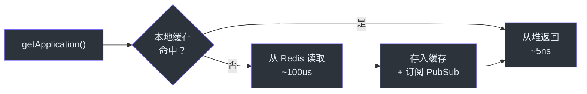
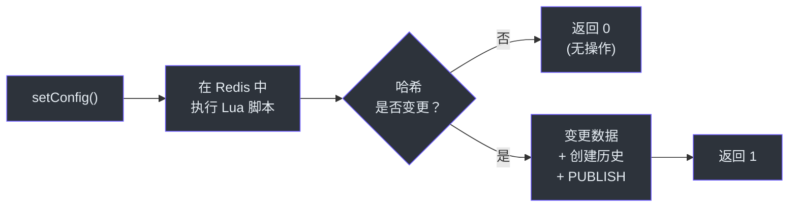
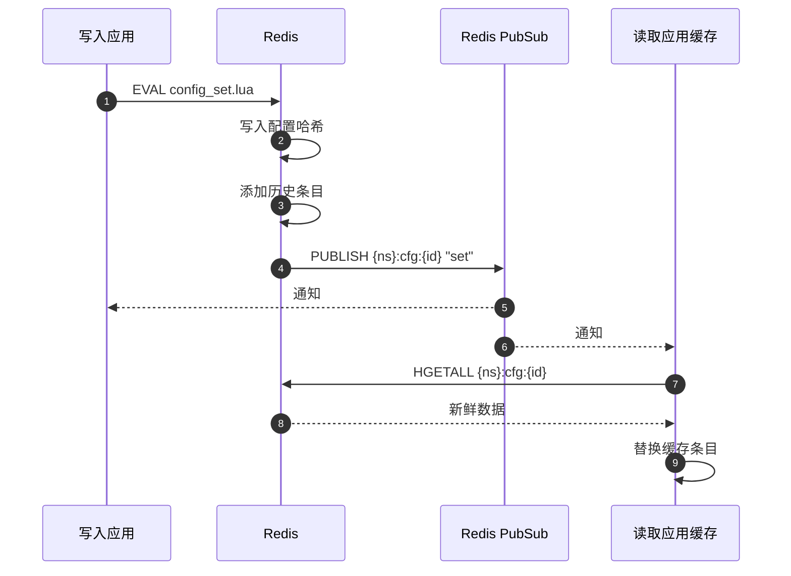
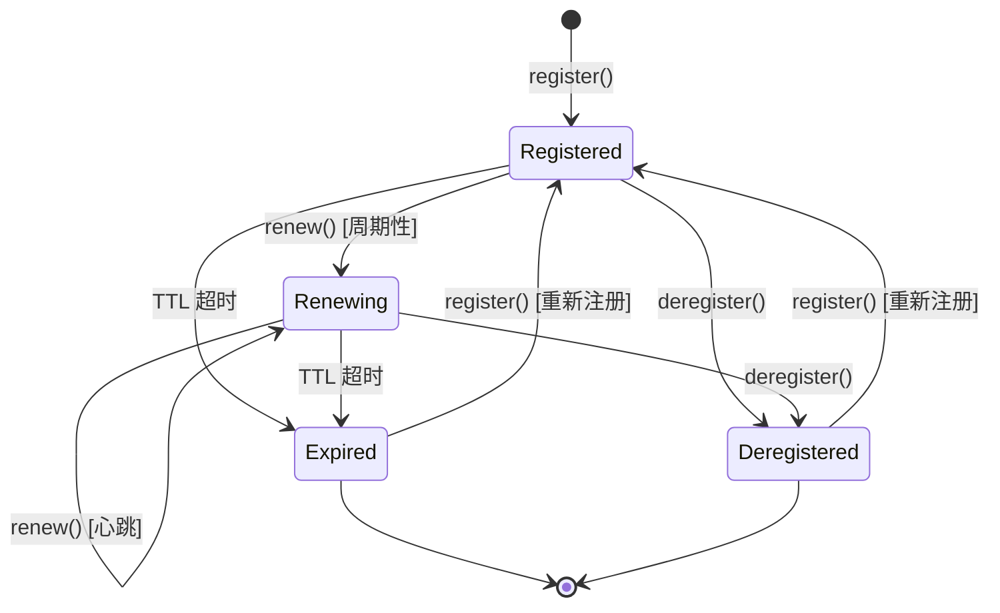

# 主任工程师入门指南

本文档面向需要在架构层面评估、扩展或运维 CoSky 的主任工程师和首席工程师。文档内容带有明确的观点性。它会告诉你系统做了什么、为什么这样做，以及潜在的陷阱在哪里。

## 一个核心洞察

CoSky 通过三个原语将 Redis 转变为服务网格控制平面：**Lua 脚本**用于原子写入，**PubSub** 用于变更传播，**本地进程内缓存**用于读放大。其他一切都源自这句话。

性能模型很简单：读取命中 JVM 堆中的 `ConcurrentHashMap`（纳秒级），一致性通过将每个缓存条目订阅到在数据变更时触发的 Redis PubSub 频道来维护（毫秒级）。这使得单机可以达到 ~250M 配置读取/秒和 ~456M 服务列表读取/秒，由 JMH 测量得出。

## 架构决策记录：为什么选择 Redis

CoSky 选择了 Redis 而非 etcd、Consul、ZooKeeper 或自定义共识协议。这不是随意的决定。

| 因素 | Redis | etcd / Consul / ZK |
|------|-------|--------------------|
| 运维负担 | 大多数组织已部署 | 需要运维新的基础设施 |
| 写吞吐量 | ~240K ops/s（单个 Lua 脚本） | ~10-50K ops/s（Raft 共识） |
| 读吞吐量（带缓存） | ~250M ops/s（本地堆） | ~10-50K ops/s（网络跳转） |
| 一致性模型 | 最终一致（PubSub 延迟 ~1-5ms） | 强一致（通过 Raft 实现线性化） |
| 运维复杂度 | 低（单一二进制文件，广为人知） | 高（Raft 仲裁、领导者选举） |
| 客户端库成熟度 | 优秀（Spring Data Redis） | 参差不齐 |

**权衡**：CoSky 用强一致性换取了极高的读取性能和运维简洁性。如果你的微服务不能容忍 ~5ms 陈旧的最终一致性，CoSky 不是正确的选择。对于绝大多数服务发现和配置管理的使用场景，这个权衡是正确的。

## 一致性模型深入解析

CoSky 实现了**读穿透缓存 + PubSub 失效**。这不是缓存旁路或写穿透模式。生命周期如下：

```mermaid
sequenceDiagram
    autonumber
    participant Caller as 调用代码
    participant Cache as ConcurrentHashMap<br>(JVM 堆)
    participant PubSub as Redis PubSub
    participant Redis as Redis 服务器

    rect rgb(22, 27, 34)
        Note over Caller,Redis: 冷读取（缓存未命中）
        Caller->>Cache: getConfig(ns, id)
        Cache-->>Caller: 未命中
        Caller->>Redis: HGETALL {ns}:cfg:{id}
        Redis-->>Caller: 配置数据
        Caller->>Cache: 存储 + 订阅频道
        Caller->>PubSub: SUBSCRIBE {ns}:cfg:{id}
    end

    rect rgb(22, 27, 34)
        Note over Caller,Redis: 热读取（缓存命中）
        Caller->>Cache: getConfig(ns, id)
        Cache-->>Caller: 缓存的配置（纳秒级）
    end

    rect rgb(22, 27, 34)
        Note over Caller,Redis: 失效（远程写入）
        PubSub-->>Cache: 消息："set"
        Cache->>Redis: HGETALL {ns}:cfg:{id}
        Redis-->>Cache: 新鲜配置数据
        Cache->>Cache: 替换缓存条目
    end
```



### 一致性伪代码（Python）

以下伪代码展示了 `RedisConsistencyConfigService` 和 `ConsistencyRedisServiceDiscovery` 共享的核心模式：

```python
class ConsistencyCache:
    def __init__(self, redis_client):
        self.redis = redis_client
        self.cache = {}  # ConcurrentHashMap 等价物

    def get(self, namespace, key):
        cache_key = (namespace, key)
        if cache_key not in self.cache:
            # 懒订阅：首次访问触发订阅
            self.redis.subscribe(f"{namespace}:{key}", self._on_change)
            self.cache[cache_key] = self.redis.read(f"{namespace}:{key}")
        return self.cache[cache_key]

    def _on_change(self, channel, message):
        namespace, key = parse_channel(channel)
        cache_key = (namespace, key)
        # 从 Redis 重新获取最新数据
        self.cache[cache_key] = self.redis.read(f"{namespace}:{key}")

    def set(self, namespace, key, value):
        # Lua 脚本：写入 + PUBLISH 原子操作
        self.redis.eval(
            "write(key, value); publish(key, 'set')",
            keys=[namespace],
            args=[key, value]
        )
        # 本地缓存将在 PubSub 消息到达时更新
```

关键不变量：**Lua 脚本总是在写入后发布**，并且**订阅者总是在收到通知后从 Redis 重新读取**。不存在"不重新读取就更新缓存"的情况 — PubSub 消息是信号，不是数据载体。

### 最终一致性窗口

陈旧窗口的上界为：

```
T_stale = T_pubsub_delivery + T_redis_read + T_cache_update
```

实际情况下：PubSub 投递 ~1-5ms（同数据中心）+ Redis 读取 ~0.1ms + 缓存更新 ~0.001ms = **总计约 1-5ms**。

这意味着两个应用实例读取同一配置键时，在写入后最多 ~5ms 内可能看到不同的值。对于服务发现来说，这完全在可接受范围内 — 大多数服务网格系统运行在 10-30 秒的陈旧窗口下。

## Redis 键设计原理

### 带哈希标签的命名空间前缀

所有键遵循 `{namespace}:type:identifier` 模式。哈希标签包裹（`{...}`）对 Redis Cluster 至关重要。

Redis Cluster 使用 `CRC16(key) % 16384` 将数据分片到 16384 个槽位。哈希标签机制允许你将相关键强制分配到同一槽位：

```
CRC16("{cosky-default}:cfg_idx") % 16384 = CRC16("{cosky-default}:cfg:database.yaml") % 16384
```

这保证了操作 `{cosky-default}:cfg_idx` 和 `{cosky-default}:cfg:database.yaml` 的 Lua 脚本在单个分片上执行 — Redis Cluster 中禁止跨槽位的 Lua 脚本。

哈希标签逻辑实现于 [cosky-core/src/main/kotlin/me/ahoo/cosky/core/util/RedisKeys.kt](https://github.com/Ahoo-Wang/CoSky/blob/main/cosky-core/src/main/kotlin/me/ahoo/cosky/core/util/RedisKeys.kt)，命名空间自动包裹发生在 [CoSkyProperties.kt](https://github.com/Ahoo-Wang/CoSky/blob/main/cosky-spring-cloud-core/src/main/kotlin/me/ahoo/cosky/spring/cloud/CoSkyProperties.kt)。

### 键类型选择

| 数据 | Redis 类型 | 原因 |
|------|-----------|------|
| 配置数据 | HASH | 字段级访问，HGETALL 读取全部 |
| 配置索引 | SET | SADD/SREM 管理成员，SMEMBERS 列出 |
| 配置历史 | ZSET | 分数 = 版本，ZREVRANGE 获取最近历史 |
| 实例数据 | HASH | 字段级访问元数据 |
| 实例索引 | SET | 每个服务的实例成员管理 |
| 服务统计 | HASH | 每个服务的实例计数 |

## Lua 脚本模式

CoSky 的 Lua 脚本使用三种反复出现的模式。理解这些模式对于修改或扩展系统至关重要。

### 模式一：带哈希去重的检查-执行

`config_set.lua` 脚本（[源码](https://github.com/Ahoo-Wang/CoSky/blob/main/cosky-config/src/main/resources/config_set.lua)）在写入前检查新数据哈希是否与当前哈希匹配：

```lua
local currentHash = redis.call("hget", configKey, hashField);
if (currentHash ~= nil) and (currentHash == hash) then
    return 0;  -- 无操作：数据未变更
end
```

这防止了在保存相同配置时产生冗余写入、历史条目和 PubSub 通知。

### 模式二：懒过期

`discovery_get_instances.lua` 脚本（[源码](https://github.com/Ahoo-Wang/CoSky/blob/main/cosky-discovery/src/main/resources/discovery_get_instances.lua)）在读取时检查 TTL：

```lua
local instanceTtl = redis.call("ttl", instanceKey);
if instanceTtl == -2 then
    redis.call("srem", instanceIdxKey, instanceId);
    redis.call("publish", instanceKey, "expired");
end
```

无效实例在读取时被懒清理，而不是由单独的后台清理进程处理。这消除了对墓碑进程的需求。

### 模式三：节流 PubSub

`registry_renew.lua` 脚本（[源码](https://github.com/Ahoo-Wang/CoSky/blob/main/cosky-discovery/src/main/resources/registry_renew.lua)）仅在上次发布时间戳即将过期时才发布 `renew` 事件：

```lua
local pubTolerance = 5;  -- 宽限秒数
local shouldPub = (lastRenewPublishTtlAt - nowTime - pubTolerance) < 0;
if shouldPub then
    redis.call("hset", instanceKey, "__last_renew_pub_ttl_at", currentTtlAt);
    redis.call("publish", instanceKey, "renew");
end
```

这在稳态心跳期间将 PubSub 流量减少了约 10 倍，因为大多数续约不会改变外部可观察的 TTL 窗口。

## 性能模型

### 读取路径（一致性层）



### 写入路径（Lua 脚本）



### 缓存失效流程



### 服务实例生命周期



## 风险领域

### PubSub 可靠性

Redis PubSub 是**即发即忘**的 — 如果订阅者在消息发布时断开连接，消息将丢失。CoSky 不实现消息持久化或重放。

**缓解措施**：`ConcurrentHashMap` 缓存条目的 TTL 为 1 分钟（`CONFIG_CACHE_TTL`）。TTL 过期后，缓存条目被驱逐，下次读取将从 Redis 获取新鲜数据并重新订阅 PubSub。因此，丢失 PubSub 消息导致的最大陈旧时间上限约为 1 分钟。

相关源码：[RedisConsistencyConfigService.kt:40](https://github.com/Ahoo-Wang/CoSky/blob/main/cosky-config/src/main/kotlin/me/ahoo/cosky/config/redis/RedisConsistencyConfigService.kt#L40)。

### Redis 故障转移

如果 Redis 主节点故障并且副本提升为主节点，所有 PubSub 订阅将被丢弃。客户端必须重新订阅。

**当前状态**：一致性包装器中的 `doFinally` 回调会在 PubSub 订阅终止时移除缓存条目（参见 [RedisConsistencyConfigService.kt:57](https://github.com/Ahoo-Wang/CoSky/blob/main/cosky-config/src/main/kotlin/me/ahoo/cosky/config/redis/RedisConsistencyConfigService.kt#L57)）。下次读取将重新从 Redis 获取数据并重新订阅。这是一种自愈机制，但存在等于 Redis 故障转移时间的陈旧窗口。

**需要关注的**：Redis Sentinel 故障转移通常需要 10-30 秒。在此窗口期间，所有 CoSky 客户端使用陈旧的缓存数据运行。对于服务发现这是可接受的（实例仍然有效）。对于配置管理，这意味着故障转移期间进行的配置变更不会传播，直到故障转移完成且客户端重新订阅。

### 网络分区下的缓存陈旧

在写入者可以访问 Redis 但某些读取者无法访问的网络分区中，这些读取者将从本地缓存提供陈旧数据。当 PubSub 订阅断开时，`doFinally` 回调驱逐该条目，后续读取将失败（Redis 不可达）。

**这是 CP 与 AP 的权衡**：CoSky 在分区期间优先选择可用性（从缓存提供服务）而非一致性。当分区恢复后，客户端重新订阅并收敛。

### Lua 脚本复杂度

Lua 脚本是代码库中最关键也最脆弱的部分。它们在 Redis 内部原子执行，这意味着：
- 它们在执行期间阻塞 Redis 事件循环
- 它们不能调用外部服务
- 它们必须快速完成（<1ms），否则 Redis 延迟会飙升

`discovery_get_instances.lua` 脚本会遍历服务的所有实例并逐一检查 TTL。对于拥有数千实例的服务，这可能成为延迟隐患。

## 架构原则

1. **无服务端状态** — CoSky 是一个 SDK，不是服务器。每个应用进程管理自己的缓存和订阅。REST API 服务器是可选且无状态的。

2. **所有写入通过 Lua 脚本** — 没有多命令事务。每次变更都是单次原子 Lua 脚本。这消除了并发客户端之间的竞态条件。

3. **懒优于急** — 缓存条目在首次访问时创建（懒）。无效实例在读取时清理（懒）。PubSub 通知被节流（半懒）。

4. **自愈订阅** — 当 PubSub 订阅中断时，缓存条目被驱逐。下次读取会自动重新获取并重新订阅。

5. **命名空间隔离** — 每个键都限定在命名空间内。命名空间映射到 Redis 哈希标签，确保在集群模式下同一命名空间内的跨键原子性。

## 架构审查关键源文件

| 文件 | 为什么重要 |
|------|-----------|
| [RedisConsistencyConfigService.kt](https://github.com/Ahoo-Wang/CoSky/blob/main/cosky-config/src/main/kotlin/me/ahoo/cosky/config/redis/RedisConsistencyConfigService.kt) | 配置一致性包装器 — 性能关键路径 |
| [ConsistencyRedisServiceDiscovery.kt](https://github.com/Ahoo-Wang/CoSky/blob/main/cosky-discovery/src/main/kotlin/me/ahoo/cosky/discovery/redis/ConsistencyRedisServiceDiscovery.kt) | 发现一致性包装器 — 处理实例级差异比对 |
| [config_set.lua](https://github.com/Ahoo-Wang/CoSky/blob/main/cosky-config/src/main/resources/config_set.lua) | 原子配置写入 + 历史 + PubSub |
| [registry_renew.lua](https://github.com/Ahoo-Wang/CoSky/blob/main/cosky-discovery/src/main/resources/registry_renew.lua) | 心跳期间的节流 PubSub |
| [discovery_get_instances.lua](https://github.com/Ahoo-Wang/CoSky/blob/main/cosky-discovery/src/main/resources/discovery_get_instances.lua) | 实例读取时的懒过期 |
| [RedisKeys.kt](https://github.com/Ahoo-Wang/CoSky/blob/main/cosky-core/src/main/kotlin/me/ahoo/cosky/core/util/RedisKeys.kt) | 集群模式的哈希标签包裹 |
| [CoSkyProperties.kt](https://github.com/Ahoo-Wang/CoSky/blob/main/cosky-spring-cloud-core/src/main/kotlin/me/ahoo/cosky/spring/cloud/CoSkyProperties.kt) | 命名空间自动包裹 |
| [RenewInstanceService.kt](https://github.com/Ahoo-Wang/CoSky/blob/main/cosky-discovery/src/main/kotlin/me/ahoo/cosky/discovery/RenewInstanceService.kt) | 临时实例的定时心跳 |
| [RedisServiceRegistry.kt](https://github.com/Ahoo-Wang/CoSky/blob/main/cosky-discovery/src/main/kotlin/me/ahoo/cosky/discovery/redis/RedisServiceRegistry.kt) | 注册失败时自动重新注册 |
