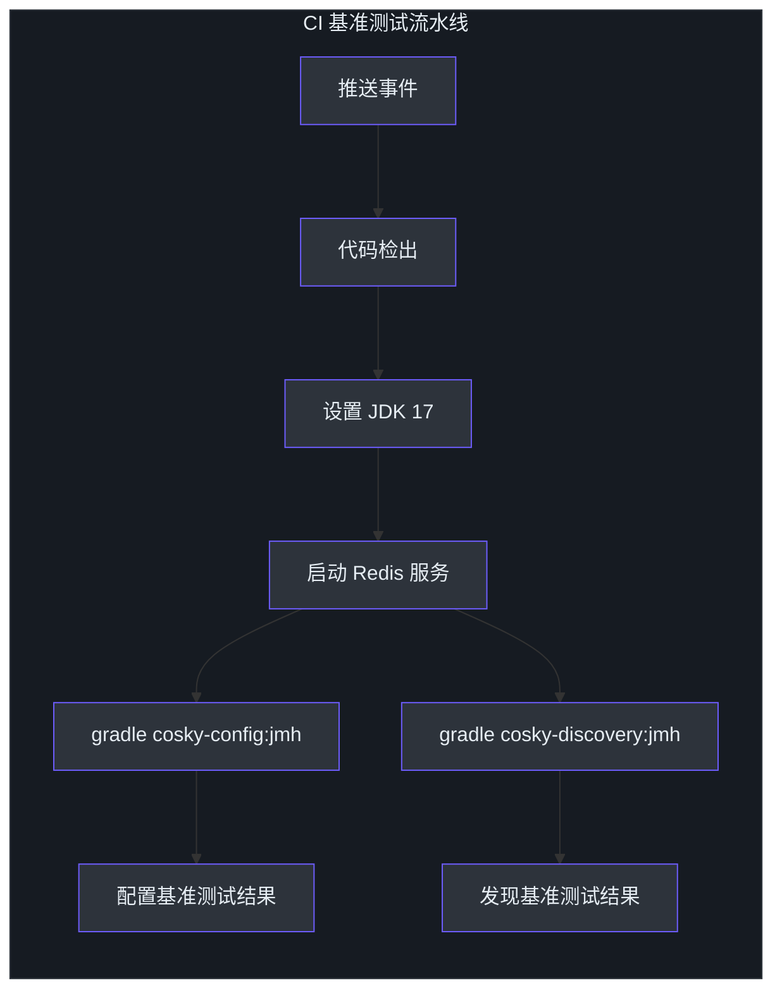
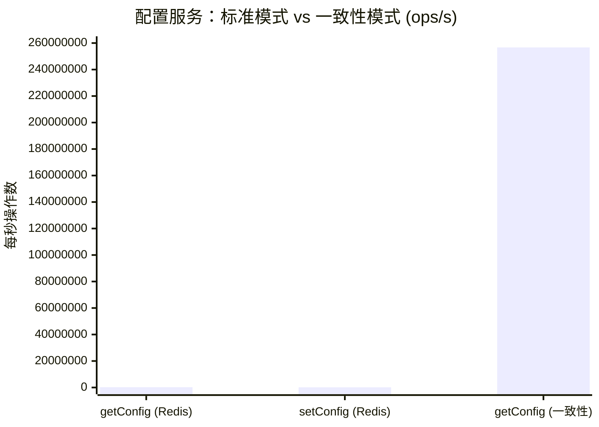
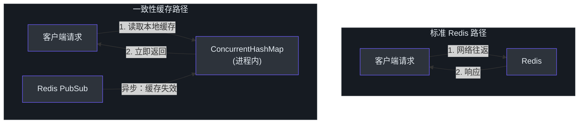
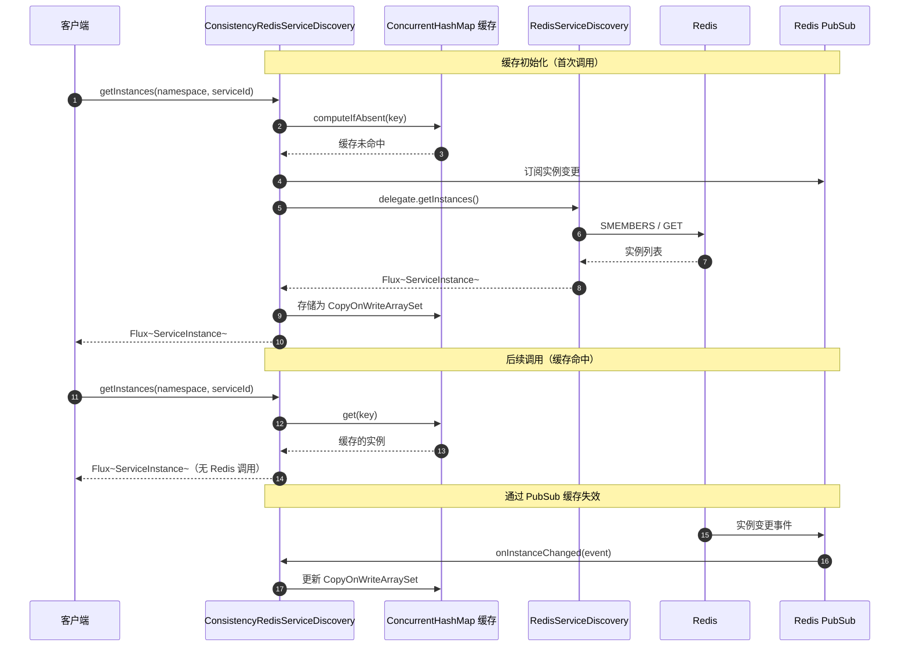
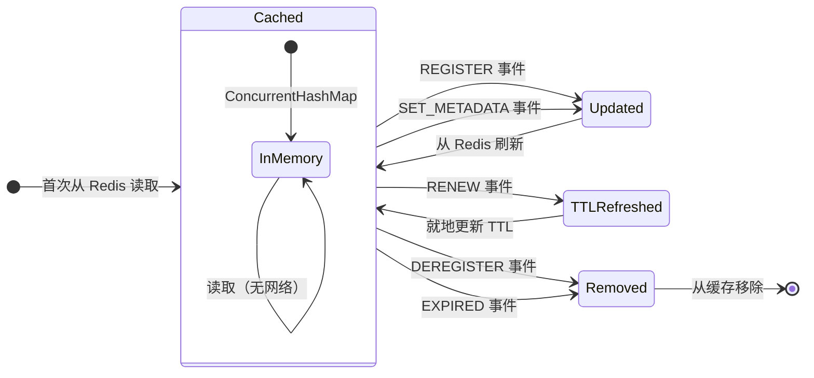
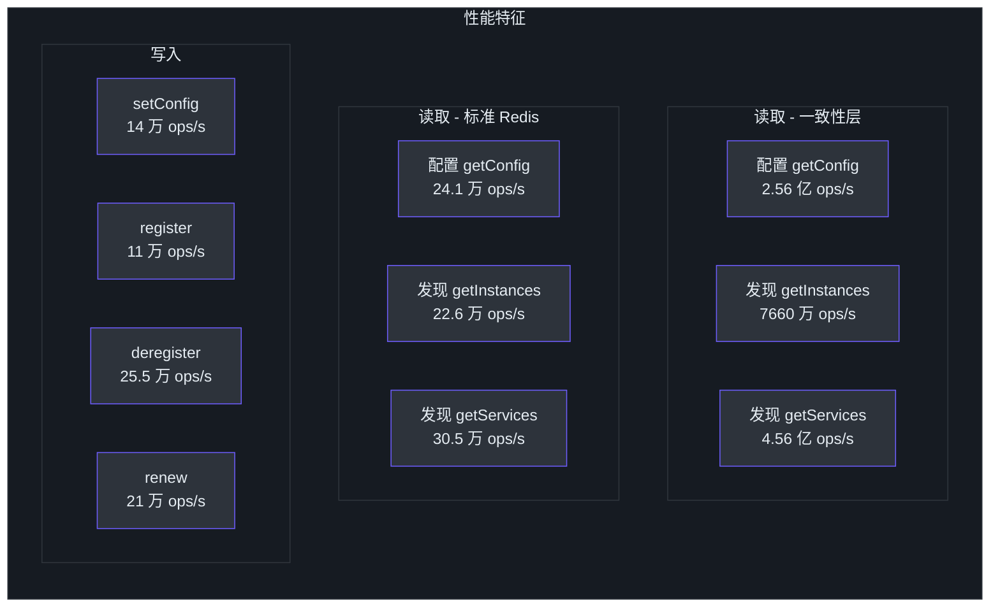

# 性能基准测试

## 概述

CoSky 通过将 Redis 作为底层存储与本地进程内一致性缓存相结合（通过 Redis PubSub 保持同步），实现了卓越的吞吐量。以下基准测试结果使用 JMH（Java Microbenchmark Harness）获得，证明一致性层为配置读取带来了 **800 倍以上的提升**，为服务发现带来了 **250 倍以上的提升**，与标准 Redis 操作相比。本文档记录了基准测试方法、环境、原始结果以及一致性层如此快速的架构解释。

## 基准测试方法

所有基准测试使用 [JMH (Java Microbenchmark Harness)](https://openjdk.org/projects/code-tools/jmh/) 版本 1.29 进行。每个基准测试运行配置为：

- **模式**：吞吐量（`thrpt`）
- **线程**：25-50 个并发线程
- **预热**：1 次迭代，10 秒
- **测量**：1 次迭代，10 秒
- **Forks**：1

CI 流水线通过 [GitHub Actions](https://github.com/Ahoo-Wang/CoSky/blob/main/.github/workflows/benchmark-test.yml) 在每次推送时运行基准测试，为每次提交启用性能回归检测。



<!-- Sources: .github/workflows/benchmark-test.yml:1 -->

## 测试环境

| 组件 | 规格 |
|-----------|--------------|
| **硬件** | MacBook Pro (Apple M1) |
| **JDK** | Zulu 11.0.11 (OpenJDK 64-Bit Server VM) |
| **Redis** | 部署在同一台机器上 |
| **JMH 版本** | 1.29 |
| **方法** | `thrpt` 模式，50 线程，1 fork，10 秒预热 + 测量 |

## 配置服务基准测试

```bash
# 运行配置基准测试
gradle cosky-config:jmh
# 或直接使用 JMH jar
java -jar cosky-config/build/libs/cosky-config-lastVersion-jmh.jar \
  -bm thrpt -t 25 -wi 1 -rf json -f 1
```

| 基准测试 | 模式 | 得分 | 单位 | 提升 |
|-----------|------|-------|------|-------------|
| `ConsistencyRedisConfigServiceBenchmark.getConfig` | thrpt | **256,733,987** | ops/s | **1,062 倍** |
| `RedisConfigServiceBenchmark.getConfig` | thrpt | 241,787 | ops/s | 基准 |
| `RedisConfigServiceBenchmark.setConfig` | thrpt | 140,461 | ops/s | - |

<!-- Sources: docs/jmh/jmh-cosky-config.json:1, README.md:348 -->

## 服务发现基准测试

```bash
# 运行发现基准测试
gradle cosky-discovery:jmh
# 或直接使用 JMH jar
java -jar cosky-discovery/build/libs/cosky-discovery-lastVersion-jmh.jar \
  -bm thrpt -t 25 -wi 1 -rf json -f 1
```

| 基准测试 | 模式 | 得分 | 单位 | 提升 |
|-----------|------|-------|------|-------------|
| `ConsistencyRedisServiceDiscoveryBenchmark.getInstances` | thrpt | **76,621,729** | ops/s | **338 倍** |
| `ConsistencyRedisServiceDiscoveryBenchmark.getServices` | thrpt | **455,760,632** | ops/s | **1,495 倍** |
| `RedisServiceDiscoveryBenchmark.getInstances` | thrpt | 226,909 | ops/s | 基准 |
| `RedisServiceDiscoveryBenchmark.getServices` | thrpt | 304,979 | ops/s | 基准 |
| `RedisServiceRegistryBenchmark.register` | thrpt | 110,664 | ops/s | - |
| `RedisServiceRegistryBenchmark.deregister` | thrpt | 255,305 | ops/s | - |
| `RedisServiceRegistryBenchmark.renew` | thrpt | 210,960 | ops/s | - |

<!-- Sources: docs/jmh/jmh-cosky-discovery.json:1, README.md:365 -->

## 性能对比图

以下图表比较了标准 Redis 操作与一致性缓存层的性能。注意对数刻度 -- 一致性层的性能高出数个数量级。



<!-- Sources: docs/jmh/jmh-cosky-config.json:1 -->

## 一致性层为何更快

关键架构洞察在于一致性层从内存中的 `ConcurrentHashMap` 缓存读取，而不是进行 Redis 网络往返。缓存通过 Redis PubSub 实时同步，因此它始终反映最新状态而无需轮询。



<!-- Sources: cosky-discovery/src/main/kotlin/me/ahoo/cosky/discovery/redis/ConsistencyRedisServiceDiscovery.kt:43, cosky-config/src/jmh/kotlin/me/ahoo/cosky/config/ConsistencyRedisConfigServiceBenchmark.kt:31 -->

## 一致性层架构

`ConsistencyRedisServiceDiscovery` 类包装了标准的 `ServiceDiscovery` 委托，并通过基于 Redis PubSub 的失效机制添加了本地缓存：



<!-- Sources: cosky-discovery/src/main/kotlin/me/ahoo/cosky/discovery/redis/ConsistencyRedisServiceDiscovery.kt:86, cosky-discovery/src/main/kotlin/me/ahoo/cosky/discovery/redis/ConsistencyRedisServiceDiscovery.kt:138 -->

## 缓存失效事件

一致性层处理多种类型的实例变更事件，每种事件触发特定的缓存更新策略：



<!-- Sources: cosky-discovery/src/main/kotlin/me/ahoo/cosky/discovery/redis/ConsistencyRedisServiceDiscovery.kt:138, cosky-discovery/src/main/kotlin/me/ahoo/cosky/discovery/redis/ConsistencyRedisServiceDiscovery.kt:171 -->

## 如何在本地运行基准测试

### 前提条件

- 已安装 JDK 17+
- Redis 在本地运行，端口 6379

### 配置基准测试

```bash
# 运行完整的配置基准测试套件
./gradlew cosky-config:jmh

# 使用自定义线程数运行
./gradlew cosky-config:jmh -PjmhThreads=10

# 运行特定基准测试
java -jar cosky-config/build/libs/cosky-config-*-jmh.jar \
  -bm thrpt \
  -t 25 \
  -wi 1 \
  -rf json \
  -f 1 \
  -p CONFIG_ID=my-config
```

### 发现基准测试

```bash
# 运行完整的发现基准测试套件
./gradlew cosky-discovery:jmh

# 使用自定义线程数运行
./gradlew cosky-discovery:jmh -PjmhThreads=10
```

> **注意**：上述 JMH 基准测试结果是在 MacBook Pro (M1) 上使用本地部署的 Redis 获得的。在 GitHub Actions 运行器上运行相同的基准测试，由于共享资源限制，得分大约低 2 倍。然而，标准操作与一致性操作之间的相对比较在任何环境中都是有效的。

<!-- Sources: .github/workflows/benchmark-test.yml:52, .github/workflows/benchmark-test.yml:80 -->

## 与竞品的功能对比

| 功能 | CoSky | Eureka | Consul | CoreDNS | Zookeeper | Nacos | Apollo |
|---------|-------|--------|--------|---------|-----------|-------|--------|
| **CAP** | CP+AP | AP | CP | CP | CP | CP+AP | CP+AP |
| **健康检查** | 客户端心跳 | 客户端心跳 | TCP/HTTP/gRPC | Keep Alive | Keep Alive | TCP/HTTP/客户端心跳 | 客户端心跳 |
| **负载均衡** | 权重/选择器 | Ribbon | Fabio | RoundRobin | RoundRobin | 权重/元数据 | RoundRobin |
| **自动注销** | 是 | 是 | 否 | 否 | 是 | 是 | 是 |
| **访问协议** | HTTP/Redis | HTTP | HTTP/DNS | DNS | TCP | HTTP/DNS | HTTP |
| **监听支持** | 是 | 是 | 是 | 否 | 是 | 是 | 是 |
| **多数据中心** | 是 | 是 | 是 | 否 | 否 | 是 | 是 |
| **跨注册中心同步** | 是 | 否 | 是 | 否 | 否 | 是 | 否 |
| **Spring Cloud** | 是 | 是 | 是 | 否 | 否 | 是 | 是 |
| **K8S 集成** | 是 | 否 | 是 | 是 | 否 | 是 | 否 |
| **持久化** | Redis | - | - | - | - | MySQL | MySQL |

<!-- Sources: README.md:400 -->

## 关键洞察

- **通过一致性层的配置读取达到 2.56 亿 ops/s** -- 相比直接 Redis 读取的 24.1 万 ops/s，提升了 1,062 倍
- **通过一致性层的服务发现达到 7660 万 ops/s**（实例）和 **4.56 亿 ops/s**（服务）-- 分别提升了 338 倍和 1,495 倍
- **写操作**（register、deregister、renew、setConfig）受 Redis 网络延迟限制，达到 11 万 - 25.5 万 ops/s
- 一致性层的性能优势来自用内存中的 `ConcurrentHashMap` 查找替代网络往返，通过 Redis PubSub 保持同步
- CoSky 的混合 CP+AP 模型既为写入提供了强一致性，又为读取提供了最终一致性和极致的读取性能。



<!-- Sources: docs/jmh/jmh-cosky-config.json:1, docs/jmh/jmh-cosky-discovery.json:1, README.md:376 -->

## 相关页面

- [Docker 部署](./deployment-docker.md) - 使用 Docker 部署 CoSky
- [Kubernetes 部署](./deployment-kubernetes.md) - 在 Kubernetes 上部署 CoSky
- [独立部署](./deployment-standalone.md) - 不使用容器运行 CoSky

## 参考

- [docs/jmh/jmh-cosky-config.json](https://github.com/Ahoo-Wang/CoSky/blob/main/docs/jmh/jmh-cosky-config.json)
- [docs/jmh/jmh-cosky-discovery.json](https://github.com/Ahoo-Wang/CoSky/blob/main/docs/jmh/jmh-cosky-discovery.json)
- [.github/workflows/benchmark-test.yml](https://github.com/Ahoo-Wang/CoSky/blob/main/.github/workflows/benchmark-test.yml)
- [cosky-discovery/src/main/kotlin/me/ahoo/cosky/discovery/redis/ConsistencyRedisServiceDiscovery.kt](https://github.com/Ahoo-Wang/CoSky/blob/main/cosky-discovery/src/main/kotlin/me/ahoo/cosky/discovery/redis/ConsistencyRedisServiceDiscovery.kt)
- [cosky-config/src/jmh/kotlin/me/ahoo/cosky/config/ConsistencyRedisConfigServiceBenchmark.kt](https://github.com/Ahoo-Wang/CoSky/blob/main/cosky-config/src/jmh/kotlin/me/ahoo/cosky/config/ConsistencyRedisConfigServiceBenchmark.kt)
- [README.md - 性能基准测试](https://github.com/Ahoo-Wang/CoSky/blob/main/README.md)
